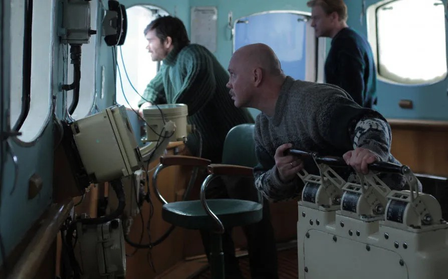

# Западня для «Ледокола». Побьет ли новый фильм-катастрофа рекорд блокбастера «Экипаж», собравшего в прокате более миллиарда рублей?

- **URL:** https://novayagazeta.ru/articles/2016/10/14/70176-zapadnya-dlya-ledokola
- **Дата:** 2016-10-14
- **Автор:** Лариса Малюкова

## Западня для «Ледокола»

## Побьет ли новый фильм-катастрофа рекорд блокбастера «Экипаж», собравшего в прокате более миллиарда рублей?

Фото: «Новая газета»«Ледокол» создан продюсерской компанией Игоря Толстунова «ПРОФИТ» (это они возродили в отечестве веру в катастрофический жанр, выпустив на экраны успешный блокбастер «Метро»). Картина отчасти основана на реальных событиях. В 1985-м дизель-электроход «Михаил Сомов» был блокирован во льдах Антарктики и 133 дня ждал освобождения в вынужденном дрейфе в море Росса. Для спасения полярников была снаряжена экспедиция на ледоколе «Владивосток», которую возглавил Артур Чилингаров. Страна ждала новостей, вспоминая легендарную историю спасения челюскинцев.Навстречу ледоколу «Михаил Громов» движется гигантский айсберг. Уходя от столкновения, судно попадает в ледовый плен и оказывается в вынужденном дрейфе вблизи побережья Антарктиды. Провизия, топливо, вода, электричество на исходе. Без подвига во льдах не выжить. В том числе подвига преодоления себя. Снежный блокбастер снимал одаренный арт-хаусный режиссер, автор камерных экзистенциальных картин Николай Хомерики («977», «Сказка про темноту»). И это тоже тенденция времени. «Дуэлянта», вышедшего двумя неделями раньше, сочинил один из лучших независимых режиссеров — Алексей Мизгирев. В обеих картинах в главной роли — Петр Федоров.

Работа актеров — главный плюс картины. Рядом с Федоровым (демократичным капитаном корабля Петровым) — Сергей Пускепалис (присланный Петрову на замену командир Севченко, сухарь и солдафон). Отличная, жирным мазком писанная работа Виталия Хаева в роли Банника, помощника капитана. Колоритны персонажи Александра Паля (он сыграл непутевого вертолетчика, цоевского фаната, сочинителя наивных виршей), Александра Яценко (его Виталик после героического морского «заплыва» потеряет голос и почти весь фильм будет нем как рыба). Диалоги — редкое качество для нашего кино — похожи на нормальную речь. Много смешного. Сцены столкновения с айсбергом динамичны и живописны: две ледяные глыбы: «замороженная туша» корабль и плавучая скала вступают в неравную схватку под страшный треск и взрывы. Айсберг натурально догоняет судно, ломится, рвет обшивку, врывается ледяной водой. Жанр фильма — микст катастрофы и производственной драмы. Гуманного руководителя, подсиженного интриганом и карьеристом старпомом, сменяет черствый упрямец, который борется не только с разгильдяйством, но и со всем живым на корабле. Под влиянием обстоятельств и коллектива он перевоспитывается. Впрочем, в суровых обстоятельствах Севера все люди — хорошие. За исключением одного злодейского кагэбэшника, который окажется на судне-спасателе.

Авторы постарались утеплить суровую ретродраму обстоятельствами времени исчезающей во льдах беспамятства советской эпохи. Спасение полярников. Айсберг, прозванный моряками Семен Семеновичем в честь героя «Бриллиантовой руки». Дефицитные колготки, которыми моряки затариваются в Австралии. Кубик Рубика — вещь в себе, которую оставляют на память мистическому айсбергу, чтобы коротал зимние ночи. Песни Цоя, эн-зэ — шпроты. Да и сам корабль превращается в социальную модель: смена руководства, переворот, бунт, драка, хаос… Все как в жизни. И в центре — отношения людей в экстремальных обстоятельствах.

Поддержите нашу работу!

1000 500 300 Нажимая кнопку «Стать соучастником», я принимаю условия и подтверждаю свое гражданство РФ

Если у вас есть вопросы, пишите [email protected] или звоните:+7 (929) 612-03-68

Главная проблема картины — в сценарии. Вроде отдельные части неплохи, но не срастаются в одно целое. Аварии, бедствия, крушения роятся аттракционами, не создавая ни саспенса, ни ощущения общей картины. В недавнем фильме Иствуда о посадке самолета на Гудзон тоже все было предсказуемо. Но благодаря точному сценарию и блестящей режиссуре, напряжение и волнение не отпускало до титров. В «Ледоколе», увы, слишком много нестыковок. Почему-то страдающая сердечной недостаточностью жена капитана, рискуя своей жизнью и будущего ребенка, убегает из больницы. Сломанный вертолет взлетает. Необъяснимы взаимоотношения капитанов «Громова» с командованием, которое вроде бы оставило моряков без помощи… А вроде и нет. Несуразны действия упрямого, как баран, капитана Севченко, который более смерти своей и экипажа боится начальства, — все запружено недомолвками.

Вообще говоря, реальная история «Сомова» была драматичнее и точно отражала отношение к человеку в лучшей в мире стране, освоившей Антарктику. Эта история рассказана в захватывающем документальном фильме «Западня для ледокола». Когда ледовая ловушка захлопнулась и вокруг судна с треснутой обшивкой начался настоящий парад айсбергов, Москва не просто бездействовала. Приказ Родины был: «Не паниковать!» и «Прекратить всякую переписку!». Это означало, что моряков оставили без помощи на корабле, вмороженном в 6-метровый лед. И если бы не сообщение Би-би-си, рассказавшее о брошенном советском судне… Капитан просил о помощи военных связистов, которые могли бы помочь отыскать спасительную полынью. Но и военные отказали. «Владивосток» вышел на помощь «Сомову», превратившемуся в обледенелый призрак, через 2 месяца.

Безусловно, игровое кино не обязано следовать всем документальным обстоятельствам. Но и художественная правда нуждается в точной аргументации.

2016-й, объявленный в России Годом кино, можно назвать годом фильмов-катастроф. Следом за ремейком «Экипажа» Николая Лебедева следует фильм Сарика Андреасяна «Землетрясение». На подходе космический блокбастер от Бекмамбетова «Время первых». Похоже, фильм-катастрофа представляется продюсерам новой золотой жилой. И отчасти история кинематографа оправдывает эти надежды. Но сценарий «Титаника» переписывался на протяжении нескольких лет. Хичкоковский постулат о том, что настоящий фильм делает «сценарий, сценарий и еще раз сценарий», никак не приживается на нашей зыбкой кинематографической почве. Теперь надежды возложены на зрелищную катастрофу, которая приведет в кинотеатры зрителей. Впору вспомнить Чапека: «Неужели за целую неделю ни одной мировой катастрофы! Для чего же я покупаю газеты?»

Поддержите нашу работу!

1000 500 300 Нажимая кнопку «Стать соучастником», я принимаю условия и подтверждаю свое гражданство РФ

Если у вас есть вопросы, пишите [email protected] или звоните:+7 (929) 612-03-68
