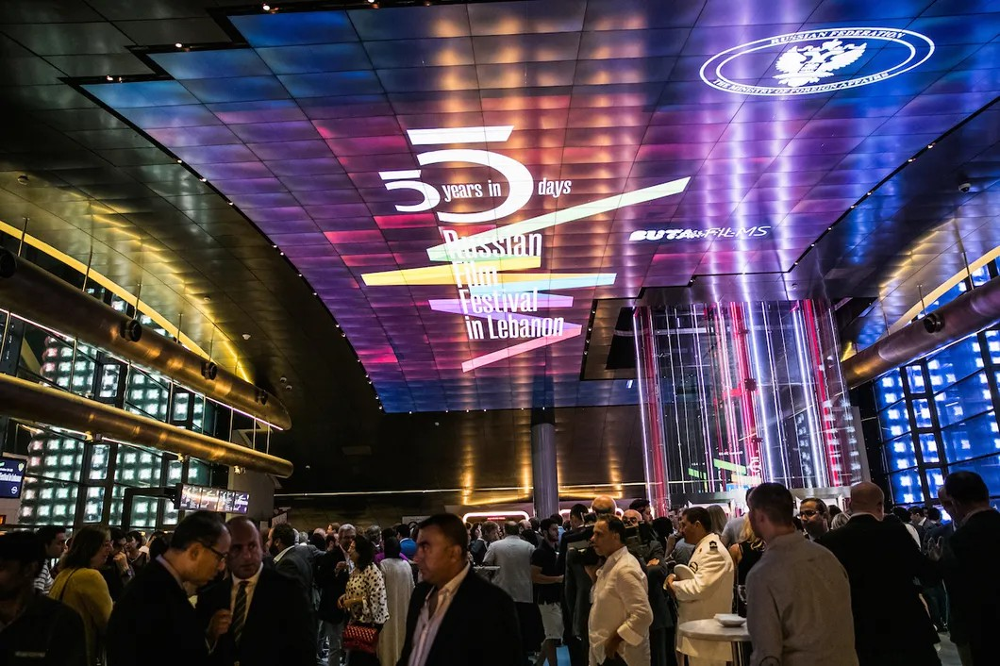

# Ливан: нестабильная стабильность. Репортаж из Бейрута, где прошел фестиваль российского кино

- **URL:** https://novayagazeta.ru/articles/2016/11/02/70397-livan-nestabilnaya-stabilnost
- **Дата:** 2016-11-02
- **Автор:** Лариса Малюкова

## Ливан: нестабильная стабильность

## Репортаж из Бейрута, где прошел фестиваль российского кино

## Гомер и Навуходоносор были здесь

Открытие фестиваля. Фото: Анна ТемеринаПервый фестиваль российского кино «Пять лет за пять дней» проходил в Бейруте в конце сентября. Вояж по «чужой среди своих» стране оказался одновременно погружением в историю Древнего мира и скольжением по кромке нынешнего непредсказуемого момента. Просвеченного теплым лучом октябрьского ближневосточного солнца, пропахшего морем, терпким ароматом бедуинского кофе, пряностей и… искалеченного войнами. О чем напомнят не только военные у входа в отель, на улицах, на блокпостах, но и расстрелянные дома.

Земля Кедра (его, кстати, в результате многовековых вырубок в Ливане все меньше) залечивает раны после 16-летней гражданской войны, после войн с Израилем, жесткого «патроната» сирийских войск. Она очень хочет нравиться туристам. Она помнит золотое время «до войны», когда Ливан был финансовой и банковской столицей арабского мира, когда путешественники со всего света слетались в благословенный светский Бейрут, на пляжи и горнолыжные курорты, а туризм составлял третью часть дохода.

О Ливане благодаря телевизору у нас сформировался набор стереотипов. Многие путают его с Ливией. Европейцы, напротив, сравнивают Бейрут с Парижем, страну — со Швейцарией. Все эти параллели — сильная натяжка.

Баальбек. Фото: Анна ТемеринаСтрана Кедра не спешит открываться чужеземцу. Просто затягивает, как воронка… Летишь в нее, словно кэрролловская Алиса, не спеша, успевая оборачиваться в древнюю древность, «для того, чтобы по­думать, что нас ждет впереди». В Ливане и мифы, и буквы Священного Писания обретают плотность, ты почти видишь, как именно здесь, в Тире, — крупнейшем в Финикии городе с 6-тысячелетней судьбой, жители бегут на остров, спасаясь от армии Навуходоносора. Как Иисус вершит здесь свое первое чудо. Как к берегам родины папируса Библоса приплывает сундук с телом Осириса. Как в Сидоне (Сайда), торговом центре Древнего мира, городе пурпура и стекла, царь Федим дарит сосуд для вина из серебра и золота Гомеру.

## Выборы, выборы

Восьмилетняя бейрутянка заказывает папе ростовых кукол на свой день рождения: Спайдермен, Насрала и Путин.

Ливанцы чрезвычайно политизированы. Как и мы, собираясь за обильным столом (кухня Ливана славится на весь мир), произносят дежурные фразы про самочувствие, семью, и понеслось… 16 лет гражданской войны. 10 — оккупации. 18 конфессий. Политических партий не сосчитать. Плюс темперамент. Таксист, охранник, продавец газет и сувениров знают и расскажут вам, как благоустроить жизнь.

Начинаешь говорить с ливанцем про запутанную, как лабиринт Минотавра, политическую обстановку. Разговор обязательно вырулит на магистральные темы. Помимо конфликта с Израилем и бомбежек Сирии — это выборы, которые долго не могли состояться. Два года Ливан жил без президента.

Согласно межобщинным договоренностям, Ливан — единственное арабское государство с президентом-христианином (маронитом). Премьер-министр — мусульманин-суннит. Спикер парламента — мусульманин-шиит. Между претендентом на главный пост генералом Мишелем Ауном и шиитской группировкой «Хезболла» заключен союз. Многие фракции поддержали Ауна. Впрочем, инженер Бэре Парман за два дня до выборов убеждал меня, что, несмотря на все предварительные договоренности, выборы могут быть сорваны. Слишком много коррупции на самом верху. Да и кресла депутатов стоят неимоверно дорого (называют цифру до $400 тысяч), значит, коррупция будет процветать. Недавно на территории Ливана обнаружили газ и нефть — борьба за власть будет еще ожесточеннее.

Но на этой неделе Аун все же выиграл выборы. В стране теперь есть президент.

Ливанцы устали воевать, многие соглашаются с тем, что «Хезболла» провоцирует соседей, но без ее армии, по мнению моих собеседников, Израиль может захватить Южный Ливан. Архитектор Салех, окончивший ленинградское Мухинское училище, убеждает меня, что у «Хезболлы» нет никакой идеи исламизации общества. Напротив, бойцы шиитской организации борются с ваххабитами. Он считает, что Армия Бога слишком занята войной в Сирии, внутренние конфликты ей ни к чему.

Памятник мученикам в Бейруте. Фото: Анна ТемеринаВсе меньше голосов в обществе, ратующих за ограничение власти полномочий «Хезболлы», которую справедливо называют «государство в государстве». Все опаснее выступления против «Партии Аллаха». Но раз армия и госструктуры слабы, бедны — разрастается и неконтролируемо множится реальная сила, которую финансово питает Иран.

Проблемы Сирии перетекают через границу, которая несколько лет назад была номинальной. В многочисленных разговорах и дискуссиях выяснилось: большинство моих собеседников поддерживают бомбежки Россией Сирии, они говорят о равновесии сил c американцами. Любимое слово в разговорах про политику — «баланс». Все зыбкие надежды мусульманско-христианского общества — на стабильность.

## Бейрут и другие

Здесь все рядом. Самая большая мечеть и кафедральный маронитский собор Святого Георгия с Богоматерью кисти Делакруа. Римский храм Зевса, высотки шикарных отелей и бизнес-центров, французская площадь Этуаль, памятник мученикам, казненным османами. Рядом с римскими руинами — ветхий район палестинских беженцев. Войти сюда легко, выйти — не очень. История здесь пенится битвами. Финикийцы, римляне, варвары, христиане, арабы, крестоносцы, мамлюки. 400 лет под владычеством турок в составе большой Сирии, многолетний французский мандат. Крупнейшая на Востоке армянская диаспора. Лагеря сирийских беженцев, которых здесь бессчетно.

Страна с ее уникальным расположением в Западной Азии похожа на слоеный пирог цивилизаций. Как будто все мировые культуры и религии назначили свидание в одном месте — в разное время. В фундаментах мечети Аль-Омари — римский храм Юпитера, превращенный в византийскую церковь, крестоносцы вознесли здесь храм в честь Иоанна Крестителя, мусульмане перестроили его в мечеть Фарух аль-Ислам («Победа ислама»).

Недавно восстановили бейрутскую синагогу. Ходить в нее особенно некому, это скорее демонстрация терпимости. Иудеев после последних конфликтов с Израилем — буквально несколько сотен. С израильской визой в Ливан не пустят. С ливанской — вас промурыжат в аэропорту Бен-Гурион, но въезд разрешат. На всех магистралях блокпосты. Военные на улицах, перед входом в кинотеатр, около гостиницы. Военные сопровождали нас в Баальбек, расположенный неподалеку от сирийской границы.

Баальбек. Фото: Анна ТемеринаПоддержите нашу работу!

1000 500 300 Нажимая кнопку «Стать соучастником», я принимаю условия и подтверждаю свое гражданство РФ

Если у вас есть вопросы, пишите [email protected] или звоните:+7 (929) 612-03-68

По людной набережной Корниш идут женщины в черных хиджабах с узкой щелью для глаз, навстречу им девушка выстукивает в чем-то страшно обтягивающем и на лабутенах. Мимо бежит мусульманка в платке, спортивных штанах и кроссовках. Курят практически везде. Ливан — единственная страна арабского мира, в которой официально разрешены производство и продажа алкогольных напитков, трапеза не обходится без бокала терпкого красного Chateau Kefraya или легкого розового Chateau Xara. Это Бейрут. Кафе и кальянные полны. Выставки, фестивали, небольшие театры (наибольший спрос у сатиры). Ночные клубы и дискотеки, огромное казино.

Все пестро, мирно. И все может взорваться вмиг. Нестабильная стабильность… Пробки как в Москве. На 2 миллиона бейрутцев — 3 миллиона машин. Пешеходов не пропускают, переход улицы — отдельный аттракцион. Фотографировать госучреждения не рекомендуется. Да и военных — исключительно с их согласия.

Жительницы Бейрута охотно посещают модные бутики, не жалеют времени на красоту. Ливан разделяет с Бразилией первое место по пластическим операциям.

Ливанцы страшно гордятся, что они потомки финикийцев, создавших письменность. У образования здесь особая репутация. 43 университета. 70 тысяч студентов на 4-миллионное население. Впрочем, сколько жителей в Ливане, никто точно не скажет (последняя официальная перепись населения была в 1932-м, и новую в многоконфессиональной стране ожидали с тревогой). В образование детей вкладывают существенную часть дохода. Доктор Акиль рассказывает, что платит ежемесячно $2 тысячи за обучение дочери в Американском университете на медицинском факультете. Он показывает мне в телефоне фото своего дома с зеленой лужайкой. Всего в 20 км от границы с Сирией. «Не боитесь, что война придет к вам?» — «Мы не боимся, — ласково улыбается Акиль. — Границу контролирует «Хезболла». Они нас защитят». Акиль также произносит любимое ливанцами слово «баланс»…

Акиль выкладывает на учебу дочери треть зарплаты. Минимальная зарплата около $700. А получить лицензию на такси стоит примерно 27 тысяч.

Лучше других зарабатывают врачи. Особенно маститые, с именами. Знакомлюсь с процветающим хирургом, совмещающим работу в государственном госпитале с частной клиникой. Основная статья дохода — операции. За здоровье, как и за обучение, здесь привыкли платить. Инженер Хусейн руководит местным шахматным клубом и хвастается, что Ливан занимает 75-е место среди 180 стран. Вместе с Российским культурным центром русскоговорящие ливанцы празднуют 9 Мая и участвуют в акции «Бессмертный полк». Есть клуб выпускников советских вузов, есть — российских. Давно бы объединились…

## Есть в русской женщине...

Русскоговорящих в Ливане более 25 тысяч. Это и выпускники вузов, и эмигранты (среди них — внук художника Серова). Российская диаспора в основном женская. По местным законам жена получает ливанское гражданство (раньше совсем быстро, сейчас сложнее). Но если ливанка выйдет замуж за иностранца, ему и их детям не светит счастье быть ливанцами. Русские жены пользуются здесь особым спросом. Они образованны (приятно сказать, что твоя жена — врач или педагог), непритязательны. Основные правила поведения женщине диктует не общество, а семья. Ольга Дагер, анестезиолог по образованию, работает экскурсоводом. В Ливане более четверти века: как и многие ее сверстницы, познакомилась с мужем в институте, ее муж травматолог. Очутилась в семье шиитов, но не религиозных, поэтому ни платков, ни особых ритуалов не требовалось.

Баальбек. Фото: Анна ТемеринаСветлана Сафа, председатель Координационного совета соотечественников, прекрасно говорит по-арабски. Ее муж — друз, дочь приняла католичество, вышла замуж и уже развелась. Точнее, пытается развестись, у католиков это муторное дело. С мужем Светлане тоже повезло, мало того что образован, совершенно не давит. Похоже, она — лидер в семье. Что не очень типично для ливанских традиций: здесь мужчины привыкли в семье доминировать.

На протяжении многих лет русская диаспора была расколота конфликтом между советскими и «бывшими». Но наследников Белой колонии все меньше, в клубке новых проблем растворяются старые разночтения. Проводятся совместные вечера. В последнее время демонстративно обособляются украинские эмигранты. От старой русской колонии Культурному центру осталась уникальная книжная коллекция — огромная библиотека книг, вывезенных из дореволюционной России. Среди них фантастические раритеты, достойные РГБ. Но куда бы ни писали ливанские россиянки — нет ответа.

## Хезболла-ленд

Гид с говорящим именем Джихад показывает нам огромные рвы с инсталляциями из лежащих навзничь ржавых израильских танков, поверженные гранатометы, насаженные на шесты каски. «Это — ад, — любезно объясняет Джихад, — где и будут гореть сионистские бойцы».

На внушительной территории бывшей военной базы и штаба «Хезболлы» в Млите (оплоте шиитского движения в Южном Ливане) расположился музей, прославляющий организацию, во многих странах (но не в России) названную террористической… Прологом к путешествиям в войну становится пропагандистский киножурнал, который крутится нон-стоп в комфортном кинозале. Оглушительная фонограмма с центральной темой «Полюшко-поле»: мученики и жертвы сионистов превращаются в героев.

Фото: Анна ТемеринаВ финале сам Насрала объявляет эру победы («Хезболла» рассматривает вывод израильских сил как победоносное окончание войны 2006-го). Этот боевой листок, как и весь парк военных аттракционов (бесконечные укрепленные подземные траншеи, манекены стреляющих из укрытия боевиков, мощные ракетные установки, кухня и штаб со стареньким компьютером), призваны воодушевить новых бойцов «Партии Бога».

Джихад по профессии компьютерщик. Он говорит мне, что сам в «сопротивлении» участвовал без оружия: занимался поставкой продуктов, воды, составлением бумаг. Вопрос, есть ли у него знакомые израильтяне, вызывает у Джихада возмущение, но, быстро оправившись от оторопи, он говорит сухо, что да, знает пару евреев.

## Лед тронулся

Здорово, что в Ливан пришло российское кино. Кажется, его очень ждали. Показы шли в двух больших кинотеатрах. Пять тысяч зрителей посетили фестиваль. Зрительские российские картины, вроде «Экипажа» и «Ледокола», публика принимали тепло (для «Ледокола», показанного на открытии, пришлось снимать второй зал). Ностальгия «по советскому» среди русскоязычного населения в ходу, ценности развитого социализма хорошо воспринимаются ливанцами. Но самые жаркие обсуждения были после документальных телевизионных фильмов на животрепещущие темы. О мальчишках-паркурщиках, гоняющих и летающих над развалинами Газы. О подготовке курдских девушек к войне с боевиками запрещенной террористической организации «Исламское государство» («Её война: женщины против ИГ»).

На показе документального кино. Фото: Анна ТемеринаВальяжный ливанец иронизировал после показа: «По вашему фильму выходит, что они не столько с терроризмом хотят воевать, сколько убежать от домашнего насилия, бороться за свои права. В чем месседж вашего фильма?» Автор объясняла, что не снимает «кино с месседжем», пытается максимально объективно фиксировать происходящее. Ей неинтересно заниматься пропагандой.

В фильме Марии Ивановой, организатора фестиваля, и Николая Викторова («Бежать от войны») сплетаются судьбы сирийских беженцев. Молодая художница, которой удалось добраться до Берлина. Подросток, достигший вожделенного берега «без войны», оторвавшийся осколок семьи. Мать-одиночка с тремя детьми, добравшаяся до Москвы и ощутившая здесь свою отделенность от «дорогих москвичей». Витальный Хасан, живущий в лагере беженцев, его две жены и его 17 детей. Примерно. Он пытается пересчитать их под хохот зрителей. Дети продолжают в этой большой семье рождаться и в лагере. Спрашиваю у Марии Ивановой, что ее удивило в процессе подготовки фестиваля. «Самым удивительным стал профессионализм ливанской команды. Все точно, ответственно. Никакой восточной неопределенности. На этих людей можно положиться». Больше всего ливанцам понравился анимационный фильм Бронзита «Мы не можем жить без космоса». Вначале много смеялись, потом была тишина, в финале плакали. Очень эмоциональный здесь зритель. Контакт с подлинным наступает мгновенно.

В Ливане еще с советской поры сохранилось не только наше оружие, но и сформированное советским (а ныне и российским) образованием мировоззрение, социальные навыки и главное — искренняя симпатия к России. Были здесь и раньше разнообразные фестивали, концерты с нашим участием. Но у кино — конструктора действительности — есть способность затрагивать животрепещущие вопросы. Именно такие фильмы здесь ждут. Фестиваль российского кино будет продолжаться, а наши фильмы вслед за «Экипажем» будут выходить на ливанские экраны. Иначе уподобимся финикийцам — первым морским путешественникам, обнаружившим Америку задолго до Колумба. Только они не стали ее открывать: посмотрели.. и поплыли назад.

Поддержите нашу работу!

1000 500 300 Нажимая кнопку «Стать соучастником», я принимаю условия и подтверждаю свое гражданство РФ

Если у вас есть вопросы, пишите [email protected] или звоните:+7 (929) 612-03-68
