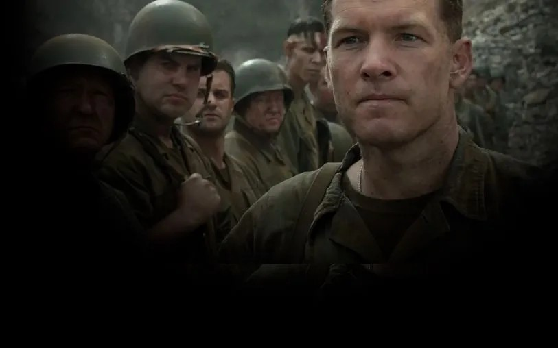

# Человек без ружья. Новую драму Мэла Гибсона «По соображениям совести» можно было бы назвать военной, если бы она не была декларативно пацифистской

- **URL:** https://novayagazeta.ru/articles/2016/11/14/70534-chelovek-bez-ruzhya
- **Дата:** 2016-11-14
- **Автор:** Лариса Малюкова

## Человек без ружья

## Новую драму Мэла Гибсона «По соображениям совести» можно было бы назвать военной, если бы она не была декларативно пацифистской

Кадр YoutubeПосле пары скандалов и гомофобских реплик Гибсон оказался персоной нон грата в Голливуде. Даже актерских работ после 2006 года было наперечет. Тем более что 60-летний дядюшка-террибль, названный родителями католиками-традиционалистами в честь Святого Мэла, по-прежнему не особенно почитает евреев, геев, воюет со стволовыми клетками и прочей ересью. В Европе же непримиримого Мэла по-прежнему любят, и его новый фильм «По соображениям совести» был принят на Венецианском фестивале овациями.Сюжет картины настолько изумляет, что оправдание у него только одно: все, что рассказывается в фильме, — правда.

Это реальная история первого в США формального отказника, адвентиста Седьмого дня Десмонда Досса (Эндрю Гарфилд — «Человек-паук» — здесь сыграл свою лучшую роль). Юноши, записавшегося добровольцем на фронт, но по религиозным соображениям отказавшегося носить оружие.

Поначалу видишь чубастого чудака с глуповатой улыбкой. Чрезмерно наивного, романтичного. Который несется спасать придавленного автомобилем недотепу. До головокружения влюбляется в миловидную медсестру. И когда этот списанный из старых голливудских фильмов романтик и патриот узнает о нападении Японии на Пёрл-Харбор, то сразу записывается добровольцем. Однако, как настоящий католик, Досс хочет не убивать, а защищать. И, как подлинно верующий, ни на пядь не отступит от принципов. Когда все однополчане, все военное начальство соберется с силами, вынуждая Десмонда взять в руки ружье, он не отступится. Это очень в духе кинематографа Гибсона, автора «Страстей Христовых», главная идея которого в том, что вера сильнее коллективного мнения, жестоких наказаний, военных трибуналов, унижений, насилия. Досс не протянет руки насилию. Он не уклонист — сам пошел на фронт по зову совести. Но он не пройдет курс стрельбы, не прикоснется к ружью. И даже в кромешном пекле не преступит главной заповеди — «Не убий!».

Первая часть фильма елейно благостная, сосредоточенная на жизни городка Линчберг, на жизни семьи Десмонда (его отец, плотник, так и не оправился от психологической травмы Первой мировой), — призвана контрастировать с огромной кульминационной сценой: битвой за Окинаву. Битвой, прозванной историками «стальным тайфуном» за интенсивность артобстрелов. 100 000 убитых японских солдат, 12 тысяч союзников и 38 тысяч раненых.

Поддержите нашу работу!

1000 500 300 Нажимая кнопку «Стать соучастником», я принимаю условия и подтверждаю свое гражданство РФ

Если у вас есть вопросы, пишите [email protected] или звоните:+7 (929) 612-03-68

Для Гибсона эта почти 40-минутная часть — торжественная и страшная оратория войны. Режиссер «Апокалипсиса» не жалеет ни красок, ни зрителя. Вы хотели зрелищной героики — получите! Обглоданные войной тела, разорванные, выпотрошенные останки, вывороченные наизнанку трупы. Пожалуй, такого убедительного в своей зрелищности кошмара смертельной оргии на экране еще не было. Главный режиссерский прием в изображении экспрессивной бойни — внезапное превращение человека в мясо. Группы людей — в гору мяса. Пылающий огонь из огнеметов мгновенно готовит из бойцов дымящееся мясо. Кажется, сам экран источает этот нестерпимый запах гари и тлена. И жирные крысы снуют меж трупов, не опасаясь еще корчащихся от боли живых.

И вот в этом аду, в Дантовых объятиях пламени и кипящей крови, снует не богатырского сложения человек. Без оружия. Его «Храброе сердце» укрыто маленькой Библией. Он ползет и перевязывает. Вкалывает морфий. Тащит к спасительной отвесной стене с морской грузовой сетью полуживых солдат. Спускает их на веревке. Своих и японцев.

Гибсон не просто восхищается непререкаемой силой духа и упорством своего героя. Он проводит тонкую красную линию в понимании долга Досса и японцев. Японский офицер после поражения совершает сэппуку, торжественный ритуал пренебрежения смертью, после которого офицера, восстановившего свою честь, обезглавливают его солдаты. Досс тоже пренебрегает смертью. Снова и снова возвращается под «стальной ливень», на линию огня снайперов, ищет еще живых солдат, оставленных умирать. У него черное от копоти, залитое чужой кровью лицо.

«Чисто святой» — скептически решит зритель. И будет обескуражен документальным признанием реального Досса, спасшего 75 солдат: «Тогда я молил Бога только об одном. Спасти хотя бы еще одного!»

И хотя фильм пропитан фирменной, временами чрезмерной гибсоновской патетикой и натурализмом, режиссер упивается не демонстрацией кошмарных сцен и ужасных ран. Прежде всего он восхищен чудом стоицизма одного в бранном поле — воина мира. В этом своевременность картины. И дело не в «Оскарах», которые, очевидно, светят вернувшемуся со щитом боевитому режиссеру и его актеру, перевоплотившемуся в скромного национального героя. А в той важной теме, которую Гибсон поднял. Когда безумным, не от мира сего, придурком объявляют нежелающего убивать. Когда с ним готовы расправиться его же друзья. Его соотечественники. Значит, пришло время войны. Вполне себе актуальный сюжет, особенно в пору воинствующей риторики и новых войн, от которых мир способны удержать лишь редкие одиночки.

### P.S.

Поддержите нашу работу!

1000 500 300 Нажимая кнопку «Стать соучастником», я принимаю условия и подтверждаю свое гражданство РФ

Если у вас есть вопросы, пишите [email protected] или звоните:+7 (929) 612-03-68
