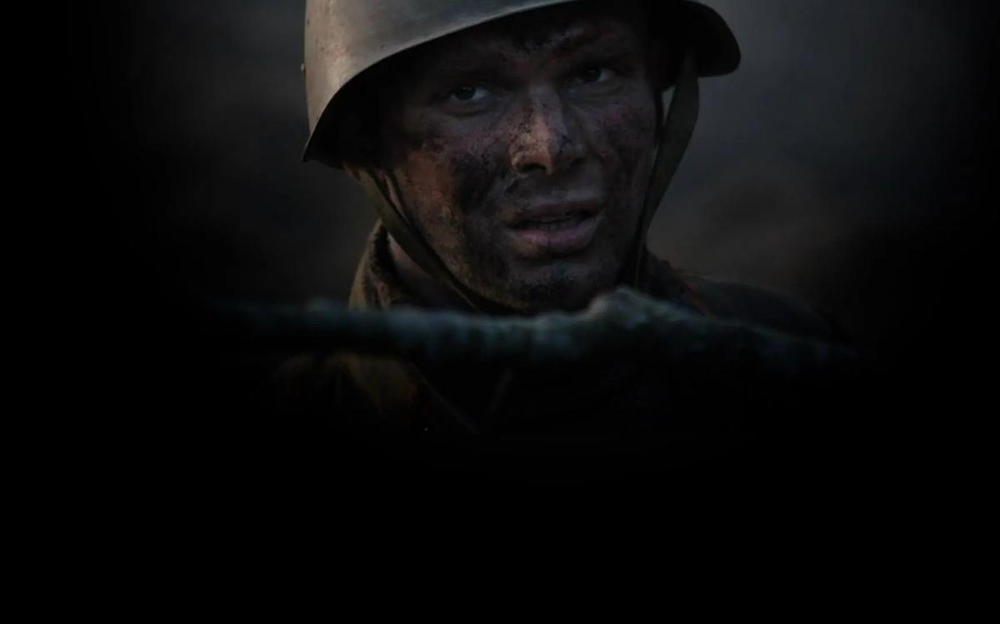

# Похоже на грамотную военно-историческую реконструкцию. ​​​​​​​Горячо поддержанный Минкультом фильм «28 панфиловцев» посмотрел обозреватель «Новой газеты», а миф об этой знаменитой битве разобрал профессор НИУ ВШЭ

- **URL:** https://novayagazeta.ru/articles/2016/11/17/70568-pohozhe-na-gramotnuyu-voenno-istoricheskuyu-rekonstruktsiyu
- **Дата:** 2016-11-17
- **Автор:** Лариса Малюкова

## Похоже на грамотную военно-историческую реконструкцию

## ​​​​​​​Горячо поддержанный Минкультом фильм «28 панфиловцев» посмотрел обозреватель «Новой газеты», а миф об этой знаменитой битве разобрал профессор НИУ ВШЭ

Кадр из фильмаВыход «28 панфиловцев» на экраны сродни столь знаменательным событиям последнего времени, как возведение рядом с кремлевскими стенами памятника князю Владимиру. Или монумента императору всероссийскому Александру Первому, диктовавшему Европе свою волю. Открытие памятников осенили своим присутствием представители высшей церковной и государственной власти. Первыми зрителями «28 панфиловцев» стали Владимир Путин и Нурсултан Назарбаев.Сама история создания этого кино свидетельствует о переменах, которые происходят в разделе отечественного кинематографа, именуемого особо значимым или патриотическим. Средства на фильм собирали в интернете. Собрали 35 миллионов рублей — беспрецедентная сумма. Пятая часть бюджета. Затем проект энергично поддержали министр Мединский, Военно-историческое общество, которое столь же энергично поддерживало и создание патриотических монументов в центре Москвы. Между фильмом и памятниками Салавата Щербакова много общего. На открытии бронзового монумента императору Александру со шпагой в руке и вражеским оружием под ногами (2014 год) патриарх говорил о наконец-то состоявшемся «сопряжении ткани национальной истории».

Именно на «сопряжение ткани национальной истории» и нацелено кино молодых авторов Кима Дружинина и Андрея Шальопы. В первых строчках фильма сказано, что память о войне это не только боль и скорбь, но и битвы, подвиги и победы.

Фильм делится на две части. Подготовка к бою и сама кровопролитная битва. В первом акте есть комбат на белой лошади. Есть обстоятельный разбор будущего боя. Тренировка бойцов с макетом танка. Рытье окопов и укрытие их маскировочной сеткой. Приготовление «коктейлей Молотова».

Бой снят профессионально. Снег взрывается черной тучей земли. Свинцовое ноябрьское небо в складку из облаков, откуда и возникают вражеские самолеты. Танки горят один за другим, из жерла кабин выскакивают горящие танкисты. Наши герои отстреливаются, поднимаются из окопов с взрывчаткой и бьют врага (в фильме есть реминисценции из известных советских фильмов вроде «Горячего снега», «Они сражались за Родину»). Тема героизма подана по-мужски сдержанно: «Никто не геройствует, спокойно жжем танки». «В бою самое тяжелое жить за родину, а не умирать».

Текста много. Речь бойцов чистая (никакого мата), с юморком. Но и с осознанием значимости предстоящей битвы («Драку обещают историческую»). Говорят про Москву — сердце Родины. Про битву, за которой весь мир следит, затаив дыхание. Про то, что воюют не за землю, за Отчизну. Про то, что фашистские захватчики впервые почувствовали кровь на зубах и ярость бессилия. Теперь они знают, как русские любят. Говорят про русских. Ни разу про советских. Рядом с могучими русскими острый на язык украинец, казахи, киргизы… «Сейчас, когда деремся за Россию, мы русские, когда за казахов — казахские». Все политкорректно, идеологически выверено. Никакого Сталина в помине. Разумеется, и слова политрука Клочкова про то, что «отступать некуда, позади Москва», — не забыты.

Все это похоже на грамотную военно-историческую реконструкцию битвы.

Когда оживают памятники

Новая монументальная пропаганда как диагноз

Немцы — безликое полчище (на лицах наступающих — балаклавы). Темная обезличенная сила саранчи. Их непереводимая речь похожа на собачий лай.

Зато есть кинематографические сюрпризы. Солдаты 1941 года на марше обсуждают знаменитые героические киносюжеты — о семи самураях, о ковбоях Великолепной семерки, о 300 спартанцах. Но и про «священную легенду» авторы помнят: после очередной атаки от четвертой роты остаются 28 панфиловцев. Именно 28. Даже эпизод из официальной версии о предателе, которого якобы расстреляли солдаты, отсутствует.

У киноистории нет развития.

Персонажи — замечательные воины, лишены воспоминаний о мирной жизни. Лишены судьбы, характеров, внутренних противоречий. Нет в них муки сомнений, страха. Стертые индивидуальности сливаются в смутном образе массового героизма. Но тогда нет и боли, осознания чудовищности гибели каждого, ставшего близким.

Как Кузнецов у Бондарева в «Горячем снеге» с его борьбой с необоримым страхом. Вспоминается и эпизод, в котором генерал Бессонов должен отдать приказ «вчерашним мальчишкам»: «Стоять насмерть!» Мучительно трудно дается ему этот приказ. В «28 панфиловцах» командир просто передает по рации: «Дальше сами! Держитесь там!»

В финале шестерка чудом выживших бойцов застынет на Волоколамском рубеже — превратится в монумент. Но еще задолго до финала будет ясно, что весь фильм и есть памятник. Мемориал славы.

Для сценариста Шальопы сюжет о 28 панфиловцах — ключевая история войны: «Думаю, я далеко не первый, кому пришла в голову идея снять об этом художественный фильм. Но, вероятно, время появиться этому фильму пришло только сейчас».

Трудно с ним спорить. В новой культурной доктрине миф вытесняет факты.

«Хотите сменить профессию? Мы это поймем»

В разгар конфликта с главой Госархива министр Мединский объяснил, для чего государству историки

Министр культуры называет историю 28 панфиловцев святой легендой, к которой нельзя прикасаться: «А люди, которые это делают, мрази конченые». По словам министра, само обсуждение того, вымысел история с панфиловцами или нет, — кощунственно. Молодые авторы фильма поддерживают этот гнев: «Министр сказал грубовато, но как мужик — верно». Ким Дружинин призывает также не выбивать «опору из-под веры людей»: «Либо они чтят свою историю — подвиги… либо начинают искать, что у нас плохо. Пора искать, что у нас хорошо. Давайте искать…» Однако лучше всех сказал Дмитрий Песков: «Вы знаете, что история о панфиловцах впоследствии подвергалась сомнению. Существовали разные исторические гипотезы, насколько это соответствовало действительности. Поэтому эта картина с точки зрения исторической правды представляет особое значение».

Авторы фильма горячо благодарят министерства культуры России и Казахстана, поддержавшие картину, — «альянс, когда государство протягивает руку народу». Действительно, феномен этого проекта в единении народа (имена 35 тысяч жертвователей выведены в титрах фильма) с партией и правительством. Скульптор Салават Щербаков характеризует свой метод как «оптимистичный консерватизм и позитивизм». Ничего нет плохого в идее возродить дух национальной гордости, к чему и призывают авторы фильма. Но почему они так настаивают на «исторической правде мифа»? Почему бы, как Спилберг, снявший «Спасти рядового Райана» по следам реальных событий, или Жан-Жак Анно, сделавший героем своего фильма «Враг у ворот» знаменитого снайпера 62-й армии Василия Зайцева, — не признаться, что и их картина смесь правды и вымысла?

Комментарий историка

ОлегБудницкий

доктористорических наук, профессорНИУ ВШЭ

Поддержите нашу работу!

1000 500 300 Нажимая кнопку «Стать соучастником», я принимаю условия и подтверждаю свое гражданство РФ

Если у вас есть вопросы, пишите [email protected] или звоните:+7 (929) 612-03-68

## «Миф более живуч, чем память о реальности»

—Хочу сразу сказать, что поверять художественные произведения историей — дело довольно бессмысленное. Это разные жанры. Тем не менее люди, как правило, хотят знать, «как было дело в действительности».

В истории с панфиловцами есть два аспекта: морально-этический и исторический. На мой взгляд (думаю, его разделяет большинство жителей нашей страны, независимо от политических воззрений или эстетических предпочтений), все отдавшие свою жизнь за родину заслуживают нашей благодарной памяти. Даже если они не уничтожили ни одного танка или солдата противника, или не успели произвести ни одного выстрела. Они погибли за нас.

Если же говорить о конкретной истории боя 16 ноября 1941 года у разъезда Дубосеково, то он происходил совершенно не так, как это изложено в очерке корреспондента газеты «Красная звезда» Александра Кривицкого «О 28 павших героях», на котором основывалось традиционное представление об этом событии. Очерк был написан по заданию главного редактора «Красной звезды» Давида Ортенберга. В очерке Кривицкого соответствуют действительности только фамилии бойцов 4-й роты 2-го батальона 1075-го стрелкового полка и то, что бой на самом деле был. Все остальное — вымысел, направленный на то, чтобы вдохновить бойцов и командиров Красной армии на подвиги.

Некоторые реалии боя и обстоятельства создания очерка были выяснены в ходе расследования Главной военной прокуратуры СССР в 1948 году.

Расследование проводилось в связи с тем, что один из главных героев очерка Кривицкого — «веселый сержант Добробабин» — оказался не только жив, но еще и после побега из плена успел послужить в немецкой вспомогательной полиции в родном селе Перекоп Харьковской области. Более того — некоторое время служил начальником кустовой полиции села Перекоп.

Приближение Красной армии заставило Ивана Добробабина бежать к родственникам в Одесскую область, где он вновь был призван в Красную армию. Узнав случайно, что ему присвоено посмертно (!) звание Героя Советского Союза, Добробабин «от большого ума» написал рапорт о выдаче ему награды. Вернулся с войны героем, но предусмотрительно поехал жить в Киргизию. Тем не менее в конце 1947 года был арестован, в 1948 году военный трибунал за измену родине приговорил его к 15 годам заключения (вышел на свободу в 1955 году), в 1949 году лишен звания Героя Советского Союза.

Однако результаты расследования решили не оглашать. Легенда о 28 героях-панфиловцах чересчур прочно вошла в канон истории Великой Отечественной войны. Легенда продолжала жить своей жизнью.

Материалы расследования Главной военной прокуратуры СССР, впервые опубликованные на исходе советского времени, в 1990 году, являются отнюдь не единственным источником наших знаний о событиях 16 ноября 1941 года. Историками, получившими наконец доступ к архивам, проведена реконструкция событий на основании боевых донесений командования 316-й дивизии (получившей впоследствии имя своего командира — И.В. Панфилова), а также документов противника — 2-й танковой дивизии 46-го танкового корпуса вермахта.

Наиболее важными, на мой взгляд, являются исследования российского историка Константина Дроздова из Института российской истории РАН и канадского историка Александра Статиева. Согласно дополняющим друг друга источникам, в бою у разъезда Дубосеково участвовало с советской стороны около 200 человек (4-я и 5-я роты). К концу боя 16 ноября в 4-й роте осталось в строю 20–25 человек. Остальные были убиты, ранены или пропали без вести. По словам командира 1075-го полка полковника И.В. Капрова, в этот день весь его полк уничтожил 5–6 немецких танков. По немецким данным, потерь в танках на этом участке не было вовсе. Сдержать противника в этот день не удалось.

Немцы оптимистично оценивали перспективы дальнейшего продвижения к Москве после весьма успешного для них боя 16 ноября. Однако не тут-то было. Начиная с 17 ноября сопротивление панфиловской дивизии усиливается, становится с каждым днем все более упорным, и главное, все более умелым. Если уж апеллировать к художественной литературе, то именно об этих днях написана одна из самых важных книг о войне — роман Александра Бека «Волоколамское шоссе». В результате Красная армия — в том числе панфиловская дивизия — сначала сдержала немцев, а затем нанесла вермахту первое в ходе Второй мировой войны серьезное поражение. Предопределившее, с моей точки зрения, дальнейший ход мировой войны. Блицкриг провалился, а затяжную войну Германия была не в состоянии выдержать.

Добробабин был не единственным уцелевшим из 28 панфиловцев, чьи фамилии были перечислены в очерке Кривицкого. Еще в ходе войны золотые звезды Героев Советского Союза были вручены Иллариону Васильеву, Ивану Шадрину и Григорию Шемякину. С Васильевым и Шемякиным сотрудниками комиссии по истории Великой Отечественной войны Академии наук СССР были проведены и застенографированы беседы. С Васильевым — 22 декабря 1942 года, с Шемякиным — 3 января 1947 года. Оба строят свои рассказы на основании очерка Кривицкого, местами буквально повторяя фразы, а также ошибки в именах и фамилиях из его текста. Правда, увлекшись рассказами о собственной роли, они рассказывают, один — о том, что лично уничтожил 4 танка противника, другой — что 5. Так что на их долю пришлась бы ровно половина из 18 танков, уничтоженных у разъезда Дубосеково. Если бы они в самом деле были уничтожены.

Эти стенограммы были опубликованы только в 2015 году, о существовании вполне живых панфиловцев из «списка Кривицкого» предпочитали не вспоминать. Вероятно, потому, что это нарушало цельность легенды.

Теперь о самой легенде, ибо жизнь мифа иногда не менее интересна для историка, чем реальность, и требует объяснения.

Важно обратить внимание на контекст времени.

Красная армия терпела тяжелые поражения. Для рассказа о достижениях армии, об освобождении городов, о победах просто не было материала. Поэтому вдохновляющая пропаганда базировалась на рассказах об индивидуальных подвигах. На создании жертвенной модели. Когда не хватает танков, пушек, самолетов, надежда прежде всего на то, что люди «лягут костьми». Что Николай Гастелло обрушит свой горящий самолет на вражескую колонну.

Ценой жизни. Что панфиловцы подстрелят предателя, один за другим погибнут, но не пропустят танки к Москве. Что пять моряков-черноморцев во главе с политруком Николаем Фильченковым бросятся с гранатами под танки…

Жертвуя собой — побеждаешь врага. Конкретное имя героя дает ощущение достоверности. На следующем этапе войны, после Сталинграда, ситуация меняется, подобные образы, отдельные подвиги героев менее востребованы. Красная армия лучше вооружена, лучше воюет, имеет преимущество в численности и военной технике. Совинформбюро теперь сообщает прежде всего об успехах в крупных войсковых операциях, о том, что наша армия освободила Киев, форсировала Вислу, Одер, взяла Берлин.

Историки должны устанавливать не только, что было, но и «чего не было». Работа историка заключается, среди прочего, в том, чтобы объяснить, почему этот текст был создан, как использовался, как соотносился с реальностью, как воздействовал на армию. Мифы нередко более живучи, чем память о реальности. Миф живет по своим законам. Многие считают, что нельзя трогать легенду, вошедшую в сознание людей, разрушать их веру. Вообще жизнь мифа иногда не менее сложна и интересна, чем сама реальность.

Некоторые люди полагают, что патриотизм воспитывается с помощью мифотворчества. С моей точки зрения, это контрпродуктивно. Когда рушится миф — это настоящая драма для того, кто верит в него. Кстати, мифологичность текста Кривицкого достаточно очевидна, даже если не обращаться к документам. Согласно очерку, 28 панфиловцев не только уничтожили 18 танков из 50, но еще и свыше 70 автоматчиков. Которые почему-то шли в атаку в полный рост и молча. Подобно каппелевцам из фильма «Чапаев». Но реальная война — это не кино, а немецкие солдаты не были картонными, так же как не были картонными танки. Красная армия сражалась с лучшей на тот момент армией мира. Превращение тяжелейшей и кровавой войны в вестерн (я не об этом конкретном фильме, а в целом об изображении войны на экране) — это, по сути, девальвация подвига. Реального, а не вымышленного.

Что же делать историку в конфликте мифологического сознания и попыток его эксплуатации, хотя бы и с благими целями, с профессиональным подходом к изучению истории? Делать свою работу. То есть пытаться рассказать о прошлом и объяснить его, опираясь на исторические источники, на установленные факты. До некоторой степени историк подобен врачу, ставящему пациенту — прошлому — пусть и не всегда приятный, но по возможности точный диагноз. Конечно, если историю считать наукой, а не гвоздем, на который вешают романы, как говаривал Александр Дюма-отец.

ЗаписалаЛ. М.

Поддержите нашу работу!

1000 500 300 Нажимая кнопку «Стать соучастником», я принимаю условия и подтверждаю свое гражданство РФ

Если у вас есть вопросы, пишите [email protected] или звоните:+7 (929) 612-03-68
