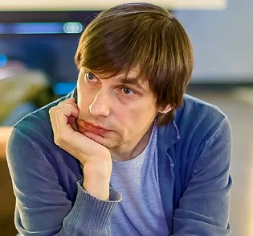

# Весь день 4 декабря вы смотрели фильм «Коробка» Эдуарда Бордукова. Показ завершен. Онлайн-кинотеатр «Новой газеты» приглашает

- **URL:** https://novayagazeta.ru/articles/2016/12/02/70760-ves-den-4-dekabrya-smotrite-film-korobka-eduarda-bordukova
- **Дата:** 2016-12-02
- **Автор:** Лариса Малюкова

## Весь день 4 декабря вы смотрели фильм «Коробка» Эдуарда Бордукова. Показ завершен

## Онлайн-кинотеатр «Новой газеты» приглашает

## Показ завершен.

## О фильме

Московская окраина. Жаркое лето. Уличный футбол для юношей — это и вся жизнь, и способ взаимоотношений, и возможность доказательства силы духа.

Внутри «коробки» — огороженной площадке рядом с жилыми домами разворачивается межнациональная драма, превращая футбольное поле в поле битвы, войну между «своими» и «чужими». Здесь назревают и не всегда решаются самые злые городские проблемы. В жесткий бескомпромиссный турнир постепенно втягиваются все жители района, а также наци и мафиози.

Энергичный, остросоциальный, честный фильм. Молодой режиссер и сценарист Эдуард Бордуков — бывший спортсмен, мастер спорта, отлично знает, о чем хочет рассказать. Сильные эпизоды фильма — сама игра, в которой подростки доказывают силу и состоятельность с помощью спорта. «Коробка, вокруг которой разворачивается действие фильма, — это метафора города, страны, мира», — утверждает режиссер.

Поддержите нашу работу!

1000 500 300 Нажимая кнопку «Стать соучастником», я принимаю условия и подтверждаю свое гражданство РФ

Если у вас есть вопросы, пишите [email protected] или звоните:+7 (929) 612-03-68

Продюсерами картины стали Елена Гликман, предпочитающая работать с дебютантами («Питер ФМ» Оксаны Бычковой, «Чайки» дебют Эллы Манжеевой), и Михаил Дегтярь.

Картина стала кинодебютом и для легендарного российского вратаря «Локомотива» Руслана Нигматулина. Воспитанник «спартаковской» школы сыграл в фильме о дворовом футболе роль тренера юношеской команды клуба «Спартак». «Несмотря на то, что я в своей жизни играл в разных клубах, в душе я — "спартаковец"», — признался Нигматулин.

## Приглашаение режиссера

Эдуард Бордуков

режиссер

— В этом фильме я хотел рассказать динамичную историю, поднять острую, проблемную тему, но высказаться по ней таким языком, чтобы это было интересно молодому поколению. Я хотел показать, как в этом агрессивном мире молодой человек, которого распирает энергия, может направить ее в мирное русло. И я показал спорт как такое русло.

Идея этого фильма у меня родилась после событий на Манежной площади. Тогда несколько тысяч подростков вышли на площадь, шли по центру города, громили все, а началось все с футбольных фанатов.

Футбол мы снимали долго, тщательно. Каждый удар, каждый пас, каждый финт по несколько дублей. На это уходило больше всего времени и с этим были связаны основные сложности. Были и форс-мажоры: актер, исполнитель одной из главных ролей, сломал ногу на съемках, из-за этого пришлось переделать сценарий.

Тему межнациональных отношений, месседж, «моралите» — их я не хотел выпячивать на первый план. И я бы не хотел, чтобы подросток лет 12-16, посмотрев мой фильм, начал задумываться. Лучше, чтобы он посмотрел его с удовольствием.

Поддержите нашу работу!

1000 500 300 Нажимая кнопку «Стать соучастником», я принимаю условия и подтверждаю свое гражданство РФ

Если у вас есть вопросы, пишите [email protected] или звоните:+7 (929) 612-03-68
