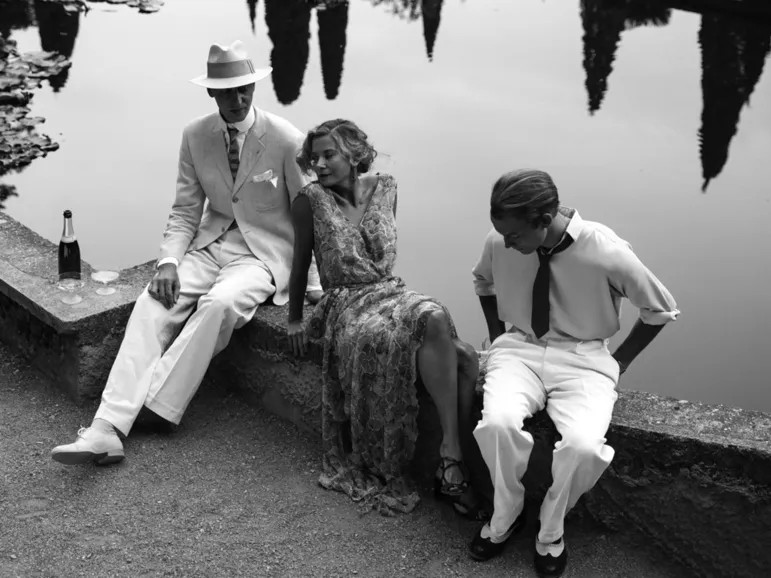

# Из рая в ад переходя, здесь движется народ. «Серебряный Лев» за режиссуру на Венецианском кинофестиваля,  оскаровский шорт-лист, три премии российской кинокритики: «Рай» Андрея Кончаловского выходит на экраны.

- **URL:** https://novayagazeta.ru/articles/2017/01/18/71195-iz-raya-v-ad-perehodya-zdes-dvizhetsya-narod
- **Дата:** 2017-01-18
- **Автор:** Лариса Малюкова

## Из рая в ад переходя, здесь движется народ

## «Серебряный Лев» за режиссуру на Венецианском кинофестиваля, оскаровский шорт-лист, три премии российской кинокритики: «Рай» Андрея Кончаловского выходит на экраны.

Кадр из фильма «Рай»Ключом к методу становятся слова главной героини: «Я не могу так рассказать, чтобы это можно было прочувствовать». Особое внимание к форме продиктовано стремлением «так показать», чтобы «прочувствовать».

Три судьбы времен Второй мировой — русской участницы Сопротивления, французского коллаборациониста и немецкого офицера СС.

… Пухлый француз Жюль (Филипп Дюкен) — в маленьких руках утренний кофе и свежая газета. После семейного завтрака автомобиль отвезет его в полицейский департамент. Где будут пытать французских антифашистов, организовывать облавы на евреев… и где он велит секретарше купить три билета в цирк.

…Хельмут (Кристиан Клаус) — аристократ из старинного немецкого рода, ныне офицер СС. Хозяин замка с тонной ненужного «в минуты роковые» хлама: резной мебели, столового серебра и еще более ненужной прислугой. Знаток Ницше и сокровищ русской литературы. По заданию партии честно вскрывает гнойники коррупции в концлагерях, выводя на чистую воду нечистоплотных «чиновников». Вроде работают исправно — 10 тысяч в день уничтоженных, но вот в Дахау — несовпадения реальных цифр и отчетных. Это не орднунг.

Все это на поверхности. На самом деле, трагическая судьба Хельмута — история мощи, магнетичности, метаморфоз зла. История о многих лицах и обличьях дьявольского, распространенная в немецкой мифологии, развита «Фаустом», демонизмом романтиков, возведших зло в предвечную внеисторическую силу. Кончаловский размышляет об искушении «бездной», как справедливо утверждал Гюго, — столь сильной, что «ад надеется совратить здесь рай, и дьявол возносит сюда Бога».

…Русская княгиня Ольга, редактор модного французского журнала (судьба героиня Юлии Высоцкой безусловно овеяна флером трагической судьбы Вики — Веры Оболенской, героини Сопротивления, гильотинированной в 1944-м). Вынужденно оторванная от корней, «прикорнувшая» на плече европейской культуры, участница Сопротивления. Пойманная на том, что спасла еврейских детей. Поступок этот Ольга совершает как бы необдуманно. Пожертвовав всем: свободой, жизнью… Она подыскивает слова… как бы это объяснить. Необъяснимо. И естественно. Дальше катастрофическое столкновение с непереносимым: с лагерем смерти. Там она увидит Хельмута, когда-то в Италии безнадежно влюбленного и в русскую княжну, и в русскую литературу. Даже учившего русский язык. Между ними завязываются странные близкие отношения. Как просвет в аду, слабый проблеск в кромешной тьме.

Поддержите нашу работу!

1000 500 300 Нажимая кнопку «Стать соучастником», я принимаю условия и подтверждаю свое гражданство РФ

Если у вас есть вопросы, пишите [email protected] или звоните:+7 (929) 612-03-68

Тьма — будничный кошмар концлагерного выживания. Как его описать? Когда к умершему бросаются… чтобы стянуть одежду и обувь. Папироса становится главной валютой, на которую можно купить и еду, и жизнь.

В отличие от обласканного Каннами и «Оскаром» «Сына Саула» — репортажа из преисподней, в котором евреи из зондеркоманды обслуживают печи и газовые камеры, Кончаловский воссоздает атмосферу липкого страха минималистскими средствами. Вместо искалеченных тел, огня и пепла — горы очков, расчесок, ботинок, которые сортируют заключенные. «Ад» и «рай», по Кончаловскому, соседствуют внутри колючей проволоки концлагеря. Здесь бьют узников ногами и освобождают бараки, выводя заключенных на санобработку. Но могут и пожертвовать собой ради другого. И тут же в коттедже молодые офицеры ведут под хороший коньяк литературные споры о Чехове — теме их дипломных работ… Пока Дуня Эфрос — невеста Чехова в 1886 году — в то же время задыхается в газовой камере. Все неразделимо. Как в избранной Кончаловским теме Брамса из третьей части Третьей симфонии, где домашний романс захлестывает трагическая волна, где минор преломляет мажорный лад. Как в воспоминаниях остриженной наголо узницы, возвращающих ее на воды нарядного итальянского курорта под кипарисами, с шампанским, смехом, флиртом с галантными кавалерами. Все это подвижные границы между тьмой и светом, проходящие через нас. «Как ты думаешь, что бы Чехов сказал о том, что сейчас вокруг творится?» — интересуется офицер СС у Хельмута, — чеховед ответит: «Он бы не поверил».

В расчеловеченной среде возможно все: смерть может победить любовь, сострадание одолеть страх. И наоборот. Три истории взаимоотношений человека и Молоха. Коллаборационист Жюль служит ему, оплачивая бюргерский образ жизни. Буржуазная мышь строит личный уютный рай для себя и своей семьи. Ольга пытается сохранить человеческое в нечеловеческих условиях. Здесь Молох неумолим — немедленно отправляет возмечтавшую о достоинстве в ад, глухую несвободу. В механическое существование, которое не может называться жизнью. Как говорит Ольга: «Только вначале страшно, а потом все равно». Молох пожирает не только самих людей, но и человеческое в них.

С точки зрения философии фильма ключевой становится история Хельмута. Образованного идеалиста и альтруиста. Филолога, цитирующего Чехова и Толстого. Не о себе заботящегося, о благе многострадального немецкого народа. Для истинных арийцев он вместе с однопартийцами строит отдельно взятый рай Третьего рейха. И с завистью посматривает на великую стройку светлого будущего, которое осуществляет камрад Сталин, заботящийся о благе всего мира. Ну да, есть проблемы, жертвы, приходится поступаться принципами… Каждый последующий выбор на этом пути «благих намерений» беспощаднее и чудовищнее предыдущего. Зло, — убежден Кончаловский, и с ним трудно не согласиться, — маскируется зачастую высокими идеями о всеобщем благоденствии, о демократии, свободе. Поиск «идеальной» жизни приводит отдельные страны и отдельных людей к нравственному падению.

В отличие от Сокурова, в «Молохе» показавшего унижение «триумфа воли» низкой правдой телесного, физиологии, — Кончаловский оставляет своему романтическому герою право на «трагедию заблуждения». Мы расстаемся с Хельмутом на перекрестке между адом и раем. И их болезненный роман с Ольгой, история их взаимного притяжения оказывается и историей трансформации их представлений о рае.

Монологи трех главных героев — одетых в одинаковые серые рубашки на никаком, сером фоне — самое ценное в фильме. Они — связующая нить киноромана. Что-то вроде синхронов в Чистилище. Чистосердечных признаний Всевышнему о содеянном в земной жизни. В тихих интервью Богу — между миром живых и миром мертвых — оттенки надежды, внутренних разладов и человеческой трагедии. Вратами в мир иной становится кинокамера. Ей и исповедываются. Тонкая, удивительная работа актеров и режиссера. Однажды Кончаловский признался: была идея оставить только эти монологи и сделать авангардную картину.

Конечно, непросто поднять уровень игровых сцен до эмоционального напряжения, до простой, прозрачной формы этих исповедей. Некоторые из эпизодов кажутся наигранными (например, истеричное восхищение Ольги нацией победителей, высшей расой, которой все дозволено, потому что «право имеют»). Можно желать большей внутренней монолитности, слаженности всех элементов. Но это вовсе небезгрешное кино точно резонирует с европейской классической традицией кинематографа. Поэтому не соглашусь с высказываниями, уже прозвучавшими: Кончаловскому дадут «Оскар» за тему.

Нет. У фильма свой голос, свое художественное видение и взгляд на трагедию. Автор размышляет о геноциде не только как тотальном уничтожении, буквально «всесожжении». Предлагает разговор и о духовном насилии, унижении, которое невозможно пережить. И в этом смысле его философия близка шаламовской: «…из потустороннего, иррационального мира нет возврата… в прежнюю свою душу мы и не рассчитывали вернуться назад. И не вернулись, конечно. Никто не вернулся». Правда, в отличие от Шаламова, Кончаловский не ставит здесь точку. Своей обреченной на смерть героине дарит надежду на «пробуждение», как рифму сквозной чеховской теме «неба в алмазах», когда «зло земное, все наши страдания потонут в милосердии…»

Поддержите нашу работу!

1000 500 300 Нажимая кнопку «Стать соучастником», я принимаю условия и подтверждаю свое гражданство РФ

Если у вас есть вопросы, пишите [email protected] или звоните:+7 (929) 612-03-68
