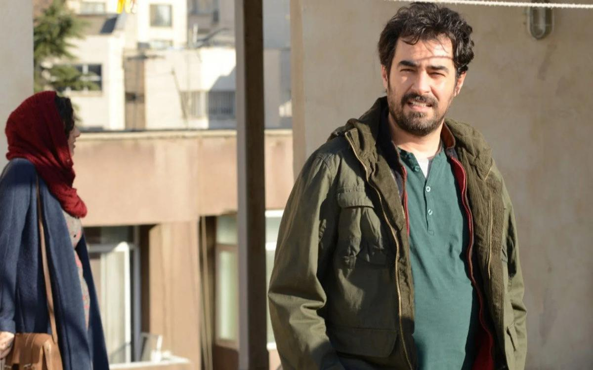

# Как выбраться из лабиринтов страха. Картины, покорившие Каннский кинофестиваль, добрались до российского зрителя

- **URL:** https://novayagazeta.ru/articles/2017/01/23/71263-kak-vybratsya-iz-labirintov-straha
- **Дата:** 2017-01-23
- **Автор:** Лариса Малюкова

## Как выбраться из лабиринтов страха

## Картины, покорившие Каннский кинофестиваль, добрались до российского зрителя

«Коммивояжер»«Коммивояжер» Асгара ФархадиИрано-французская драма получила сразу две награды в Каннах («Лучший сценарий» и «Лучшая мужская роль»). Фархади любят и заокеанские академики, его «Надер и Симин: Развод» удостоен «Оскара» за лучший иностранный фильм.

И вот снова режиссер разворачивает семейный роман в психотриллер. Эмад (Шахаб Хоссейни) и Рана (Таране Алидости) живут и работают в Тегеране. Днем муж учительствует, вечерами они вместе играют в самодеятельном театре. Сейчас репетируют «Смерть коммивояжера» Артура Миллера, пьесу о разбитых мечтах, истощении иллюзий, о нравственных подменах и крушении одной семьи.

Из-за строительных работ в их доме Эмад и Рана вынуждены переехать на съемную квартиру, где на Рану нападет неизвестный, лицо которого она даже не запомнит. Вопреки желанию жены, муж начнет расследование и наконец вычислит мерзавца. Им окажется тот, на которого менее всего могло бы пасть подозрение… Ну да, в пересказе все это похоже на телевизионный детектив. Однако Фархади использует криминальную интригу лишь как катализатор исподволь растущего напряжения в отношениях между героями. Вторжение неизвестного разрушит мирное течение жизни. Закручивается клубок из явного и тайного. Драматический подтекст из пьесы Миллера, где ложь смешана с правдой, воображаемое с действительным, — вползает в дом влюбленных в театр.

В фильме, как в микроскопе, рассматриваются психологические парадоксы и двусмысленности. Благородная месть, превращающая правосудие в судилище. Справедливый гнев и неисповедимая опасность его границ. Стыд как личностное поражение. Неврозы… Подозрительность… Вина…Страхи… Фильмы Фархади — моральные лабиринты, из которых зрителю предлагается выбираться самостоятельно.

Он обладает редким режиссерским темпераментом — в его картины медленно входишь, словно в холодную воду или в чужую квартиру, и незаметно в них обживаешься, сближаешься с его героями. Вместе с ними ищешь и нащупываешь ответы на сложные вопросы. И точно как в жизни: никогда не угадываешь, куда же развернется сиюминутно меняющийся сюжет. Фархади расшивает бытовое платье обстоятельств (квартирный быт, лестничная клетка, клубный театр) шелковым узором зыбких, ненадежных человеческих связей. Так же, как в оскароносном «Разводе Надера и Симин», он обнаруживает завораживающую полифонию взаимозависимостей. Всматривается в поток реальности и в своих героев с разных точек зрения. У каждого здесь своя правда, свои мотивации — решайте, на чьей вы стороне.

Автор не педалирует «восточный колорит». История пропитана универсальными смыслами, развивает универсальную драматургическую структуру (конечно же, вспомнятся напряженные «поединки близких» в пьесах Теннесси Уильямса или Олби). Но вместе с тем из его фильмов, как и из интеллигентных работ Джафара Панахи, осужденного за антиправительственную деятельность, начинаешь понимать, как, чем живет сегодня в Иране средний класс. Насколько обеспокоен он конфликтом между консервативными устоями, секуляризацией и желанием личной свободы, эмансипацией семьи и традицией, давлением общества и индивидуализмом, модернизацией жизни (к примеру, беспорядочным разрастанием Тегерана) и старым миром. Да, фильмы Фархади, обладателя наград всех крупнейших фестивалей класса «А», точно так же, как драмы Панахи, — портреты современного иранского общества. Каким-то образом, несмотря на давление местных «министерств идеологии и культуры», иранским режиссерам удается показать и настроение общества, и политическую ситуацию в стране, и особенности обычной жизни Ирана. Страны, законы и принципы которой непросто понять иностранцу.

Кино Фархади, скроенное как авторское (и в монтаже, и в движении камер, в отсутствие музыки), обладает зрительским потенциалом. Его «Развод…» только во Франции посмотрело более миллиона зрителей. И cейчас, пока режиссер готовится к съемкам фильма на испанском языке c Хавьером Бардемом и Пенелопой Крус, — мир смотрит «Коммивояжера», участника оскаровской гонки.

## «Иллюзия любви» Николь Гарсии

Поддержите нашу работу!

1000 500 300 Нажимая кнопку «Стать соучастником», я принимаю условия и подтверждаю свое гражданство РФ

Если у вас есть вопросы, пишите [email protected] или звоните:+7 (929) 612-03-68

Говорят, «любовные романы» успокаивают. Надо сказать, что из-под пера итальянской писательницы Милены Агус выходили лав-стори, рассказанные с иронией, вкусом, изяществом. Ее «Каменная болезнь» (Mal di pietre) — про страстных и странных персонажей. Одна из героинь, страдая от несовершенства реального мира, выбирает мир воображаемый. Всматривается в лица мужчин, встречающихся на ее пути, выискивая и не обнаруживая единственно возможное лицо… Ненормальная? Кажется, именно это и привлекло режиссера Николь Гарсию в повести Агус:

«Меня больше всего интересуют люди — как мужчины, так и женщины, — которые находятся на краю пропасти, на границе между нормальным и ненормальным. Как канатоходцы. Я нахожу их поэтичными».

Впрочем, Гарсия переносит действие из поэтичной Италии в южную провинцию Франции, переживающую тяжелые послевоенные годы, а также на швейцарский курорт, куда своенравную Габриэллу (Марион Котийяр) муж отправляет подлечить почки. Надо сказать, этому мужу, простому строителю, — девушку, начитавшуюся книжек, сокрушительную в своих чувствах и желаниях, — сплавляют ее родовитые родители. Брак как «лекарство от нервов». Говорят, некоторым помогает. Муж (Алекс Брендемюль) — значительно старше. У него светлые, почти прозрачные глаза. Молчаливый, терпеливый, сдержанный. В общем, совсем не тот, о ком мечтают романтически озабоченные книжные девушки. Поиск идеальной любви ослепляет: подлинной, грандиозной любви не видишь у себя под носом.

Эгоцентричная Габриэлла никак не справляется с бурями панических атак.

И только в швейцарском санатории она обретет зыбкое счастье, влюбившись в раненого ветерана войны в Индокитае. Похожего на лермонтовско-врубелевского Демона. Ее можно понять: у Андре лицо Луи Гарреля, в которого влюблены все девушки Франции. Он жует опиум и мечтает умереть в бою. А также играет на пианино сверхромантическую «Баркаролу» Чайковского. С таким только и можно броситься с головой в иллюзорный мир любви. Бежать-улететь от обыденности. Подобный пожар страстей, запретных желаний не то что встречами с мужем, даже душем Шарко, — не унять.

На главные вопросы, насколько реальна или фантомна, взаимна или безответна любовь Габриэллы, — зритель будет отвечать самостоятельно. Также решать для себя, не отвращает ли его некоторая сиропность чрезвычайно красивой картины.

«Иллюзия любви» — фильм про силу воображения и небезопасность «полетов во сне», фантазии, которая сильнее не только разума, но и самой жизни. Примерно про то же мы разговаривали с Луи Гаррелем, талантливым наследником замечательной французской кинодинастии, сыгравшим роль Андре. Роль любовника. Роль мечты. «Я ведь и сам с детства живу в мире иллюзий. Когда в наших желаниях — мы лишь модели, копирующие желания наших «медиаторов», тех, кому мы подражаем. Во всех наших отношениях — мы сложно устроенные отражения. Вся моя жизнь состоит из съемок, в которые вкладываешь личные впечатления, воспоминания, всхлипы предыдущих работ. Встреч с мастерами, с коллегами. Все это зеркало, в котором отражается другое зеркало. Ты проходишь через эту анфиладу отражений, оставаясь вроде бы неизменным, но существенно меняясь. Как говорил Шекспир: «Стану твоим зеркалом, и открою тебе то, о чем ты сам и не догадывался».

После показа фильма на Каннском кинофестивале 2016 года зал стоя аплодировал фильму Николь Гарсии почти 10 минут, тем самым продлевая сеанс коллективной иллюзии. Неужели так сильно желание жить миражами? «Все-таки лучше, чем ничего», — заметил классик.

Поддержите нашу работу!

1000 500 300 Нажимая кнопку «Стать соучастником», я принимаю условия и подтверждаю свое гражданство РФ

Если у вас есть вопросы, пишите [email protected] или звоните:+7 (929) 612-03-68
