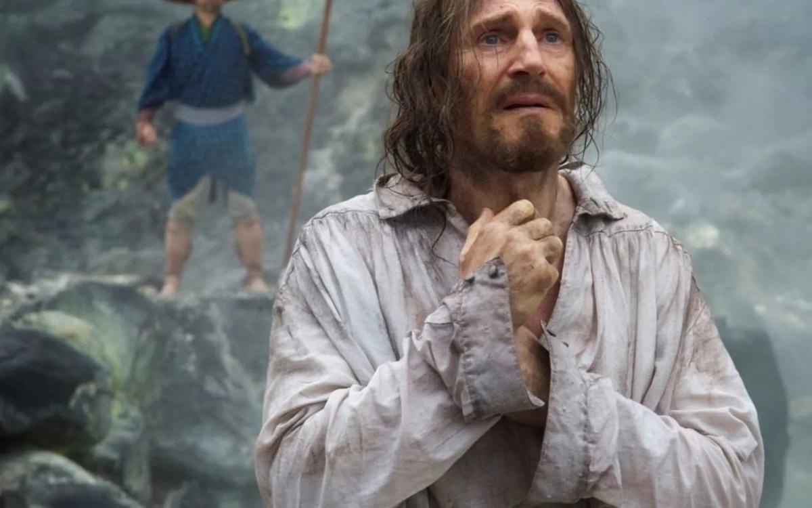

# «А что бы сделал Иисус»? Исторический и теологический эпос «Молчание» — одна из самых знаменательных работ Мартина Скорсезе

- **URL:** https://novayagazeta.ru/articles/2017/01/24/71274-a-chto-by-sdelal-iisus
- **Дата:** 2017-01-24
- **Автор:** Лариса Малюкова

## «А что бы сделал Иисус»?

## Исторический и теологический эпос «Молчание» — одна из самых знаменательных работ Мартина Скорсезе

Кадр из фильма74-летний Скорсезе — посланец Золотого века Голливуда, снял новый фильм. Но не только поэтому «Молчание» — событие. И не оттого, что поклонники классика уже готовы считать его опусом-магнум. Для самого Скорсезе — это одна из самых знаменательных работ.О ней размышлял на протяжении десятилетий. Как только прочитал в конце 80-х знаменитый роман Сюсаку Эндо, которого литературоведы называют японским Грэмом Грином. Роман погружает нас в Японию ХVII века, в период Эдо, когда была объявлена война «какурэ-кириситан» (скрывающиеся христиане). Собирая материал, Эндо отправился в большой вояж, прежде всего в Нагасаки, один из главных миссионерских центров, где японские власти, искореняя новую религию, обрушили жесточайшие гонения на христиан. Отсюда ощущение репортажности, словно автор — очевидец событий многовековой давности.

По сути, «Молчание» — продолжение напряженного диспута с церковью и ее догматами. Диспута о вере и сомнении, который на протяжении всей жизни ведет католик Скорсезе, в молодости собиравшийся принять церковный сан.

Римская курия получила шокирующее сообщение: посланец португальского ордена иезуитов Кристован Феррейра отрекся от веры после пытки «ямой» в Нагасаки. Португальские иезуиты падре Себастьяну Родригес (невероятная по мощи и трагизму работа Эндрю Гарфилда) и падре Франсиско Гаррпе (Адам Драйвер) решают самолично удостовериться, отказался ли почитаемый ими наставник Феррейра (Лиам Нисон) от веры, дабы ублажить антихристианскую аристократию чужеродной страны. И вроде бы — о ужас! — даже взял японскую жену (кстати, документальная история Феррейры зафиксирована в разных исторических источниках).

Родригес и Гарпе клянутся разыскать учителя и рассеять клевету.

Это не просто опасное путешествие в закрывшую для иноземцев врата Японию. Это миссия: «Вы два последних священника, когда-либо посланные».

Кадр из фильма / kinopoiskИх проводник, контрабандист и рыбак Кизидзуро (Есукэ Кубозука), грязный пьянчужка, вечный предатель (трудно не заметить сходства этого жирно выписанного трагифарсового персонажа с самураем-самозванцем, сыгранным Мифунэ Тосиро в «Семи самураях»).

Христианство объявлено вне закона как угроза, разъедающая японский менталитет. Чужая вера выжигается безжалостно. В деревне, населенной тайными христианами, и миссия волонтеров начинает меняться: теперь необходимо не только найти падре Феррейра, но и помочь благочестивым крестьянам, жизнь которых превратилась в кошмар. Они существуют в постоянном страхе быть обнаруженными властями. Тысячи и тысячи крестьян подвергались гонениям, уничтожению. Родригес становится свидетелем зверств, пыток собратьев по вере.

Упорствующих подвергают мучениям. Водные кресты, сожжения, яма, в которой жертву вешают вниз головой, сделав маленький надрез на виске, чтобы кровь вытекала медленно. Нет предела фантазии «инквизиции».

Скорсезе и оператор Родриго Прието (он работал с Альмодоваром, Стоуном, Энгом Ли, снимал «Волка с Уолл-стрит» Скорсезе) воссоздают «остров проклятых» в духе Гойи, гравюр Дюрера… Сквозь туманную зыбь, пары серы и кипящих источников видим мужчин со связанными руками. Солдаты обливают их огненной водой из леек: каждая капля «горящего угля» — объясняют нам, недогадливым, — бьет и ранит кожу…

Но падре Родригеса не пугают пытки, ради веры он готов на мученичество, дабы обрести честь в смерти. Он жаждал попасть в Японию и жить одной жизнью с японскими христианами. Что ж, мечта стала явью. Он пленен вместе с ними. И теперь молится, умоляя Господа облегчить участь тех, кого распинают, топят, обезглавливают. Отчасти из-за него, из-за его стоицизма. Откажись! И им станет легче!

Крепость веры против милосердия — неразрешимый конфликт. Вера проходит испытание любовью к своим прихожанам. Что бы сделал на его месте Иисус? Родригес подавлен ощущением своей бесполезности, он лишь свидетель пыток и убийства тех, кто поверил ему. Но еще больше он страдает от очевидного «молчания» Всевышнего. Правда, трудно быть богом.

Кадр из фильма / kinopoiskСкорсезе мог бы, как Теренс Малик в «Древе жизни», взять эпиграфом к фильму цитату из Книги Иова «Где был ты, когда Я полагал основания земли?». Ведь и главный вопрос Родригеса Всевышнему: «Как ты мог допустить подобные трагедии и муки?» Этот напряженный диалог в полном безмолвии… кульминация фильма. В этой кромешной тишине, в которой заперт Родригес, и мы должны сделать выбор.

Скорсезе проводит пунктиром лейтмотив веры как отражение одного в другом. Родригес видит Иисуса, когда смотрится в реку, его крестный путь с мытарствами и предательством рифмуется со скорбным путем Христа. Он должен вновь и вновь прощать предателя Иуду—Кизидзуро. Но во время своих хождений по кругам ада Родригес впускает в сердце сомнение — искаженное отражение веры. Впрочем, по Скорсезе, сомнение — часть веры, необходимое препятствие для внутреннего роста верующего, способного услышать в мертвенной тишине голос Бога.

Поддержите нашу работу!

1000 500 300 Нажимая кнопку «Стать соучастником», я принимаю условия и подтверждаю свое гражданство РФ

Если у вас есть вопросы, пишите [email protected] или звоните:+7 (929) 612-03-68

Скорсезе в основном сохраняет неоднозначность, заложенную в романе. Не только Родригес, все миссионеры — здесь чужаки, пришельцы с других планет. Убежденные в своей правоте, презирающие местную еду, традиции, язык.

Скорсезе сохраняет важную идею романа Эндо: «Не гонения и казни уничтожили христианство в Японии. Оно умерло, потому что не могло здесь выжить…»

По предположению Эндо, идея некоей верховной силы, карающей за грехи, в душе японца не могла найти отклика.

Главный оппонент последнего португальского священника — инквизитор Иноуэ (Иссэй Огате в сокуровском «Солнце» сыграл императора Хирохито) мил и любезен с Родригесем, он взывает к разуму и логике. Объясняет, что существует онтологическая несовместимость христианства и японского духа. И никаких доказательств эта несовместимость точно так же, как вера инородцев, — не требует. Для японского миропорядка очевидна вредоносность «благородного импорта» веры высокомерными и нелюбознательными европейцами. А зритель невольно сравнит это праведное вмешательство с благими намерениями — свобода и демократия, которую нынче огнем и мечом несут просвещенные империи в страны третьего мира.

Одна из глубинных тем фильма — компромисс. Не только как способ выживания, но временами и возможность, уступая, не предать главного: «Учась возлюбить так, чтобы вынести то, через что прошел «последний христианский священник Родригес».

Власть предлагает и простым крестьянам, и священникам компромисс. Совершив обряд Фуми-э — «чистая формальность», пройти через «Врата очищения». Разве это отречение? Миссионер-иезуит падре Феррейра (многомерная работа Лиама Нисона) возводит компромисс в высшую степень жертвенности. Отречение — мучительный акт любви, по сравнению с которым «маленькая смерть» ничтожна.

Сам исторический и теологический эпос «Молчание» полон страсти, сомнений и боли. Не поучает, не миссийствует, лишь ставит вопросы. И в этой его неопределенности есть стремление докапываться до непостижимых тайн веры. Сценарий писал Джей Кокс, давний партнер Скорсезе, с которым они сочинили «Эпоху невинности» («Оскар» «За лучшую адаптацию») и «Банды Нью-Йорка» («Оскар» «За оригинальный сценарий»)

Многие работы Скорсезе посвящены попытке человека прорваться сквозь злой хаос жизни к смыслу, к истине. Не только «Последнее искушение Христа», где он исследовал двойственность природы Богочеловека, возмутив чувства миллионов «оскорбленных верующих католиков», которые выходили на улицы с протестами и взрывали кинотеатры. «Кундун» о стоичестве духовного лидера тибетских буддистов Далай-ламы ХIV. Едва ли не каждый фильм — опыт самоидентификации. Не потому ли он использует в саундтреке криминальной драмы «Казино» «Страсти по Матфею» Баха, подсказывая зрителю сравнение между деградацией персонажа Де Ниро с падением Люцифера. В высоковольтных «Злых улицах» — неожиданный контрапункт бандитизма и католических воззрений, и племянник местного мафиози стремится воплотить в жизнь идеи святого Франциска Ассизского. В «Воскрешении мертвых» и даже в яростных «Таксисте» и «Отступниках» сквозят темы возмездия, а вера или ее отсутствие — повод обнаружить человека.

«Молчание» — крайне важный фильм Скорсезе. Без пафоса поднимающий вопросы вопросов. Которыми всуе не озадачиваешься. Которые во все времена задавали себе большие художники. О праве отстаивать веру с мечом в руке, о методах нетерпимости и насилия. О кровопролитии во благо. О возможности диалога со Всевышним. И автор, сосредотачиваясь на них, словно сознательно ограничивает себя в средствах выражения: медитативный характер действия, размеренный ритм, приглушенный свет. Почти неслышимая музыка.

Во время просмотра почти трехчасового колосса, временами затянутого, можно утонуть в боли, страданиях, жестокости. И все ж, в отличие от Гибсона, нет-нет, да и любующегося батальными страданиями, взгляд Скорсезе направлен на интенсивность духовного поиска. А мытарства иезуитов — не столько путь религиозного опыта, сколько постижения непостижимого: тайны веры.

Кажется, и для самого Скорсезе это кино — его личное разбирательство с самим собой, со своими противоречивыми мыслями по поводу догматов католической церкви, цены веры, греха и искупления.

Скорсезе словно развивает идеи известного диспута между великим атеистом Умберто Эко и кардиналом Карло Мария Мартини, в котором Эко с самого начала предлагает «целиться повыше».

Без страха и оглядок касаться «предметов, которые корнями уходят глубоко в историю и служат причиной волнения, страха и надежды для всей человеческой семьи на протяжении уже двух тысячелетий».

При этом режиссер не забывает о жанре, о кинематографических традициях, с которыми связано «Молчание». Повествование включает вольные и невольные цитаты, сюжетные и эмоциональные рифмы. Вспоминаются не только фильмы Малика, Кеслевского, Итикавы, Гибсона, но и «трилогия веры» Бергмана, прежде всего «Причастие», в котором подвергнута сомнению истинность веры священника. Так же как в брессоновском шедевре «Дневник сельского священника», смысловым центром фильма становятся внутренние монологи Родригеса, звучащие не только в закадровом тексте, но в самом зыбком изображении, в скользящей смене кадров…

Кадр из фильма / kinopoiskНет, он не «замер в позе живого классика», как написал один критик. В одном из интервью Мартин Скорсезе со свойственной себе иронией заметил: «Кажется, сейчас я стал немного мягче, потому что, в конце концов, в начале 1990-х многим в Голливуде неожиданно понравилось то, что я делал. Они осмотрелись, а я все еще тут. Спустя 20 лет они сказали себе: «Эй, а он все еще жив».

Поддержите нашу работу!

1000 500 300 Нажимая кнопку «Стать соучастником», я принимаю условия и подтверждаю свое гражданство РФ

Если у вас есть вопросы, пишите [email protected] или звоните:+7 (929) 612-03-68
