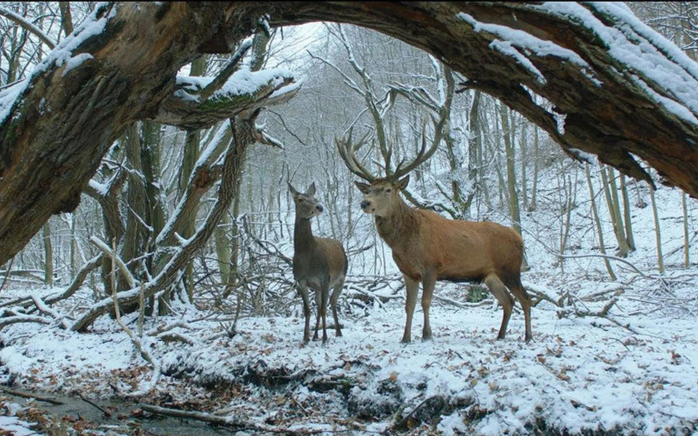

# Рогатые олени… и немного нервно. На «Берлинале» показали «О теле и душе» Эньеди и «Заложники» Гигиниешвили: смотреть или нет?

- **URL:** https://novayagazeta.ru/articles/2017/02/11/71474-rogatye-oleni-i-nemnogo-nervno
- **Дата:** 2017-02-11
- **Автор:** Лариса Малюкова

## Рогатые олени… и немного нервно

## На «Берлинале» показали «О теле и душе» Эньеди и «Заложники» Гигиниешвили: смотреть или нет?

Кадр из фильма«О теле и душе»Реж. Илдико Эньеди, 2016Среди первых фильмов берлинской конкурсной программы — «О теле и душе» опытного венгерского режиссера Илдико Эньеди.

Ее фильм «Мой 20 век» был выбран в качестве одного из 12 лучших венгерских фильмов всех времен. В фильмах Эньеди, независимо от их качества, чувственное изображение. Вот и новая картина начинается с монтажных рифм. Печальный глаз коровы, устремленный к спасительной луне. Лица людей на летней улице. Зимний лес с блуждающей парой оленей. Их нежные отношения. И тут же кошмар скотобойни.

В фильме странным образом сосуществуют разные жанры. И героиня весьма странная. Примороженная Мария похожа на инопланетянку. Но скорее всего, как и Сага Норен, героиня популярного сериала «Мост», страдает синдромом Аспергера, характеризующимся серьёзными трудностями в социальном взаимодействии. Девушка с высшим образованием имеет весьма смутные представления о взаимоотношении полов, не пользуется мобильным телефоном, живет в стерильно чистой квартире, на работе сторонится людей. А работает Мария контролером качества на… будапештской скотобойне. У Марии феноменальная память, с математической точностью она выписывает штрафные очки работникам перерабатывающего цеха за каждую лишнюю унцию жира на мясе. Похоже помимо цифр и детсадовских взаимоотношений с окружающим миром в голове этой хрустальной Снегурочки нет ничего.

Кадр из фильма / «Кинопоиск»Ее босс Эндре — тоже вещь в себе. Существует отдельно от дружного «мясного» коллектива. После инцидента в цеху на скотобойню приходит психолог, тут и обнаруживается, что Марии и Эндре — из ночи в ночь снится один и тот же сон. Будто они олени, вместе блуждают по снежному лесу. Нежно и тревожно. А в пересказе звучит мелодраматично.

Хотя начинается фильм брутально. С концлагеря для коров. Видим страшную механику, по сравнению с которой пыточная Гестапо отдыхает.

Для Эньеди тело — видимая часть души. И поэтому преступно любое убийство. Режиссер использует свои навыки художника и автора документального кино. Она наверняка хорошо знает работы Артура Пелешяна. Поэтому строит фильм как столкновение нежности и жестокости, порыва и сосредоточенности. По звонку идет забой и расчленение животных. Пол и стены заливаются кровью, которую споро смывают из шлангов люди в резиновых сапогах и спецодеждах. И тема «оленьих снов» рефреном сквозит сквозь это повседневное убийство. Любопытно, что к теме сновидений сама Эньеди неравнодушна. В ее «Волшебном стрелке» заказного убийцу преследовали сновидения, связанные с прошлыми временами.

Это кино о фобиях, которые расстраивают стены между людьми. О непреодолимых — по собственной вине — дистанциях.

Понятно (едва ли не с самого начала), что Снегурочка будет постепенно оттаивать.

Ближе к финалу фильм, несмотря на всю изысканность съемки (а сцены в лесу с влюбленными оленями вообще непонятно как сняты), и вовсе превратится в душещипательную мелодраму. А опытный режиссер — в тетеньку, вышивающую крестиком амурные истории.

Поддержите нашу работу!

1000 500 300 Нажимая кнопку «Стать соучастником», я принимаю условия и подтверждаю свое гражданство РФ

Если у вас есть вопросы, пишите [email protected] или звоните:+7 (929) 612-03-68

## «Заложники»

### Реж. Резо Гигинеишвили, 2017

Кадр из фильмаСостоялась мировая премьера «Заложников» Резо Гигинеишвили (Россия — Грузия — Польша), фильма, основанного на реальных событиях, произошедших в Грузии в 1983 году. Шестеро молодых людей и одна девушка, дети известных в республике людей, захватили самолет Ту-134А, намереваясь бежать из СССР. В результате неудавшегося угона погибли семь человек, десять человек получили ранения. Захватчики, выжившие после штурма самолета, были осуждены и приговорены к смертной казни, девушка — к 15 годам колонии. Эти события переживались всей Грузией как национальная трагедия.

Резонансная история стала темой для спектакля, документального фильма, книги Дато Турашвили. Среди угонщиков был Гега Кобахидзе — сын Михаила Кобахидзе — блистательного грузинского режиссера, автора волшебных «Зонтика», «Свадьбы», «Музыкантов». Гега сыграл роль внука тирана Торнике в «Покаянии» Абуладзе. Но после угона самолета Абуладзе велели переснять все сцены с Торнике. В новой редакции юношу сыграл Мераб Нинидзе. И вот спустя 34 года со времени трагедии Нинидзе — играет отца Гега Кобахидзе.

У Гигинеишвили вообще есть вкус в деталям. Он любовно воссоздает эпоху во всех подробностях: советская символика на улицах и в учреждениях, дефицитные пластинки с «битлами» и заграничные сигареты, трехлитровая банка с пивом на столе, музыка Boney M, старый, словно потрескавшийся от времени, Тбилиси. Но детали, увы, не компенсируют отсутствия главного — человеческой драмы.

Да, авторы не обвиняют своих героев и не пытаются их обелить. Они восстанавливают несколько дней перед трагическим событием, сам захват. Пытаются осмыслить след трагедии. По их мнению, ответственность за совершенное преступление лежит не только на этих мальчиках и девочке, но и на обществе, на стране. На родителях, смирившихся с двойной моралью, не сумевших выстроить отношений с детьми. Но все это проговорено спешно, небрежно. Потому про героев мы так ничего и не понимаем. Ну да, границы на замке, нет свободы передвижения… Но молодые люди, читающие Библию, почему так легко решаются на убийство? Не думали, что все завершится столь трагично и преступно? Входя в самолет с пистолетами и гранатами, не думали вообще?

Фильм называется «Заложники» — а не захватчики или террористы. Как гласит словарь, заложники — «лица, удерживаемые силой». В данном случае, силой всей системы, построенной на давлении, подчинении и лжи. Но ведь и террорист нередко преследует самые возвышенные цели. И тогда встает вопрос цены. В случае с «Заложниками» — цены свободы. И человеческой жизни. Но и эти вопросы повисают в воздухе.

Фото: Дина Оганова, 2016 / «Кинопоиск»В истории о взаимоотношениях отцов и детей, также прописанной весьма невнятно проблескивает мотив «Покаяния» Абуладзе. Там внук тирана кончает жизнь самоубийством. А сын — выкапывает отца-тирана из могилы. Здесь родители пытаются разыскать могилы отвергших их детей. Трагедия так и не получила разрешения. Ни в жизни. Ни в кино.

Фильм завершается. Пытаешься вспомнить героев, их лица, судьбы их родителей. Сделать это довольно трудно. Возможно, поэтому не испытываешь ни боли, ни сострадания.

Наверное, сочувствие как-то связано с пониманием?

Поддержите нашу работу!

1000 500 300 Нажимая кнопку «Стать соучастником», я принимаю условия и подтверждаю свое гражданство РФ

Если у вас есть вопросы, пишите [email protected] или звоните:+7 (929) 612-03-68
