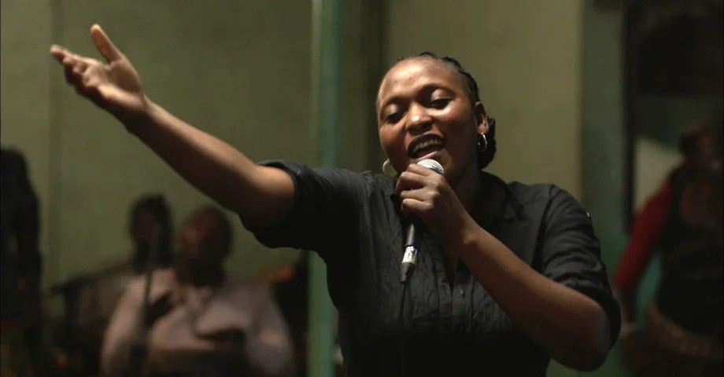

# «Берлинале» — место для жизни людей и зверей. Кинофестиваль продолжается: «Реквием для миссис Джей», «Фелисите», «Дикая мышь» и «След»: смотреть или нет?

- **URL:** https://novayagazeta.ru/articles/2017/02/13/71507-programma-kinofestivalya-prodolzhaetsya-rekviem-dlya-missi-dzhey-felisite-dikaya-mysh-i-sled-smotret-ili-net
- **Дата:** 2017-02-13
- **Автор:** Лариса Малюкова

## «Берлинале» — место для жизни людей и зверей

## Кинофестиваль продолжается: «Реквием для миссис Джей», «Фелисите», «Дикая мышь» и «След»: смотреть или нет?

## Барбитураты с алкоголем

«Попробуй барбитураты с алкоголем», — советует опытный приятель пятидесятилетней Елене, решившей покончить самоубийством. Героиня фильма Бояна Вулетича «Реквием для миссис Джей» впала в глубокую депрессию год назад, когда умер ее муж. Ей больше не интересны ни жизнь дочерей, ни самочувствие свекрови, хотя все они живут в одной, давно не убранной квартире. Она молчит. Портрет ее депрессии — длинный облезший коридор ее бывшей, ныне тоже умершей фабрики. Она и решает за собственной никчемностью присоединиться к мужу аккурат через пять дней, в годовщину его смерти. Всего-то и дел: наказать каменщику выбить ее имя рядом с мужниным на памятнике, оставить детям небольшие банковские накопления. Но дальше экзистенциальная драма обрастает фарсовыми подробностями. Оказывается, свести счеты с жизнью много проще, чем получить долги с обанкротившегося общества, болтающегося между системами, эпохами, втянутого в щель переходного периода. И ведь по сути, именно хождение по мукам бюрократического ада, всем нам знакомого, когда выдача одной справки тянет за собой паровоз из десятка других ненужных бумажек, ее спасает. Необходимо доказать, что она — была, работала всю жизнь, заслужила медицинскую страховку. И к концу недели в ушедшем времени «была» неуверенно проблескивает настоящее — «есть».

Метафизическую сказку Вулетича из привычного мрака социальной безнадеги выводит сдержанный юмор, связанный из ниток обыденности. Юмор как кинематографическое доказательство жизни.

Вспоминается другая «Елена» Андрея Звягинцева того же продюсера Роднянского. Загнанная в патовую ситуацию немолодая женщина решалась на убийство. И было в ее решимости и сомнениях что-то лесковское. Здесь — наоборот. Абсолютно обесточенное тело, тусклый глаз постепенно наполняются воздухом жизни. И финальная стопроцентно предсказуемая песня Елены оправдана внутренней логикой. Потому что в ее видениях муж, военный музыкант, выходит в парадной форме из морских волн, но труба его беззвучна. Значит, сама «русалочка» по всем правилам этой черной сказки должна обрести голос.

## Ой, мамо!

«Фелисите»Рифмой фильму Вулетича — конкурсная картина «Фелисите»франко-африканца Алена Гомиса. Счастье (Фелисите) — имя героини, жительницы Конго, певицы из маленького бара в Киншасе. «Пой, мама!» — взывают ее поклонники. И она погружает в транс себя и всех вокруг. Ее пение, качающееся в джазовых ритмах и звуках африканского фольклора, напоминает то ли крик, то ли плач. Счастьем жизнь одинокой певицы назвать трудно. Будет автокатастрофа, покалеченный сын, и унизительные попытки собрать невиданную сумму для операции. Рядом возникнет огромный ловелас Табу, который будет помогать, тянуть из болота уныния и Фелисите, и ее горемычного подростка. Заезженные сюжетные перипетии (как здесь не вспомнить Островского или распутинские «Деньги для Марии») отчасти компенсирует эксцентриада взаимоотношений главных героев и камера, которая ведет себя как документальная — не привязана к мизансцене. Ну и, конечно, эзотерика как существенная часть жизни. Черные сновидения, наваждения вторгаются в пыльную, убогую, нищую реальность. И музыка — сестра древних ритуалов, помогающая выживать. Трудно сохранить достоинство в подобных условиях. Как говорят в фильме: храбрым надо быть потому, что нет другого выхода.

## Дикий, дикий мир

«Дикая мышь»Музыкальный критик, потерявший работу — герой черной комедии «Дикая мышь», режиссерский дебют известного австрийского комика Иосифа Хайдера. На протяжении четверти века от его слова зависела судьба музыкантов, оркестров, начинающих композиторов. И вот язвительный невротик, выброшенный на улицу, должен на кого-то направить свой гнев. И тут он неистощим на выдумку. Хайдер, сам написавший сценарий, строит фильм как американские горки, но не за счет спецэффектов, а странных сюжетных зигзагов.

Поддержите нашу работу!

1000 500 300 Нажимая кнопку «Стать соучастником», я принимаю условия и подтверждаю свое гражданство РФ

Если у вас есть вопросы, пишите [email protected] или звоните:+7 (929) 612-03-68

«Дикая мышь» — название полуразрушенного городского аттракциона — американских горок, который решают оживить экс-музыковед и его школьный товарищ. А сама история милой, но скромной картины, становится концентрированной метафорой страхов и фрустраций благополучного среднего класса.

## Господа, вы звери!

«След зверя»Волшебным именем Душейка зовут героиню картины ветерана польского авторского кино Агнешки Холланд. Ее «След зверя» — демонстрация непредусмотренных способов борьбы со злонравным миром, а также еще один фестивальный опус в защиту животных.

И снова черная комедия (как еще рассказывать о черных страстях негармоничного мира, чтобы зрителю не было мучительно больно?) Похоже, эта Душейка (Агнешка Мандат-Грабка) во многом автопортрет самой Холланд. Во всяком случае, рьяный темперамент пожившей леди, с которым она защищает животных, сродни публичным выступлениям режиссера.

В основе — роман Ольги Токарчук «Веди свой плуг по костям мертвецов» (название — строчка из поэмы Уильяма Блейка «Бракосочетание рая и Ада», которая тоже будет ввязано в многофигурную сюжетную композицию).

Живет Душейка с любимыми собаками на польско-чешской границе в своем райском лесном доме рядом с адским линчевским городом, где все друг друга знают. К ней в дом и два поклонника захаживают, с которыми она не прочь раскурить у костра под хорошую музыку косячок. Важную роль в фильме играет календарь охотника. Каждая глава — название месяца со списком зверей, которых разрешено именно в этот месяц убивать, чтобы забить холодильник «диким мясом». Кровавая и бессмысленная баня для зверей, их мучения в клетках местного живодера приводит в ярость Душейку. Но на вопли и бешеные протесты пенсионерки не реагируют ни полиция, ни местный священник. Почему вчера еще нельзя было убивать оленя, косулю, волка… а сегодня можно? Почему нельзя молиться за безвинно убиенного? Холланд с темпераментом и язвительностью Душейки, которую благонамеренные граждане считают безумной, воюет не только против общественного договора, легитимирующего убийство. Но и против церковных постулатов, отвергающих наличие душ у животных, и тем самым оправдывающих бесчеловечность охотников. В ее кино многие люди похожи на зверей. Во всяком случае — живорезы, убивающие безответных четвероногих, в том числе и собак Душейки.

Но в какой-то момент в городе начинают исчезать и гибнуть сами охотники и браконьеры.

«Возможно, сама природа решила мстить своим врагам?» — предполагает душеспасительница животных и приводит убедительные примеры из истории человечества, рассказывая о странных пандемиях. А глаз ее сверкает вовсе не благопристойно.

Свою спорную, но, безусловно, живую картину Холланд называет «анархистско-феминистической криминальной драмой с элементами черного фарса». В ее фильме многие персонажи бесчинно шаржированы. И странным образом сочетается старомодность режиссуры и способа съемки (камера Иоланты Дылевска подчеркивает небесную красоту мира природы и уродскую — мира людей) с развязным кэмпом, жонглирующим моральными установками.

«Наш фильм мог бы назваться „Старухам тут не место“, — говорит режиссер, — Мир, в котором мы живем, как раз такое место».

«Берлинале» развивает ее утверждение. Тут «не место» безработным, беженцам, старикам, людям с неправильным цветом кожей и неправильной ориентацией. И диким животным, разумеется. Список можно длить, задавшись простым вопросом: Кому же зарезервировано «тут место»?

Поддержите нашу работу!

1000 500 300 Нажимая кнопку «Стать соучастником», я принимаю условия и подтверждаю свое гражданство РФ

Если у вас есть вопросы, пишите [email protected] или звоните:+7 (929) 612-03-68
