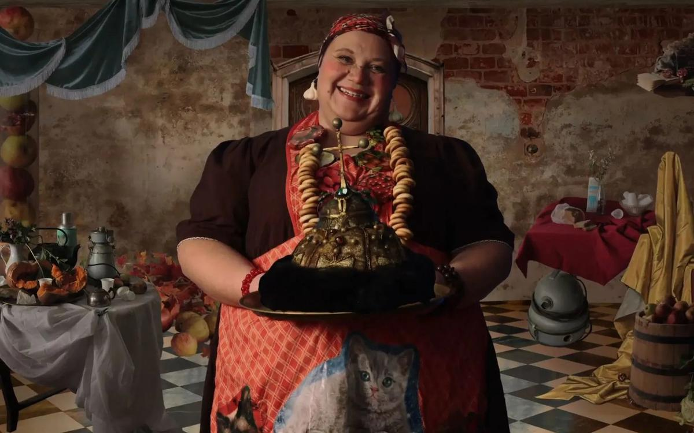

# Черный квадрат с Винни-Пухом. Гид по XXII Открытому фестивалю анимации Суздальфест

- **URL:** https://novayagazeta.ru/articles/2017/03/20/71853-chernyy-kvadrat-s-vinni-puhom
- **Дата:** 2017-03-20
- **Автор:** Лариса Малюкова

## Черный квадрат с Винни-Пухом

## Гид по XXII Открытому фестивалю анимации Суздальфест

Кадр из «Опасного путешествия»По улице Ленина между бесчисленных церквей двигалась разноцветная и разношерстная демонстрация. Винни–Пухи, Пятачки, Ослики, нарисованные аниматорами на ватмане, вырезанные из картона, похожие на своего создателя Хитрука, которому исполнилось бы в этом году 100 лет.

Шествие под оркестр и крики «Ура Винни-Пуху!» напоминали первомайские демонстрации… но из мультфильмов советских времен. Мультзвезды на воздушных шарах улетали в небо со старинной торговой площади Суздаля. Рукотворный салют взрывал мартовское серое марево бонифацевским многоцветьем.

Этот парад директор Открытого анимационного фестиваля Саша Герасимов назвал «центральным деловым событием». Хотя событий было немерено. Целый Деловой Конгресс со своим расписанием давно образовался рядом с фестивалем.

Кульминация — напряженная дискуссия «Индустриальная анимация и авторская — дистанция огромных размеров?», во время которой успешные главные продюсеры полнометражного кино и сериалов с зашкаливающим рейтингом с одной стороны, и творцы авторского кино — с другой, говорили о взаимных претензиях, обидах, недопонимании. О возможности диалога.

Или операция «Открытая премьера» — показ конкурсных фильмов по всей России с голосованием за лучшую работу.

Шла дискуссия «Индустриальная анимация и авторская — дистанция огромных размеров?». И операция «Открытая премьера» — показ конкурсных фильмов по всей России с голосованием за лучшую работу.

Нет ничего сложнее, чем «судить» анимационное кино. Это как выбирать между Шагалом и Левитаном. Поэтому любой вердикт профессионального жюри — выбор лишь этого жюри. Говорю с ответственностью одного из участников. В этом году лист лауреатов практически совпал с рейтингом всего анимационного сообщества, что бывает редко. Но только время — главный жюрист — разделит работы на главные и проходные, а некоторые вдруг да и впишет в историю мировой анимации.

«Рыбы, пловцы, корабли»Одна из самых завораживающих картин конкурса — «Рыбы, пловцы, корабли», ее сделали Дмитрий Геллер и Андрей Кулев с китайскими студентами. Черно-белые с всплесками цвета акварельные кадры накатывались, словно волны. Героиня в шумной китайской закусочной разыгрывает с помощью плоских марионеток и бамбуковых палочек «театр теней». Древнее действо о предопределенности, битве жизни и смерти — среди красных лиц, поедающих лапшу. Диковинные остроносые теневые существа бьются друг с другом и исчезают в бурных волнах. Как будто их создательница знает, что и ее поглотит морская стихия — она репетирует свою судьбу. Влюбленному в нее ловцу жемчуга придется с потерей смириться… и последовать в глубину за ней. Кино о предопределенности судьбы как личном выборе, о блуждающих по кругу рифмах «бытие» — «небытие». Красное и черное. Проза и поэзия… Чистая поэзия, многосложная, страстная; вместо букв — живописные образы, основанные на китайской акварельной тушевой живописи в духе легендарного Ци Байши, философии Лао-цзы и строках Элюара.

Федор Савельевич Хитрук на экране размышляет вслух: «Вот фото: я сижу за столом, на котором стопка бумаги и карандаш. Все. Больше нет ничего — вся трагедия на кончике карандаша». Сегодня анимации не хватает этой простоты, прозрачности, точности. Но при всех проблемах (прежде всего драматургической невнятности) авторская анимация продолжает заниматься поиском киноязыка, который мог бы выразить «невыразимое». Справедливый приз «за прорыв» — геллеровским «Рыбам…» от Норштейна и мэтров. Приз критики.

Геллер сегодня — один из немногих, кто использует компьютер с таким бесстрашием и художнической свободой. Он из Екатеринбурга.

Вот есть в уральской анимации какой-то секрет. Радиация ли, эхо шаманских заговоров, магические кристаллы — преобразуют заряд авторской энергии в эмоцию, волшебство линии, трагическое мироощущение? По мнению Димы Геллера, дело в том, что в тех краях практически не было крепостного права, что прятались там в разные времена целые поселения старообрядцев, «оседали» многие выходцы из ГУЛАГа, которым не разрешалось жить в Москве и Питере…

Поддержите нашу работу!

1000 500 300 Нажимая кнопку «Стать соучастником», я принимаю условия и подтверждаю свое гражданство РФ

Если у вас есть вопросы, пишите [email protected] или звоните:+7 (929) 612-03-68

Среди черных волнГран-при у фильма «Среди черных волн»Ани Будановой из екатеринбургской студии. Автор известного фильма «Обида» — про девочку, которая вырастила свою маленькую обиду в страшного монстра, — сделала совершенно иную работу. Средствами ручной текучей графики (тушь, гуашь, масляная краска) интерпретировала на свой лад древнюю легенду о душах утонувших людей, превратившихся в морских животных. Рыбак вылавливает из моря нерпу. И становится она ему верной женой, рыбу острым ножом безропотно разделывает, девочку ему рожает. Пока обнаруженная кожа не возвращает ее в родную стихию, оставляя у кромки проруби убитого раскаянием рыбака. Черная вода, черная собака с оскалом, глаза нерпы, сверкающие угольным блеском, — ее сущность, просвечивающая сквозь глухую ткань капюшона. Графика, движение, цвет разыгрывают конфликт видимого и сущего. Красная рябина, на которую пяткой наступает героиня. Красный квадрат на черном экране, камера отъезжает: черное оказывается мертвым телом кита, от которого аборигены отрезают шматы мяса и уволакивают домой, оставляя кровавый след на белом снегу.

«Два трамвая»У анимации — своя внутренняя связь с поэзией. «Два трамвая»Светланы Андриановой (Спецприз за поэтичность) вдохновлены стихотворением Мандельштама и книжными рисунками Анны Десницкой. Кукольные трамваи. Мама и ее неопытный сын Клик колесят по городу, моргающему электричеством, мимо светящихся окон, бумажных птиц и белых дворников, вырезанных из картона. В пространстве этого фильма уживается плоское и объемное, коллаж и рисунок. Детская краснощекая радость Клика и беспощадность времени: одинокая старая трамваиха под фонарем…

Опытные авторы говорят: по Хармсу и прочим абсурдистам кино снять невозможно. Но очень хочется! Лиза Скворцова — девушка храбрая. Сочинила свое кино по мотивам абсурдистского стихотворения Эдварда Лира про сватовство мистера Джони-Бони-Бо к леди Джингли-Джонс. Поведала о любви изломанной певицы, затянутой в черное платье с талией в миллиметр, и бородатого лохматого Робинзона. Певица, «заломив руки», отвергает любовь простака. И тогда он уплывает в открытое море на огромной черепахе. Фильм получил Спецприз жюри с формулировкой «За чувственность и гармонию выразительных средств». Формулировка привела автора в неописуемый восторг. Она скакала по сцене на каблучищах, в шокирующем мини, обцеловывала членов жюри красной помадой и хохоча повторяла: «За чувственность! Такого у меня еще не было! Такое у меня впервые!» Лиза-Скво была совершенно героиней лировского лимерика. И потом уплыла со сцены в темный зал на невидимой черепахе.

«Компания»Аниматоры вдохновляются не только поэзией, но и живописью. Рустам Корнаушкин, к примеру, работами Любарова. Евреи в трактире вместе с приятелем Рыбой пьют самогон, закусывая солеными огурцами. Огурцы съедены, больше есть нечего, глаза из-под черных шляп устремляются к товарищу-Рыбе. В финале «Компании»собутыльники рыдают над рюмкой водки с поминальной с корочкой хлеба, вспоминая пучеглазого друга.

«Опасное путешествие»Аниматорам не чужды и «национальные идеи», пламенеющие в телевизоре. Особенно патриотические. В «Опасном путешествии»американский репортер Иван Стоун приезжает по заданию телекомпании из процветающей страны Америки в гигантскую безлюдную страну Россию, чтобы спасти последних 13 аборигенов, засевших и незнамо как выживающих в своей тайге. И оказывается в особом месте силы. Ленин в разнообразных бюстах, гармошка, «белые розы в злые морозы», водка из шапки Мономаха, памятник Петру посреди речки, гора неполезных красных яблок, забубенная свадьба… с Иваном Стоуном в роли жениха. Кому-то привидится ёрничество, а по мне, все всерьез. С помощью техники пиксиляции и stop motion Михаил Солошенко смешивает игровое и анимационное кино, обеспечивая экранной реальности здоровое безумие. Он как бы расчленяет действительность на кадры и собирает ее на свой лад. Так же, как в предыдущей короткометражке — «На пороге Ильич», где Пушкин рьяно дерется с Лениным, его кино про то, что умом Россию не понять. Миша по-своему по-стопмоушенски решает задачу Умберто Эко: «Перед самим художником стоит насущная необходимость решать вопрос: «Как современное искусство осваивает беспорядок действительности».

Есть «9 способов нарисовать человека»(фильм Александра Свирского удостоен диплома «За своеобразие стилистического решения»). Например, подробно, но это скучно. Одной линией. Целого или фрагментами. А можно нарисовать человека, рисующего человека. Как бы ты ни рисовал, все равно рисуешь себя.

The SquareВ «The Square»(лучший студенческий фильм) прохожие бредут по запруженной городской улице, вдруг что-то видит один, другой, онемевает старушенция, близнецы сливаются в одно изумленное целое, даже малыш разевает рот… На кого они все смотрят? На нас? В финале маляр кистью закрашивает экран, превращая его в «черный квадрат». Точно. На нас.

Поддержите нашу работу!

1000 500 300 Нажимая кнопку «Стать соучастником», я принимаю условия и подтверждаю свое гражданство РФ

Если у вас есть вопросы, пишите [email protected] или звоните:+7 (929) 612-03-68
