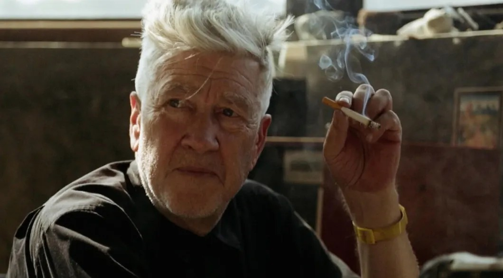

# Тайны Дэвида Линча. В преддверии пришествия нового сезона культового сериала «Твин Пикс» смотрите документальный фильм «Дэвид Линч: Жизнь в искусстве», мировая премьера которого состоялась на Венецианском кинофестивале.

- **URL:** https://novayagazeta.ru/articles/2017/04/12/72126-tayny-devida-lincha
- **Дата:** 2017-04-12
- **Автор:** Лариса Малюкова

## Тайны Дэвида Линча

## В преддверии пришествия нового сезона культового сериала «Твин Пикс» смотрите документальный фильм «Дэвид Линч: Жизнь в искусстве», мировая премьера которого состоялась на Венецианском кинофестивале.

Это не жизнеописание славного пути декаденствующего гения. Фильм группы режиссеров (Джон Нгуйен, Рик Барнс, Оливия Ниргард-Хольм) — лаборатория кино, в которой под лупой камеры рассматривают, как, из чего возникает уникальная кинопоэтика. Самый верный из способов погружения во «внутреннюю империю» автора, проклятого Голливудом.

Вместо эпиграфа — посвящение Лулу-Богине — маленькой дочке седовласого художника. Никаких вам синохронов знаменитостей о «роли Линча в моей жизни». Никаких вопросов интервьюеров. Вопрос один. Из каких молекул произрастает «необъяснимое чудо» — язык кино.

Пролог и эпилог: Линч в профиль в клубах дыма перед профессиональным микрофоном… молчит. Вспоминает. Дальше в кадре он будет создавать странные, сюрные произведения. Которые и стихи (диковинные названия буквами лепятся в кадре: «История всеобщности Ангела», «Человек с мухами», «Три мушкетера-оленя»), и провокативные инсталляции. Алхимик сочиняет их на наших глазах: размазывает пальцами краску на холсте, лепит из различных материалов плоть объемной картины — из размятой горбушки хлеба, пакли и кетчупа, изображающего, разумеется, кровь. Линчевская «фабрика грез» в действии. Картины невольно рифмуешь с фильмами, вспоминаются кадры-образы, преследующие художника. Непомерно длинная рука, тянущаяся за спичками. Черный шлейф изо рта мужчины (червь, покидающий рот Генри в «Голове-ластике» или темная тряпка — во рту колоритного персонажа «Синего бархата», или ухо в траве, через которое сон проникнет в реальность в том же фильме), голова на веревочке, как воздушный шарик, «насекомое в кресле». Когда-то он сам, по его воспоминаниям, был таким насекомым — работал запоем, не вставая месяцами, пригвожденный к искусству.

Он рисует на мольберте. Рядом маленькая Лула, у своего — маленького мольберта. Возможно, его живописные работы и есть самые подробные «жизнеописания».

За кадром продолжается внутренний монолог. Прошлое, как справедливо полагает Линч, не только сопровождает тебя: «Оно будит цели». Родина изысканий Дэвида Линча — его детство.

Вспышки воспоминаний. Как с тремя другими малышами сидят в жаркий день в жидкой грязи в тени деревьев — делают с этой грязью, что хочешь. Как в их тишайшем районе в Айдахо однажды вечером из темноты вышла голая женщина с кровью на губах — как это поразило. Вроде бы жил тогда в узком мире — два квартала до магазина, — но до краев наполненном свободой и тайной.

Айдахо — это солнце, потом Вирджиния — ночь. Ненависть к школе. Встреча с настоящим художником, который не «ходит на работу», а только рисует. Значит, можно? !

Поддержите нашу работу!

1000 500 300 Нажимая кнопку «Стать соучастником», я принимаю условия и подтверждаю свое гражданство РФ

Если у вас есть вопросы, пишите [email protected] или звоните:+7 (929) 612-03-68

Непредсказуемость будничности познана в юности. И в Бостонской «художке», и в Пенсильванской Академии изящных искусств.

Линч перебирает старые фото. Ищет отпечатки своих умонастроений той поры. Первая затяжка марихуаны. Ночи в морге. Первая мастерская. Первый фильм. Три экрана, анимация. Скрупулезная работа… вся пленка в браке.

«Неудачи, — говорит нам Линч, — чрезвычайно полезны». Как та грязь, из которой произрастает его чувство природы. Как гниющие плоды и фрукты, плесень и засохшие насекомые — материал для инсталляций, когда-то шокирующих его отца, всерьез испугавшегося за его разум и умоляющего сына вернуться к «настоящей профессии».

Блуждать в лабиринтах его «авторских мифов» страшно-интересно-загадочно, как во сне, из которого не можешь выбраться, но если повезет — обязательно увидишь свое отражение.

Это кино о том, как одержимость свободой диктует судьбу. Судьба инсталлирует себя в пространстве поиска. Поиск ведет, ломая устои семьи, общепринятого, приличного.

Линч — прежде всего художник, поэтому закономерно начинает с анимации. За пробными «Шестью блюющими мужчинами» — первая короткометражка «Алфавит»: совмещение кино и анимации. Нащупывание пластики, формы: пиксиляция? игровое кино? прописанный сценарий? или ночные кошмары — в качестве сценария, причем кошмары не самого Линча, а племянницы его жены Пэгги. И кто распутает клубок тайны творчества. Случай? Да, один из ключевых способов осуществления талантов. В случае Линча — нежданный грант Американского института кино. Награда за сценарий «Бабушка», в котором люди-грибы растут на грядках. Потом пять лет работы над «Головой-ластиком» — главным фильмом раннего Линча, воссоздание мира-мрака с чудовищным младенцем-уродцем, покрытым гнойниками. С оторванной головой, из которой на карандашной фабрике начинают производить стирательные резинки.

Фильм боялись, его игнорировали, им… восхищались Кубрик и Лукас. Но все эти внешние обстоятельства судьбы прославленного и проклятого поэта — за кадром. На экране только его сосредоточенная работа. Сосредоточенное погружение в давно истлевшее и никуда так и не девшееся прошлое.

Впереди знаменитые фильмы — волшебные страшные сказки, сюрреалистические экзерсисы, прозрачные «простые истории» и легендарный «Твин Пикс». Впереди «Золотая Пальмовая ветвь» и «Венецианский Лев» за вклад в кинематограф. И даже целый год, посвященный Линчу и победительному пришествию в кинематограф «диких сердцем» неоварваров. Но прошлое режиссера не менее знаково и поучительно: с самых первых шагов в кинематографе он оставался верен себе. Намерению «яркое делать ярче, а темное — темнее». Не оглядываясь на авторитеты, менять язык и представления о кино, смешивая на холсте экрана краски разных искусств. «Я всегда оставляю свое окно полуприкрытым, чтобы тайна, мечта, сон не обрывались раньше времени».

Поддержите нашу работу!

1000 500 300 Нажимая кнопку «Стать соучастником», я принимаю условия и подтверждаю свое гражданство РФ

Если у вас есть вопросы, пишите [email protected] или звоните:+7 (929) 612-03-68
