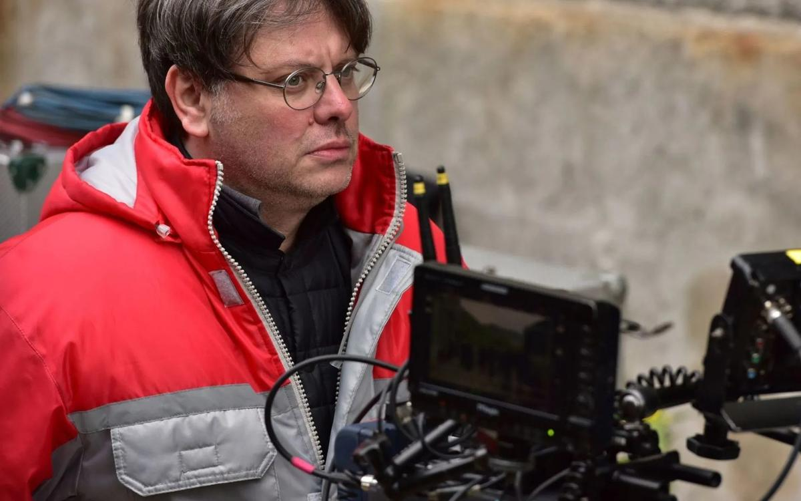

# Валерий Тодоровский: «Что бы я ни сделал — возникает раскол». Режиссер — о своем новом фильме «Большой»

- **URL:** https://novayagazeta.ru/articles/2017/05/10/72400-valeriy-todorovskiy-chto-by-ya-ni-sdelal-voznikaet-raskol
- **Дата:** 2017-05-10
- **Автор:** Лариса Малюкова

## Валерий Тодоровский: «Что бы я ни сделал — возникает раскол»

## Режиссер — о своем новом фильме «Большой»

Фото: Продюсерская компания Валерия ТодоровскогоСпустя девять лет после «Стиляг» Валерий Тодоровский представляет фильм «Большой», приоткрывающий потаенный мир закулисья известного «всей планете» театра. С 11 мая — на широком экране.Экран вновь влюблен в балет. О Нуриеве снимает BBC и Рэйф Файнс, в афише «Танцовщица» о Лои Фуллер и «Полина» Анжелена Прельжокажа, мультфильм «Балерина» и «Dancer» с Сергеем Полуниным.

«Большой» — история провинциалки Юли из городка Шахтинска, получившей один шанс из тысячи — попасть на прославленную сцену. История про цену удачи и про судьбу, истинного режиссера, воле которого подчиняются и примы, и кордебалет. Сразу после символичной премьеры в Большом театре вокруг фильма завязались острые дискуссии. С режиссером Валерием Тодоровским говорим о стереотипах и способах их избежать. О мнении критиков. И прежде всего о балете — многомерном пространстве, поглощающем мечты и мольбы, заветные мысли, боль, редкие прорывы и нередкие личные катастрофы.

— Кажется, больше, чем любая история, вас притягивает создание мира. «Страна глухих», мир «cтиляг», для которых музыка и яркая одежда — акт неповиновения. «Мой сводный брат Франкенштейн» — мир людей, вернувшихся с войны, но не способных от войны излечиться.

— Вы правы, возражу в одном. Во «Франкенштейне» больше интересовала страна обывателей, куда попадает осколок далекого, как им кажется, мира, где идет война. Кино о том, что война на самом деле здесь, просто мы об этом не знаем. Или не хотим знать. Да, меня притягивают новые территории. Нравится их осваивать. Как закрытый для постороннего глаза мир балета.

— Откуда возникло это притяжение? Не в детстве ли, когда вы жили в Одессе неподалеку от прекраснейшего Оперного театра?

— Если честно, не вспомню момента, когда что-то щелкнуло. Шло накопление: время от времени сталкивался с чем-то. Притягивал контраст между этой волшебной красотой с жертвами, на которые готовы многие, чтобы состояться. Потом начал говорить знакомым: «Давайте про балет что-то сделаем». Мысли, как известно, имеют свойство материализоваться.

— Пришли и «сами все предложили»?

— Такое случается редко. Просто однажды решил: «Напишу хотя бы пять страниц». Самый страшный момент. Если написались — и не пять, а двадцать — эти страницы оказываются живучими. Появились люди, убеждавшие «попытаться». Я пошел в театр, директором которого был еще Иксанов. Меня впустили, приняли доброжелательно. Я прошел собственными ногами по сцене, обладающей свойством приковывать.

Посмотрел несколько спектаклей из-за кулис. Увидел фантастическое: за мощной машинерией — огромные человеческие силы, эмоции. Колоссальные ресурсы. Все копится годами, чтобы на три минуты вылететь на эту сцену. Началась работа над сценарием. А с минуты, когда дали деньги и тратишь первый рубль, — обратного пути нет. Уже определен день сдачи готового фильма. Кто-то из больших режиссеров говорил, что иногда снимает кино про себя, иногда — про других. Хотя в глобальном смысле: все кино про себя. Но если буквально, то «Любовь» — про себя. И «Оттепель», и «Стиляги».

— А «Любовник» — про других.

— Согласен. И «Франкенштейн», и «Страна глухих», и «Большой». Это не означает, что меня там нет. Просто хочется понять, какие они. Проникнуть, как вы правильно заметили, в иной мир со своими законами, где никогда не жил. Это не «Оттепель», где каждая сцена — про меня.

— Настолько про вас и про нас, что второй сезон вы уже не стали снимать — реальность заморозила «Оттепель».

— Возможно. А «Большой» — «жизнь других», которые не просто интересны — я должен в них влюбиться. Влюбиться в то, чего не случилось в моей жизни.

— Вы — литературный человек, как формулировали для себя: балет — это столкновение?

— Это адская битва со временем.

— Про это история Белецкой Алисы Фрейндлих, педагога, теряющего память и жизненные силы.

— И еще история стареющего танцовщика французского балета, признающегося: «Каждый день я прыгаю на один миллиметр ниже, чем вчера». Это жестокая битва, когда человек понимает, что в 35 — все заканчивается.

— Отчасти это вообще актерская история. Когда понимаешь: Ромео и Гамлета уже не сыграть. Остался Лир, если повезет.

— Нет. Драматический актер может сыграть лучшую роль и в семьдесят. В балете это невозможно. И когда так сжимается время, все умножается на сто. Страсти, чувство, затраты. В каком-то смысле я про это снимал. Человеку десять лет. Он прикован к станку: днями, месяцами, годами повторяет одни движения. Потом щелк — 25, ты — третий лебедь. Никто. А когда же что-то произойдет? Как успеть? Если не сейчас — то никогда. В этот момент люди ломаются, уходят, разочаровываются, смиряются.

— У вас есть история смирения: танцовщица, принявшая свою нестандартную фигуру, ушедшая в костюмеры. А вот вопрос, вы, наверное, устали от сравнений фильма с «Черным лебедем»?

— Это совершенно разные фильмы. «Черный лебедь» вообще не про балет, про раздвоение личности, балет там лишь площадка.

— Вы сосредоточились не на погружении в роль, ваша история про взаимоотношения с другими людьми, с самим собой.

— Конечно, но не оттого, что я думал про «Черного лебедя». Мне была интересна тема судьбы, в этом сжатом времени играющей порой первую скрипку. Почему Белецкая полюбила эту невоспитанную девочку из Шахтинска? Лучше других танцует? Не факт. Это момент судьбы. Все ужасно несправедливо. Потому что есть любовь и нелюбовь. Вот увидела девочку — буду ей помогать до конца. А девочка неблагодарна, оценит дар судьбы слишком поздно. Это история фатума: тебя вынесет, потом унесет обратно. Как волну, приходящую из моря. В балете ощущение судьбы физически заметно. В Питере я разговаривал с двадцатилетними балеринами. Красивые. Неустроенные. Живут в общаге. На личную жизнь — ни времени, ни сил. Интересуюсь: «Завтра — принц, красавец-миллионер. Носит на руках. Открывает мир. Хочет семь детей». Ни одна не сказала, что готова ради этой сказки отказаться от балета. Будут вкалывать и ждать. И жить с ощущением чего-то значимого в жизни.

Фото: Продюсерская компания Валерия Тодоровского— Вы и с Барышниковым общались?

— Встречались в Нью-Йорке на показе «Стиляг». Познакомились, ему вроде понравился фильм. Была безумная мысль, чтобы он сыграл у нас. Посылал ему сценарий, который он не отверг, но наотрез отказался приезжать в Россию.

— Николя Ле Риш хорош в роли заезжей звезды. Но с Барышниковым в роли сквозила бы судьба самого грандиозного танцовщика. «Большой». «Барышников». «Балет». Три «Б» — манок для проката. Кстати, про «Большой». Наверное, у этого названия — свои преимущества и свои ограничения: про это можно, сюда заходить уже не стоит?

— Не было ни одного человека, включая директора Урина, в роли цензора или даже советчика. Они понимали, что я сниму фильм, какой хочу. Они могли отказать в названии. Условие одно: я показываю фильм — они принимают решение. Понятно, что бренд не может стоять на титрах фильма, который — как могло бы им показаться — порочит или дискредитирует. Были другие ограничения: возможность войти со съемочной группой на сцену. Благодарен, что мне разрешили. Вместо двенадцати дней дали шесть. Снимали напряженно, в спешке, в стрессе.

Поддержите нашу работу!

1000 500 300 Нажимая кнопку «Стать соучастником», я принимаю условия и подтверждаю свое гражданство РФ

Если у вас есть вопросы, пишите [email protected] или звоните:+7 (929) 612-03-68

— В процессе работы над фильмом в Большом происходили громкие скандалы, в том числе и криминальные, была идея дать их отзвук?

— Я пришел в театр вскоре после истории с кислотой, которую плеснули в лицо худруку балетной группы Сергею Филину. Про нее писала и желтая пресса, и зеленая. Но это не входило в нашу концепцию. Про историю с кислотой можно снять отдельный фильм. Как «Большой Вавилон» Франкетти, который показали по HBO. Поразило то, что его пустили с камерой на собрание коллектива. Они достаточно открыты. Но я-то про другое. Про маленьких девочек, которые туда приходят. Конечно, существует сильнейшая конкуренция. Хотя когда я разговаривал с разными людьми, выяснилось: все эти истории со стеклами в пуантах — как правило, мифы.

— После премьеры в Большом поднялась волна споров в прессе, в том числе о стереотипах, «на поводу которых пошел Тодоровский».

— У меня есть тревожное чувство, что журналисты, пишущие о картине, забывают простую вещь. Если ты снимаешь скромный малобюджетный авторский фильм про балет, не претендующий на выход в 1000 залах, можешь показать не только пот, но и как маленькие девочки бритвами режут друг друга. У мейнстрима иные законы. Обращаясь к широкой аудитории, остаешься верным мифам. Главный среди них — о Золушке. В фильме есть архетипические вещи, за которые его и ругают: ну понятно — будет девочка из провинции. Но в Голливуде снимали «золушек» и будут снимать.

— Поэтому у вас звучит Чайковский?

— Мы думали-перебирали: Прокофьев, Стравинский. Но когда широким экраном выходит «Большой» — заметьте, не пятнадцатый по счету фильм о театре… Люди, которые будут снимать про Большой театр дальше, могут экспериментировать. И выбирать малоизвестные произведения. Мейнстрим требует мировых хитов. Есть три балета Чайковского, которые соответствуют трем возрастам героев. «Щелкунчик», «Спящая красавица» и «Лебединое озеро». Экспериментировать здесь невозможно, меня проклянут.

— У вас же две аудитории: публика и балетные.

— И балетный зритель, поверьте, видит все, может распять за неправду. Поэтому на съемках стояли профессионалы, поправляя каждое движение, жест, слово.

— Что вы думаете про балет и время? Не будем брать первые спектакли при Алексее Михайловиче. А вот хотя бы воспетый Пушкиным — и сегодняшний классический балет. Он меняется? Или это закрытый от посторонних глаз хрустальный дворец со своим неизменным ритуалом?

— Если говорить про русский классический балет, то, конечно, это прежде всего сохранение традиций. Это важно: кто-то же должен увидеть в ХХI веке, как это было всегда.

— А девочки туда приходят современные, порой из Шахтинска. Не возникает конфликта?

— Их выстраивают так, что они влюбляются. Хотят быть Одеттой и Одиллией. Про это тоже мы снимали: про традицию и культуру, которые передаются из поколения в поколение, сохраняя то, что заложил Петипа.

— Но есть здесь и история разрушения личности. Фрейндлих играет состарившуюся приму-балерину. Мучительно трудно собрать себя в пору твоего личного землетрясения. Как работалось с Алисой Бруновной?

— Опыт мой говорит: чем больше артист, тем легче с ним работать. Она была полностью погружена в фильм. Ходила в Вагановку к своей подруге, там преподающей: подсматривала «кухню». Дальше мы подробно обсуждали роль в целом, отдельные сцены. Все наши девочки ее боготворили.

— Любопытно развиваются взаимоотношения учителя и ученицы в сериале.

— Я не снимал сериал!

— Об этом уже все написали.

— Ну да, читал: «Тодоровский снимал сериал, из него смонтировал фильм». Чушь. Я снимал фильм. К сожалению, его пришлось сильно сократить. Вот теперь я могу сделать телеверсию. Но я вообще не думал о телевидении.

— Возможно, из-за этих сокращений возникли смысловые потери. Мне, к примеру, показалась слишком пунктирной история взаимоотношений юной героини с ее семьей. Странно, что мама ее не узнает.

— Там огромная история, которую пришлось вырезать. Поэтому и хочу сделать телеверсию. Отчасти это будет другой фильм.

— Вы как-то говорили, что по своему темпераменту относитесь к несчастному типу личностей, не способных абстрагироваться от реальности. Каким образом наше «интересное время» проникает в кино?

— Что касается «Большого», в нем реальность вроде бы отодвинута: балетные всегда жили герметично. У меня в сценарии была сцена: героиня выходила из училища и терялась: все чужое, непонятное. Вылетел эпизод, в котором парень из электрички говорил ей: «Пойдем, покажу тебе город. Ты тут живешь, а Москву не видела!» Но остался момент, когда мама подружки и конкурентки предлагает Юле деньги за роль. Этого сюжетного поворота мне хватает как знака вторжения действительности в воздушный балетный мир.

— Я про другое, про историю с «Матильдой», наезды на «богохульные постановки Богомолова», наставления кинематографистам от Бурляева. Все эти кампании из умозрительных превращаются в конкретные: настигают, программируют сам творческий процесс. Что делать?

— Не изменять себе. В какой-то момент казалось, что история с «Матильдой» — морок, сон. А дальше вопрос: если при всех обвинениях фильма, который никто не видел, он выйдет в кинотеатрах, никто его не запретит, не подожжет кинозалы, как было обещано, — это одна история.

У душевнобольных случаются обострения. Но если это повлияет на судьбу фильма — беда. К примеру, в ситуации с головой свиньи у дверей МХТ мне хотелось спросить: почему люди, это учинившие, так и не были наказаны. Мы же слышим регулярно об оскорблении чувств верующих. А меня оскорбляет эта история. Я знаю, что такое МХТ и Олег Павлович Табаков. Кто эти люди — не знаю. Безнаказанность провоцирует дальнейший беспредел. Если подобные вещи будут иметь поддержку со стороны власти, они отбросят страну на десятилетия назад, в итоге напоремся на взрыв, который больно ударит по всем.

— А нет ли здесь вины кинематографического сообщества, которое страшно разрознено, не может консолидированно противостоять мракобесию, набирающему силу?

— Согласен. Но было же письмо «Киносоюза» по поводу «Матильды». Кстати, я его не подписал — просто мне его не дали. Но вот сейчас говорю вам, что я его подписываю.

— Когда вы читаете критику на фильм, вы что-то принимаете? Дискутируете? Возмущаетесь?

— Я не охотник до чтения критических рецензий — себя берегу. Так сложилось: что бы я ни сделал, возникает раскол — от отвращения до обожания. Знаете, сколько людей ненавидит «Стиляг»? Когда вышла первая серия «Оттепели», открываю фейсбук — и ужас! Словно я расчленил и съел заживо младенца. Мне не хватает профессионального разбора, чаще сталкиваюсь с волюнтаристским мнением, не важно — со знаком плюс или минус. Не понимаю: за что хвалят и за что ругают.

Кроме того, я достаточно трезвый человек: знаю свои слабые и сильные стороны. Проще судить о кино через какое-то время. Отношения с фильмом, как с детьми, в какой-то момент тебя ребенок раздражает, видится неучем, хамом. Потом смотришь — правильный вырос. Еще проходит время — и начинаешь принимать его таким, какой он есть.

Поддержите нашу работу!

1000 500 300 Нажимая кнопку «Стать соучастником», я принимаю условия и подтверждаю свое гражданство РФ

Если у вас есть вопросы, пишите [email protected] или звоните:+7 (929) 612-03-68
