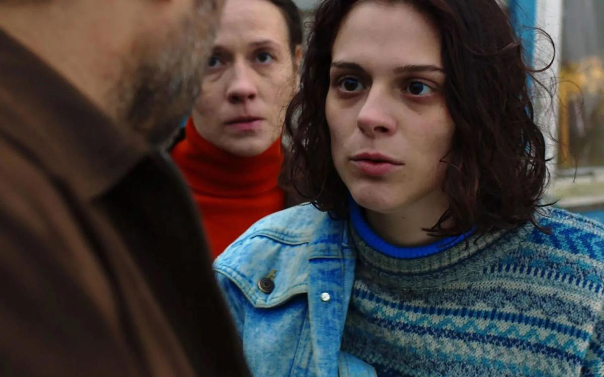

# Катрин! Педро! Николь! Изабель!.. Звезды Каннского фестиваля призывают к состраданию и терпимости

- **URL:** https://novayagazeta.ru/articles/2017/05/25/72565-katrin-pedro-nikol-izabel
- **Дата:** 2017-05-25
- **Автор:** Лариса Малюкова

## Катрин! Педро! Николь! Изабель!..

## Звезды Каннского фестиваля призывают к состраданию и терпимости

Фото: EPA/CANNES FILM FESTIVALВ канун празднования своего юбилея Канны опубликовали коммюнике с поддержкой жителей Манчестера, назвав теракт «нападением на культуру, молодость и радость, на свободу, благородство и терпимость», — все, чем дорожит фестиваль. Самый влиятельный киносмотр пытается не только фиксировать тенденции кинопроцесса, но и предъявлять зрителям картину мира. Во время праздника прояснился выбор главной фестивальной темы: «Семья как средоточие проблем и надежд современного мира». Семидесятилетие Каннского смотра отмечалось как юбилей проверенного годами брачного союза между фестивалем и мировой кинематографией. Не случайно во время праздника цитировали Жана Кокто — президента жюри 1953-го года, назвавшего Канны «романтической встречей душ и сердец». Гламур, большие деньги и индустриальные проблемы поубавили сердечности. Но в этот майский вечер мировое кино, собравшееся на одной лестнице, светилось благостными улыбками. Пожалуй, впервые звезд и знаменитостей, восходивших по красной дорожке в зал Люмьера, было больше, чем фотографов, традиционно одетых в смокинги.

Фотографы не успевали кричать: «Катрин! Педро! Николь! Изабель!.. Посмотри сюда!» Они нон-стоп сверкали вспышками, собирая богатейший урожай снимков. Но даже в такой помпезный, сверкающий бриллиантами вечер со сцены, декорированной золотом и блестками, звучали призывы к терпимости, состраданию к современникам, лишенным прав, говорилось о невозможности деления людей на «мы» и «они».

Российское кино на юбилейном фестивале выглядит достойно. По оценкам фестивальных критиков, у фильма «Нелюбовь» Звягинцева самая высокая позиция (к сожалению, нередко оценки критиков и жюри кардинально не совпадали, стоит хотя бы вспомнить историю с проигнорированным наградами «Догвилле» Ларса фон Триера).

«Теснота» — режиссерский дебют Кантемира Балагова, снятый под художественным руководством Александра Сокурова. Кабардино-Балкарию — новую территорию на карте мирового кино — вслед за Сокуровым открыл и Каннский кинофестиваль (картину приглашали и в другие секции Канн, а также на другие фестивали). Еще один нетривиальный взгляд на драматичную жизнь наших соотечественников, оказавшихся на переправе из одной системы в другую. Точно так же, как Звягинцев, Балагов скрупулезен в обозначении времени. 1998-й. Нальчик. Беда в еврейской семье — пропадают младший сын и его невеста. Сумма выкупа непосильная, семья вынуждена не только продать небольшой бизнес, но и обратиться за помощью к коммуне. Эту историю режиссеру рассказал его отец, который жил в Нальчике и общался с местной еврейской диаспорой. Поэтому фильм отличает субъективный авторский взгляд, подчеркнутый титрами («Меня зовут Кантемир Балагов. Эта история случилась…») и самим изображением. К примеру, в первом кадре камера смотрит из подполья вверх, потом оказывается, что это взгляд не из зиндана, а из автомобильной ямы. Но и дальше ощущение тесного, душного, враждебного мира будет усилено цветом (много красного, много темных кадров), кашированным экраном, «близкой» камерой.

Поддержите нашу работу!

1000 500 300 Нажимая кнопку «Стать соучастником», я принимаю условия и подтверждаю свое гражданство РФ

Если у вас есть вопросы, пишите [email protected] или звоните:+7 (929) 612-03-68

Полеты нелегалов, или Киночудеса в решете реальности

Программа Каннского кинофестиваля: диалоги фильмов и тема волшебства

Действие плетется из разных мотивов. Есть сюжет еврейской Джульетты (Илана днюет и ночует с папой в автомастерской, платьям предпочитает джинсовый комбинезон) и кабардинского Ромео (миролюбивый богатырь Залим — труженик заправки). Есть здесь скрытая неприязнь во взаимоотношениях всех диаспор, пресловутое деление на «они» и «мы», похищение евреев, которых не считают людьми. Есть криминальная линия киднепинга и морального выбора, на который вынуждена идти семья ради сбора средств. Есть конфликт между средневековыми устоями и брызжущей через край дозволенного молодостью, бурлящей гормонами и жаждой жизни: не завтра, сейчас. Метафора узкого, лишенного воздуха мира ощущается в пространстве едва ли не каждого эпизода. Люди живут в малогабаритках буквально на головах друг у друга, они носят просторную с широкими плечами одежду (по моде 90-х), но слишком тесные внутрисемейные, внутриобщинные отношения подавляют индивидуальность, вынуждают быть как все. Родители говорят детям: «Вы выросли из нас», словно ребенок перерос прошлогоднее платье. И уезжать не хочется. И дома жить тоскливо и тревожно.

Важна тема жертвы. Невыносимые видеокадры убийства российских солдат во время чеченской войны (им режут горло, как скоту) с интересом смотрят друзья Залима, споря об оправданности жестокости по отношению «к захватчикам». По сюжету на добровольную жертву ради брата должна пойти старшая сестра Илана. Она центр повествования, а актриса Дарья Жовнер с ее витальностью, кипящим темпераментом, удивительным лицом, парадоксальными реакциями — настоящее открытие.

В «Тесноте», не лишенной шероховатостей, — ток высокого напряжения, непредсказуемость жизни. Это настоящее путешествие в 90-е, путанные, опасные, драйвовые. Нас сопровождает музыка: дискотечный «Вирус», плачущая Буланова. Взгляд автора не благостен, он чуток к людям, пытающимся сохранить человеческие качества в унизительной, жутковатой ситуации. Семья здесь предстает настоящей горячей точкой, в которой самые близкие мучительно продираются друг к другу. Но с другой стороны, в «Тесноте» именно семья оказывается пусть и неустойчивым, пропускающим воду, но последним плотом во всемирном потопе враждебности.

Канны 2017: из ниоткуда с нелюбовью

Директор фестиваля Тьерри Фремо призывает обратить внимание на кинематограф современной России

Ближе к финалу форума в Российском павильоне прошла презентация книги «Каннские хроники», собранная из дискуссий и текстов киноведов Даниила Дондурея, Андрея Плахова и Льва Карахана. Уникальная подборка выстраивается в двойной портрет Каннского фестиваля, который портретирует действительность. Как меняется форум, как запечатлевает мировую повестку, определяет новый тип художественного мышления. Прекрасные и ужасные фильмы нуждаются в креативной личности, способной не только считывать смыслы, но понимать контекст, скрытый потенциал. Без талантливого взгляда картины тускнеют, остаются недосмотренными, недопонятыми. Увы, презентация книги прошла без одного из ее авторов — Даниила Дондурея, в полной мере обладавшего таким взглядом.

Поддержите нашу работу!

1000 500 300 Нажимая кнопку «Стать соучастником», я принимаю условия и подтверждаю свое гражданство РФ

Если у вас есть вопросы, пишите [email protected] или звоните:+7 (929) 612-03-68
