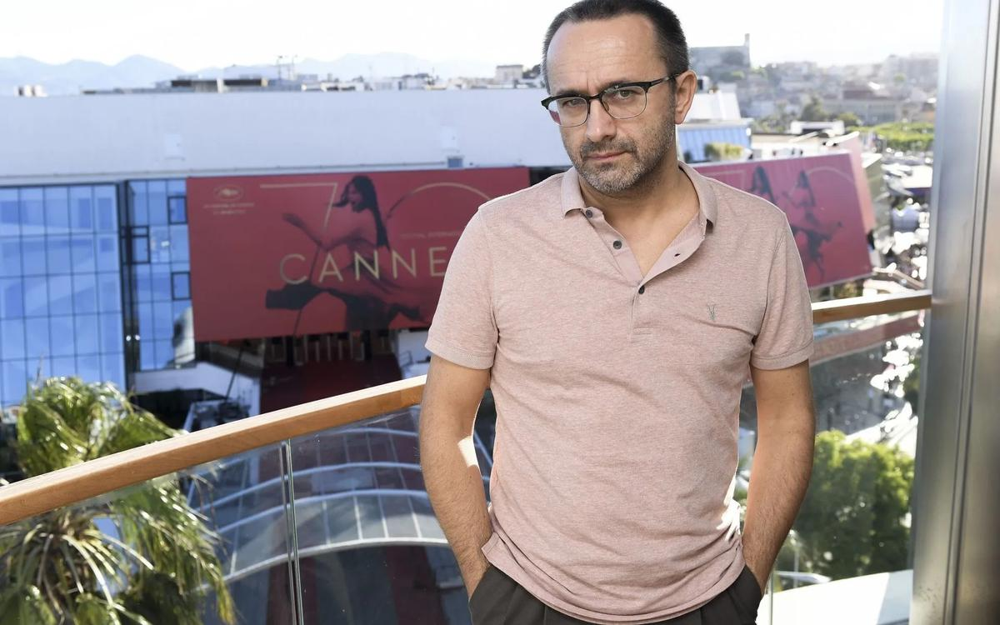

# Андрей Звягинцев: «Агрессия и неприятие сожрут нас с потрохами». Каннский лауреат — о «Нелюбви», Серебренникове, инакомыслии

- **URL:** https://novayagazeta.ru/articles/2017/05/26/72588-andrey-zvyagintsev-film-snyat-dlya-togo-chtoby-vy-prishli-domoy-i-krepko-obnyali-svoih-detey
- **Дата:** 2017-05-26
- **Автор:** Лариса Малюкова

## Андрей Звягинцев: «Агрессия и неприятие сожрут нас с потрохами»

## Каннский лауреат — о «Нелюбви», Серебренникове, инакомыслии

Фото: РИА НовостиВне зависимости от того, поддержит или нет жюри Альмодовара картину «Нелюбовь» Андрея Звягинцева, она очевидно ярко и мощно прозвучала на Каннском фестивале. Ей аплодировали после официального показа. Ведущие СМИ отозвались одобрительными рецензиями. Фильм покупают десятки стран. Жаль, государство не приняло участие в судьбе действительно общественно значимой картины. О фильме и его судьбе говорим с режиссером.— «Елену», «Левиафан» и «Нелюбовь» уже поименовали трилогией. Хотя Звягинцев скорее из разряда режиссеров, снимающих одно кино с разными главами.

— Это суждение со стороны. У меня не было идеи создавать трилогию или еще, чего доброго, тетралогию, приуготовляя аудиторию к следующему своему шагу. Ну да, есть в этих фильмах свои внутренние связи. Но едва ли их достаточно, чтобы рассуждать о таких вот творческих стратегиях.

— Кстати о связях: почему в центре каждой вашей картины — семья, причем семья, изживающая травму? Словно не можете от этой темы избавиться.

— Признаюсь, нет у меня ответа. Мог бы, конечно, отделаться от вопроса, сказав, что семья — это поле битвы. И это действительно уникальная площадка для наблюдения за человеком, за тем, что с ним происходит на самом деле. Дома он обнажается, выходит из укрытия его существо. Тут он снимает маски, являя себя в полном великолепии: в гармоничных или уродливых отношениях с любимыми (или нелюбимыми), с детьми, с родителями, близкими. Сам удивляюсь: что ни фильм, то непременно семейная драма. Одно могу сказать, тут нет никакого рационального ответа. Думаю, может, действительно взяться за какую-то «постороннюю» тему, никак не связанную с семьей. Но поверьте, никакого селекционного, умозрительного подхода тут нет. Эта тема сама являет собой мощный магнит.

— Может, в этом что-то автобиографическое?

— Не думаю. Да, отец ушел, когда мне было пять лет, но особых драматических воспоминаний на этот счет у меня нет. Может, и хорошо, что его не было рядом. Возможно, мне пришлось бы бороться за свое будущее. После двенадцати лет отсутствия отец заглянул как-то домой «навести порядок». Мне уже исполнилось восемнадцать. Узнав, что я поступил в театральное училище, он хлопнул по столу кулаком, заявив маме: «Что за херня? Какое театральное?» К счастью, я сам не видел эту сцену. И с чего бы я этому чужому дяде объяснял, чем хочу заниматься. Нет, мне кажется, что фрейдистской травмы здесь нет. Скорее — опыт личного наблюдения за самим собой, за окружающими меня, за друзьями или приятелями, за самой жизнью. Но вообще сложно разделить субъективные переживания.

— Экран в каком-то смысле — автопортрет режиссера.

— И зрячее око. Но только в каком-то смысле автопортрет. В каком-то, но значительном. Видишь друзей, знакомых и незнакомых людей. Они же не могут надеть маску настолько плотно, чтобы не было зазора. Какой бы прочной, убедительной эта социальная «аватарка» ни была, ты видишь по каким-то незначительным приметам тень самой сути и, сличая ее со своей, видишь полную картину. Ну или, по крайней мере, предполагаешь, что видишь достаточно верный портрет.

— В «Нелюбви» важен внутренний сюжет утраты человечности. Это касается и героев, их семей, и общества в целом. Недоверие, подозрительность, разрывы некогда прочных связей. Это тоже можно назвать «разводом» с неприятными последствиями. Почему было так важно точно обозначить время событий в фильме: с 2012-го по 2015-й?

— Как мне кажется, это тот самый период, когда мы полностью утратили надежду на обновление, изменение среды обитания, достойной человеческой жизни и даже самоуважение. Период, когда один за другим гасли маяки этой надежды. Действие фильма начинается в октябре 2012-го. «Закон подлецов» имени Димы Яковлева — это уже декабрь 2012-го. Но ясно, что закручивать гайки начали сразу после Болотной. День за днем, помаленечку. Со всеми этими депутатскими законотворческими инициативами, одна абсурднее другой… Пока не пришли мы к 2015-му — боям под Дебальцево. И дальше — со всеми «остановками». Так что, контекст, да, очень важен для нас. В такой духовной среде тяжело, если вообще возможно, чувствовать перспективу; глазу человеческому нужен горизонт, иначе, в этой тесноте и духоте человеку трудно проявлять свои лучшие качества. Впрочем, одно от другого в прямой зависимости: нельзя всю ответственность свалить на политический климат. Наше поведение и образ жизни в какой-то степени реакция на действительность, да, но и действительность ткётся из наших с вами реакций, действий, интенций. Не уверен, что каждый зритель увидит динамическую связь героев с этим замерзающим временем, но, мне кажется, это сработает и на бессознательном уровне.

— Зарубежной аудитории это вряд ли понятно.

— А вот наша аудитория, надеюсь, почувствует. Во всяком случае, размышляющий, переживающий за свою страну зритель это почувствует. Рискну произнести непопулярное ныне словосочетание «интеллектуальная элита». Хотя, к сожалению, эти сигналы морального SOS воспринимаются в основном ею. И это как публиковать важные, касающиеся всех размышления в «Новой газете» или на «Дожде». То есть, по сути, будто бы разговаривать с самим собой, с такими же, как ты. Однако разговаривать нужно, потому что, к сожалению, люди, избегающие задавать неудобные вопросы самим себе, снова будут возмущены: «Где вы таких людей видели? Что ж вы так ненавидите нашу страну?! Зачем вы человека таким монстром рисуете?» Они, еще не видавши фильм, выкрикивают свой «репертуар».

Фото: РИА Новости— Кстати, вспоминаю выступление на пресс-конференции украинского журналиста, заявившего: «Раз вы показываете в вашем кино, как работает российская пропаганда (провокации против Немцова, война на востоке Украины, Киселев), значит, участвуете в ней». Это вопрос и к аудитории: какими глазами мы смотрим кино. Признайтесь, кого хотели «опорочить своей чернухой»? Многие обижаются уже до просмотра.

Поддержите нашу работу!

1000 500 300 Нажимая кнопку «Стать соучастником», я принимаю условия и подтверждаю свое гражданство РФ

Если у вас есть вопросы, пишите [email protected] или звоните:+7 (929) 612-03-68

— Есть точная мысль: «Об уважении не просят, его заслуживают». Заслуживают, как говорил Лермонтов, люди, которые «независимо от ситуации, времени и места остаются такими же, какие они есть на самом деле». Сегодня множится число оскорбленных, уязвленных, возмущенных. Чем? Не уровнем жизни, духовной нищетой, а выставкой, фильмом, спектаклем, в которых говорят о несправедливости игнорирования человека.

Конечно, никакой цели кого-то задеть, обидеть не было. Тем более делить людей на украинцев или русских. Вообще говоря, я не занимаюсь политическим кино. Ведь речь в фильме совсем о другом. Одна актриса пробовалась на главную роль мамы пропавшего ребенка. Она рассказывает: «Вчера в два часа ночи закончила читать сценарий… пошла в детскую… в слезах обняла дочь крепко-крепко… и просила прощения». Я изумился: «Сколько вашей дочери?» — «Два с половиной года». — «Ну не может же человек, — говорю ей, — накопить такую большую вину перед малышкой. Вся ваша любовь в нее вложена. Просто вы уже заранее предчувствуете будущие ошибки, обиды, недопонимание, недолюбовь». Вот что хочу сказать тем «чудакам», которые заранее уверены в том, что я снимаю чернуху, порочащую людей. Сказать им лично следующее: «Фильм снят только для того, чтобы вы пришли домой и крепко обняли своих детей». Все. Точка.

— Снова в твоем фильме противопоставление автоматизма госмашины человеку, в этом, кстати, признается честный милиционер. «Не теряйте, говорит, времени — сразу идите к волонтерам».

— Он действительно хороший человек, к тому же отлично знает, какие механизмы у нас реально работают. Он действительно хочет помочь.

— Волонтеры — самое светлое пятно в этой истории.

— В определенном смысле, конечно, существует это противопоставление. И если говорить о перспективах, речь может идти только о самоорганизации. Если государство не работает. Если человек в нем не предусмотрен. Государству нынешнего образца человек просто не нужен. Поэтому, как растут сквозь асфальт цветы, так и человек выбирается из-под колес Молоха. Прорастает человеческое в нас самих, в лучших из нас. В частности, в настоящих «героях нашего времени» — волонтерах. Иначе их не назовешь. Встреча с этим явлением в нашей жизни — событие в моей.

Нелюбовь — бумеранг, возвращается ненавистью

Репортаж Ларисы Малюковой с Каннского фестиваля, где с новый фильм Звягинцева приняли с большим одобрением

— В этом смысле «Нелюбовь» оптимистичней «Левиафана», в котором тоже была внутренняя тема оппозиции человека и госмашины. Ощущение, что все друг другу чужие. С темой волонтерства, приходит не только надежда, но и энергия солидарности.

— Я рад, что счастливым образом случилась наша встреча с людьми из добровольного поискового отряда «Лиза Алерт». Их работа бескорыстна. Незаменима. И необходима. Работа доброй воли. Без подобных людей действительно мрак был бы беспросветный.

— Ваши фильмы не радуют киночиновников. И когда министр настаивал на введении вето при распределении финансирования кино, в качестве аргумента приводил «Левиафана», порочащего страну. Кажется, ровно на следующий день «Нелюбовь» получила приглашение в каннский конкурс.

— У меня нет телевизора, и все эти дурные заявления, слава богу, пролетают мимо. Хотя все это страшно огорчает. Я узнал об этом уже здесь от ваших коллег.

— Фильм снят с продюсером Александром Роднянским без государственного участия. Но как планируете дальше работать? Как-то не верится, что Звягинцев «одумается» и будет сочинять лояльное, милое душе чиновника кино.

— Честно скажу, не знаю. Чиновники приходят и уходят. Я же хочу не просто рассказывать какие-то занимательные истории. Хочется говорить о том, что по-настоящему волнует. О том, что я наблюдаю вокруг себя. И потом, послушайте, я снимаю не для министерств и ведомств, не для престижа страны и даже не для фестивалей. Для людей, которые и являются страной. Для отдельного человека, который не так прост, не так доверчив, как кажется людям, у которых простые решения в головах: запретить, например, показывать фильмы с распитием спиртных напитков. Тоже, кстати, инициатива — обхохочешься. Так вот, этот отдельный человек заслуживает, чтобы с ним говорили о его жизни на языке правды. Чтобы фильм являлся откликом на его жизнь, его беды, его надежды, его вопросы к жизнеустройству; чтобы фильм говорил с ним о его настоящем и будущем.

— Но государству как раз не нравится, когда искусство говорит с человеком откровенно, задавая самые сложные вопросы. Государству нужен простой, то есть упрощенный человек. И мне кажется, претензии к Гоголь-центру копились давно и вовсе не по «экономическим вопросам».

— Конечно. Все их претензии — к вопросам инакомыслия. А вот что мы можем на эти вопросы ответить, что мы должны в связи с этим делать, как наладить диалог, вот это совершенно неясно. Потому что без диалога невозможно никакое движение. Ни вперед, ни назад. Ни прогрессивная мысль, ни традиционалистская позиция не могут найти в нашем обществе равновесия. Это непросто сделать. Но кто-то же должен заниматься вопросами примирения сторон, иначе агрессия и неприятие сожрут нас с потрохами. Мне кажется, единственным разумным решением со стороны власти было бы искать возможность примирения сторон, разъяснения позиций одних и других, а не возгонка ненависти и вражды.

— Название твоего фильма звучит как диагноз. Так что же случилось: любовь умерла? Или ее не было? Скорбное бесчувствие?

— А это самый неразрешимый вопрос. Наша героиня заявляет, что у нее и не было к мужу никакого чувства: забеременела, так и покатилось. Но можно ли верить словам женщины? Тем более в состоянии нервного срыва. При всем очевидном эгоизме вижу в ней усилие быть человеком. Что же касается нашей истории в целом — не думаю, что любви не было. Она была. Она будет. Потому что мы не черно-белые, и наши чувства — такие головокружительные качели. Порой сами не знаем, на какую высоту способны взлететь. И что как не любовь живет в сердцах этих людей из «Лизы Алерт»? Прийти с работы, встать с дивана — вечером, ночью, ранним утром — в любую погоду и идти прочесывать лес, подъезды, больницы, заброшки. Искать чужого ребенка. Старика. Разве это не любовь?

Поддержите нашу работу!

1000 500 300 Нажимая кнопку «Стать соучастником», я принимаю условия и подтверждаю свое гражданство РФ

Если у вас есть вопросы, пишите [email protected] или звоните:+7 (929) 612-03-68
