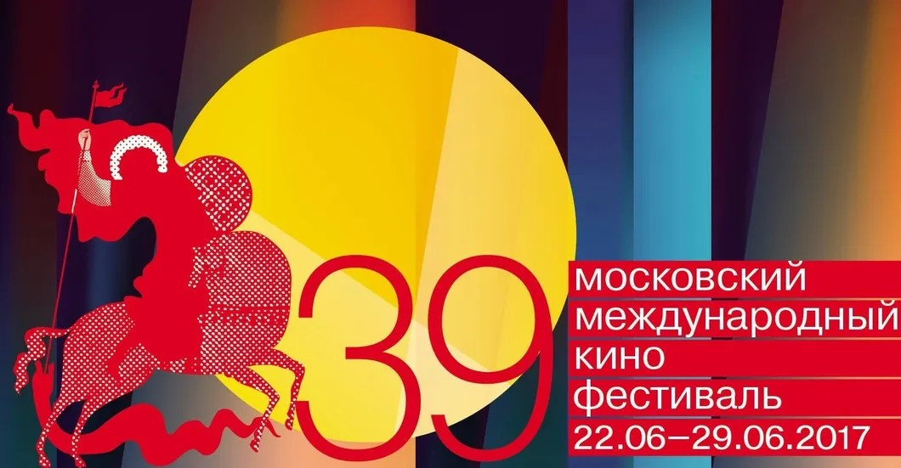

# Эйфория без дна. Гид «Новой газеты» по 39-му ММКФ

- **URL:** https://novayagazeta.ru/articles/2017/06/20/72854-eyforiya-bez-dna
- **Дата:** 2017-06-20
- **Автор:** Лариса Малюкова

## Эйфория без дна

## Гид «Новой газеты» по 39-му ММКФ

КонкурсЖанровый диапазон на все вкусы — от социального памфлета до комедии и мелодрамы. Из 13 фильмов Россия представлена тремя работами.

«Мешок без дна»Среди них отметим в первую очередь «Мешок без дна»Рустама Хамдамова. Кинофантазия утонченного, изысканного художника по мотивам новеллы Рюноскэ Акутагавы «В чаще». История происходит во время правления русского Императора Александра II. Волшебство, мистика, полярные взгляды на происходящее составляют мозаику фильма.

Владимир Котт представляет провинциальную трагикомедию«Карп замороженный»с Мариной Нееловой и Алисой Фрейндлих. Про то, как известие о смерти может стать источником энергии жизни.

«Хохлатый ибис» Ляо Цяо — раритетный образец китайского кино, способного из узкой оптики (изучении птицы, ставшей национальным символом Китая) выйти на самые широкие просторы актуальных обобщений.

Датская «Преисподняя» — универсальная работа талантливого режиссера Фенара Ахмада. Криминальная история становится ключом к драме морального беспокойства с ее вечными вопросами о смысле жизни, о цене мести, о путях самосохранения.

Скромная финская картина «Звездачи»Койсо-Канттила переносит нас в полузабытые 70-е прошлого века. В провинциальный городок, до которого докатилось эхо сексуальной революции.

## Программа Андрея Плахова «Эйфория окраины»

По словам куратора, в секции в основном фильмы из бывших соцстран. В слове «окраина» Плахов не видит негативного оттенка. Он напоминает, что и фильм одного из ведущих режиссеров Аки Каурисмяки назывался «Огни городской окраины». Окраиной сегодня может стать и деревня, и город, и страна. К тому же вспомним две легендарные российские «Окраины», ставшие вехами в истории нашего кино: Барнета и Луцика с Саморядовым.

«По ту сторону надежды»В фильме Аки Каурисмяки «По ту сторону надежды» (Серебряный Медведь «Берлинале» за режиссуру) неожиданно соединяется актуальное кино про бесправных эмигрантов с античной мифологией. А современным Одиссеем оказывается сирийский беженец.

Здесь же одна из самых неожиданных работ «Берлинале» — венгерская «О теле и душе»Ильдико Эньеди, в которой реальность и сны перемигиваются и удивляют друг друга. А кровавая бойня оказывается местом действия для романтической любовной истории.

Центром же очередной «эйфории» стало прогрессивное румынское кино. Андрей Плахов показывает нам фильмы не самых именитых лидеров новой румынской волны, вроде Пуйю или Мунджиу, а режиссеров менее известных, демонстрируя, что в румынском кино нет первых и вторых. Есть мощное поколение современных художников, способных отрефлексировать последствия коммунистической эпохи, проблемы страны на острие социальных катаклизмов. В программе картины Адриана Ситару «Незаконные» и «Посредник».

А пока мировое киносообщество щедро одаривает наградами представителей румынской волны, болгарский кинематограф набирает силу. Среди заметных работ последнего времени — «Слава»Кристины Грозевой и Петра Вылчанова — гротеск, переходящий в трагифарс, в котором личное и общественное неразрывны, настоящее несет в себе больной ген прошлого, а часы «Слава» еще обладают непреходящей ценностью.

Поддержите нашу работу!

1000 500 300 Нажимая кнопку «Стать соучастником», я принимаю условия и подтверждаю свое гражданство РФ

Если у вас есть вопросы, пишите [email protected] или звоните:+7 (929) 612-03-68

«Реквием по госпоже Ю» сербского режиссера Бояна Бояна Вулетича — актуальное кино из берлинской программы: о безжалостности времени, разрушенных иллюзиях и о надежде, прорастающей сквозь асфальт абсурда жизни в посткоммунистической Европе. Среди продюсеров современной трагикомедии Александр Роднянский.

«След зверя» ветерана Агнешки Холланд был удостоен приза «инновации» имени основателя «Берлинале» Альфреда Бауэра. Черная криминальная комедия с элементами фарса (ни грамма старческого менторства) демонстрирует самые радикальные средства борьбы с мировым злом, агрессией и истреблением животных. Никаким общественным договорам не легитимизировать убийство. Один из самых обсуждаемых фильмов Берлинского кинофестиваля снят по мотивам романа Ольги Токарчук «Веди свой плуг по костям мертвецов».

## Программа «8 ½ фильмов» Петра Шепотинника

Здесь в основном собраны фильмы, отмеченные наградами Каннского и Венецианского кинофестивалей.

«Смерть Людовика ХIV»«Смерть Людовика ХIV» Альберта Серра. Неподражаемый Жан-Пьер Лео в роли умирающего короля-Солнце. Физиология при чудодейственном участии киногения превращается в мифологию. Хроника необъявленной смерти одного персонажа и целой эпохи. Режиссера притягивает парадокс: бесконечность власти и конечность человека. «В следующий раз получится лучше», — саркастически говорят в финале. Фильм представит режиссер Альберт Серра — член жюри фестиваля.

«Женщина, которая ушла» Лава Диаса — победитель Венецианского кинофестиваля. Героиня фильма, школьная учительница, выходит из исправительной колонии после тридцати лет заключения по приговору за убийство, которого не совершала. Испытание для синефилов. Авангардист Диас — среди чемпионов хронометража (его «Колыбельная скорбной тайне», посвященная Филиппинской революции конца XIX века, длится восемь часов). Многочасовые фрески Диаса — протест против требований и рамок, установленных кинотеатрами и прокатчиками. В основе новой четырехчасовой картины — короткий рассказ Толстого, любимого писателя филиппинского режиссера, названного в честь Берии Лаврентием.

Из Венецианского фестиваля и «Сеть» Ким Ки Дука — лауреата всевозможных кинофорумов. Драма о скромном рыбаке, живущем в Северной Корее, который из-за неисправности лодки попадает на «вражескую» южнокорейскую территорию. Схваченный пограничной полицией, герой подвергается жестоким допросам и знакомится с темной стороной процветающей страны-соседа.

«Дом» Фина Троха — лучшего режиссера программы «Горизонты» Венецианского кинофестиваля. О том, как отчуждение незаметно перерастает в насилие. Фильм сделан в жесткой и скромной дарденовской стилистике.

«Молодой Годар» Мишеля Хазанавичуса — один из самых скандальных и спорных фильмов Каннского кинофестиваля. Романтический и иронический байопик об иконе новой французской волны. Сам Годар историю своей любви и своего бунта смотреть отказался. Но стоит ли обижаться на автора, посягнувшего портретировать икону — судить поклонникам «Китаянки», «Презрения» и «Безумного Пьеро».

## Одна из самых неожиданных секций — «Фильмы, которых здесь не было» Стаса Тыркина

При создании она и предназначалась для исключительных киноработ, по разным причинам пропущенных нашими фестивалями или кинопрокатом.

«Бабочки»Среди них «неформатное» докьюментари молодого талантливого режиссера Дмитрия Кубасова (он принимал участие в документальном фильме «Зима, уходи!») «Бабочки».

Для Стаса Тыркина понятия «здесь» и «сейчас» практически тождественны: «В программе представлено кино нового поколения, физически невозможное в ХХ веке. Например, картина «Последний из нас» Алаэддина Слима, справедливо удостоенная в Венеции призом «Лев будущего». Удивительное иммерсивное путешествие в «сердце тьмы», самое лучшее и радикальное из того, что было сделано на актуальную тему «миграции» и «мигрантов». Актуальность эта, конечно, не равна интернет-публицистике, это актуальность подлинного современного искусства. Но и новейшего кино, ибо музейной замкнутости в нем нет. Обидно пропустить «Фантастическую женщину» Себастьяна Лелио, со всей общечеловеческой обстоятельностью разбирающуюся в психологии трансгендера, впервые в кино сыгранного представителем «третьего пола». Это тоже новая реальность — нравится это кому-то или не нравится.

Последние изгои ХХ века, в борьбе преодолевающие свои страхи, — в центре картины «120 ударов в минуту», получившей в Каннах Гран-при жюри. О больных СПИДом молодых французах, благодаря усилиям которых смертельная болезнь стала сейчас «просто» хронической.

В мире изменившихся сексуальных практик живут и герои фильма Клэр Дени «Впусти солнце» — еще пару десятилетий назад в их возрасте было принято поливать цветочки и поглаживать внуков, героиня же Жюльетт Бинош находится в самом угаре своей сексуальности, меняя партнеров с увлеченностью молодой нимфоманки. Исландский «Сердечный камень»предъявляет частную жизнь с размахом эпоса, утверждая ее как единственную ценность. А «Мистер Вселенная»с помощью реальных участников рассказывает чистую историю любви — такие всегда будут актуальны, несмотря на изменившиеся времена и нравы».

И традиционно призываю обратить внимание на картиныКонкурса документального кино и «Свободной мысли», на мой взгляд, одной из самых интересных секций. Здесь встреча с необыкновенным буддийским монахом, одержимыми, призраками из израильского центра заключенных, роженицами и «Партией простого человека».

Поддержите нашу работу!

1000 500 300 Нажимая кнопку «Стать соучастником», я принимаю условия и подтверждаю свое гражданство РФ

Если у вас есть вопросы, пишите [email protected] или звоните:+7 (929) 612-03-68
