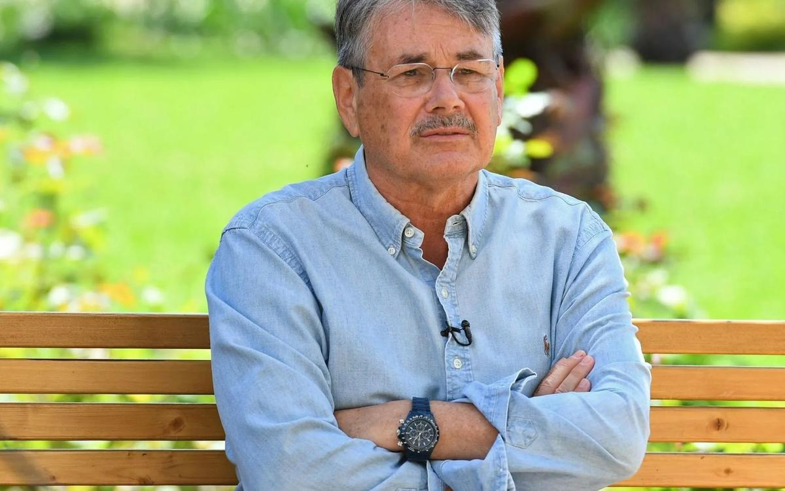

# Павел Чухрай: «Дремучей гопоты вокруг становится все больше». 22 июня на экраны выходит фильм «Холодное танго» — о любви в реалиях агрессивного жестокого мира

- **URL:** https://novayagazeta.ru/articles/2017/06/22/72880-pavel-chuhray-dremuchey-gopoty-vokrug-stanovitsya-vse-bolshe
- **Дата:** 2017-06-22
- **Автор:** Лариса Малюкова

## Павел Чухрай: «Дремучей гопоты вокруг становится все больше»

## 22 июня на экраны выходит фильм «Холодное танго» — о любви в реалиях агрессивного жестокого мира

Фото: РИА Новости— Кажется мне, что в основе вашей картины не только роман Эфраима Севелы, прочитанный несколько лет назад. Видимо, годами накапливались вопросы…

— Я прочел его несколько лет назад. Для кино он мне показался слишком многослойным. Но запомнилась история двух героев, история их любви — сложная, драматичная, вплетенная в трагические события середины ХХ века. Они жили и любили друг друга в реалиях агрессивного, жестокого мира, где убивают друг друга, разделены идеологией, национальной ненавистью, неприятием чужой культуры. Время действия – Вторая мировая и десятилетие после, тоже не слишком радужное. Эта пронзительная история любви, погруженная в те обстоятельства, показалась нужной сегодня, когда мир буквально зашкаливает от агрессии, когда он переполнен религиозной и национальной ненавистью, культурными предрассудками и, когда все это выливается в жесточайший международный террор.

И еще тема, волнующая меня всегда: человек и тоталитарное государство, человек, не защищенный перед этой жестокой машиной. Я вырос в постсталинское время, самое страшное знал только по рассказам близких и по литературе. Но рос, можно сказать, в мрачной тени недавнего прошлого, и хорошо представляю себе все «прелести» жестокой машины, бездушного асфальтового катка государства. В нем люди в любую минуту — и жертвы, и виновники, и даже палачи. Так устроена была эта машина. Чтобы остаться человеком, нужно было приложить колоссальные усилия. Остаться человеком внутри такой «машины» — почти подвиг.

Я воспитывался в семье, где эти вопросы всегда ставились остро. У отца были замечательные друзья, переживавшие за происходящее в стране: Коржавин, Ромм, Карл Кантор, Булат Окуджава, сценаристы Фрид и Дунский, польский режиссер Анжей Вайда. С детства слушал их споры, разговоры о свободе и совести. Эти люди меня формировали. Фильмы Вайды меня в юности буквально ошеломили. Помогли лучше понимать мир, в котором мы живем.

— «Пепел и алмаз» на ту же тему — столкновение людей с системой, хрупкость человеческой жизни и мечты о будущем.

— Конечно. А потом просто была наша жизнь, когда приходилось недоговаривать, отказываться от заветных замыслов в творчестве. Искать что-то, чтобы идиотическая вездесущая цензура не доставала. Никаким я революционером, конечно, не был, и картины мои на полки не клали. Поправки, правда, требовали. По «Клетке для канареек» — 21 поправка от Госкино плюс приказ переснять финал. Я тогда устоял, но было непросто.

— В каких-то сценах картины я узнавала темы, пришедшие из ваших предыдущих работ. Например, из вашего документального проекта со Спилбергом «Дети из бездны». Там женщина, уцелевшая в аду Холокоста, рассказывала, как они глохли от страшного крика, когда их загоняли в грузовики. Этот эпизод с истошным криком женщин и детей есть в фильме.

— Мне много дала та моя работа, опыт столкновения с человеческой болью, с добротой, с жестокостью. После «Детей из бездны» считал, что тему эту для себя закрыл. Очень тяжелым эмоционально был материал. Но вот случилось так, что я снова ее коснулся. Правда, под несколько другим углом и, как мне кажется, шире по мысли. Не о трагедии одного народа мы говорим в фильме. Мы все связаны одной цепью — и русские, и татары, и прибалты, и молдаване, украинцы… да нет, пожалуй, еще шире… Поэтому «не спрашивай, по ком звонит колокол, он звонит по тебе».

— То есть в каждой вашей картине вы задаете вопросы о нашем прошлом и настоящем себе самому?

— Знаете, на протяжении нескольких лет во время интервью меня ставят в тупик вопросом: «Почему вы все время снимаете ретро-картины?» Ну, во-первых, это не так. Я снимал несколько фильмов на современном материале. Но никогда не приходило в голову, что, обращаясь к недавнему прошлому, я занимаюсь какой-то экзотикой, вызывающей недоумение и вопрос «зачем». Вроде такой вот чудак, вроде как спичечные коробки собираю или сушеных бабочек… или — снимаю «ретро»…

Неловко напоминать таким журналистам, что величайшие произведения в живописи, в литературе, в драматургии по такой классификации были «ретрухой». «Гамлет», «Ромео и Джульетта», «Война и мир», «Тихий дон», «Тарас Бульба» и т. д. Все это вроде писалось о прошлом. Но этот аргумент был бы для такого журналиста не убедителен, он явно всего этого не читал. Это для нас с вами герои Толстого и его мысли о жизни, о человеке, о войне полны актуальности, а вопросы Гамлета злободневны (к счастью, не только для нас), хотя вокруг дремучей гопоты становится все больше и больше.

Ненависть, пророщенная любовью

Фильм Павла Чухрая «Холодное танго» открыл «Кинотавр-28»

Почему я так подробно об этом говорю? Потому что в корне лежит очень серьезная проблема. Современный россиянин чудовищно образован. Культурное, смысловое пространство, в котором он живет, сужено до пятачка сегодняшнего дня. «Вот я купил колбасы, поехал на метро, с женой поругался, обманул начальника, вернулся, включил телевизор под пиво, посмотрел футбол или «пятиминутку ненависти» про Украину и про дураков-иностранцев. Пошел культурно проветриться — посмотрел в кинотеатре киномифы, вроде «Пиратов Карибского моря», могу и родное посмотреть. Оказывается, князь Владимир только с виду был викинг, на самом-то деле — наш, родной, российский начальник. И как советский начальник, осознав ошибки коммунистического многобожия, стал наконец православным! Дальше — Иван Грозный, Сталин, Берия — эффективные менеджеры. Оказывается, все они в душе были добрыми патриотами, просто прикидывались палачами, как Штирлиц прикидывался эсэсовцем. А еще посмотрел сериал про охранника-вертухая Власика — нормально развлекся «под патриотическую старину». Зачем мне еще ваше «ретро»?

Очень жаль, если зритель станет рассуждать таким образом. Поэтому когда меня спрашивают, для какого зрителя вы делаете фильмы, я отвечаю: «Для любого, кто готов услышать, почувствовать, кто готов думать».

«Холодное танго»— В финале фильма появляется титр с важными цифрами, сколько было уничтожено евреев в Литве во время немецкой оккупации, сколько литовцев переселено в Сибирь в советское время, сколько погибло солдат Советской армии при освобождении Прибалтики от фашистов. Нет ли в этом некоторого уравнивания жертв? Хотя вряд ли что-то может сравниться с кошмаром Холокоста.

— Мы вставили этот титр по двум причинам. Первая — да, не все народы, участвовавшие в трагедии Второй мировой войны, одинаково виновны в тех событиях, но ужас в том, что была уже злоба, сдерживаемая до времени агрессия, недоверие, ложь. А расплачиваться за все это своими жизнями пришлось огромному количеству невинных людей самых разных национальностей. И пока мы не научимся понимать других, я уж не говорю, пока мы не научимся прощать, нас ждут подобные катастрофы. И это тот месседж, который несет наш фильм. Кроме того, титр был нужен, чтобы те, кто не знает, узнали.

— Действительно пояснения требуются — зритель недостаточно исторически образован.

— Действие нашего фильма проходит в послевоенной советской Литве. Там живут два моих героя, там любят, ссорятся, идут на компромиссы, мучаются совестью, изо всех сил стараются остаться людьми. И конечно, не все в России знают, что происходило в Литве перед войной и после нее, какую роль в судьбе этой небольшой страны сыграл Советский Союз.

— Есть важная мысль в фильме, что и во времена пропагандируемого советского интернационализма сегодняшние проблемы существовали. В этой киноистории целый клубок противоречий: между русскими и литовцами, литовцами и евреями, немцами и литовцами. Это неизбывная история?

— Понимаете, на протяжении многовековой истории среди народов, живущих бок о бок, возникает множество конфликтов, так устроена жизнь. Страшное начинается тогда, когда государство, используя внутренне накопившиеся претензии, обиды, начинает манипулировать людьми. Чем «тоталитарней» система, тем сильнее механизмы политических манипуляций. Вы говорите «интернационализм». Ну какой, к черту, у нас был интернационализм? Никогда его не было. При Сталине целые народы ссылались — чеченцы, литовцы, крымские татары, эстонцы, еврейское «дело врачей-вредителей»…

— Конечно. А лозунги-знамена-призывы были совсем другие.

— Лозунг у нас был всегда противоположен реальности. Вроде бы была демократия, а при этом авторитарный строй. Мы говорили, что империалистами были американцы, теперь говорим «мы были империалисты», и очень этим гордимся. Социализмом назывался практически феодальный строй. Я жил в украинском селе, я видел, что такое крепостные колхозники, крестьяне. Когда им в 1956-м дали паспорта и разрешили свободно переселяться, руководство страны буквально распирало от гордости, мы трубили об этом на весь мир. А мир от такой информации был в шоке. Венгерские кинематографисты говорили нам: «Ребята, вы бы молчали. Никому в голову не приходило, что у вас бесправные крестьяне, попросту крепостные, без паспортов живут и не могут никуда переехать. Зачем же вы к этому внимание привлекаете?»

Поддержите нашу работу!

1000 500 300 Нажимая кнопку «Стать соучастником», я принимаю условия и подтверждаю свое гражданство РФ

Если у вас есть вопросы, пишите [email protected] или звоните:+7 (929) 612-03-68

«Холодное танго»— Если бы я, например, изучала генеалогию вашего кино, я бы сравнила «Холодное танго» даже не с «Сорок первым» (любовь врагов) и не с «Чистым небом» (свой-чужой), я бы вспомнила «Трясину», снятую Григорием Чухраем в разгар застоя. Сложные герои, к которым у автора неоднозначное отношение. Сложная ситуация. И зрителю не дают никаких подсказок — решай сам.

— Есть мнение, что современный зритель этого не любит. Мне продюсеры не раз говорили: «Зритель хочет, чтобы ему ясно сказали — «хороший» это человек или «плохой». У тебя же все перемешано — зрителю трудно»… Конечно, трудно тому зрителю, который не в курсе, что последние минимум триста лет искусство, наука о психологии только и делают, что пытаются разобраться в человеке, в его желаниях и поступках, пытаются нам с вами сказать, что человек — сложный, противоречивый мир, в котором намешано и плохое, и хорошее, и эгоизм, и альтруизм, и зависть, и благородство…

— И в истории кино самые запоминающиеся герои — неоднозначные, непредсказуемые…

— Потому что зритель, даже не отдавая себе отчет, подсознательно чувствует, что они похожи на живых людей.

— На «Кинотавре» вам вручили приз «За честь, достоинство и преданность кинематографу». Вспоминается знаменитая история на ММКФ, когда ваш отец буквально вырвал приз для Феллини, несмотря на все противодействие системы. В общем, гены вам достались прекрасные.

— Во всяком случае, когда воспитываешься в определенной среде, точно видишь планку, ниже которой опускаться не хочется.

— Но нынешнее время от всех нас требует новых и новых компромиссов. Где-то промолчать, не подписать коллективного позора. Я про черту между приличием, стыдом, изменой себе.

— Вопрос сложный. Но, по-моему, людям мозги и сердце даны для того, чтобы практически каждый день они выбирали, решали, в том числе и вопросы совести, компромисса. «Компромисс» — понятие широкое. В бытовой сфере это вещь необходимая. Сдержавшись и не нагрубив незнакомому человеку, найдя выход в бизнес-споре, мы идем на компромиссы. Целые страны, дабы избежать столкновения, идут на компромиссы. В общем человеческом доме без этого нельзя. Дальше начинается зыбкая зона — где-то человек промолчит, где-то подпишет письмо против правды, где-то наврет в своем фильме или проголосует за подлый закон…

— Почему вы снимаете так редко?

— Не умею искать деньги на фильм. А организациям, которые в нашей стране дают деньги на кино, большинство моих проектов, видимо, не интересны. Вот и скапливаются у меня написанные мною сценарии, нереализованные проекты. Собралось уже больше десятка. Два несостоявшихся проекта. «Голова на плахе» по нашему с Миндадзе сценарию про князя Меньшикова сорвалась перед выбором натуры — уже были собраны актеры, пошиты костюмы. Я пришел к замминистра культуры Ивану Демидову, рассказал о проекте, оставил сценарий. Он, глядя мне в глаза, как доктор на больного, почти с нежностью сказал: «Павел Григорьевич, да у нас этих сценариев исторических… Мы даже про Суворова и Кутузова не запускаем, а вы хотите, чтобы про какого-то Меньшикова? Ну куда вы с этим пришли?»

Потом мы с Игорем Толстуновым затеяли проект «Москва-400». Юношеская история о парнишке, ассистенте оператора со студии «Военфильм», который попадает на испытание водородной бомбы в Семипалатинск. И влюбляется там в казахскую девочку. Драма в том, что люди эти туда ехали и не знали, что их ждет, их ни о чем не предупредили. И после облучения им тоже ничего не объяснили. Такой был сценарий. Но когда выяснилось, что нет возможности снять так, как я себе представляю этот «водородный апокалипсис»… и денег на широкомасштабное решение не хватает, продюсер сказал: «Перепиши и сократи сценарий». Я сидел, бился — а треть фильма уже снята… Сократил. Говорят: «Мало». Сократил еще. Потом сказал Игорю Толстунову: «Больше не могу выстругивать из полена спичку. Это уже другая история. Другой, наверное, это снимет по-своему». Я ушел. Взяли другого режиссера, он сделал камерную картину за минимальные деньги. Замечательную, но не мою.

Еще был написан сценарий «Месть» по замечательному рассказу Анатолия Кима. Про судьбу корейца, попавшего после войны на Сахалин. Мы нашли половину бюджета с южнокорейской стороны. Выбрали натуру в Корее и на Сахалине, провели в Корее кастинг, но требовалась российская часть бюджета. Ни фонд кино, ни Минкульт денег на это не дали. Еще был сценарий мой «Сыновья», и Минкульт снова нам отказал в денежной помощи. Потом сценарий «Воробьинное поле», с ним я даже не совался в Минкульт, ясно было, что откажут. Сценарий был напечатан в «Искусстве кино». История молодых влюбленных, которые в конце 40-х годов попадают на работу в секретную лабораторию, где волей случая над ними начинают ставить опыты. В лаборатории испытывают яды, создают препараты, действующие на психику человека или другие — уничтожающие память. История на основе деятельности одной закрытой гэбэшной лаборатории. И вот нашим влюбленным «отшибают память», и «подопытные» влюбленные забывают друг друга. Их выпускают во внешнюю жизнь, а они снова знакомятся и влюбляются друг в друга. Им снова электрошоком отшибают память. А они снова встречаются и влюбляются друг в друга… Короче, и это лежит не сделанное, не снятое… Написал сериал для телевидения «Враг СССР» об убийстве Троцкого. Возможно, он дойдет до производства…

«Холодное танго»— Вы могли бы уже книгу издать «Неснятое кино».

— Ну, когда пойму, что снимать не могу, может, так и сделаю. Десяток сценариев есть. Сейчас надо на что-то жить, я сочинил восьмисерийный сериал «Нефть». Но тоже попадаем в сложности — сейчас меняется все так быстро. Надеюсь, его все же запустят. В общем, не сижу сложа руки. Если не снимаю — пишу. Сейчас сочиняю очередной сценарий. Современный материал. Буду искать деньги на стороне. Может, и Минкульт что-то подкинет. На «Холодное танго» все же нашли деньги, и плюс — государство немного добавило. Так что надежды остаются…

— Вы один из немногих режиссеров, продолжающих традицию советского кино большого стиля. С каким кино вы бы сами себя ассоциировали?

— Не мое это дело. Это дело критиков и зрителей, если им это интересно.

— Как вы относитесь к сегодняшнему российскому кино?

— Интересней всего мне наше «молодое кино». Термин применяю условно. Отнесем к молодым режиссерам авторов, скажем, до сорока лет. Наиболее интересными мне почему-то кажутся фильмы, сделанные на скромном бюджете, в минимальной степени использовавшие государственные гранты. Я для себя пока не определил, случайность это или есть этому объяснение.

— Кого бы из этих условно молодых авторов вы бы могли назвать?

— Перечислять коллег даже с похвалой — дело неблагодарное, можно легко забыть не одного и не двух… Ну вот Хлебников, получивший главный приз на «Кинотавре», Бакур Бакурадзе, которому я лично вручал приз на одном из «Кинотавров» будучи председателем жюри. Мне нравится то, что делает Василий Сигарев, Звягинцев, безусловно… Павел Бардин. Талантливый дебют Кантемира Балагова «Теснота», «Заложники» Резо Гигиенишвили — об угоне самолета грузинской молодежью. Мне нравится, как сделан этот фильм, работа режиссера, актерские работы. Люблю такое кино. Хотя как зрителю мне интересны самые разные по жанру фильмы. Сейчас заканчиваю сценарий современной психологической драмы. Думаю, фильм будет совсем другой по киноязыку, чем то, что я снимал последнее время.

— Хотите уйти от прежней стилистики?

— Хочу развиваться, не стоять на месте. Мне кажется, эта история потребует другой формы, языка. Конечно, новая форма не самоцель. Порой смотрю фильмы своих в прошлом очень талантливых сверстников, старающихся быть «современными», говорить на языке молодежи, и вижу искусственность, натужность. Как-то это совсем беззащитно, даже жалобно иногда получается. Но что других судить… Нужно на себя посмотреть со стороны, это полезней, конструктивней. А дальше — написать сценарий, стоящий, интересный… и хорошо бы найти возможность его снять.

Поддержите нашу работу!

1000 500 300 Нажимая кнопку «Стать соучастником», я принимаю условия и подтверждаю свое гражданство РФ

Если у вас есть вопросы, пишите [email protected] или звоните:+7 (929) 612-03-68
