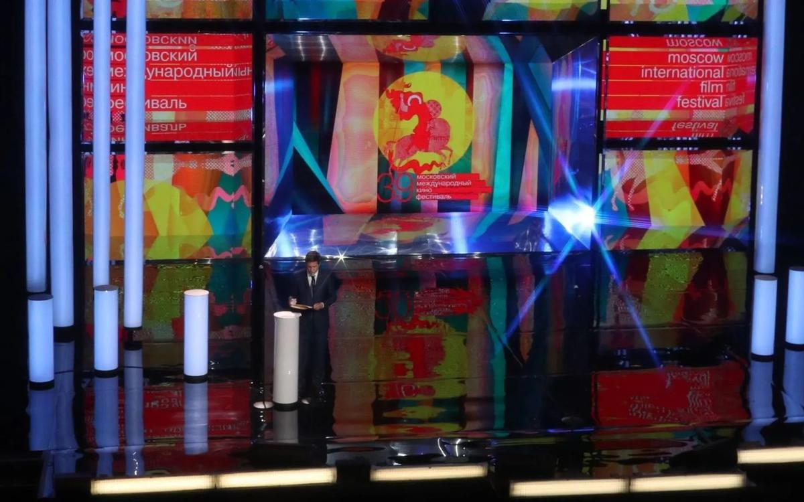

# Карпы и слоны, проповеди и проститутки. Московский кинофестиваль притягивает противоположности

- **URL:** https://novayagazeta.ru/articles/2017/06/26/72921-karpy-i-slony-propovedi-i-prostitutki
- **Дата:** 2017-06-26
- **Автор:** Лариса Малюкова

## Карпы и слоны, проповеди и проститутки

## Московский кинофестиваль притягивает противоположности

Фото: Вячеслав Прокофьев/ТАССПо словам программного директора ММКФ Кирилла Разлогова, если и можно охарактеризовать смотр одним словом, то им станет слово «контрасты». Спорят, контрастируют друг с другом не только отдельные фильмы (что в порядке вещей для любого фестиваля), но программы и даже страны.

К примеру, среди разнообразных секций программа «Сегодня о Корее». В северокорейских картинах «Люди и карпы», «Аттестат зрелости», «Город Кэсон, где были в поисках женьшеня» и «История нашего дома» во всей красе предстают легенды из жизни героического народа, ведомого в светлое будущее Великим Вождем и Учителем. Из главных идей Чучхэ — вырастить чудодейственный женьшень. Можно было бы умилиться тому, что догма, идейный каркас способны на экране обрести неожиданное эстетическое качество… кабы не недавняя история с американским студентом, превращенным этой самой догмой в овощ.

Несколько лет назад на ММКФ из лучших побуждений попытались показать параллельно две корейские программы: южную и северную. Разгорелся международный скандал.

Нынешний ММКФ предложил показ и некоторых южнокорейских картин. Среди них ретроспектива Юна Джегюна, лауреата множества премий. Есть и совершенно радикальный южнокорейский опус «Нагорная проповедь»,снятый буддийской монахиней Лю Юнуи. Восемь студентов семинарии получают задание разобраться в идеях учения Христа. Буквально следуя платоновской аллегории о познании, забираются в пещеру и в свете живого огня пытаются найти ответы на сокровенные вопросы бытия в пределах и за пределами христианской концепции. Им важно отыскать в Вечной книге смыслы, которые стали бы отправными точками на их сегодняшнем пути. Ключевой фразой спора становится заповедь «Блаженны нищие духом, ибо их есть Царство Небесное». Вопрос «может ли человек познать тайну отношений с Богом» и после этого нескончаемого диспута остается открытым. Точно так же и маршрут каждого к вере, по-прежнему определяющийся ежедневным выбором и личной ответственностью.

Среди новых или хорошо забытых старых кино-территорий — фильмы из секции «Открытие: кино регионов Индии». Да и сам фестиваль открылся индийским блокбастером «Бахубали. Завершение». Титаническая дилогия актера, режиссера и сценариста С.С. Раджамули — ядреная смесь мифологии и комикса, в центре которой мощнорукий батыр Шивуду и его избранница — танцующая воительница королева Девасена. Эпическое фэнтези со слонами стоимостью в два миллиарда индийских рупий уже побило рекорд в Индии и сейчас на колесницах, сверкая мечами, несется на российского зрителя. Быки с горящими рогами, битвы, переходящие в массовые пляски. Акробатика, умноженная компьютером и архаичная знойная мелодрама. Любовь — предательство, кровь — золото… Еще немного, и воинственная сказка превратилась бы в самобытную пародию на болливудский китч. Но иронии автора на это не хватило. А всерьез смотреть это пестрое поющее кино утомительно. Странный выбор для Открытия ММКФ.

Конкурс удивил числом российских картин. Из тринадцати претендентов на приз — три наши. Самая, мягко говоря, спорная, «Купи меня». Ее снял Вадим Перельман, режиссер фильмов «Дом из песка и тумана» (три номинации на «Оскар») и неплохого сериала «Измены» с Еленой Лядовой. В основе сюжета незамысловатая сериальная схема — три подруги в поисках счастья и денег. Но только чтоб деньги и счастье — сейчас и здесь. Понятно, что «сейчас и здесь» — это панель. И, следовательно, вип-клиенты, изредка — шейхи, к которым валютные проститутки летают в Эмираты под видом моделей. Про двух девушек все более-менее понятно: Галя и Лиза — из провинции, пробивают путь к немедленному счастью собственным телом. С Катей, выпускницей филфака, сложнее. Полученный грант на изучение парижских архивов она легко меняет на бизнес-трип к шейхам (естественно, шейхам Катя «даст прикурить»). Но Катя не цинична, это ее протест против предсказуемости судьбы отличницы и обеспеченной мамы, доставшей приговором: «Ты можешь лучше». Катя — профессиональный ник «Ходасевич» — действительно «может». Она не просто обаятельна и умна, но умеет превращать образование в средство добычи из желаемого — действительного. Подобно «Амели» или «Русалке» интердевочка нового поколения совершает чудеса ради своих подруг. Впрочем, бойся своих желаний. Мечты осуществляются самым трагическим образом. А может, Катя слишком буквально поняла урок неистового Белинского: «Внутри что-то ревет зверем — и хочет оргий… самых буйных, самых бесчинных и гнусных».

Поддержите нашу работу!

1000 500 300 Нажимая кнопку «Стать соучастником», я принимаю условия и подтверждаю свое гражданство РФ

Если у вас есть вопросы, пишите [email protected] или звоните:+7 (929) 612-03-68

У фильма наверняка найдутся ценители, высмотревшие в работе Перельмана «новую откровенность». На мой взгляд, дело даже не в банальной истории, но в отсутствии киногении (которой Перельман, судя по другим работам, обладает), в примитивном видении человеческой природы. Но прежде всего в отсутствии меры и вкуса. Как в сценах изнасилования, озвученных «Ходасевичем», так и рифмах между убитой грешницей и распятым Христом.

Трагикомедия «Карп отмороженный» Владимира Котта снята по повести Андрея Таратухина. Тема в тренде мирового кино — про третий возраст. Елена Михайловна (Марина Неелова) — учительница на пенсии — приговорена учтивым кардиологом к скорой внезапной смерти: у нее желудочки сердца трепещут вразнобой. Вот Елена Михайловна и надумывает приготовиться как следует, чтобы сына не беспокоить. Сын — профессиональный коуч (Евгений Миронов), учит других быть успешными и счастливыми. Страшно занят. К маме заезжает раз в пять лет. Так что рассчитывать приходится на себя, соседку — женщину необразованную, но сердечную (Алиса Фрейндлих) и экс-учеников. Вроде понимающего патологоанатома (Сергей Пускепалис), выдающего вполне живой учительнице справку о смерти. Дальше всего ничего: гроб приобрести и упаковать (вам «Президент» или «Луч»? — интересуется гробовой коммерсант (Баширов), в сельпо «Пять углов» закупить провизию для поминок… Чтобы как у людей. И сыну — не хлопотно. Если б не карп, внезапно оживший после заморозки… не видать благополучному коучу своей трепетной мамы. Автор повести — актер, что немаловажно, и написана она как бенефис для больших актрис. Марина Неелова и Алиса Фрейндлих играют взахлеб, временами очень хорошо, временами с перехлестом (что отношу на счет режиссуры). Но, возможно, Владимир Котт и хотел сохранить некоторую театральность стилистики. Елена Михайловна Нееловой сразу напомнит об учительнице Елене Сергеевне в драме Эльдара Рязанова, сыгранной актрисой много лет назад. Своей наивностью, мягким очарованием, неприспособленностью к реальности. Сама же картина неожиданно срифмуется с сербским фильмом «Реквием по госпоже Ю» из программы «Эйфория окраины», в которой немолодая героиня, впавшая в депрессию после смерти мужа, тоже решает обстоятельно и продуманно свести счеты с жизнью. Да жизнь со всем ее абсурдом оказывается магнитом посильнее смерти.

Владимиру Котту удалось собрать невиданный актерский состав. Даже эпизоды играют блестящие актеры (вроде Натальи Сурковой в роли пожирательницы конфет и по совместительству директора ЗАГСа). А может, это заслуга не режиссера, а юного питерского продюсера Никиты Владимирова, внука Алисы Фрейндлих и Игоря Владимирова. Правда, он рассказывает, что свою бабушку в роли деревенской хабалки снимать не планировал. Но она прочитала сценарий и сразу приметила эту роль. Снимали кино долго и трудно: и Фонд Кино, и Минкульт отказали в поддержке.

Финал выбрасывает нас из этой странной, но все равно патриархальной истории в непостижимое сверкающее прошлое. В лучах кинопроектора оживает время, «где мама молодая и отец живой». Герой Миронова всматривается в юную, совершенно незнакомую маму — излучающую счастье Марину Неелову из «Монолога» Ильи Авербаха. Видимо, этот воздушный и многозначный эпизод — подарок от сопродюсера фильма Марии Авербах, дочери рано ушедшего режиссера. Такая вот сплошная семейственность, союз наследников по прямой.

Среди незабываемых встреч на ММКФ — фильм с гением и провидцем Олегом Каравайчуком. Юлия Бобкова сняла фильм «Последний вальс» как прощание с композитором-новатором. Это вовсе не биография. Фильм строится живо, неловко и неудобно, как сам Каравайчук. Вечный вундеркинд с ломким детским голосом в нелепом берете и парике бредет по улицам дачного поселка, раздраженно отвечает интервьюеру, капризничает, дотрагивается пальцами до инструмента — нежно и стучит по клавиатуре, выбивая кулаками нервную дробь. Можно сказать, что сам композитор выстраивает фильм о себе. Ведет режиссера по родному Комарово, где со сталинских времен селилась творческая интеллигенция от Ахматовой и Шостаковича до Улановой, на даче которой Каравайчук пару раз бывал. Он говорит с нами о смерти. Своей, которая вот-вот наступит. О гибели старого любимого дерева, которое спилили нувориши, так и не заселившиеся в свой новый особняк. О смерти старого Комарово, по улочкам которого меж штакетников гуляла поэзия и «такое поветрие музыки», как у оркестра Мравинского. Теперь одинаковые дома за высокими заборами: «Комфорт галактики сменил практический комфорт». Как быть спокойным, если человечество маразматирует в отказе от культуры? Как быть нормальным? Делать вид, что ничего не происходит. Каравайчук не умеет «делать вид». Он сам — поветрие музыки.

Для этого фильма он сыграл свой последний вальс. Для своего фильма, в котором стал соавтором режиссера. Дерево, Комарово, человечество, комфорт галактики, музыка Вагнера и его собственные синкопы и секунды в муратовских «Коротких встречах» или всхлипы в «Монологе» — все вместе это его прощальный вальс. «Знаете, как я играю сейчас? Это как предсмертная икота, вот и получается «Вальс Комарово».

Поддержите нашу работу!

1000 500 300 Нажимая кнопку «Стать соучастником», я принимаю условия и подтверждаю свое гражданство РФ

Если у вас есть вопросы, пишите [email protected] или звоните:+7 (929) 612-03-68
