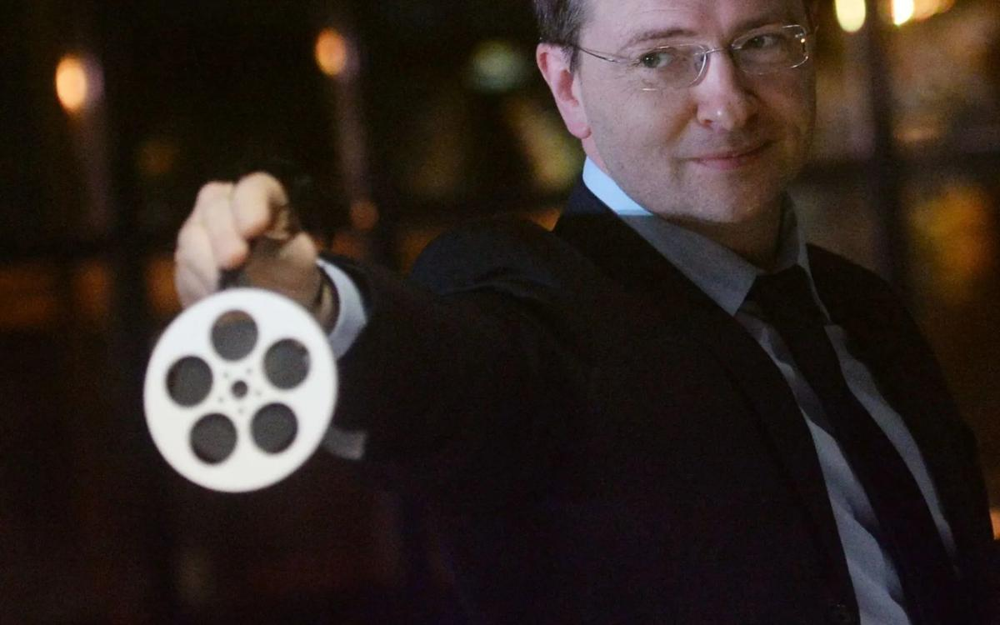

# Крым, футбол и танец с саблями. Какое кино будет профинансировано государством и почему: обзор Ларисы Малюковой

- **URL:** https://novayagazeta.ru/articles/2017/07/22/73204-krym-futbol-i-tanets-s-sablyami
- **Дата:** 2017-07-22
- **Автор:** Лариса Малюкова

## Крым, футбол и танец с саблями

## Какое кино будет профинансировано государством и почему: обзор Ларисы Малюковой

Фото: РИА НовостиВ июле Минкульт опубликовал список проектов авторских, экспериментальных, дебютных и детских фильмов, которые будут поддержаны в этом году. Создателей 74-х игровых авторских фильмов допустили к открытой защите. Подано 111 заявок, субсидию от Минкультуры получат 39. 17 проектов остались в черте «резерв», и их судьба, мягко говоря, туманна. 17 проектов не поддержали.За...Среди ожидаемых и, безусловно, одобренных — «Грех» Андрея Кончаловского. Картина, посвященная Микеланджело, задумана как видение скульптора, создающего усыпальницу Папы Римского Юлия II и фасад церкви Медичи Сан Лоренцо, — «зеркало всей Италии». С российской стороны в совместном с Италией производстве примет участие не только Минкульт, но и Фонд Алишера Усманова (бюджет — 780 млн руб).

Анна Меликян начинает работу над «Феей»— последней частью волшебной трилогии («Русалка», «Звезда») по собственному сценарию. Константин Хабенский сыграет создателя виртуальной реальности, владельца империи по производству компьютерных игр, ощутившего духовную связь с Андреем Рублевым. Создание вселенной компьютерной игры «Коловрат», а также средневековых декораций и костюмов требуют немалых затрат. Бюджет фильма 124 млн рублей.

Иван И. Твердовский — автор фестивальных хитов «Класс коррекции» и «Зоология» — продюсером Натальей Мокрицкой приступили к работе над фантастической социальной драмой «Подбросы». Твердовский продолжает исследовать взаимоотношения общества и особенных людей. В «Классе коррекции» героями были инвалиды, в «Зоологии» — женщина с хвостом. Редкое заболевание и у Дениса, поэтому он не восприимчив к боли. Чем и пытаются воспользоваться мошенники, уговорившие его изображать жертву ДТП. В создании фильма примут участие Европейский фонд поддержки совместного кинопроизводства, зарубежные партнеры из Литвы, Ирландии и Франции. В «Подбросах» развита и сквозная тема фильмов Твердовского — проблема взаимоотношений отцов и детей.

Способы уменьшить «дистанцию огромного размера» между дочкой и ее мамой ищет и Валерия Гай Германика в «околоправославном, по ее определению, кино по сценарию Юрия Арабова. В притче «Мысленный волк» мать сыграет Ксения Раппопорт, дочь — Агния Кузнецова.

Убедительный сценарий «Клятвы», которую поставит Владимир Котт. Это реальная история главного врача психиатрической больницы Симферополя Наума Балабана, который во время войны спас более 200 человек. Друг Балана немецкий ученый Густав оказался одним из разработчиков закона о стерилизации душевнобольных. В картине об испытании на человечность снимаются Сергей Маковецкий и Рэйф Файнс.

Режиссер сурового плакатного стиля Юрий Быков («Дурак», «Майор») работает над триллером «Сторож», который пробивал несколько лет. Бизнесмен вынужден скрываться вместе с женой в захолустном санатории. Замкнутый затворник, сторож гостиницы неожиданно станет частью их жизни.

Светлана Проскурина определяет свою будущую картину «Воскресенье» как социальную драму, хотя, скорее всего, фильм с талантливым артистом Алексеем Вертковым («Перемирие», «Палата № 6», «Раскол») превратится в трагикомедию. Это третья совместная работа режиссера и продюсера Сабины Еремеевой (их «Перемирие завоевало главный приз «Кинотавра»). Среди получивших поддержку — «Танец с саблями» Юсупа Разыкова. Режиссера увлекла история создания хачатуряновского шедевра, написанного за восемь часов в эвакуации в Перми. Бюджет скромной копродукции России и Армении — 68 млн рублей. Среди ожидаемых работ — «Ревность» талантливого молодого режиссера Нигины Сайфуллаевой (ее дебют «Как меня зовут» был отмечен «Кинотавром» «за легкое дыхание и художественную целостность»). Психологическая драма по сценарию Любови Мульменко — про непроговоренные деструктивные чувства. Автор так и не вышедшего на экраны «Комбината «Надежды» Наталья Мещанинова (это по ее сценарию Борис Хлебников снял «Аритмию») расскажет на экране «чувственную историю»«Сердце мира»про ветеринара, выросшего в детдоме, который ищет семью и дом.

Не могли не поддержать эксперты и чиновники вездесущего телеведущего, по совместительству режиссера и актера Александра Гордона. Героя фильма «Дядя Саша»— режиссера Авербуха сыграет сам Гордон. Вообще, кастинг комедии о том, как духовные скрепы направляют рефлексирующего интеллигента на верный путь, впечатляет: Никита Ефремов, Ольга Яковлева, Анна Слю, Сергей Пускепалис, а также вице-спикер Госдумы Петр Толстой в роли себя. Хитроумный Гордон презентацию проекта превратил в шоу: пока рассказывал о герое, отвергающем опыт предыдущих поколений, вокруг него бродила операторская группа с включенной камерой. В финале он поздравил присутствующих с тем, что только что была снята одна из сцен будущего фильма. Шоумен предупредил, что снимет не фестивальное кино, а рассчитанное на «широкого и глубокого зрителя». Любопытно, отчего же со своим народным фильмом он не пошел в Фонд кино, которому вменена в обязанность помогать производству картин жанровых, обращенных к широкой зрительской аудитории?

## Смеяться, право…

Минкульт же — как было объявлено многажды — поддерживает кинематограф как искусство. Собственно, и питчинг, на котором защищались проекты назывался «заседание Экспертного совета по игровому авторскому и экспериментальному кино». Экспериментального кино практически замечено не было. Что же касается авторства — тут полная неразбериха. К примеру, почему-то не Фонд кино, а именно Минкульт поддержал лирическую семейную комедию «Элефант» Алексея Красовского, видимо, сочтя ее сугубо авторской. Герой фильма — детский писатель Шубин, прославившийся рассказами про слона Мишку. Богатый человек Тимур обещает помочь писателю с больным сердцем, если тот напишет еще одну историю про слона. Продюсером и исполнителем главной роли станет Алексей Гуськов, в фильме сыграют Михаил Ефремов и Ирина Старшенбаум. Еще одна зрительская комедия«Выше неба»от крепкого профи Оксаны Карас, автора «Хорошего мальчика». Смех безобидный, несаркастический, смех как доходный товар обещают нам «Три в одном» (о жизни после измены), «Папы» (о разобщенной семье).

Или вот «Неадекватные люди-2», сиквел отличной комедии 2010-го, не только принесшей известность и Гран-при фестиваля «Окно в Европу» режиссеру Роману Каримову, но и ставшей одной из самых окупаемых российских работ (фильм за 100 тысяч рублей собрал в шесть раз больше). Но объясните мне, при чем тут Минкульт? Можно, конечно, сказать, что это «авторская комедия», а какая, простите, хорошая комедия — не авторская? Если только несмешные фарсы и слезовыжималки от Сарика Андреасяна («Тот еще Карлосон!», «Мужчина с гарантией», «Беременный»). Кстати, Андреасян пробился и к государственной мошне. В категории «детское кино» поддержали его «Робо». Про списанного из МЧС робота-спасателя, который подружился с одним мальчиком. Спилберг со своим «Инопланетянином» умрут от зависти. Потому что у Андреасяна обещают сняться Нагиев и Безруков.

Можно было бы изумиться, зачем Минкульту поддерживать невнятный курортный телемувик Леонида Марголина, снявшего с Андреасяном пустоголовую комедию «Все о мужчинах». Но название фильма многое объясняет. «Крымские каникулы»расскажут «о Крыме не только как о здравнице, но и месте, где можно поправить душевные качества, духовные и любовные отношения». Так «место действие» превращается в «дело государственного значения».

Поддержали новую работу сериального режиссера Антона Сиверса, снявшего патриотический фальшак «Василиса». Он расскажет историю Джамалуддина, сына имама Дагестана и Чечни Шамиля. У этого сюжета характерный политический акцент, во многом определивший судьбу проекта. Мальчиком Джамалуддин был выдан своим отцом в качестве заложника (аманата) русскому правительству как знак преданности России, и опекунство над ним принял лично Николай I. В фильме «Аманат» обещают показать Кавказскую войну и любовные отношения Джамалуддина с Елизаветой Олениной, ради которой он решил принять христианство. Бюджет немалый — 320 млн рублей. Но, возможно, чеченские любители кино поддержат.

## Безумству храбрых

Среди первостепенных сюжетов — героика.

Здесь сияет «Высота 220» Леонида Пляскина, до этого специализирующегося в криминальных детективах, сериалах вроде «Опергруппа», двух сезонов «Гончих» и приторной «Молодой гвардии». Пляскиным будет возведен кинопамятник во славу 19-летнего командира пулеметного полка Ханпашу Нурадилова. Во время Отечественной войны юноша уничтожил 920 немецких солдат. Помнится, о доблестном герое уже был снят фильм «В семнадцать мальчишеских лет» на студии «Азербайджанфильм». Говорят, Рамзан Кадыров любит вспоминать о подвиге Нурадилова, возможно, поучаствует в создании особо значимого фильма.

Поддержите нашу работу!

1000 500 300 Нажимая кнопку «Стать соучастником», я принимаю условия и подтверждаю свое гражданство РФ

Если у вас есть вопросы, пишите [email protected] или звоните:+7 (929) 612-03-68

Неподалеку дерзновенный продюсерский проект Гоши Куценко«Балканский рубеж» —о «времени, когда Россию хотели окончательно стереть с карты мировой политики». Российский десант удерживает стратегически важный аэропорт в Косово в разгар военного конфликта 1999 года. Сам Куценко в «честной искренней картине во славу русского оружия» обязательно сыграет. Слоганом героического боевика авторы скромно выбрали шолоховское «Они воевали за родину». Вопрос о местоположении «родины» зритель выберет сам.

А вот любопытные «реальные события», достойные стать основанием экранизации. В госфинансировании нуждается миллиардер Сергей Саркисов. Совладелец страхового бизнеса «РЕСО», один из 200 богатейших бизнесменов России, входящий в список Forbes. Но полные карманы не всегда утоляют жажды новых несокрушимых свершений. Решив разнообразить свою жизнь, Сергей и его сын Николай увлеклись кинематографом. Николай, учившийся за океаном, зарегистрировал собственную компанию Blitz Production. А папа снял короткометражку. Среди героев двадцатиминутной «Лодки» богач, молодая жена, дочь богача и ее любовник. Сюжет: криминал + секс. В одном из эпизодов богач выплывает с ножом в спине из моря. Монтировал «Лодку» учитель Саркисова по Высшим курсам Ираклий Квирикадзе.

Сейчас выплывает другая история. Саркисов под руководством Квирикадзе делает фильм «На Париж!» по сценарию Станислава Говорухина и Сергея Ашкенази. В основе рассказ Владимира Высоцкого о танкистах, вознамерившихся отпраздновать окончание войны в столице Франции. Кастинг завидный: Дмитрий Певцов, Сергей Маковецкий, Михаил Ефремов, Рената Литвинова. 180 млн — производственный бюджет. Съемки завершатся в конце августа.

## Спортлото-17

Еще одна история — не поддержанный «Фондом кино» многострадальный проект «Лев Яшин. Вратарь моей мечты» со сменяющимися режиссерами и упорным продюсером (Олег Капанец), выбившим-таки господдержку от Минкульта (производство было запущено благодаря вливаниям ВТБ, затем съемки поддержала управляющая компания «Динамо») — даром что ли чемпионат по футболу на носу. Фильм по довольно архаичному сценарию находится в производстве более трех лет. Бюджет солидный — 380 млн рублей. Какое-то время главой проекта был Сергей Степашин, экс-председатель наблюдательного совета ФК «Динамо», который обещал сделать фильм «теплым» и «с душой». Премьеру обещали 22 октября — в день рождения Яшина. Успеют ли…

В связи с предстоящим чемпионатом волна жаркой и неутоляемой любви к спорту поглотила наших кинематографистов.

Киностудия «Медведь», к примеру, снимает «хорошую, добрую и светлую» историю» про влюбленность в футбол с незамысловатым названием «Футбол — это жизнь». Дмитрий Киселев («Время первых») порадует нас историей рождения в СССР национального искусства самообороны «Начало. Легенда о самбо». Обещают «масштабное историческое полотно» о двух великих творцах самбо: сотруднике НКВД, мастере боевых искусств Викторе Спиридонове и опальном агенте советской разведки Василии Ощепкове, изучившим дзюдо в Японии.

В спортивной драме «Зимняя поездка к деду»актер, режиссер и глава комиссии по культуре Мосгордумы Евгений Герасимов расскажет о том, как сбываются мечты. Юному Артему хочется попасть на соревнования по сноуборду. Вспомнив, что неподалеку от места проведения соревнований — живет его дедушка, Артем отправляется к нему. Роль мужественного деда сыграет сам актер и депутат Герасимов. Съемки пройдут на лыжном курорте «Роза-хутор», одеждой группу обеспечит компания Bosco. Фильм поддержит и Олимпийский комитет. Права была Мачеха в «Золушке», нет сильнее вещи, чем связи. Кстати, по словам депутата, уже есть договоренности со школами: на его фильм будут водить учеников.

А может, министерство и нужно для того, чтобы сбывались мечты? Чтобы Безруков вновь сыграл Пушкина в проекте Игоря Угольникова «Учености плоды»?

Сбудется и мечта продюсера и основателя Благотворительного Фонда «Федерация» Елены Север. В криминальном триллере «У моря»про террористов и агентов ФСБ под прикрытием главная женская роль ей обеспечена.

## Воздержаться

В общем, много будет фильмов хороших и разных: веселых, спортивных, фантастических. Среди режиссеров маститые и дебютанты, сериальные ремесленники и художники. С авторским и экспериментальным кино, правда, не густо.

Хотя «Паркет»Александр Миндадзе отправлен в резерв. История, в которой лодка иллюзий разбивается о вещную жизнь… «в ритме танго». Оператором фильма согласился работать Олег Муту, постоянный единомышленник Миндадзе, лауреат премии Европейской Киноакадемии. Работы самого Александра Миндадзе участвуют в крупнейших фестивалях и отмечены кинопремиями («Милый Ханс, дорогой Петр» удостоен «Ники» как лучший фильм года). Да и в его таланте сценариста сомневается… пожалуй, лишь Минкульт.

Возможно, причина холодности министерских чиновников в скандале, который развернулся вокруг предыдущего фильма «Милый Ханс…» Тогда один из лидеров питчинга неожиданно «выпал» из итогового списка получивших госфинансирование. Нынешний питчинг завершился тихо, без скандала. Кинематографисты не хотят ссориться с министерством, способным вычеркнуть их из профессии.

## Против

Среди «отказников» — один из лучших режиссеров авторского кино Бакур Бакурадзе («Шультес», «Охотник»). Его «Квартира» — экспериментальная психологическая драма с Яной Трояновой и режиссером Алексеем Федорченко в главных ролях. По словам режиссера, фильм «о любви зрелых людей в духе муратовских «Коротких встреч». О страхе потери, на которую обречена любовь, и о которой не хочется думать.

За бортом господдержки — «Барсук» Оксаны Бычковой («Питер FM», «Еще один год») — еще одна печальная история первой любви и предательства по сценарию Любови Мульменко.

Не будет поддержана и «История одного назначения» — один из интереснейших проектов, представленных на питчинге. Основанный на реальных событиях сценарий Авдотьи Смирновой об эпизоде из жизни 38-летнего Льва Толстого (Евгений Харитонов), создающего «Войну и мир». Главный герой фильма — поручик Григорий Колокольцев (его должен сыграть Алексей Смирнов), история его взросления — сквозная линия фильма. «Это история про то, как в России вечно входят в конфликт закон и справедливость, долг и милосердие», — сказала на презентации Авдотья Смирнова. И, судя по результатам питчинга, была совершенно права.

### P.S.

Поддержите нашу работу!

1000 500 300 Нажимая кнопку «Стать соучастником», я принимаю условия и подтверждаю свое гражданство РФ

Если у вас есть вопросы, пишите [email protected] или звоните:+7 (929) 612-03-68
