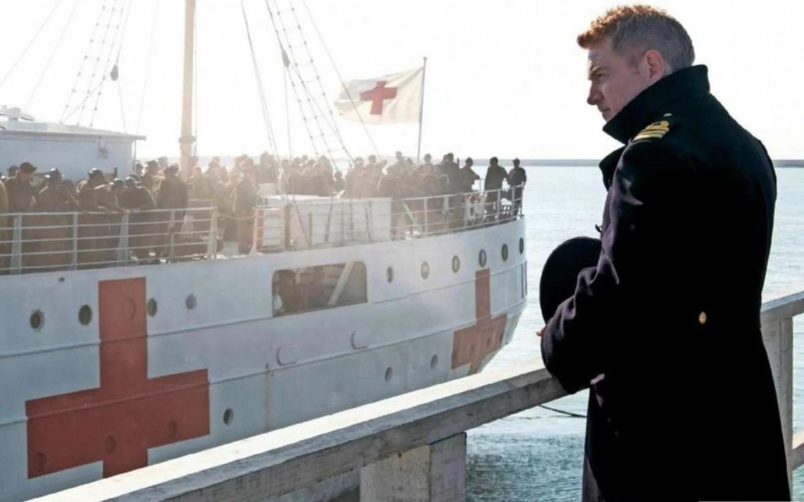

# «Дюнкерк» Нолана: обыкновенное чудо. Эпос об одном из самых важных и загадочных событий Второй Мировой — надо смотреть

- **URL:** https://novayagazeta.ru/articles/2017/07/25/73237-dyunkerk-nolana-obyknovennoe-chudo
- **Дата:** 2017-07-25
- **Автор:** Лариса Малюкова

## «Дюнкерк» Нолана: обыкновенное чудо

## Эпос об одном из самых важных и загадочных событий Второй Мировой — надо смотреть

Кадр из фильмаСамый заветный из замыслов Кристофера Нолана фильм «Дюнкерк» получил высокие оценки мировой критики, ему всячески сулят «Оскар». Но дело, как мне кажется, не столько в качестве кино, к нему как раз есть некоторые претензии, сколько в авторском взгляде Нолана на войну и способы ее отражения на экране.

Фильм, о котором режиссер мечтал 20 лет, снимали на камеры IMAX на широкой 70-ми миллиметровой пленке. Авторы рекомендуют смотреть этот зрелищный экшн на огромном экране вогнутой формы: объемное изображение дает ощущение погружения, присутствия. Это репортаж из прошлого.

Кадр из фильмаНа питчинге для Warner Нолан заявил: «Мы посадим зрителя в кабину истребителя „Спитфайр“ и устроим ему стычку с „Мессершмиттами“. Мы выведем зрителя на берег, где повсюду песок и волны. Мы поместим зрителя на маленькие рыболовецкие лодки и дадим почувствовать, как волны разбиваются о борт. Это виртуальная реальность без шлема… Мы должны поставить камеру на настоящий самолет эпохи Второй мировой и посадить в него актера».

Режиссер разговаривал с историками, ветеранами, изучал редкие материалы, сам писал сценарий, консультируясь с Джошуа Левином, автором книги «Забытые голоса Дюнкерка» и с Иэном Макьюэном, автором романа «Дорога на Дюнкерк». И взял за основу идею романа: «Это был разгром, и это был конец разгрома. Возвращая зрелищному кино живую фактуру пленки, Нолан обращается к истокам, когда зритель при виде приближающегося люмьеровского поезда всерьез опасался за собственную жизнь. Нам бояться нечего: в России прокатчики решили показывать обычную цифровую копию.

Сюжет — реальная история эвакуации английских, французских и бельгийских частей во время Второй мировой.

«Подлежат немедленному уничтожению»

Как воевали лорды: британский спецназ — личный враг Гитлера

В мае 1940 г. союзники были окружены и прижаты к береговой линии в районе порта Дюнкерка. Британское командование воспользовалось неожиданной остановкой немецких войск. По приказу Черчилля все суда, большие и малые, были направлены к Дюнкерку для того, чтобы забрать английских солдат. В ходе операции «Динамо» было эвакуировано 338 тысяч военнослужащих, в том числе 123 тысячи французов. Эта эвакуация была названа военными историками «чудом Дюнкерка».

Нолан — умелец в конструировании миров. Мрачноватого комиксового пространства «Темного рыцаря», меланхолического неонуара «Помни», межгалактических коридоров «Интерстеллара». Здесь он вроде бы впервые вступает на зыбкую территорию исторических событий и фактов. Зыбкую, потому что версий волшебного спасения солдат Британии и их союзников много.

В трехмерном авторском мире «Дюнкерка» соединяются три стихии. Как пишут в рецензиях: «Земля, Вода и Воздух». Формальное определение требует уточнения. Собственно, Земли здесь нет. Только белый пляжный песок, при взгляде на который воображаешь людей в купальниках, шезлонги, зонтики, слышишь смех, гомон, плеск волн. И нет ничего более противоестественного, чем понурые военные на пляже, в длинных очередях ждущие решения своей участи, чем взрывы на пляже, трупы на пляже. Вода — синие с пеной волны Ла-Манша, оставляющие на берегу белую соль во время отлива. Воздух — это небо, в облаках которого бьются британцы с немецкими «мессерами», бомбящими мирные и военные суда.

Режиссер смешивает все краски. Все стихии. Море горит. В кабине пилота кажется, что небесная высь падает вниз, а волны бьются над головой. Ручные камеры передают головокружительность полета.

Считается, что в этом фильме нет главных героев, лишь несколько отдельных персонажей, за которых действие периодически цепляется: опытный летчик, потерявший оружие рядовой, генерал сухопутных войск, хозяин яхты, и мальчик, в последний момент вскочивший на эту самую яхту, отправляющуюся в Дюнкерк на спасение соотечественников…

Великая, но не только Отечественная

Вклад союзников по антигитлеровской коалиции в победу над нацизмом

Поддержите нашу работу!

1000 500 300 Нажимая кнопку «Стать соучастником», я принимаю условия и подтверждаю свое гражданство РФ

Если у вас есть вопросы, пишите [email protected] или звоните:+7 (929) 612-03-68

А все же в фильме есть герой — по версии, Нолана, это сама война.

Энергия ежесекундной опасности, разрушения. Энергия бессмысленной атакующей с воздуха, с моря, с берега смерти — держит саспенс с первой минуты и почти до конца. Война. По Нолану, она не последовательность событий, а нарушение привычности — в том числе, и течения времени. Военные кампании задумывают конкретные люди, но под режиссурой фатума их сценарии срывает с катушек, и война несет себя сама, лихая, пьяная от крови, безумная, алчущая молодых тел старуха. Как песчинку несет отельных людей с побережья Ла-Манша в воронку всемирного хаоса. Поэтому автор фильма и не показывает нам никаких фашистов. Зло войны инфернально, обезличено, и потому страшно.

Кадр из фильмаВ нолановском «Интерстелларе» исследователи галактики для своего путешествия использовали так называемую кротовую нору — туннель в пространстве. В сновидческом «Начале» режиссер конструировал мир пограничья реальности и подсознания. Он долго почти 20 лет подступался к «чуду Дюнкерка», по его мнению, одному из величайших сюжетов в истории человечества; гонке со временем, где ставка — жизни людей: «Наша задача — дать зрителю прочувствовать это, сохранить уважение к истории, не потеряв градус напряженности и привлекательности для аудитории».

В «Дюнкерке» он погружает нас в подобный пространственно-временной тоннель (Нолан называет это смешением темпоральных пластов). В «зоне» войны реальность расслаивается между временем и пространством. Время летит вперед и назад с разной скоростью, замирает, чтобы вновь закружиться на месте. Смотрим на происходящее с различных ракурсов: рядовой Томми неделю мыкается на французском побережье, капитан яхты идет к Дюнкерку один день, а пилот Тома Харди перелетает Ла-Манш за час. Монтаж связывает эти потоки, отдельные сюжетные отрезки и соединяет ближе к финалу в одной точке. Вой самолетов, смешивается с оркестром, навязчивым воем скрипок, перкуссия — с реальными взрывами (музыка Ханса Циммера), и вдруг вся звуковая вакханалия обрушивается в оглушительную подводную тишину. В этой тишине люди верх тормашками пытаются вылезти из тонущего судна. Временами монтажная сумятица действительно, превращается в «сумбур вместо музыки».

Кадр из фильмаМножество раз повторяется кадр: длинные очереди из понурых военных стоят на песке в ожидании спасения. Их спасет не государство (Черчилль хотел сэкономить военные эсминцы, чтобы разом не проиграть войну): в залив со всей Англии идут яхты, рыбачьи шхуны, катера и утлые суденышки. Целая армада. Но по сути, это частная инициатива каждого из соотечественников.

Историю пишут не только выжившие, историю пишет кинематограф. Нолан показывает, что поражение определяется прежде всего состоянием ума и самоуважения.

По сути, его фильм опровергает главную идеологическую установку нашего военного кино: «Мы за ценой не постоим».

Он полемизирует и с боевым кинематографом Стоуна, Копполы, Майкла Бэя. «Умрем, но не сдадимся!», «Мы — стена, на место убитого встанет другой!» «Вырви страх из сердца!», — говорят в «Апокалипсисе». А у Нолана люди — просто люди. Они боятся, ищут лазейки для спасения, отчаиваются, но и совершают поступки, и даже подвиги. Вместо сверхидеи — сакральной смерти за родину, на протяжении всей картины пытаются выжить, сохранить жизнь и достоинство. Насколько это возможно во время самой кровопролитной из войн. Философия и девиз фильма: спастись…чтобы вернуться. И продолжить борьбу.

За полями осталась одна из загадок Второй Мировой: почему Гитлер собственноручно остановил немецкие танки, и по сути, дал возможность осуществлению гигантской и отважной операции. Скорее всего, причины кроятся в складках наглухо задернутой от посторонних глаз закулисной политики, в том числе тайных переговорах между Британией и Германией. Обиделись на Нолана и французы, которые в фильме исполняют роль декорации для отважных действий рядовых британцев.

«Секретно», «совершенно секретно и лично»

Быль и небыль Второй мировой войны: о чем говорят британские архивы

К тому же финал фильма исполнен такого пафоса и духоподъемности, натасканной из цитат из речи Черчилля, словно голливудские редакторы решили подсластить горькую пилюлю строгого военного кино. Критики долго еще будут спорить, насколько ошибочной или напротив, инновационной, оказалась режиссура и монтаж фильма. Дело не в этом.

В «Дюнкерке» Кристофер Нолан воочию продемонстрировал как на наших глазах маленькими шажочками вершится большая история. Втянул нас в воронку ее турбулентности. Показал, как мало и как много от нас зависит в сотворении обыкновенного чуда — мира.

Кадр из фильмаПоддержите нашу работу!

1000 500 300 Нажимая кнопку «Стать соучастником», я принимаю условия и подтверждаю свое гражданство РФ

Если у вас есть вопросы, пишите [email protected] или звоните:+7 (929) 612-03-68
