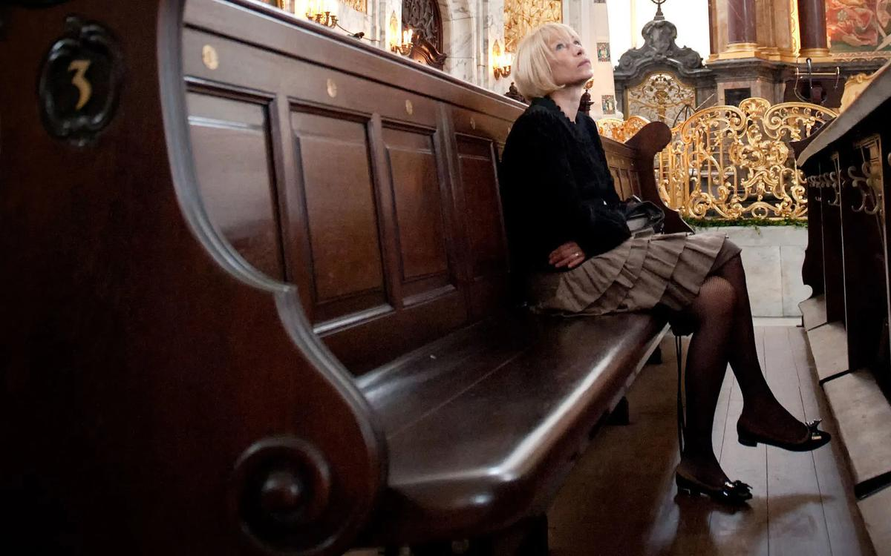

# МузыКанты на волшебном острове. Квартира Микаэла и Веры Таривердиевых станет музеем

- **URL:** https://novayagazeta.ru/articles/2017/08/28/73611-muzykanty-na-volshebnom-ostrove
- **Дата:** 2017-08-28
- **Автор:** Лариса Малюкова

## МузыКанты на волшебном острове

## Квартира Микаэла и Веры Таривердиевых станет музеем

Вера Таривердиева в Кафедральном соборе КалининградаНового директора Кафедрального собора в Калининграде представляли как «признанного авторитета в мире органной музыки и всего музыкального сообщества». Вера Таривердиева — созидатель: затеяла престижный Международный органный конкурс в Калининграде, фестиваль «Орган+», в разных концах света концерты, выставки. И даже «Музыкальный трамвай» выехал из калининградского депо. Все же, думаю, когда ей предложили стать директором собора на «острове Канта», где в «профессорской усыпальнице» похоронен основатель классической философии, она испугалась. По складу неамбициозного, смешливого характера, начальственных кресел и постов она сторонится.Микаэл Таривердиев. Фото: Владимир Савостьянов / Фотохроника ТАСС— Забежала я на почту получить книжку, — говорит Вера Таривердиева. — Тут звонит вице-губернатор: «Мы тебя просим…» «Вы с ума сошли? Как может быть директором Кафедрального собора человек, у которого четыре года не было света в собственном туалете? Я не могу жить в Калининграде, не могу бросить свои занятия, не могу отставить дела Микаэла Леоновича, а сколько времени съедает конкурс…» Он настаивает: «Будем помогать…» И так два с половиной часа. Я поняла, что выбор сделан не только командой молодого губернатора Алиханова, но и собором: люди хотели перемен.

— Что за эти полгода сделано?

— Жизнь на острове бурлит. Новые идеи, замыслы, проекты. Приезжают музыканты с мировыми именами, многие по дружбе: собор нищий, на все получает от государства 2 млн в год.

— Знаю, что ты отказалась от зарплаты. Живешь в соборе?

— Вначале жила в офисе собора, сейчас — в гостинице. Соглашалась идти туда на год, но… Так непросто выстроить стратегию на долгую перспективу. Создан художественный совет, в который вошли не только представители калининградской интеллигенции, но и такие музыканты, как Владимир Федосеев, Александр Князев, Денис Мацуев, Мартин Хазельбек. Будут делиться опытом, помогать создавать контекст, атмосферу.

Ведь что такое Кафедральный собор? Знаковое место не только для Калининграда, но для мировой культуры. Величественная северная готика Средневековья. Уникальный органный комплекс — лучший в России. Бесподобная для органа акустика…

— Представь: у тебя есть деньги и возможности. Какой ты видишь жизнь собора в идеале?

— Собор, способный защитить себя, свой образ, позицию культурного центра Калининграда, органной столицы. Благодаря конкурсу и фестивалю уже приезжают и будут приезжать выдающиеся органисты. Хотелось бы сформировать вокруг собора своего слушателя. Калининградская публика пока еще достаточно отсталая. Но мы запустили абонементы. Первый — нужно же пример подавать — для своей семьи купил Антон Алиханов. В начале октября, в День музыки, устроим ярмарку абонементов. Собор должен стать равен своей славе. Ведь его фото можно увидеть даже в рекламе чемпионата мира по футболу, а собор за это ничего не получает.

— Публика, концерты, реклама… Достаточно ли этого, чтобы сделать остров и собор средоточием культурной жизни?

— Как я это вижу: конечно, классика, эксперименты в области современных композиций, новые формы преподнесения музыки. Вовлечь, поделиться с публикой счастьем соприкосновения с серьезным искусством. Мы объявили остров Insula Magica — волшебным. Во время Музейной ночи в мае там проходили театрализованные экскурсии, помимо органных были джазовые программы, ренессансная музыка, космические композиции. Рыцарский фестиваль превратил остров в средневековый город.

— В идеале, чтобы не только калининградцы стали завсегдатаями фестивалей, но и меломаны покупали билеты, прилетали на концерты, как в Зальцбург. А личность Канта, каким образом воздействует на будущую программу?

— Там есть Музей Канта, увы, названный калининградцами «полем чудес»: люди делились с музеем тем, что у них было. Раритетов там нет. Хочется, чтобы он преобразился. Меня, к примеру, впечатлил Музей Ганзы в Любеке — история мощнейшего средневекового торгового союза воссоздана в интерактиве. С этого года будем отмечать Всемирный день философии, формируется и программа «МузыКанты», потому что в каждом творце есть философ. Будут и философские беседы. Ищем точки пересечений философии, музыки. Будем привлекать талантливых представителей разных культур от классики до регги и рэпа.

— Расскажи про конкурс.

— У нас одна из сложнейших программ среди международных конкурсов, поэтому к нам приезжают музыканты высокого уровня. На прошлом конкурсе дипломантом, к примеру, стал шестнадцатилетний Володя Скоморохов. Сегодня он уже солирует в концертах Владимира Федосеева. Среди наших лауреатов — звездная Ивета Апкална, солистка Гамбургской филармонии на Эльбе, она выступала с Клаудио Аббадо. Жан-Батист Дюпон — один из лучших органистов Европы.

— Что они исполняют?

— Программу первого конкурса придумал Гарри Гродберг. Этот формат держим, он дает возможность привлекать участников, оценить мастерство. Сонаты Баха, добаховская музыка в первом туре. Романтики, произведения современных авторов, в том числе хоральные прелюдии Таривердиева, его органный концерт. В третьем туре — помимо свободной концертной программы, исполнение одной из частей таривердиевской симфонии для органа «Чернобыль». Эту музыку — «Страсти ХХ века» — хорошо знают в мире.

— Опыт показывает, что вдовы знаменитых людей чаще всего занимаются разбором архивов, публикацией неизданного. Ты человек не кабинетный. Все превращаешь в живые события, придумала, к примеру, восхитительный вечер из цикла «Декабристские вечера»: в полуподвальном помещении мастерской художника.

— Терпеть не могу слово «вдова», оно меня коробит. Понимаешь, Микаэл Леонович дал мне ощущение поразительной остроты жизни, ее бесконечности, в том числе своим уходом. С этим ощущением живу.

— Мне кажется, помогает твоя профессия музыковеда, способность осмыслять, разбирать, чувствовать и анализировать музыку. По сути, ты продолжаешь начатое Таривердиевым. Он старался противостоять попсе, вел передачу о серьезной музыке.

— Знаю точно: чтобы его музыке было хорошо, должен быть контекст. Вот я и создаю контекст, пространство для его музыки. Музыке тоже нужен воздух.

— Кажется, ты приложила максимум усилий, чтобы сломать клише восприятия Таривердиева как исключительно кинокомпозитора, сочинителя двух ласковых мелодий в «Семнадцати мгновениях» и музыкальных монологов в «Иронии судьбы…». Кто-то вспомнит рефрен из чудного фильма Калика «Любить» или тему из «До свидания, мальчики». А чьи они, кто знает?

Поддержите нашу работу!

1000 500 300 Нажимая кнопку «Стать соучастником», я принимаю условия и подтверждаю свое гражданство РФ

Если у вас есть вопросы, пишите [email protected] или звоните:+7 (929) 612-03-68

— Да и в «Семнадцати мгновениях» не две песни, а четыре часа музыки, строящейся по симфоническому принципу. Музыка создает объем, делает драматургию, может существовать отдельно от фильма.

— Хотя и неотделима от кино, но музыка «Семнадцати мгновений» перпендикулярна разворачивающейся на экране истории про разведчика. Именно музыка Таривердиева создает тему ностальгии, тоски по небу с «тихим облаком». А не дежурный эпизод с печеной картошкой, гармошкой и «Степью широкой».

— Микаэла Леоновича эта сцена раздражала, представлялась искусственной. Пока он не нашел главную лирическую тему, не давал согласия работать на картине.

— А помимо киномузыки, оперы, балеты, симфонические произведения, органные и вокальные циклы, романсы… Но при всем объеме музыки, видимо, из-за ее мелодичности, в ней есть обманчивость простоты.

— Его музыка, даже самая известная, непростая. А воспринимается легко, ее можно напеть. Но за то же корили Петра Ильича Чайковского. Когда же ее берутся исполнять профессионалы, оказывается, что это сложно. Скажем, «Монологи» на стихи Ашкенази, Поженяна, сонеты Шекспира, помимо музыки, требуют особой манеры исполнения. Не поставленных голосов, скорее актерского пения.

— Ценители говорят об особом чувстве слова. Не случайно он обращался к высокой поэзии. Песни на стихи Цветаевой, Ахмадулиной, Аронова, Вознесенского не просто украсили «Иронию судьбы» — стали ее частью. Он открыл нам таких исполнителей, как Пугачева. Не могу забыть ее еще хрустальный голос в «Короле-Олене».

— Отыскал выпускницу училища имени Ипполитова-Иванова, еще до всех конкурсов и званий. Когда не могли найти, кто бы справился с интонацией в «Мне нравится, что вы больны не мной» или «По улице моей который год…», Микаэл Леонович вспомнил: «Приведите мне ту девушку из «Короля-Оленя». Зара Долуханова — первая исполнительница его вокальных циклов: и ахмадулинского, и мартыновского.

— Вера, а ты вспомнила историю балета «Девушка и смерть», закрытого в 1970-х в канун премьеры в Большом театре в связи с отменой премьеры балета «Нуриев»?

— Конечно, сразу вспомнилось письмо Микаэла Леоновича Григоровичу.

— Не могу не процитировать: «У меня сложилось твердое убеждение, что ни хореография, ни музыка не имеют отношения к тому, что происходит вокруг этой постановки. В этой ситуации я не могу и не хочу продолжать работу в театре, прошу вернуть мне мою партитуру». Во-первых, это поступок. Во-вторых, все это еще раз напоминает: ничего не меняется. Искусство по-прежнему изничтожается идеологией, интригами, политикой.

— Ну, это же еще тот самый Большой театр, чутко реагирующий на «повестку дня».

— Но в этой истории еще и драма автора, уважающего себя, труд коллег.

— Для него поступок — это этическая норма. Скажем, талантливейший режиссер Михаил Калик, его друг, соавтор, признававший, что с музыкой Таривердиева фильм словно перерождается… Калик более четырех лет провел в лагерях. Когда картину «Человек идет за солнцем» пригласили на фестиваль в Париже, Калика не выпустили. У «Метрополя» всей группе, уже с чемоданами, выдали паспорта… кроме режиссера. Микаэл Леонович заявил: «Я не еду в аэропорт без Калика». Пырьев, глава делегации, убеждал его: «Ты станешь невыездным, не делай этого». Микаэл Леонович поступил по-своему. И 12 лет его не выпускали. Да и первое звание «Заслуженного деятеля искусств» знаменитому уже композитору выдали по случаю пятидесятилетия. Он еще отказывался идти документы оформлять. Его считают таким «советским композитором». Он не советский и не антисоветский. Просто «другое дерево».

— Но он же не был непримиримым, отдельно стоящим.

— Напротив, его обожали. Особенно в 60-е он был чрезвычайно популярен и общителен. Это был «круг «Современника», Ахмадулина, Евтушенко, Вознесенский, Аксенов, Мессерер… После случая с аварией он отдалился.

— Ты имеешь ввиду историю с автокатастрофой с участием известной актрисы, потом воспроизведенной в «Вокзале для двоих»?

— Да. Все эти суды, судимость, не только травмировали, но словно отделили его. В пору переживаний он написал цикл для ленкомовского спектакля «Прощай, оружие!» на стихи Хемингуэя, обнаруженные после смерти писателя — реквием невероятной силы. А широкий круг друзей сузился до «ближнего». Но со «своими». С Беллой, с Андреем Вознесенским не обязательно было выпивать, чтобы сохранить это хрупкое ощущение близости. Именно Ахмадулина нашла самые верные слова, когда Микаэл Леонович ушел. О его тонкости, изящности силуэта музыкальной фразы, отвращении к вульгарности, о безупречном мужском поведении. О музыке, возвышающей смыслы. Они чувствовали редкое внутреннее совпадение, способность общаться через музыку сфер.

— Еще больше отдалила его история с розыгрышем Богословского, пославшего в Союз композиторов телеграмму, вроде бы от имени Фрэнсиса Лея — поздравление с успехом «его музыки» в фильме «Ирония судьбы». И хотя навет был развеян, осадок остался надолго.

— Самым тяжелым испытанием было поведение коллег. Вся эта история закончилась инфарктом. Но знаешь, с каждым подобным испытанием, у него начиналась другая музыка.

— А со стороны он выглядел страшно везучим. У «золотого мальчика» в 16 лет первый концерт в Тбилисском театре оперы и балета…

— Вадим Абдрашитов на вечере Калика в Выборге заметил, что этот режиссер пришел в мир с предназначением, что называется, от Бога. И несмотря на все горести, делал фильмы, наполненные светом. То же можно сказать о Таривердиеве. Это было его внутренним ощущением: есть задание, которое он должен выполнить. И смотри. После истории с балетом «Девушка и смерть» начинается его органный период, он пишет «Чернобыль» с его трагической апокалиптической картиной мира. Там две части: «Зона» — апокалипсис, и Quo vadis — реквием, завершающийся картиной полета душ на небо, в пустоту, где нет ничего. А в следующем произведении — Концерт для альта… «хроника расставания души с телом». Его музыкальное прощание.

— Скажи, пожалуйста, Вера, почему ты решила завещать свою квартиру музею? У тебя же есть сын, родственники.

— Не было внутренних сомнений. Хотелось, чтобы дом, мир Микаэла Леоновича остался нетронутым. Мне непросто это говорить. Знаешь, когда я впервые вернулась в нашу квартиру одна, у нас собрались люди… А последние восемь месяцев он почти не спал, мучился из-за бессонницы, сердечной боли. У него было свое место на диване. За пару месяцев до ухода он вдруг предложил поменяться местами. Стал сидеть в моем кресле, я — на его диване. Когда на поминках я увидела кого-то на его месте, мне стало нехорошо… Понимаешь, придут другие люди, все изменится. Я же видела, что сделали с квартирой режиссера Джеммы Фирсовой и оператора Владислава Микоши. Ее квартирой владеет двоюродный племянник, которого она видела один раз в жизни. А ведь мы с ней когда-то мечтали, что здесь будут два музея… Это же тот самый киношный дом, откуда выбросили на улицу журнал «Искусство кино». Терзали меня и мысли об архиве, замечательных инструментах, книгах с автографами друзей. Обо всем этом пространстве. Я посоветовалась с Михаилом Аркадьевичем Брызгаловым, директором Музея музыкальной культуры, в котором мы проводим конкурсы, устраиваем выставки. Он говорит: «А вот Мира Прокофьева написала такое завещание». И в конце августа я официально вручу ему завещание. Пусть музей разбирается с архивом. У меня и без этого дел достаточно.

Кант, с именем которого связана жизнь волшебного острова, считал, что в счастливом супружестве он и она образуют «как бы единую моральную личность». Достигают этой гармонии редкие пары. Но случается.

Поддержите нашу работу!

1000 500 300 Нажимая кнопку «Стать соучастником», я принимаю условия и подтверждаю свое гражданство РФ

Если у вас есть вопросы, пишите [email protected] или звоните:+7 (929) 612-03-68
