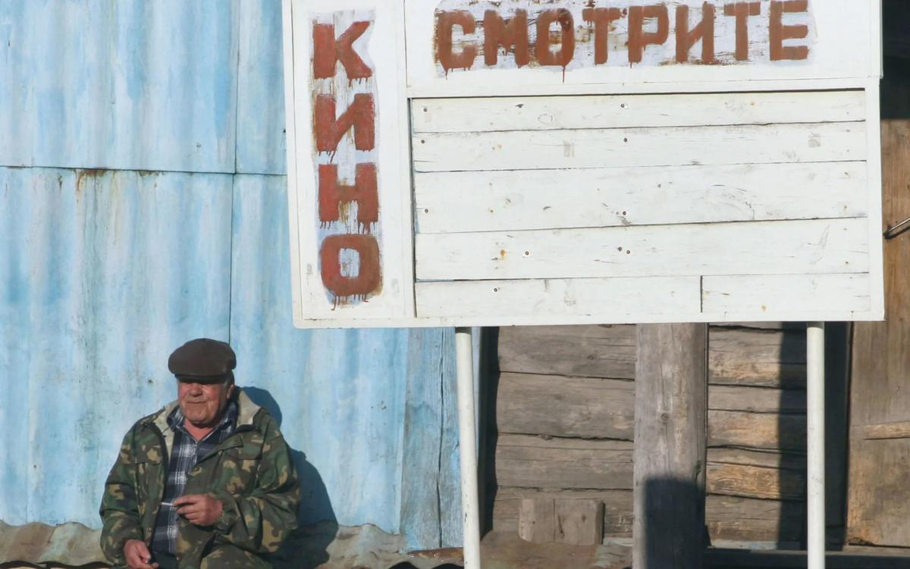

# Дело о пяти миллионах. Обсуждаем проект закона, который коснется не только всей киноиндустрии, но и каждого зрителя

- **URL:** https://novayagazeta.ru/articles/2017/09/06/73716-delo-o-pyati-millionah
- **Дата:** 2017-09-06
- **Автор:** Лариса Малюкова

## Дело о пяти миллионах

## Обсуждаем проект закона, который коснется не только всей киноиндустрии, но и каждого зрителя

PhotoXPressИзвестие о том, что Минкульт вносит в правительство законопроект, который обяжет прокатчиков платить единовременный сбор пять миллионов рублей за выпуск фильма на экраны — самая тревожная и обсуждаемая тема в профессиональной среде. Почин вызвал массу вопросов и претензий у всех участников кинорынка. «Новая» послала свои вопросы в Министерство культуры. Из каких расчетов возникла цифра 100 сеансов, свыше которой продюсер должен платить пять миллионов рублей за прокатное удостоверение? 5 миллионов рублей могут стать непосильным бременем для российских прокатчиков и продюсеров. Какие меры предусмотрены в защиту некоммерческого кино? В какую организацию будут поступать средства, полученные за прокатное удостоверение? Каков механизм возвращения средств, полученных за прокатное удостоверение в киноиндустрию? Предусмотрено ли в новом положении обязательство для продюсеров сдачи фильмокопии в Госфильмофонд РФ? Историки кино обеспокоены исчезновением этого пункта из проекта поправок. Мы получили обстоятельный ответ министерства за подписью Вячеслава Тельнова, директора департамента кинематографии Министерства культуры РФ, в котором игроков кинорынка призывают к диалогу. В ходе этого диалога предлагается прийти к конструктивному согласию: «Поймите: министерство ничего не «продавливает», министерство вместе с коллегами и партнерами ищет оптимальную модель. Именно это и есть задача. Не придем к согласию по данному конкретному вопросу — все равно продолжим искать решения именно в этой логике, в логике поддержки российского кино, в логике задачи его развития. А кто из участников диалога предложит оптимальное решение — министерство или отрасль — это как раз непринципиально».

Мы решили откликнуться на призыв министерства к дискуссии и выслушать и инициаторов «проекта», и его критиков.

Минкульт:

— Вынесенный на общественное обсуждение законопроект — это очередной шаг в поисках оптимальных механизмов протекционистских мер в отношении отечественного кинематографа. Это естественная составляющая государственной культурной политики. Как и в целом — поддержка отечественного производителя в ряде отраслей. Такие меры могут быть временными, но они объективно необходимы. И практикуются повсеместно, не только в России. В том числе и в отрасли национального кинематографа. Во Франции и Польше, например, существуют различные налоги и сборы с кинотеатров, интернет-провайдеров, телеканалов и т.д., доходы от которых направляются на развитие национальной кинематографии.

И данный проект — проявление сознательной и целенаправленной политики на этом направлении, попытка выстроить работающий механизм поддержки отечественного кинопроизводителя в конкретном законодательном поле, в конкретных рыночных условиях.

Сергей Сельянов

продюсер, руководитель кинокомпании «СТВ»:

— Изначально моя идея была в том, чтобы убрать из российских кинотеатров «мусорные фильмы», это порядка 200 названий, не представляющих художественной ценности, собирающих около 1% от общей кассы. Раньше барьером на пути «кинохлама» была цена копии на пленке. Купили вы фильм класса «C» за несколько тысяч долларов, но на его выпуск надо вложить еще 100 тысяч. Печать фильма — дорогое удовольствие, вот и утекал поток подобных фильмов на DVD и в телевизор. Но после цифровой революции доступ на большой экран стал дешевым, и число фильмов удвоилось.

Из всего нашего бокс-офиса 95% собирают 100 фильмов, на оставшиеся 350—400 приходится примерно 5%. Поэтому хочется разгрузить репертуар, ведь «кинохлам» забирает у афиши 600 тысяч сеансов в год. А все совокупное российское кино — это 1,8 миллиона сеансов в год. Идея должна была работать на интересы зрителя и качественного кино.

Борьба за экраны между российскими мейджорами и спровоцировала идею «порога» для выхода фильмов на кинорынок.

Минкульт:

— В 2016 году на российские экраны вышел 331 иностранный фильм, в том числе 145 американских. 33 американских фильма собрали большую кассу (свыше 300 млн руб.), из которых только 10 фильмов являются лидерами проката со сборами свыше 1 млрд руб. На долю указанных 33 фильмов приходятся сборы в размере 29,0 млрд рублей, что составляет 93,5% от общих сборов американских фильмов. Из остальных 112 фильмов большинство не являются ни произведениями искусства, ни популярными у зрителей, но занимают при этом значительную часть киноэкранов, не оставляя места отечественным фильмам.

Дистрибьюторские компании, приобретая права на показ крупных американских релизов, например, лидера проката 2016 года фильм «Зверополис» (сборы в России свыше двух млрд руб.), вынуждены покупать его в пакете с десятью более слабыми фильмами.

Вот зачем занял 74 экрана, с позволения сказать, семейный фильм «Тигриный хвост», собравший всего 350 тыс. рублей? Или зачем выпускать неинтересный самим детям детский фильм «Арло: Говорящий поросенок», собравший на 13 экранах 47 тыс. рублей? Или такой голливудский «блокбастер», как «Хроники мстителя», который на 50 экранах собрал 237 тыс. рублей? И таких примеров масса.

Олег Березин

генеральный директор компании «Нева-фильм»:

— Фильмы, собравшие 10 млн рублей, о которых говорится в документе, составляют половину всех названий. Но их доля в прокате всего лишь 1% или чуть больше. Суждение о «пакетной нагрузке» тоже ошибочно. Мол, фильмы вроде «Зверополиса», «Форсажа», «Парка юрского периода» получают в нагрузку «киномусор». Это, мягко говоря, неправда. Крупнейший дистрибьютор UPI фильмы не покупает, а работает как агент, выпуская картины. И не только блокбастеры, но и арт-кино: «Искупление», «Девять», «Под покровом ночи», «Манчестер у моря». А еще, если кто забыл, «28 панфиловцев». Информация о «нагрузке» давно устарела.

В предварительных вариантах проекта сбор 5 млн рублей планировалось брать с картин, собирающих больше 100 млн. Предлагалось также освободить от налога фильмы с прокатом — не более 100 экранов. Но в проекте «экраны» неожиданно превратились в «сеансы», а это в разы меньше. Ведь на одном экране в день может быть и семь сеансов.

Минкульт:

— Мы готовы эту цифру обсуждать. Поверьте, ни у кого нет задачи «задушить» артхаус. Однако хотелось бы услышать не просто протестные возгласы «нас это не устраивает», а конструктивные предложения, основанные на статистических данных, расчетах и реальных цифрах. Мы ведь довольно долго пытались добиться от киносообщества соответствующих предложений, проводили даже специальное совещание с представителями компаний, прокатывающих авторское и фестивальное кино.

Сергей Сельянов:

— Эта цифра — «100 сеансов» выглядела как описка, наши юристы звонили в министерство. Говорят: «Нет, все правильно». Неправильно! Нельзя отсекать все живое, превращаться в дикарскую в кинематографическом смысле страну. Идея состояла в том, чтобы кино, собирающее больше 100 миллионов, платит сбор пять миллионов. Таким образом, артхаусное, фестивальное кино остается нетронутым. Однако произошла странная метаморфоза, когда Министерство культуры, подхватив инициативу, пишет совершенно другой закон. Это просто поиск дополнительного источника дохода.

Олег Березин:

— Картина, победившая на фестивале, может показываться в кинотеатре одним-двумя сеансами. И это нормально. Это жонглирование числом сеансов, которые вдруг возникли в документе вместо экранов — не ошибка. Это символическая кость, брошенная киносообществу. Сейчас все будут обсуждать абсурдность цифры. И чиновники согласятся: ну ладно, исправим. А все остальное протащат.

Прокатный бизнес непредсказуем: вместо того чтобы платить большие деньги государству, компания выберет более простой и дешевый путь: не выпускать рискованный фильм, прежде всего фестивальное кино. Представители больших студий оставят по несколько крупнобюджетных хитов в афише. В перспективе это — отсутствие российских фильмов в репертуаре. Вроде бы хотели сыграть «за наших» против голливудских. Но новый закон льет воду на мельницу заокеанских блокбастеров. А ведь у нас и так больше 90% сборов, по итогам прошлого года, принадлежат основным студиям-мейджорам, прокатывающим голливудское кино и делающим большие отечественные релизы (ЦентралПартнершип, «ХХ век Фокс», «Уорнер бразерс», «Каро-премьер», «Дисней-Сони»). У всех остальных — 7–10%. Пока.

Раиса Фомина

директор агентства «Интерсинема» (среди привезенных агентством кино Франсуа Озона, Вонга Карвая, Ларса фон Триера, Рейгадоса, Цзя Чжанкэ):

— Предла­га­емые меры смертельны для любого арт-кино. Такие фильмы не конкуренты российским. На них ходит ограниченное число людей, которые коммерческую (в том числе нашу) продукцию не смотрят. Это ложный посыл. Нас пытаются убедить, что фестивальное кино «занимает место», выбросим его — и публика бросится смотреть патриотические фильмы.

Главная из обнаруженных во время подготовки документа потерь: в нем не указывается, что авторское кино освобождается от налога. Хотя об этом с самого начала говорил Сергей Сельянов. По мнению экспертов, после принятия закона качественное арт-кино, российское и зарубежное исчезнет из киноафиши.

Минкульт:

— С учетом того, что часть такого рода фильмов (слабых. –Ред.)просто не будут выходить в прокат, мы рассчитываем, что ежегодные поступления на счет резерва кинематографии составят около 1,4—1,5 миллиарда рублей. Они пойдут исключительно на поддержку отечественной кинематографии.

Поддержите нашу работу!

1000 500 300 Нажимая кнопку «Стать соучастником», я принимаю условия и подтверждаю свое гражданство РФ

Если у вас есть вопросы, пишите [email protected] или звоните:+7 (929) 612-03-68

Сергей Сельянов:

— Проблему авторского кино, поискового, экспериментального в этой конструкции, я считаю, не менее ключевой. Необходимо освобождать от этого сбора художественные картины с небольшим количеством копий. Иначе закон вредный. Я против.

Многие профессионалы, которых мы опрашивали, объясняют, что государство так и не сформулировало, какое оно кино поддерживает. С авторами возникло некоторое напряжение: художнику, его вкусу, таланту не очень доверяют. Власть диктует темы, исторические и политические события, которые должны быть освещены, героев, которым должна следовать молодежь. Беда в том, что молодежи эти фильмы по большей части неинтересны. Судя по всему, документальное кино чудом избежало дани. Что будет с анимационным — неизвестно. Много вопросов и к процедуре возвращения средств. И не станет ли Наблюдательный совет, который будет определять, кому деньги возвращать очередным цензурным ситом?

Сергей Сельянов:

— Вторая задача в предлагаемых нами вариантах была в разумно сконструированной программе, обеспечивающей, чтобы собранные деньги шли на российское кино, как во Франции, в Польше. Нам нужны смысловые решения. Например, считаю, что авторскому кино (в том числе российскому) надо придать статус элитарности. Оно необязательно должно идти во всех кинотеатрах, скажем, Екатеринбурга. Но в двух надо продумать систему лояльности, скидок для постоянных зрителей, для семейных походов в кино и т.д. Нужно просчитать эффективность, проговорить с экспертами, но аналитики Минкульта, видимо, эту работу просто не стали делать.

Раиса Фомина:

— Просто в очередной раз самая культурная часть общества лишится возможности увидеть образцы мирового кинематографа. Я уже не говорю о том, что никакая компания, распространяющая качественное кино, не сможет вести бизнес: они и так с трудом возвращают затраченное. Выйти в ноль — уже успех.

Если я должна буду заплатить более $8 тысяч — это убийственно для компании. Мое терпение лопнуло на прекрасной корейской картине «Поэзия» (Каннский приз за лучший сценарий). Я потеряла много денег. Раньше было возможно хоть какую-то часть вернуть за счет продажи на телевидение, но телевидение впало в политическую истерику. Ему не до кино.

Для рынка крайне опасно отсутствие независимых компаний. В такой ситуации диктовать свои условия будут исключительно миллиардеры-мейджоры. Но и с ним непросто. В какой-то момент в силу экономических или политических причин крупнейшие игроки рынка могут развернуться и уйти.

Алексей Рязанцев

генеральный директор кинокомпании КАРО-премьер:

— Мы выпускаем в год примерно 25 картин. Пять миллионов с каждой картины составят 125 миллионов. Даже самая крупная студия откажется их платить. Мы платим все налоги, но если этот дополнительный сбор введут, студия может объявить трехмесячный локаут. Повлияют ли три месяца без мейджорского кино на жизнеобеспечение кинотеатров?

Олег Березин:

— Кому будут возвращать собранные «миллионы»? Мы сделали трансляцию концерта Рамштайна: одновременный показ — триста экранов, полные залы. Сборы — 26 млн рублей. Или «Флоренция и Галерея Уффици» — документальный фильм с комментарием Пиотровского. Экранов может быть и много, но проект — просветительский. Могут сказать, слишком много экранов или зачем нам Микеланджело?

Минкульт:

— Собираемые средства будут поступать на счет специального резерва кинематографии при Фонде кино, а контроль за этой частью деятельности будет осуществлять специально созданный наблюдательный совет, который ежеквартально будет получать и рассматривать отчеты о поступивших и израсходованных средствах. Механизм возврата средств — это чисто техническая задача, которая будет решена в ближайшее время.

В основе подобных пертурбаций должны лежать творческое целеполагание и серьезный экономический расчет. Продюсеры, представители сетей, дистрибьюторы задают вопрос: отчего расчеты будущих «заработков» ведутся на основании сегодняшних условий существования киноотрасли? С введением нового закона ситуация на кинорынке изменится. Число выходящих картин в разы уменьшится, значит, меньше денег будет собрано. Главными жертвами станут независимые дистрибьюторские компании. Сегодня и так их число уменьшилось. Нет уже «Пирамиды», «Веста», с трудом выживает «Парадиз».

Сергей Сельянов:

— В этом документе много проблем, без решения которых закон может стать вредным. К тому же проект по самым простым расчетам не оправдается экономически. Мы от Ассоциации продюсеров готовим свой отзыв на проект. В таком духе эту идею развивать не имеет смысла.

Олег Березин:

— Что будет в результате? Ну заработают они два млиллиарда рублей — на полтора «Викинга», а целую отрасль загубят. Сейчас проходят встречи между представителями кинотеатров, крупными и независимыми дистрибьюторами. Ищем способы решения проблемы. Надо действовать. Безусловно, проект будут протаскивать. Горизонт планирования госчиновника — до выборов, до новых назначений. Значит, надо показать себя, чтобы наверху твои инициативы услышали и сказали: «Молодцы!» Для них главное — отчетность. Надо к 2030-му обеспечить пять с половиной тысяч экранов! Непонятно, что и кому будем показывать. Но эффективность законов и инициатив никем не обсуждается. Вроде бы нас призывают к дискуссии, но больше на словах. В сентябре состоится профессиональная конференция «Форсайткино» про стратегию развития киноотрасли до 2025 года. Мы послали в Минкульт приглашение в конце июля. Ответа так и не получили.

Об успехах и недостатках российского кино в последнее время судят исключительно по его процентной доли (2015-й — 17,9%, 2016-й — 18,4%). Почему не по количеству проданных билетов, которые точно покажут динамику развития? Неужели критерием успешности нашего кино для Минкульта является исключительно прибыль? Достоинства и недостатки не анализируется, грабли работают, расчищая экран от искусства.

Сегодня выходит до 700 фильмов в год. В день примерно семь картин. И рядом с каникулярными хитами в афише можно увидеть «Квадрат» Эстлунда, Гран-при Каннского кинофестиваля. Зрители летом смотрели не только «Человека-паука», но и «Тесноту» Балагова, и «Люмьеров» Тьерри Фремо. А еще экспериментальное отечественное кино, вроде «России как сон» Сильвестрова, снятое за три копейки. И оперы ведущих театров мира, экранные версии балетов и драматических спектаклей. Новая подать нанесет вред региональному кино, вроде якутского, которое не всегда стремится добраться до столиц. Все это разноцветье может исчезнуть.

По мнению чиновников, новый сбор не только освободит прокат от низкобюджетного иностранного «балласта». Российское кино получит дополнительные средства, а значит, невиданный импульс к развитию.

Эксперты отвечают, что увеличение числа показов и даже строительство кинотеатров не решит проблемы востребованности и окупаемости отечественного кино. Практики индустрии полагают, что дело не в количестве залов, сеансов, а в качестве аудитории. Именно Минкульт мог бы инициировать просветительскую программу для школьников, для молодежи. Создать условия, чтобы в кинотеатры вернулась взрослая аудитория. «Поднять с диванов 63 миллиона потенциальных зрителей», как говорит Олег Березин. Необходимо поощрять кинотеатры с системой льгот для семей, школьников, студентов, пенсионеров. В Америке в кино ходят не избранные, а едва ли не каждый.

Среди первостепенных вопросов, которые задают эксперты: к чему приведет принятый закон. Обогатится ли отрасль? Оставит ли Минфин собранную подать в Минкульте или деньги уйдут в нищающую бюджетную корзину?

Зато есть и хорошая новость. В новом положении предусмотрено обязательство для продюсеров сдачи фильмокопии в Госфильмонд РФ. Историки кино взволновались: если не хранить фильмы в архиве, они могут просто исчезнуть. Но тут Минкульт всех успокоил:

Минкульт:

— Сдача копий фильмов в Госфильмофонд никуда не исчезла. Здесь как раз мы нашли точку соприкосновения с киносообществом, которое ранее неоднократно поднимало вопрос о том, что кинокомпании не успевают сдать копию фильма при получении прокатного удостоверения. Поэтому были подготовлены изменения в Федеральный закон от 29.12.1994 № 77-ФЗ «Об обязательном экземпляре документов», предусматривающие, в том числе, сдачу копии фильма не до выдачи прокатного удостоверения, а спустя три месяца после его получения.

Общественное обсуждение проекта о новом сборе в пять миллионов продлится месяц. Всем очевидно: необходимо уточнять документ, нужен диалог с государством. Но для этого игрокам внутри индустрии следует договориться друг с другом. Это непросто. Но иного выхода нет. Уже меньше чем через месяц документ отправится в правительство. «Новая» приглашает заинтересованных лиц к дискуссии.

Поддержите нашу работу!

1000 500 300 Нажимая кнопку «Стать соучастником», я принимаю условия и подтверждаю свое гражданство РФ

Если у вас есть вопросы, пишите [email protected] или звоните:+7 (929) 612-03-68
