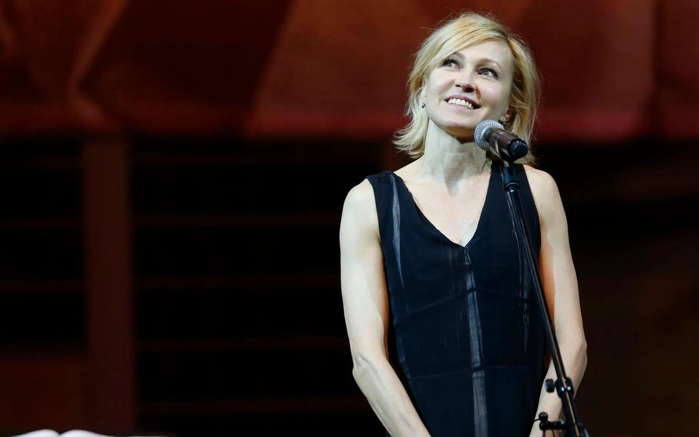

# «Разговоры об объективности и оскорблении исторической правды — смешны». Ингеборга Дапкунайте — о Балабанове и личном выборе. А депутаты Госдумы — о «Матильде», закрытый показ которой посетили

- **URL:** https://novayagazeta.ru/articles/2017/09/29/74022-razgovory-ob-ob-ektivnosti-i-oskorblenii-istoricheskoy-pravdy-smeshny
- **Дата:** 2017-09-29
- **Автор:** Лариса Малюкова

## «Разговоры об объективности и оскорблении исторической правды — смешны»

## Ингеборга Дапкунайте — о Балабанове и личном выборе. А депутаты Госдумы — о «Матильде», закрытый показ которой посетили

Фото: Михаил Джапаридзе / ТАССДиапазон работ Ингеборги Дапкунайте изумляет. Помимо царственных особ она сыграла фатальную декадентку Ольгу в «Циниках», шельму Кисулю в «Интердевочке» Тодоровского-старшего, меланхолическую Катю Измайлову в «Подмосковных вечерах» Тодоровского-младшего, лучезарную Марусю в «Утомленных солнцем», страдалицу Маргарет в балабановской «Войне», миссис Хадсон в «Шерлоке Холмсе» и даже мать Ганнибала Лектера. В Литве работала с Некрошюсом. Снималась в американских фильмах и сериалах, играла на британской сцене. Она перевоплощается в белого клоуна князя Мышкина, летает на проволоке в образе заграничной дивы Марион Диксон в «Цирке». А недавно «нездешняя актриса» с древним скандинавским именем и иностранным акцентом оказалась втянута в сутяжный бред, клубящийся не первый месяц вокруг «Матильды», здесь она сыграла мать Николая II. — Начнем с «Матильды»? Отчего-то пропустили зоркие депутатши вашу работу, возможно, среди избранников народа не оказалось верных поклонников Дагмар, Марии Федоровны? Впрочем, исторические персонажи всегда играть сложно, что вы вкладывали в эту роль, как к ней подступались?

— Пытаюсь начинать с книг, дневников. Мне интересно читать, погружаюсь в контекст. Это сложный исторический период, к которому я «подбираюсь» все ближе. Когда-то играла Александру Федоровну, жену Николая II.

— Известно, что отношения между вдовствующей императрицей и Александрой Федоровной были, мягко говоря, непростыми.

— А бывают «простые отношения»? Играешь не «отношение», даже не свое восприятие истории. Проживаешь жизнь героя в обстоятельствах, которые предлагают режиссер и сценарист. Это история, которую онирассказывают. Возвращаясь к больной теме «оскорбления исторического персонажа». Если бы мы снимали документальное расследование, я бы сочла возможным какие-то претензии. Но мы снимаем развлекательное кино.

— Развлекательное?

— Это зрелищный костюмированный образец энтертеймент индустрии. Мы увлекаем и развлекаем людей. Можно развлекать, говоря о серьезных вещах и проблемах. Можно снимать «Нелюбовь» или «Аритмию», поднимая разговор о современнике и его одиночестве. Развлекать легкомысленными и серьезными мюзиклами. На самом деле, мы по-прежнему представители одной из самых старых профессий: рассказываем историю. Когда я училась в консерватории, нам объясняли на лекциях: с чего начинается театр? С человека, который рассказывает историю. Он может говорить правду, а может все выдумать. Как правило, неправда интереснее. И к вопросу о правде. Как только человек начинает что-то рассказывать, правда растворяется в его интерпретации, субъективном взгляде на вещи.

— Плюс субъективный взгляд сценариста, режиссера, камеры, монтаж.

— Из нашего с вами разговора мы можем выбрать те или иные фразы и поменять смысл. Даже фотограф не просто фиксирует — он выбирает, на что смотреть. Под каким углом и фильтром. Поэтому разговоры об объективности и оскорблении исторической правды смешны.

— Как вам кажется, совместны ли социальная активность и творчество? Есть художники, которые считают: «У меня есть профессия, и в ней я могу все высказать». Другие возражают: «Нет, я должен. Мне не все равно, что происходит на улице, с детьми, с правозащитниками, с теми, кто не может за себя постоять».

— Кто-то умеет это делать, умно, с достоинством, как Звягинцев, кто-то не может. Меня возмущает, когда говорят: «Ты актер, играл бы свои роли, чего ты лезешь?» Актер такой же человек, как и вы. Так же переживает за происходящее. Вы имеете право на свое мнение? И актер, и врач, и капитан корабля, и официант. Так что это всегда личный выбор.

— Когда вы обсуждали сценарий, говорили с Алексеем Учителем, ставился ли вопрос об ответственности исторического персонажа, наделенного властью? Например, ответственности Николая II, Марии Федоровны, Александры Федоровны.

— У Алексея Ефимовича был долгий подготовительный путь перед съемками. А на съемках мы просто «играли сцены». Если можно определить его способ работы, он бескомпромиссно ищет правду в кадре. Не какую-то абстрактно объективную, а в данный момент: чего герой боится, что ненавидит, кого любит, к чему стремится.

— Но дело же не в какой-то выскочке-депутатше, влюбленной в «святого царя». Дело в определенной тенденции, когда запретить можно что угодно.

— Евгений Миронов точно сформулировал то, что и я чувствую: «Нам должно быть стыдно, потому что мы даже не заметили, как это произошло. Как все мы оказались в этой ситуации». С трудом понимаю, что кто-то всерьез верит в мироточащие бюсты. Наверное, в их понимании, это правда. Тогда я бы хотела, чтобы и они с уважением отнеслись к тому, что мы снимаем кино и развлекаем людей. Это наша правда. Увы, мы видим, что у паранойи есть опасность массового распространения.

— А что вы думаете о претензии замминистра культуры Пожигайло, который сказал: «Лучше бы этого фильма не было. Это голливудское кино глазами американца. Матильда с обнаженной грудью попахивает патологией. Уберите эротику».

— Искусство отражает жизнь. А в жизни люди, кроме всего остального, занимаются сексом, благодаря которому мы появляемся на свет. Не знакома с человеком, который как-то по-другому умудрился это сделать. Поэтому секс и любовь будут вечными темами искусства. Дело художника, как он в своем произведении это покажет. Про патологию не буду; папа дипломат говорил, что у них есть правило — не слышать глупых вопросов.

Грехопадение в «Плейбое»

Хью Хефнер как зеркало сексуальной революции

— А не связана ли вся эта инициативная истерия с тем, что творческое сообщество несколько раз промолчало, не выступив солидарно против нападок на МХАТ, варварства на выставках?

— Если вы посмотрите на мировую практику, то какие-то яркие художественные высказывания всегда вызывали бури негодования. Спектакль «Пикник на Голгофе» Гарсиа католики пытались сорвать, обливая зрителей машинным маслом. Скандал вызвала греческая постановка «Тела Христова» по пьесе Терренса Макнэлли. После британского спектакля Эдварда Бонда «Спасенные», в котором мучали младенца, кричали: «Как это можно! Запретить!» Сара Кейн обвинялась всей прессой в аморальности. Теперь два последних — классики.

— Вы говорите о состоявшихся постановках. А у нас протестный вопль охватывает массы до премьеры, так сказать, превентивно. Как бы чего не вышло.

—Осуждать, не читая, в традициях авторитарных систем. Но опасно поддаваться на провокацию. «Матильда» выходит большим тиражом. Главное, чтобы она говорила о вещах, которые интересны публике, вызвала сопереживание — и опять же развлекала. Это задача посложнее любой провокации и скандала.

— Да уж, теперь ответственность на фильме, который будут рассматривать с пристрастием, особая. Кстати, об ответственности. Вы одна из первых в стране занялись благотворительностью. Сейчас вы сопредседатель попечительского совета фонда помощи хосписам «Вера». Выбрали самое сложное направление.

— Это все Нюта Федермессер. Она решила организовать благотворительный фонд помощи хосписам «Вера» и позвала меня. Им нужен был человек, как бы это сказать…

— С узнаваемым лицом.

— Ну да. Это было 10 лет назад. Познакомил меня с Нютой мой зубной врач. Володя Никитин сказал: «Тебе непременно надо с Нютой встретиться». Я за это ему безмерно благодарна. Потом к нам присоединилась Таня Друбич и много других замечательных людей. 10 лет пролетели незаметно.

— Когда было труднее сейчас или тогда?

—Ну, это же не трудно. Или нет… Трудно сначала, потом ставишь конкретную задачу: теперь нам нужно сделать вот это. И ищешь способы ее решить.

— К примеру?

— Пару лет назад мы решили, что нужен детский хоспис. Не было в таком громадном городе детского хосписа. А в наш Первый московский хоспис дети не допускались по закону. Потом вроде договорились, но детям там не место. Проблема стояла остро. Тогда объединились фонд «Подари жизнь» и мы. Мы поняли, что нужна помощь властей… Власти Москвы отозвались, выделили из фондов землю. Мы нашли спонсоров. Это требовало времени, усилий. Теперь «Дом с маяком» — отдельный фонд, которым занимается Лида Мониава. Делает это прекрасно. А у фонда «Вера» свои задачи. Нюта стала директором огромного паллиативного центра, который развивается и разрастается. Каждый раз, когда говорю: «Ну вот раньше был один хоспис, а сейчас 30», меня поправляют: «Нет, 60… 70 хосписов по стране, которым мы помогаем». Конечно, чем больше людей о нас узнают, тем больше нам нужно средств, больше задач требуется решать. У нас огромная выездная служба. Говорю вроде о простейших вещах. Но когда мы начинали, элементарной задачей было объяснить, что такое хоспис. Что это не ад, а помощь, помощь и больным, и родственникам. Мы продолжаем объяснять: последние дни человека ничем не должны отличаться по качеству от середины, начала или какого-то другого периода его жизни.

Матильда как источник трезвости

Зачем читать воспоминания Кшесинской

— Потому что это еще жизнь.

— Конечно. Раньше федеральные каналы не касались этой темы, а сейчас и «Голос» на Первом, и НТВ пустили наши ролики.

— То есть смысл Фонда не только помогать конкретным людям, но и менять сознание в обществе.

— Это задача любого фонда. Например, Ксения Раппопорт с фондом «Дети-бабочки». Мы не знали о такой болезни. Она подняла эту тему.

— А как вы полагаете, популярность различных форм благотворительности — не компенсация ли недостатка внимания со стороны государства?

— Это признак развития, признак цивилизованного общества. Раньше мы думали, что все обязано делать государство. Это утопично. В любой стране должна существовать благотворительность.

— Что для вас сегодня это понятие обозначает?

— Мы должны делать мир лучше. Это не пафос. Я не говорю, что встала утром и думаю, какой бы подвиг сегодня совершить? Но вот вчера мы обсуждали сериалы. Почему мне не очень интересен «Карточный домик», а интересен сериал «Мост» (первый сезон русской версии выйдет в ноябре на НТВ, мы с Пореченковым в главных ролях). Потому что в «Карточном домике» герои интересуются исключительно собой и властью (я понимаю, что это крутейший, мастерски сделанный сериал), а в «Мосте» герои борются за добро.

— Но как актрисе, вам, наверное, интереснее играть сложный характер, а не борцов за все хорошее.

—С противоречивыми характерами мне везет. Но я сейчас говорю как зритель. Говорю о мире, в каком мне хочется жить.

— Что касается ролей, «вам нет преград»: в детстве вы играли сына Мадам Баттерфляй, среди недавних работ — князь Мышкин и даже Майкл Джексон в ироническом сериале «Пьяная фирма».

— Это вы громко сказали: «Роль».

— Какая из работ вас удивила, позволила открыть в себе нечто новое?

— Меня скорее удивляет, что это все может быть интересно другим. Иногда кажется, проснусь, и мне скажут: «Ты кто? Уходи. Ты нас обманула».

— Как в «Мимино»: «Он же и есть Хачикян! А его аферистом назвали!» Вы не лукавите? У вас популярность, возможность играть серьезные роли в экспериментальных спектаклях.

Поддержите нашу работу!

1000 500 300 Нажимая кнопку «Стать соучастником», я принимаю условия и подтверждаю свое гражданство РФ

Если у вас есть вопросы, пишите [email protected] или звоните:+7 (929) 612-03-68

— Роль интересна, если она живая, когда не сразу видишь результат. Идешь к нему вместе с режиссером. Такая профессия. Если расположусь удобно в кресле, профессия исчезнет. Не говорю о том, что должна свои раны терзать, но… каждый день идешь заново. Делаешь первые шаги, нащупываешь под ногами почву. Есть намеченная карта, рисунок, «арка». Обозначение пути от пункта «А» до пункта «Я». Какая последняя буква русского алфавита — «я»?

— Это и буква, и важное, в том числе и для вашей профессии слово.

—В актерской профессии наверное своя азбука. Ты каждый день другой: «я», «он» или «оно». Не можешь играть так же, как вчера. Есть конечно блестящие технические актеры… Но это как пословица — «два раза в одну реку не войдешь». Роль — это река. У тебя голова болит? Ты с кем-то поссорился? Это влияет, но река течет.

— Вы сказали о реке, и я сразу вспомнила вашу работу в «Войне» Балабанова. Сложнейшие по-настоящему опасные съемки в ледяной стремительной реке. Потом вы сыграли и Анну Николаевну в его «Морфии». Чем для вас была встреча с Алексеем Балабановым?

— Мы с Лешей познакомились на «Кинотавре». Вспоминала это недавно. У меня с ним было два разных опыта. Первый — «Война», очень трудный.

— Тяжелые съемки?

— Да. У меня была гипотермия, но это забывается. Прежде всего, очень трудные отношения.

— Он рассказывал мне, что съемки для вас стали настоящим испытанием, и что хотел он снимать именно вас, хотя сомневался — согласитесь ли.

— Мне нравилось его кино, и я очень хотела сниматься. Но после первых съемочных дней, почувствовала себя бездарнейшей актрисой. Он на меня почти не смотрел, я не знала, что делать. Но приехал Сережа Бодров-младший. Сказал: «Да нет, он всегда такой. Он тебе никогда не скажет: «Вот это было неплохо». И я успокоилась. Хотя Леша мог быть и достаточно резким. «Морфий» — другая история, мы уже стали соратниками.

— Мне кажется, в этой роли вы себя свободнее чувствуете.

— Разные характеры. В «Войне» почти все съемки пролежали в холодной яме. Возможно, в отчуждении Леша инстинктивно от нас добивался нужной интонации. Представьте, лежишь в яме целый день, мухи кусаются, как собаки. Потом идешь длинной дорогой по овечьему говну целый день. Он не считал актера «обезьяной в кадре», уважал профессию. Говорил только: «Сыграйте талантливо. Пожалуйста». И мы делали больше своих возможностей, еще чуть-чуть. Он по какому-то внутреннему наитию и чувству знал и видел всю глубину кадра. Мог двинуть что-то из вещей, и кадр преображался. Такой дар. Временами было забавно. Мне надо в «Морфии» делать укол Бичевину. Я научилась делать уколы, но на современных пластмассовых шприцах. Перед камерой мне дают старый металлический шприц, который кипятят — это же 1919 год. Подхожу к Бичевину. Надо ему в попу воткнуть «это» — у меня отскочила игла — она толстая — не ХХI век. Балабанов вопит: «Что же ты, давай, давай коли его!» В следующем кадре я вбила так, что Бичевин подскочил от боли. Балабанов, глядя в монитор, говорит: «Бичевин перетопил. Спокойнее надо. Давайте еще».

— Вам везет с партнерами. От Малковича и Брэда Питта до Бодрова, Миронова и Ларса Айдингера в «Матильде». Партнер для вас — это приключение, союз, конкуренция?

— От работы партнера зависит твоя роль. Например «Мост» — полгода съемок. Мне очень повезло с Мишей Пореченковым. Он чрезвычайно щедрый партнер. В кадре успевает подумать, как сделать, чтобы мы вместе были хороши. Что ты можешь один? Крупный план «поиграть»? Здоровая конкуренция возможна, но не в ущерб другому.

— Вашего партнера по «Матильде» Ларса Айдингера, звезду берлинского «Шаубюне» наши блюстители нравственности обвиняют бог знает в чем, но главное считают недостойным играть роль Николая II.

— Эти нападки и обвинения неуместны и отчаянно глупы. Ларс не нуждается в моей защите. Ведущий европейский актер, снимающийся в Европе, в Англии, ради «Матильды» отказался от съемок в американском сериале «Родина». До нашей работы, я видела два лучших спектакля в Шаубюне с его участием «Гамлет» и «Демоны». Он тоже блестящий партнер. Замечательно играть маму такого сына.

— Как же он произносил текст по-русски? Вы не чувствовали в этом смысле «стены»?

— Нет. Я его понимала. Для «Моста» мне самой пришлось учить эстонский. Играть на языке, которого не знаешь, трудно.

— Скажите, а ваш акцент, не мешал профессии? Или напротив, помогал получить роль?

— Палка в двух концах. Иногда помогает, иногда мешает.

— Палка в двух концах — не точно по-русски, но образно.

—Это как «руки обледели». Если я дольше нахожусь в России, то и ошибок делаю меньше, и акцент пропадает. Но когда играю в «Цирке» американку, говорящую с акцентом, то и мой акцент усиливается. Знаете, какая среди десятков ролей моя любимая? Любительницы «Вишни в шоколаде» — Ольга из «Циников» по роману Мариенгофа. Благодаря ей я почувствовала, как плита революции накрыла «бывших», испытавших ужас перед пустотой бездны. Пытавшихся как-то барахтаться в этой бездне. Там шикарный текст. Все роли забываю, а из «Циников» помню дословно: «Говорят, что в городе совершенно исчезнет французская губная помада. А как же тогда жить?» Или когда ей говорят: «Почему бы вам не стать актрисой?» Я отвечаю: «Коонен я быть не хочу, а Комиссаржевской из меня не получится».

Контекст

## «Наши ханжи, они и Венеру Милосскую готовы одеть в лифчик»

### «Новая газета» опросила депутатов, посетивших закрытый показ «Матильды»

В четверг, 28 сентября, в ГУМе прошел закрытый показ фильма «Матильда» режиссера Алексея Учителя для депутатов Госдумы. Картину посмотрели парламентарии комитета по культуре и несколько депутатов из других комитетов нижней палаты. «Новая» расспросила парламентариев об их впечатлениях от фильма, который еще не вышел в прокат. Интересно, что в тот же день в стенах самой Госдумы провели Круглый стол, посвященный традиционным ценностям…

СтаниславГоворухин

председатель комитета Госдумы по культуре

— Дискуссия вокруг фильма неоправданна, потому что там нет ничего, что могло бы оскорбить чувства верующих.

Елена Драпеко

первый заместитель председателя комитета по культуре Госдумы

— Я думаю, у этого фильма будет широкий прокат, его можно показывать на селе, где люди любят посмотреть на красивые интерьеры. Это именно то, почему мы в свое время смотрели французскую Angélique («Анжелика, маркиза ангелов»). Потому что на фоне нашей серой жизни вот эта прекрасная жизнь, страсти, любовь. Она дает воздух, радость жизни, а наши мракобесы и ханжи, они и Венеру Милосскую готовы одеть в лифчик.

«Фильм должны посмотреть как можно больше человек, чтобы снять напряжение, которое сегодня возникло».

Считаю, что прокатчики в этой ситуации себя повели неверно. Чем больше будет ограничений на просмотр, тем сильнее будет противостояние между противниками показа «Матильды» и теми, кто считает запрет недопустимым, поскольку народ сам в состоянии оценить, что повлияет на нашу нравственность, а что нет.

Сторона, выступающая за запрет «Матильды» пытается нарушить Конституцию Российской Федерации, которая предполагает отсутствие цензуры. Фильм экспертными советами и министерством культуры к показу разрешен, а эти люди пытаются отобрать прерогативу государства, чтобы они решали, что можно показывать, а что нельзя. Это очень опасная тенденция.

Дискуссия, которая развернулась вокруг фильма, раскачивает лодку, дестабилизирует общество, у нас и так достаточно много проблем в России, которые мы должны разрешить, а эта проблема абсолютно надуманная, но очень болезненная. Все, что касается культуры, идентичности, ценности, святынь — это очень тонкая и болезненная тема. Как только ее затронули, общество всколыхнулось, и это происходит в любой стране и всегда, а в России особенно, попробуйте, троньте наши святыни, и мы тут же пойдем с кольями их защищать, так как Донбасс защищает язык. Но здесь людей просто обманули, в фильме нет ничего, что могло бы оскорбить чувства верующих или память семьи Николая II, а следовательно требует защиты.

Ольга Казакова

заместитель председателя комитета по культуре Госдумы

— Я не усмотрела в картине никакого нарушения закона. В конце фильма просто выдохнула, стало так спокойно, и появилось четкое ощущение, что дискуссия, которая вокруг фильма разгорелась, особого отношения к нему не имеет. Те, кто в ней участвовал, после просмотра фильма это поймут.

Картину я восприняла не как историческую, а как художественную. При других обстоятельствах я бы не задумывалась о личной жизни Николая II, а изучала бы события, связанные с исполнением им государственного долга.

Фильм показал, что даже у тех людей, которые управляют государством, есть слабости. Они также любят, страдают, плачут. Многие события, представленные в фильме, скорее всего, являются художественным вымыслом.

Мне кажется, авторы и не претендовали на историческое отражение событий. Николай II прожил большую жизнь — 50 лет, после того, как его короновали, он еще больше 20 лет правил страной, а в фильме показан один из небольших периодов в его жизни перед коронацией.

Для меня после просмотра фильма осталось понимание, что нашей большой страной, на тот момент действительно многострадальной, о чем свидетельствуют события, произошедшие на Ходынском поле, когда произошла давка, нашей страной должен управлять очень сильный человек.

Ярослав Нилов

заместитель руководителя фракции партии ЛДПР в Госдуме

— Возможно, без столь бурного обсуждения картины, я бы вообще не пошел ее смотреть. Я предпочитаю документальные фильмы, эта картина больше похожа на мелодраму. Красивый фильм, на любителя.

Ничего крамольного, оскорбительного я не увидел в фильме. Я православный верующий, в кабинете у меня висит икона царской семьи.

Пусть все занимают свою позицию, доказывают ее, но главное, чтобы никто не преступал нормы права.

Александр Шолохов

заместитель председателя комитета по культуре Госдумы РФ

— Надо как-то очень напрячься, чтобы найти в фильме оскорбления чувств верующих.

Фильм как художественная работа — средненький. Я не в восторге. Очень хорошая работа оператора, интерьеры, декорации, а сценарий и актеры, по моему непрофессиональному мнению, оставляют желать лучшего.

Для меня образ Николая II, показанный в картине, совпадает с тем, каким его описывают — человек, который до конца не может сделать выбор, в силу чего остается заложником ситуации. Это преследовало его по жизни, так происходило не только в его личных взаимоотношениях, но и в его государственной деятельности.

Дискуссия вокруг фильма велась без предмета спора — глуповатая получается ситуация. Эти споры облекаются в форму экстремистских действий. Это попытка снова расколоть общество по одной из наметившихся трещинок.

Без скандала фильм прошел бы очень спокойно, он бы нашел свою аудиторию, но бурной реакции бы не вызвал.

Поддержите нашу работу!

1000 500 300 Нажимая кнопку «Стать соучастником», я принимаю условия и подтверждаю свое гражданство РФ

Если у вас есть вопросы, пишите [email protected] или звоните:+7 (929) 612-03-68
