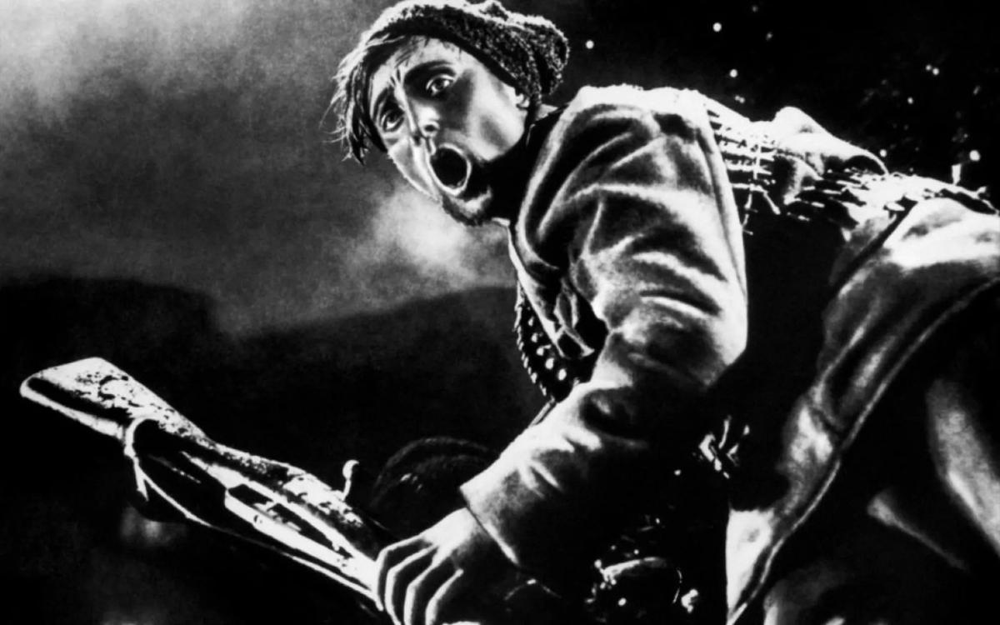

# Мир верит в динамит. Идеи революционного кино родились вовсе не в России, а задолго до великого и ужасного переворота. Первый «Броненосец «Потемкин» рассекал экраны Франции, у философского корабля был предшественник в Америке, а вожделенный «Оскар» оказался портретом мексиканского революционера

- **URL:** https://novayagazeta.ru/articles/2017/10/02/74034-mir-verit-v-dinamit
- **Дата:** 2017-10-02
- **Автор:** Лариса Малюкова

## Мир верит в динамит

## Идеи революционного кино родились вовсе не в России, а задолго до великого и ужасного переворота. Первый «Броненосец «Потемкин» рассекал экраны Франции, у философского корабля был предшественник в Америке, а вожделенный «Оскар» оказался портретом мексиканского революционера

«Октябрь»Стоит сказать «революция», сразу представятся пассионарные мировые хиты: «Броненосец «Потемкин», «Октябрь», «Мать», «Мы из Кронштадта». Но река антибуржуазного кино течет и за пределами советской киношколы, беря свои истоки на рубеже ХIХ и ХХ веков, причем на земле погрязших в капиталистических несвободах европейцев и американцев.По следам научной конференции «Транслируется ли революция», развернувшейся во время фестиваля «Послание к человеку»

О мировой революции мечтали не только Маркс с Энгельсом, большевики, расправившиеся с оппонентами, но и кинематографисты. Более того, фильмы формировали общественное мнение, становясь проводниками идей, смыслов и действий. Двигали, так сказать, массы в нужном направлении. Причем, начали задолго до 10 дней, потрясших мир. Занимались «кинореволюцией» люди самые не­ожиданные. К примеру, отец американской мультипликации Джеймс Стюарт Блэктон, один из основателей фирмы Vitagraph. Его «Уничтожим испанский флаг»снят в том самом 1898-м, когда народились первые российские фильмы. Под видом реконструкции хроники — ​заваривалось чистой воды пропагандистское кино. Блэктон собственноручно рвал содранный с мачты испанский флаг, который тут же заменялся американским (американцы поддерживали кубинских повстанцев). Фильм настиг успех. Несколько сотен копий было продано немедленно.

Фальсификация хроники — ​родная сестра кино. Михаил Трофименков объясняет, что фальсификация так же стара, как сам кинематограф: «Тот же Блэктон устраивал перед доморощенной камерой морские сражения между американцами и испанцами в тазиках с водой с вырезанными модельками кораблей. Жена режиссера курила сигару, сигарный дым превращался в дым морского сражения. Кто-то из американских адмиралов потом интересовался у режиссера: «Как же вы это сняли, ведь бой-то ночью происходил?» И слышал в ответ: «Знаете, я изобрел специальную камеру, которая снимает ночью, и все видно как днем, и еще такое приспособление, что я могу за 50 миль снимать». Адмирал поверил.

Исследователи подсчитали: едва ли не 90% картин той поры, исторических, революционных, снятых под хронику, — ​инсценировка. Студия «Пате», к примеру, в 1904-м выпустила множество короткометражек — ​сцен о русско-японской войне. Гвоздем сезона была «Гибель «Петропавловска» на рейде в Порт-Артуре», выполненная в макетах. По выбору публики владельцы ярмарочного кино могли заканчивать фильм титрами: «Да здравствует Япония!» или «Да здравствует Россия!» (Титры в «Пате» прозорливо изготовлялись на шести языках.)

США также можно признать основателями политического, революционного, пропагандистского кинематографа. Историки доказывают, что ленинская идея — ​в стране общей неграмотности важнейшим из искусств является понятное массам кино — ​американского происхождения. Концепция была не просто открыта, но и с успехом освоена отцами Голливуда. Язык кино и цирка — ​ближайших родственников балагана — ​стал общим для различных этнических общин, заселивших страну эмиграции. Экран сулил неимущим светлое и обеспеченное будущее, обучал, настраивал. Экран превратился в главное орудие идеологов. Почище листовок и демонстраций умел гасить и разжигать войны, в том числе революционные.

Уильям Фостер — ​один из идеологов Коммунистической партии (автор книги «Волны рабочей революции в Германии, Англии, Италии и Франции») — ​предсказывал, что движение «революционных штатов Америки охватит весь мир».

Война между трудом и капиталом действительно шла перманентно, то затихая, то заново вспыхивая по всему миру, и ее отсветы пробуждали неумеренные фантазии режиссеров. Надо заметить, что цензура в 10-е годы еще не подмяла кинематограф. Напротив, протест пытались монетизировать. В 1903 году Фернан Зекка, автор народных мелодрам, которого называли «мастером на все руки», снял «Стачку» (заметим, за 20 лет до эйзенштейновской «Стачки») — ​ленту, проникнутую сочувствием к рабочим. Фильм был принят на ура в прямом смысле слова: зрители устраивали стачки после фильма. Его сподвижник Люсьен Нонге — ​автор первой версии «Броненосец «Потемкин», которую он снял в 1906 году под названием «Революция в России. События в Одессе», то есть непосредственно после реальных событий. Его игровая лента была наспех сварганенным слепком бунта матросов и беспорядков в городе. Известно, что Эйзенштейн заинтересовался историей «Потемкина» в связи 20-летним юбилеем первой революции, когда приехал в Одессу снимать совсем другую картину — ​«Беню Крика» по сценарию Исаака Бабеля. Видел ли он фильм Нонге, неизвестно. Зато его посмотрела княгиня Волконская, которая описала свои впечатления, и порой кажется, что она рассказывает о картине нашего классика:

«Революция в России»«…мы решили доставить удовольствие детям и, проходя мимо синематографа (электрические картины, как названо здесь), мы взяли места с боя и взошли. Сердце кровью обливается, злоба душит. Публика состояла из крестьян, множество солдатиков и молодежи — ​будущих солдат. Между прочими картинами, как гибель «Петропавловска» с адмиралом Макаровым, мы присутствовали при бунте на «Кн. Потемкине» — ​палуба, снуют солдаты, матросы, садятся кружком на пол (владелец увеселения выкликает объяснения: матросы получают недоброкачественную пищу — ​«гадость»). Является офицер, его окружают, угрожают, он убивает матроса, другие бросаются на него. Является любимый офицер — ​все жестикулируют, матросы волнуются и ловят проходящих офицеров: бросают их за борт — ​только и видно, как летят мундиры за борт, публика неистово гогочет, радуясь расправе, очевидно. В следующих картинах — ​бомбардировка Одессы, впрочем, забыла — ​прощание и предание земле убитого матроса. Скажите, допустимы ли подобные зрелища как увеселения? Поучительно: «Во как расправились!» — ​слышались возгласы. Князь очень расстроился, дети и я ушли сконфуженные. Чему публика так смеялась? Неужели подобные зрелища не цензуруются?»

Автор книги «Кинотеатр военных действий» Михаил Трофименков, которая «не про искусство кино», а про революционную войну кино», — ​доказывает, что историю кинематографа определяет политика. Он описывает кинематограф, который не «отражает», не «осмысляет», «а ворожит и развязывает исторические перевороты, участвует в них, иногда убивает, но чаще погибает».

В фильмах начала ХХ века на невидимых баррикадах сражались с несправедливой действительностью в «Стачке текстильщиков», «Шахтерском округе» (хозяевам плевать на технику безопасности, травмы рабочих), в «Девушках с мельницы» (женщины — ​жертвы трудовой и секс-эксплуатации). Авторы фильмов с яростью и страстью выражали сочувствие и солидарность с угнетенными. Рабочие операторы снимали забастовки, пикники соцпартии.

Поддержите нашу работу!

1000 500 300 Нажимая кнопку «Стать соучастником», я принимаю условия и подтверждаю свое гражданство РФ

Если у вас есть вопросы, пишите [email protected] или звоните:+7 (929) 612-03-68

В то же время появлялось и много антирабочих фильмов. Некоторые из авторов не могли определиться. Дуалистичный подход присущ картинам Гриффита. В «Спекуляции пшеницей», предвещающей параллельный монтаж, негодующий и саркастический взгляд автора обращен на спекулянтов, которые жируют за счет простых крестьян. В «Рождении нации»кадры победоносной скачки Ку-клукс-клановцев сопровождались «Полетом валькирий» Рихарда Вагнера. Картина подверглась критике со всех сторон: «Национальной ассоциации развития цветных народов», известных либеральных журналов. А ректор Гарвардского университета Чарльз Элиот заявил, что фильм является «извращением идеала белых».

У революционного кино появился свой прокат. В десятые еще не было монопольных сетей, показ носил анархический характер. Профсоюзы (еще не соглашательские организации) выпускали ревкино на экраны. С их помощью открывались кинотеатры, арендовались кинозалы. Показы проводились также в народных домах, клубах, читальнях, рабочих клубах. В Лос-Анджелесе начал работу Социалистический кинотеатр.

«Кинотеатр революционных действий» расширял афишу. Арман Гуэрра (Герра), революционер, писатель, режиссер в кооперативе «Кино для народа» снял в 1913-м «зрелищную и блестящую драму», так газеты характеризовали его фильм о Парижской коммуне («Коммуна»), в которой было революционное смешение игровой и документальной стилистик. Первый фильм о Парижской коммуне представляли на конгрессе коммунистов-анархистов. Фильм завершался кадрами со стариками-коммунарами, как вердикт: дело коммуны живо.

Трофименков вспомнил еще один любопытный сюжет, связанный с американским фильмом «Мученики своего дела». Фильм как политический жест ​сняли по следам громкого дела братьев Макнамара, синдикалистов судили за то, что они взорвали редакцию «Лос-Анджелес таймс». Жертвами взрыва были убитые и раненые. Но профсоюзы наняли братьям известного адвоката, и суд никак не мог прийти к правильному решению. В фильме показано, как честные труженики и прекрасные сыновья стали жертвами клеветы. Мать братьев в финале читала письмо в защиту безвинных борцов за справедливость (до фильма «Мать» Пудовкина еще 14 лет). Практика оправдания преступников их идейной озаренностью будет широко использоваться и в реальности, и на экране на протяжении всего века. «Мучеников своего дела», снятых за 200 долларов, посмотрело около 50 тысяч человек. Но реальность обыграла киношников. Через некоторое время после премьеры в 1911 году братья признали свою вину. Наказание было суровым. Приговоренный к смерти Джеймс Макнамара в своем последнем слове был выразителен: «Понимаете? Весь проклятый мир верит в динамит». Не знаю, как «весь мир», но кинематограф точно уверовал: динамит — ​мощный инструмент экшена. Впрочем, фильм про взрыв в редакции популярной газеты сразу сошел с экрана.

Картина со знаменательным названием «От заката до рассвета»снята еще в 1913-м в Нью-Йорке. Шла в рабочих кинотеатрах, потом на Бродвее. Собрала сотни тысяч зрителей. Поставил ее идеолог Фрэнк Вольф, автор текстов про кино и революцию. Он призывал кинематографистов обращаться к аполитичным массам, привлекать их на свою сторону. В качестве рецепта предлагал использовать привлекательные для публики жанры. В его фильме о восстании рабочих политика под колокольный звон обручалась с мелодрамой. Хэппи-энд был тотальным: побеждали обе забастовки: сталелитейщиков и прачек. Лучший сталелитейщик и лучшая из прачек женились. Жених выигрывал выборы, и первым распоряжением новоявленного губернатора был указ о введении социализма на территории штата.

История революционного кино в США непосредственно связана с историей левого движения, и прежде всего с мощной американской компартией. Историки считают, что начиная с 1907 года, то есть за 10 лет до революции, в США существовала реальная альтернатива капиталистическому строю. Правда, социальная активность была заторможена и сошла на нет: надвигалась Первая мировая. Во время так называемой «красной паники» или «красной истерии» в Россию высылали анархистов на кораблях. С ними не церемонились, многих избивали. Трофименков утверждает, что идея философского парохода и пришла большевикам на основе этого американского опыта.

Любопытно еще одно обстоятельство: революционно настроенные фильмы прокатывали и спонсировали не только профсоюзы, но и успешные капиталисты. Бюджеты от $2,5 тысячи до 15–20. Многие знаменитые люди, такие как Джек Лондон, придерживались социалистических убеждений. Эптон Синклер, Джек Лондон, Том Хейден создавали и спонсировали «Молодежную организацию социалистической Лиги промышленной демократии» («Студенты за демократическое общество»). Синклер не только придерживался социалистических убеждений, но давал деньги и даже участвовал в экранизации своего романа «Джунгли» (1913). В историях из жизни чикагских рабочих автор «Джунглей»мучительно искал выход из непримиримых противоречий действительности. Синклер разоблачал кошмар капиталистической эксплуатации, проливал свет на махинации дельцов, выводил образы рабочих, которым хотелось сочувствовать. А вот Чаплина несправедливо называли «прихвостнем коммунистов». ФБР обвиняло его в спонсировании революционных организаций (дело подозрительного кумира распухло до двух тысяч листов). Нет, не был Чарли спонсором коммунистов. Он сочувствовал идеям социализма, воспел в кино образ маленького человека, поддерживал связи с СССР, гордился ретроспективой своих работ в Стране Советов. В 1942-м году выступление в Карнеги-холле начал со слов «Дорогие товарищи!», отдавая дань уважения русским, присутствовавшим на митинге. Но по многим свидетельствам, сэр Чарльз Спенсер Чаплин был слишком жаден, чтобы платить за процветание одной идеологии над другой. И когда его допрашивали маккартисты, отвечал честно: «Предпринимали ли вы какие-либо шаги, финансовые или иные, которые способствовали бы защите интересов коммунистической партии Соединенных Штатов?» «Нет, насколько мне известно».

Революции — ​рассадники будущих революций. Они не останавливаются на достигнутом, и покуда живы революционеры, они мечтают о мировом перевороте. Советское руководство полагало, что следующей страной, где произойдет «Великий Октябрь» станет Германия. Страна, как казалось идеологам марксизма-ленинизма, «созревшая для вооруженного восстания». Любопытно, что кинематограф Германии до Первой мировой интересовался не столько политическими, сколько бродячими мистическими сюжетами с элементами ужаса (вроде популярного «Пражского студента» — ​чистый образец германского киносимволизма). Сила кинематографа как орудия пропаганды спешно осваивалась в Германии уже в первые годы войны, когда французские, британские, а следом и американские фильмы были запрещены.

Революция — ​и локомотив истории, и политическая апоплексия. В Америке ее идеи тлели годами, но так и не разразились огненным вулканом, пожирающим все живое. «Не мы сделали революцию, революция сделала нас», — ​провозглашал Дантон в пьесе Бюхнера «Смерть Дантона». Мысль актуальная. Экран на равных с идеологами участвовал в революционной войне. Вовлекал в ряды недовольных новых бойцов. Вердикт киноисториков: «Кино, снятое политически», кино как орудие национально-освободительной борьбы — ​оказалось востребованным в стране советов, и создало свои шедевры. В других странах — ​прежде всего в Америке — ​оно постепенно уходило с авансцены на периферию интересов: Голливуд захватил мейнстрим. Но и в стране победившего империализма кинематограф периодически охватывает влечение к остросоциальному кино. Нередко именно экран раскрывает глаза обществу на злободневные проблемы.

История кино поучительна, и по-прежнему ставит неустареваемый вопрос перед авторами: имеет ли экран право на политический выбор?

Кстати, статуэтку «Оскара», — ​сообщает автор книги «Кинотеатр военных действий», — ​в 1928 году лепили с натурщика по имени Эмилио Фернандес. Еще не знаменитого актера и режиссера, просто юного атлетического латиноса. Участник одного военных мятежей в Мексике был приговорен к двадцатилетней каторге и бежал в США. «Не символично ли, что самую контрреволюционную киноиндустрию мира олицетворяет революционер?»

Автор благодарит Михаила Трофименковаза обширные исследования в малоизученной области истории кино.

Поддержите нашу работу!

1000 500 300 Нажимая кнопку «Стать соучастником», я принимаю условия и подтверждаю свое гражданство РФ

Если у вас есть вопросы, пишите [email protected] или звоните:+7 (929) 612-03-68
