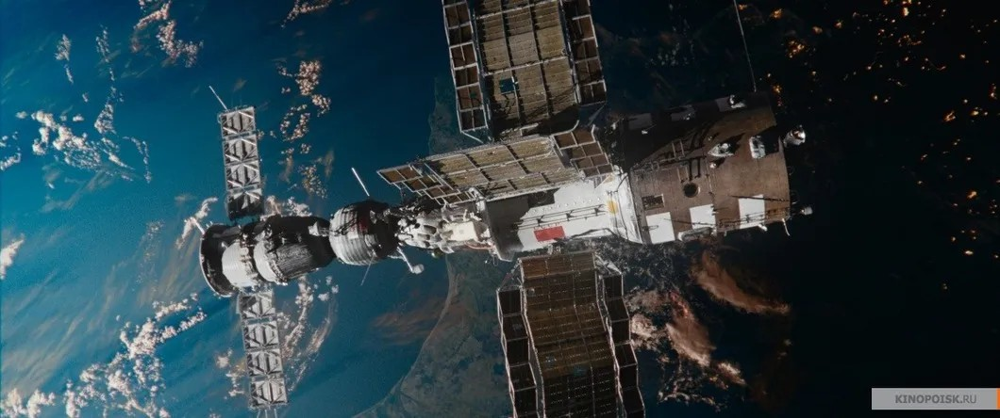

# Кувалда, подвиг и сигарета. «Салют-7» на экранах: правда или ложь, реальность или вымысел — разбиралась Лариса Малюкова

- **URL:** https://novayagazeta.ru/articles/2017/10/07/74107-kuvalda-podvig-i-sigareta
- **Дата:** 2017-10-07
- **Автор:** Лариса Малюкова

## Кувалда, подвиг и сигарета

## «Салют-7» на экранах: правда или ложь, реальность или вымысел — разбиралась Лариса Малюкова

Фильм Клима Шипенко — смесь голливудской и советской героики (в духе «Аполлона-13» про лунную миссию или «Укрощения огня», где впервые была приоткрыта завеса над суперсекретной ракетно-космической сферой).

Фильм про подвиг двух выдающихся космонавтов, про историю спасения станции «Салют-7». Владимир Джанибеков и Виктор Савиных в 1985 году полетели к мертвой оледеневшей станции, смогли пристыковаться и оживить ее. В истории освоения космоса эта страница — одна из наиболее ярких и фантастичных.

Сценарий «Салюта-7» Наташа Меркулова и Алексей Чупов написали после встречи с журналистом Самолетовым, рассказавшим им о захватывающем дух экстремальном путешествии в космос. Среди источников вдохновения книга Виктора Савиных «Записки с мертвой станции».

Кадр из фильма…Космическая гонка набирает обороты, если не оживить впавшую в кому станцию, она может свалиться на землю (обломки гигантской американской станции «Скайлэб» долетели аж до Австралии) или ее могут забрать американцы и узнать наши секретные секреты. Поэтому отправление космонавтов ведется в спешке. Вы скажете, в космической сфере так не бывает? А вам ответят: у нас бывает все и во всех сферах. Даже в секретных и сверхточных: и авралы, и пятилетка в четыре года, и «как бы доложить наверх… чтобы не влетело». На околоземную орбиту отправляется космический корабль «Союз Т-13» с экипажем из опытных космонавтов — командиром корабля Владимиром Федоровым (прототип — Владимир Джанибеков) и бортинженером Виктором Алехиным (прототип — Виктор Савиных). Двадцатитонная станция не просто мертва (замерзла система подачи кислорода, горячей воды и т.д.) — превратилась в дом изо льда.

На протяжении всего действия космонавтам приходится не только решать нерешаемые проблемы, рисковать жизнью, спасать и поддерживать друг друга, но и делать сложный нравственный выбор. Космонавты экзамен выдержат. На земле не все…

Кадр из фильмаСреди напряженных моментов — сама стыковка без лазерного дальномера, вручную, со станцией, которая вертится с огромной скоростью. Космонавт Валерий Рюмин, который был на связи с экипажем в ЦУПе, потом скажет: «Стыковка «Союза Т-13» со станцией «Салют-7» — то же самое, что стыковаться с булыжником».А еще охлаждение температуры на станции до минусовой температуры (замерзшая вода разорвала трубы), возвращение к жизни покрытой инеем станции и даже пожар.

Что в этом кино хорошо. Изображение.

Оно сконструировано с помощью сложных устройств замечательным оператором Сергеем Астаховым, отрисовано компьютерщиками так точно, что многие профессионалы уверены, что часть съемок проводилась в космосе.

Из смысловых вещей понравилась оппозиция «земля—небо». Если внизу в ЦУПе альтернативе «репутация» или «человеческая жизнь» выбирают честь державы (а нехорошие военные еще и требуют взорвать станцию вместе с людьми, чтобы не досталась врагу), то в небе побеждает человечность. И вот еще. Когда техника отказывает — космос осваивается вручную: руками откручивают, замерзшими пальцами связывают, стыкуют, собирают тряпками воду после того, как станция оттаяла. (Это рассказывал и Савиных, как «голыми руками скручивали электрические провода и обматывали их изолентой. И так 16 раз».)

И если есть превосходство нашей космонавтики перед американской, оно прежде всего в его в человеческом факторе. Как и в реальности, пилоты «Союза» с несчастливым номером «13» в экстремальной ситуации едва ли не все делают вопреки приказу ЦУПа. Им сверху виднее. На Земле, уже после возвращения Савиных, месяц решали: наградить космонавтов или наказать — те не всегда действовали по инструкции и в соответствии с командами ЦУПа.

Кадр из фильмаПоддержите нашу работу!

1000 500 300 Нажимая кнопку «Стать соучастником», я принимаю условия и подтверждаю свое гражданство РФ

Если у вас есть вопросы, пишите [email protected] или звоните:+7 (929) 612-03-68

На реальной станции пожара не было, не было еще целого ряда чисто киношных подробностей. Например, кувалды, которой бьют по кожуху датчика системы ориентации, мешающего «оживить» электропитание станции (вроде бы космонавты возражали против этого эпизода, но кинематографисты сделали по-своему). В реальности застряла лебедка — не снималась с фиксатора, нельзя было вернуть к жизни солнечную батарею (об этом писал Виктор Савиных в своих «Записках с мертвой станции»). Не было, конечно, и сигареты, да и глупо закуривать сразу после пожара. Кстати, о пожаре, так возмутившем некоторых критиков. На «Салюте» его не было, а вот на «Союзе ТМ-25» он случился в 1997-м из-за бракованной кислородной шашки. Да и американцы, как рассказал в одном из интервью Савиных, подлетали к нашей станции.

Но «Салют-7» — не документальное кино, не реконструкция, а зрелищный блокбастер, вольная фантазия на тему реального космического полета. Авторы жертвовали точностью ради экшена. Поэтому фамилии космонавтов изменены. Джанибеков стал Федоровым (его роль исполнил Владимир Вдовиченков), Савиных — Алехиным (Павел Деревянко). Именно зрелищность, образность, эмоциональность — сильные стороны фильма, за которые прощаешь не только неточности (и в «Аполлоне-13» астронавты обнаружили море ошибок, а Джим Ловелл заявил, что его персонаж «неправдоподобен»), но и слабость «женской линии» (не прописана она была и в фильме-конкуренте «Времени первых»), некоторые эпизоды, в которых режиссер не сумел быть убедительным.

«В нашем повествовании исторические факты переплетены с элементами вымысла», — говорит один из авторов Алексей Чупов. Безусловно, не было кувалды в космосе, но зато сразу возникают смысловые рифмы с эпохальными фильмами «Коммунист» или «Как закалялась сталь». Не случайно для героя Вдовиченкова в его шкале ценностей: жена и дочка, футбол и… строительство коммунизма. «Я знаю, ты настоящий коммунист», — говорят летчику-испытателю Астахову в «Чистом небе». Это кино про забытое сегодня превосходство «должен» над «могу». В фильме Шипенко первое, что увидели космонавты, когда отогрели станцию, — фото Гагарина, проявившееся под инеем. Вымысел ли, правда — не знаю. Но красиво.

Думаю, если бы фильм назвали просто «Салют», и претензий бы не было, и название для космического триллера отличное.

А про спорные моменты мы решили спросить у авторов и самих космонавтов — самых строгих экспертов.

Виктор Савиных

космонавт, дважды герой СССР, участник космической экспедиции «Салют-7»

— Фильм хороший, зрелищный, народу точно понравится. Особенно хочу отметить замечательное качество изображения космоса, невесомости: компьютерная грамматика воссоздает размах и красоту неба. Что касается неточностей, ну да, они есть. Вопрос, сбивать ли станцию, вообще не стоял. Вместо кувалды у нас была просто монтировка, ею мы пытались ликвидировать совсем другую неисправность. Мы не курили, не горели. Хотя в космосе действительно было несколько пожаров. Но по существу вранья нет. Поэтому в целом фильм пришелся по душе. А если бы я не работал в космосе, понравился бы еще больше. Трудно смотреть на придуманное на экране, когда знаешь, как все было на самом деле. К примеру, моя жена не рожала во время нашего полета, моей дочке было уже 16. Вот на днях покажут документальный фильм «Салют-7. История одного подвига», в котором мы с Джанибековым, Рюминым и Соловьевым расскажем, как все было на самом деле». Это будет история от первого лица.

Юрий Батурин

космонавт

— Наверное, спрашивать мое мнение о художественном кино про космонавтов неправильно, потому что человек, занятый в любой сфере профессионально, смотрит и видит иначе, чем обычный зритель. Нас цепляют неточности, мешают восприятию.

### Продюсеры Юлия Мишкинене и Бакур Бакурадзе:

— Перед съемками была большая подготовительная работа. Мы общались со специалистами из Центра подготовки космонавтов, РКК «Энергия», Музея космонавтики, корпорации «Роскосмос». Консультанты из НПП «Звезда» помогали в производстве скафандров. Режиссер, оператор, специалисты по спецэффектам ездили на Байконур, присутствовали при запуске космического корабля. Благодаря этому художники-постановщики точно воссоздали детали и Центра подготовки полетов, и космического корабля, и станции. Виктор Благов, главный специалист РКК «Энергия», бывший руководителем полетов, смотрел фильм на стадии монтажа и попросил показать сцены из ЦУПа еще раз — не мог поверить, что все это воспроизведено в декорациях. На подготовительном этапе много встреч было и с участниками событий — с Владимиром Джанибековым и Виктором Савиных. Их рассказы, книги, архив фотографий очень помогли в прописывании деталей экспедиции по спасению космической станции.

Про детали.

Мы старались основываться на реальных фактах, происходивших в космосе. Станция «Салют-7» действительно потеряла контроль, было оледенение, потом затопление, с которым справлялись подручными средствами: пошли вход даже личные вещи космонавтов. Из-за обилия воды возникла угроза короткого замыкания и пожара.

Часть деталей взяли из других космических экспедиций. Так, пожар возник на орбитальной станции «Мир» в 1997 году. На орбитальной станции «Салют-4» жила муха Нюрка, которую космонавты очень берегли. Была и специальная исследовательская программа с запуском в космос 54 тараканов.

Надо сказать, что в советское время да и сейчас все, что касается космоса, было под грифом секретности, можно было найти только официальную информацию. Поэтому не будем ни на кого конкретно ссылаться, но из личных разговоров знаем, что проносили космонавты с собой в космос и водку, и сигареты. Правда, курить там довольно сложно.

Теперь про кувалду. Много у нас было разговоров и споров с Виктором Петровичем по поводу кувалды. Но раз кувалда на космическом корабле есть, значит, ею пользуются. В самой же экспедиции действительно застряла солнечная батарея. Пришлось выйти в открытый космос, натянуть трос. Потом применить физическую силу… Это была борьба человека с железом в экстремальных условиях. Мы заменили трос на кувалду, так как зрительно это понятнее. Все-таки мы снимали не документальное кино, а жанровое. Это космическая катастрофа. И конечно, здесь возможен символизм, метафоричность и некоторые преувеличения для визуальной выразительности. Мне кажется, наши друзья-космонавты больше нас понимают, что жизнь, в том числе космическая, гораздо шире наших самых смелых представлений о ней.

Поддержите нашу работу!

1000 500 300 Нажимая кнопку «Стать соучастником», я принимаю условия и подтверждаю свое гражданство РФ

Если у вас есть вопросы, пишите [email protected] или звоните:+7 (929) 612-03-68
