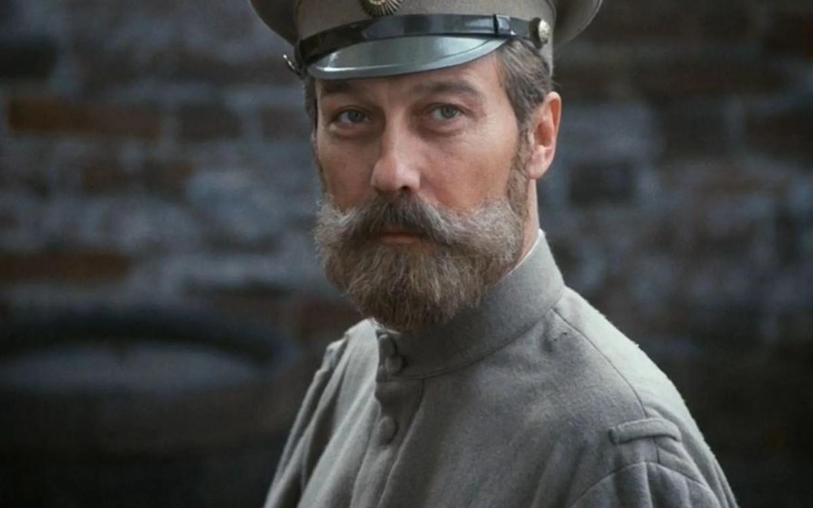

# Игра в престолы. Как менялся образ Николая Второго на экране: от первых киносъемок до фильма Алексея Учителя

- **URL:** https://novayagazeta.ru/articles/2017/10/10/74144-ot-houm-video-do-vodevilya-kak-menyalsya-obraz-imperatora-nikolaya-ii-rossiyskom-potom-v-sovetskom-a-zatem-snova-v-rosiyskom-kinematografe
- **Дата:** 2017-10-10
- **Автор:** Лариса Малюкова

## Игра в престолы

## Как менялся образ Николая Второго на экране: от первых киносъемок до фильма Алексея Учителя

Кадр из фильма «Цареубийца». Реж. К. ШахназаровНиколай Второй начал царствовать практически в одно время с началом эры кино. И отношения с «театром теней» складывались противоречивые. Первая документальная съемка придворных церемоний состоялась во время коронации в мае 1896-го, по существу, это первый документальный фильм Российской империи.

В одной из резолюций самодержец назвал кинематограф балаганным промыслом. Но интерес к модной технической новинке только возрастал. И в дневниках Николая появляются записи о домашних просмотрах «движущихся фотографий». Смотрели кино в Большом дворце, в Аничковом, в Царском селе (смотрят его и в фильме «Матильда»).

Шкатулка для истлевших красот

«Матильда» Алексея Учителя, не ходить на показы которой призывали некоторые депутаты, с 26 октября выйдет на экраны

Позже в Александровском дворце для показов оборудовали специальную комнату. Важно другое. Благодаря кинематографу Николай Второй — последний самодержец — стал по-настоящему публичной фигурой.

И чтобы увидеть царя, не обязательно было через всю страну ехать на коронацию. При высочайшем дворе была налажена регулярная съемка царских выходов, торжественных приемов, разнообразных событий придворной жизни. А в 1898-м появились и первые циркуляры, регламентирующие «порядок демонстрирования посредством синематографа картин, воспроизводящих различные моменты событий с изображением высочайших особ». Власть оценила возможность «себя показать» и вступала с синема в договорные отношения. Государство открыло необозримые возможности воздействия на массы посредством нового массового искусства. Историки отмечают, что после событий 1905–1907 гг. в «царской кинохронике» наряду с официозом увеличилось число «эпизодов» частной жизни царской семьи. Экран был призван придать человечности живым портретам высокородных персон.

В полной мере вкус к пропаганде кинематограф обнаружил после 1917-го. Среди разоблачающих монархический режим опусов: «Темные силы — Григорий Распутин и его сподвижники», «Люди греха и крови», «Таинственное убийство в Петрограде 16 декабря». Ближайшее окружение венценосца и он сам представали на экране сборищем авантюристов и пакостников. Лучшей среди разоблачительных лент оказался фильм «Царь Николай II, самодержец всероссийский». В нем царское правительство развенчивалось с помощью микста игрового сюжета и документальных кадров. На рекламном плакате — шаржированный портрет Николая Кровавого в короне, за его спиной — виселицы с повешенными. Там же был апробирован любимый прием кино как идеологического оружия — «идейный монтаж»: великолепные пышности царского двора соединялись с нищетой и безнадегой существования бедняков. Тот же метод использован в фильме Александра Ивановского «Дворец и крепость» (пуанты балерины «склеивались» с ногами революционера в кандалах.

Прошлое — тлетворное, купающееся в дворцовом золоте и роскоши, — следовало отринуть вместе с его символом царем. Про Кровавое воскресенье Вячеслав Висковский в 1926-м снял фильм «Девятое января». В смертоубийственной давке обвинялась охранка и поп Гапон. В этой «реконструкции» участвовали около 3000 человек. Кинематограф действительно набирал производственную мощь. В том же году был снят и эпохальный «Броненосец «Потемкин». Экран развивал киноязык и во всеоружии доказывал закономерность хода истории, справедливость революции и свержения царя.

В этой ответственной идеологической работе были свои прорывы. К примеру, монтажные фильмы Эсфири Шуб, создававшей киноистории на основе хроники, а не игровом материале. Ее «Падение династии Романовых» пользовалось особым успехом у зрителей. Николай в окружении «военной клики», его придворные танцуют мазурку, а народ в это время убивается на полях и каменоломнях. Шуб добралась и до материалов дворцового архива Николая II.

«Падение династии Романовых»Пропагандистскую мощь кино новая власть оценила быстро.

«Хорошая картина, — говорил Сталин, вынашивающий идею создания сети кинематографических заводов, — стоит нескольких дивизий».

Начиная с тридцатых, царская семья постепенно почти исчезает с советских экранов. Место светлейших правителей занимают новые властители уже советской империи — Ленин и Сталин.

После XX съезда российский император вернулся на экран. В историко-революционном «Прологе» (1956) Ефима Дзигана Николая II сыграл вахтанговец Владимир Колчин, актер яркого комедийного дарования. Получилось не смешно. Идеолог Михаил Суслов заключил: «Промахнулись. Не вышло комедии. Надо было Алейникова».

Леонид Луков с тем же Колчиным снял эпопею «Две жизни» (1961).

В одном из эпизодов Николай обращается к солдатам, пришедшим заключить его под домашний арест. Он сдержан, даже спокоен: «Вы хотели меня видеть?» — и протягивает руку для приветствия.

«У вас грязные руки, гражданин Романов, — бросают ему в лицо солдаты. — Они испачканы народной кровью!»

«Две жизни»И простой солдат в исполнении Николая Рыбникова рассуждает: «Я представлял себе царя огромным зверем, а это маленький человечек, похожий на нашего сапожника».

Царь на смысловом уровне низвергался с пьедестала.

Поддержите нашу работу!

1000 500 300 Нажимая кнопку «Стать соучастником», я принимаю условия и подтверждаю свое гражданство РФ

Если у вас есть вопросы, пишите [email protected] или звоните:+7 (929) 612-03-68

Новую волну интереса к персоне последнего самодержца пробудило празднование 50-летнего юбилея Октябрьской революции. В 1966-м Анатолий Эфрос начал снимать фильм по пьесе Толстого «Заговор императрицы». Иван Пырьев велел передать постановку молодому режиссеру Элему Климову, который назвал пьесу картонной. Фарсовый сценарий о фольклорном старце Распутине, написанный Нусиновым и Лунгиным, раскритиковали и закрыли. Среди претензий: «нельзя бить царизм по альковной линии». Новый сценарий не без мытарств и оттяжек все же запустили. А потом 10 лет фильм ждал возможности встретиться с отечественным зрителем. Кино о немощности власти и бесовских силах, вьющихся вокруг сильных мира сего, о непреодолимой пропасти между властью и обществом. Анатолий Ромашин играл не просто безликого, заурядного человека, не справившегося с миссией, которую возложила на его некрепкие плечи история. Его Николай, травмированный страданиями сына, вызывал глубокое сочувствие. Безответственность, слабоволие монарха он показывал не в лоб, а исподволь. Например, в сцене, где он стреляет по воронам.

Идея Климова крайне интересна, он задается вопросом: почему тишайшего из царей прозвали Кровавым? И сам себе отвечает: кровавый — не тот, кто жесток по природе, «но тот, кто в бессилии принять собственное решение» может поддаться и даже спровоцировать неуправляемый натиск извне.

«Агония» была про вырождение династии — составной части вырождения всего строя. Многие прочитали в картине предчувствие грядущей гибели системы. Через несколько лет распался Советский Союз.

«Агония»На пике разлома в 1991-м Карен Шахназаров снял мистический триллер «Цареубийца», в котором Олег Янковский сыграл страдающего раздвоением личности врача-психиатра Смирнова (он же император Николай II).

Отождествить себя с пациентом и погрузиться в старую трагедию, ощутить собственную вину должен был не только Смирнов, но и зритель. Фильм назвали «Покаянием 90-х». Янковский создавал сложный психологический портрет Николая II как человека, ощущающего приближение катастрофы, пытающегося понять: за что его убьют? При этом он обогатил роль трагикомическими красками.

«Цареубийца»В это время в прессе стали появляться многочисленные публикации о последних Романовых, телевидение показывало документальные фильмы и передачи, издавались книги, публиковались ранее неизвестные документы.

В игровом кино использовать образ последнего монарха стало обычным делом.

Только Андрей Ростоцкий сыграл Николая II в фильмах и сериалах семь раз (!).

Исследователи назовут это время «романовским бумом». И когда в Екатеринбурге в конце 90-х обнаружили царские останки, споры о роли Николая в истории России в обществе разгорелись с новой силой.

В 2000-м Николая II и членов его семьи, убитых в подвале Ипатьевского дома, причислили к лику святых. В том же году вышел фильм Глеба Панфилова «Романовы. Венценосная семья» — версия последних полутора лет жизни и гибели последнего царя династии и его семьи. Характер Николая II (Александр Галибин) сравнивали с образом царя Ромашина в «Агонии». Но Панфилов в своем семейном портрете в интерьере времени — само время как социально-политический контекст — растворил, растушевал.

«Романовы. Венценосная семья»В центре портрет Николая — отца, пытающегося отъединиться от враждебного внешнего мира, спрятаться в маленькое пространство купе, гостиной, в ласковое окружение семьи. Авторы сосредотачивают наше внимание на детях, жене, на «ближнем круге». Венценосность, святость императора для режиссера очевидны. Он Богом избранный. Но ради семьи готов пожертвовать всем, в том числе страной. Панфилов превращает царя всея Руси в чеховского персонажа, кроткого человека со страдающим сердцем. Проблема несовместимости интеллигентности и власти — одна из ключевых в этом кино. Светлые образы невинно убиенных утверждали право жертв на канонизацию. Не случайно в одной из версий финала возникала бумажная икона в руках человека из толпы — на ней «святое венценосное семейство».

Сегодня, в эпоху утверждения идеологии сильной государственной воли, востребованы иные правители, те, что огнем и мечом утверждали незыблемость государевой воли. К Николаю Второму в обществе (а значит, и в кинематографе) сложилось двойственное отношение. Возможно, поэтому верх берет голливудская тенденция «водевилизации» истории (как в «Анастасии»).

«Анастасия»Для Алексея Учителя Николай II — «личность недооцененная»: «Его воспринимают как человека, развалившего государство, а я считаю, что он вывел Россию на небывалый уровень во всем: и в экономике, и во многих других областях. Он поднял страну и с триумфом выигрывал Первую мировую войну». Он не видит крамолы в слабоволии верховного правителя, не рассматривает спорность ряда его решений. Он снимает свой триллер о человеке, которого не понимают. Который должен пожертвовать любовью ради государевых нужд. Поэтому история отношений с Матильдой Кшесинской для него переломный момент в судьбе последнего самодержца.

«Трансляция заведомого ложного и крайне пейоративно-денигративного образа Николая II...»

С экспертизой фильма «Матильда» что-то не так. Публикуем выдержки из нее с комментарями режиссера

Взаимоотношения кинематографа с последним императором похожи на нерасторжимые связи сверстников: дружба-вражда, обиды, обвинения, бойкоты, влюбленности. Образ Николая II, оценка его исторической роли — индикатор общества, его умонастроений. В сегодняшнем общественном сознании, как свидетельствуют эксперты, «сосуществуют оба — совершенно противоположных — образа последнего императора, которые возникли и нещадно эксплуатировались в XX веке: идеальный, святой, жертвенный и зловещий в своем безволии и неосмотрительности. Жанровый кинематограф склонен использовать романтический флер, в том числе и в царственных кинопортретах.

Глупо упрекать его в этом.

Поддержите нашу работу!

1000 500 300 Нажимая кнопку «Стать соучастником», я принимаю условия и подтверждаю свое гражданство РФ

Если у вас есть вопросы, пишите [email protected] или звоните:+7 (929) 612-03-68
