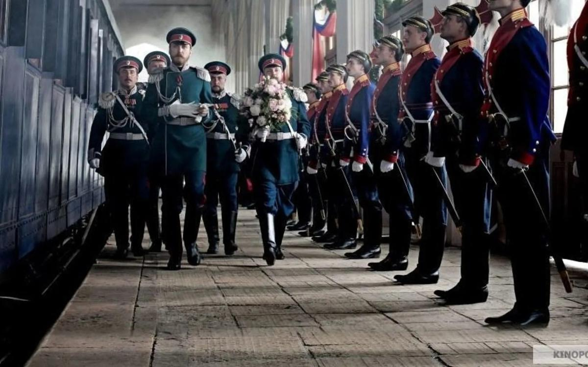

# Шкатулка для истлевших красот. «Матильда» Алексея Учителя, не ходить на показы которой призывали некоторые депутаты, с 26 октября выйдет на экраны

- **URL:** https://novayagazeta.ru/articles/2017/10/10/74145-igra-v-prestoly
- **Дата:** 2017-10-10
- **Автор:** Лариса Малюкова

## Шкатулка для истлевших красот

## «Матильда» Алексея Учителя, не ходить на показы которой призывали некоторые депутаты, с 26 октября выйдет на экраны

Кадр из фильма «Матильда»Когда я слышу слово «Матильда», хочется схватиться за пистолет. Кажется, уже и самим создателям негаданно прогремевшего на всю страну фильма мечтается, чтобы сей гром остался в прошлом. Усиленные меры безопасности (помощь МЧС и Росгвардии) сопровождают предварительные показы. Во Владивостоке билеты раскупили за считанные часы. На «Кино Экспо» в Питере директоры кинотеатров фильм поддержали, по поводу шумихи недоумевали: «Столько дыма. А огонь-то где?» Возможно, и в кино многие пойдут, чтобы в темном зале «подержать свечку»: есть крамола в фильме, нет?Но дело в том, что для заразительной паранойи причина не нужна. Это диагноз. «Матильда», как точно сформулировала в беседе с «Новой» Ингеборга Дапкунайте (здесь она в роли вдовствующей императрицы), — кино развлекательное, коммерческое. Нисколько не претендующее разоблачать монархию или унижать светлейших «высочеств» и «величеств».

«Разговоры об объективности и оскорблении исторической правды — смешны»

Ингеборга Дапкунайте — о Балабанове и личном выборе. А депутаты Госдумы — о «Матильде», закрытый показ которой посетили

«Мариинский театр представляет» — первый титр фильма Алексея Учителя. В Мариинском планируют провести премьеру. Потому что назначенное символом кощунства кино на самом деле галантный костюмированный спектакль, в котором действие приподнято на котурны, главные герои вроде бы носят знаковые для российской истории имена, но им отведены роли в условной игре, театрализованных любовных треугольниках мелодрамы. Ощущение иллюзорности происходящего усиливают второстепенные персонажи. К примеру, загадочный доктор Фишер, в психиатрической клинике которого ваннами и парами лечат дам, а подводными процедурами — мучают нелояльных режиму. Или поручик Воронцов — Даниле Козловскому пришлось играть влюбчивого романтика-злодея. Или Директор императорских театров Иван Карлович — Евгений Миронов с завитыми волосами, в розовой бабочке и пенсне напомнит Маркиза Па-де-труа из «Золушки». Картинка волшебная: в закатном небе брызги фонтанов Петродворца, грандиозное убранство Успенского собора Кремля, игра воды рядом с «плавучим дворцом», гигантский воздушный шар с гербом Российской империи, пышные декорации Мариинского театра с царской ложей, дворцовое убранство, фейерверки, балет… Волшебство изображения сооружено руками художников и оператора Юрия Клименко — творца до мозга костей, умеющего превращать будничное в возвышенно, салонный изыск — в ошеломляющее великолепие.

Среди кинематографических параллелей я бы назвала не «Николая и Александру», признанный в СССР «целлулоидной клюквой», все-таки у этой кинолегенды претензия на биографичность, скорее, с чистой мелодрамой «Королева Кристина» с Гретой Гарбо — о шведской королеве, переодевшейся в мужскую одежду и влюбившейся в испанского посла.

«Королева Кристина»Или с «Частной жизнью Генриха VIII» Александра Корда о любвеобильном английском короле. Или с лентой «Поэт и царь» Гардина и Червякова. Главные действующие лица того фильма: Николай I, Натали, Дантес, Пушкин и петергофские фонтаны. Картина стала одним из главных хитов 1920-х. Прокатчики после него просили деятелей кино делать еще как можно больше картин с фонтанами.

И в советские времена костюмные и исторические мелодрамы пользовались небывалым успехом. Хитами был не только сериал про Анжелику, но и «Майерлинг» с Омаром Шарифом и Катрин Денев, «Есения», «Дикие сердцем».

…Ни одного некрасивого кадра. Любовные сцены — во флере целомудрия с тюлем и воздушными шарфами (о, эти шарфы — бич российского кино).

Поддержите нашу работу!

1000 500 300 Нажимая кнопку «Стать соучастником», я принимаю условия и подтверждаю свое гражданство РФ

Если у вас есть вопросы, пишите [email protected] или звоните:+7 (929) 612-03-68

Даже Ходынка в «Матильде» показана едва ли не единственным планом как начинающееся волнение нарядной толпы. На общем плане увидим «народ» и из вагона государева поезда: из разных краев страны люди целыми семьями идут с котомками пешком вдоль путей на коронацию: повидать самого государя, полакомиться гостинцем «с царского стола». Гостинец обернется кровью. Но и здесь будет все благообразно. Государь опечалится, искренне пожалеет народ, подавленный на Ходынском поле, велит щедро вознаградить серебром пострадавших, погибших хоронить в отдельных гробах.

Игра в престолы

Как менялся образ Николая Второго на экране: от первых киносъемок до фильма Алексея Учителя

Кто там ругал Ларса Айдингера? Его меланхоличный Николай — застенчив, сентиментален, влюбчив, от скуки стреляет по воронам. И подобно древним героям мучается выбором между любовью и долгом, человеческим — и имперским. Он похож на Янковского из «Цареубийцы», он хорош собой, как и все главные герои фильма.

Гордая Матильда — богиня балета в чем-то белом, с цветами, или с крыльями, или в золотом. Никакая не интриганка, большого сердца и жертвенности героиня. К тому же пророчица: предсказывает будущему императору горькую судьбу. Замечательно благороден богатырь Александр III в исполнении Гармаша. В одной из самых запоминающихся и выразительных сцен фильма он — как и свидетельствовали очевидцы — держал на плечах крышу вагона во время крушения поезда, пока семья и другие пострадавшие выбирались из-под обломков.

Ему отдана ключевая фраза о том, что

Россию «надо держать вот так», — и умирающий царь сжимает кулак, показывая цесаревичу, как именно надо обращаться со страной.

Среди выразительных сцен — беззвучный танец Кшесинской — язык пластики в фильме вообще убедительней слов. Сценарий и диалоги («Как же она прекрасна!», «Хороша чертовка!») не сильная сторона этого кино. Но отличный монтаж отчасти компенсирует эти изъяны.

Режиссер не стал обозначать грядущее крушение века и мира через мучительный выбор цесаревича между любовью и престолонаследованием. Есть лишь один пунктирный лейтмотив, тема крови: от укола булавкой — до Ходынки. Но сам конфликт герметичен, обрамлен жанром костюмной мелодрамы. В любовной многоугольнике, отдаленно напоминающем «Лебединое озеро», партия принца — у престолонаследника, Матильда — королева лебедей Одетта. Черный лебедь — вовсе не будущая императрица Аликс (она тоже страдающая, защищающая свою любовь жертва обстоятельств), а Одиллия — коварная конкурентка Кшесинской Пьерина Леньяни. Есть несколько непрописанных персонажей, вроде поручика Воронцова или Великого князя Андрея, беззаветно и безответно влюбленного в блистательную приму балета, но выступающего в основном в роли шофера. Но все эти придирки были бы справедливы в отношении кинематографа большого стиля, подлинной драмы, отсвет которой повлиял бы на историю страны.

«Матильда» же — шкатулка для хранения утекших, почти истлевших красот, прощание со старым миром, с веком, в котором воздушные сильфиды, флоры, авроры, эсмеральды, вопреки приближающимся грозам, немилосердной реальности, устанавливали законы волшебства, преображения и неземного блаженства.

### P.S.

Поддержите нашу работу!

1000 500 300 Нажимая кнопку «Стать соучастником», я принимаю условия и подтверждаю свое гражданство РФ

Если у вас есть вопросы, пишите [email protected] или звоните:+7 (929) 612-03-68
