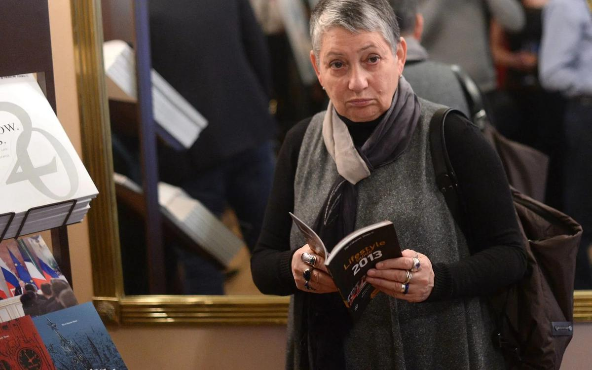

# «У каждого человека есть своя личная граница страха и граница стыда». Обращение к прокурору и судье по делу историка Юрия Дмитриева

- **URL:** https://novayagazeta.ru/articles/2017/10/24/74311-u-kazhdogo-cheloveka-est-svoya-lichnaya-granitsa-straha-i-granitsa-styda
- **Дата:** 2017-10-24
- **Автор:** Лариса Малюкова

## «У каждого человека есть своя личная граница страха и граница стыда»

## Обращение к прокурору и судье по делу историка Юрия Дмитриева

Фото: Сергей Карпов / ТАССЛюдмила Улицкая, посетившая очередное заседание по делу Юрия Дмитриева, выступила с обращением к людям, от честности которых сейчас зависит его судьба.открытое письмопрокурору города Петрозаводска Елене Алексеевне Аскеровой и заместителю председателя Петрозаводского городского суда Марине Анатольевне Носовой от Улицкой Людмилы Евгеньевны, лауреата премии «Большая книга» (Россия, 2016 г.) Литературного приза Медичи (Франция, 1996 г.) «Русского Букера» (Россия, 2001 г.) Премии «Книга года» (Россия, 2004 г.) Кавалера ордена Искусства и литературы (Франция, 2004 г.) Премии Пенне (Италия, 2006 г.) Национального общественного приза Олимпия (Россия, 2007 г.) Премии Грициане Кавур (Италия, 2001 г.) Номинанта на международную премию «Букер» (Англия, 2009 г.) Премии Симоны де Бовуар (Франция, 2011 г.) Австрийской государственной премии по европейской литературе (Австрия, 2014 г.) Кавалера ордена Почетного легиона (Франция, 2014 г.) Книги переведены более чем на 40 языковГоспожа прокурор! Госпожа судья! Мне никогда прежде не случалось греметь наградами, но в данном случае я предъявляю свой послужной список именно в надежде быть услышанной.

Дело Юрия Дмитриева взволновало все российское общество, и не только тех людей, которые хорошо знают о его почти тридцатилетней героической и благородной деятельности. Предполагаю, что вы, профессионалы, не можете не осознавать, до какой степени бездоказательны и вымышлены все выдвинутые против него обвинения. Именно по этой причине у всех здравомыслящих людей создается впечатление, что вы являетесь заложниками трудной ситуации, при которой вы вынуждены действовать как послушные служащие, а не как независимые граждане, способные говорить правду о человеке, не совершавшем ни одно из преступлений, ему предъявленных. Я могу догадываться о том, насколько велика ваша зависимость от вышестоящего начальства и как вам, должно быть, сложно в том положении, когда от вас требуют совершить поступок, за которым могут последовать неприятные последствия с точки зрения вашей дальнейшей карьеры.

«Возможно, он лучший из нас»

Наталия Солженицына, Лев Шлосберг и Юрий Норштейн — в защиту историка Дмитриева (видео)

Поддержите нашу работу!

1000 500 300 Нажимая кнопку «Стать соучастником», я принимаю условия и подтверждаю свое гражданство РФ

Если у вас есть вопросы, пишите [email protected] или звоните:+7 (929) 612-03-68

Последние годы я часто размышляю о том, что у каждого человека есть своя личная граница страха, граница боли и граница стыда, и очень важно, когда человек эти границы осознает.

Тем не менее я обращаюсь к вам в надежде быть услышанной: от вашей личной честности, от вашего чувства собственного достоинства зависит не только судьба Юрия Алексеевича Дмитриева, одного из самых достойных и героических людей нашего времени в нашей стране, но и ваша репутация. Вынесенное вами решение может быть той черной меткой, которую вы никогда не сможете смыть, — ваши дети будут стыдиться вас и страдать, точно так же, как сегодня страдают потомки тех палачей, которые расстреливали невинных людей в тридцатые годы.

Юрий Дмитриев в суде. Фото: Сергей Маркелов / 7x7«Прислушайтесь к тому, что я вам сейчас пытаюсь сказать. Мы все проживаем одну-единственную жизнь».

Я не знаю, есть ли в ваших душах какая-то тень веры в Высший суд, в загробное существование, в идею некой высшей справедливости, которая осуществляется за пределами нашей земной жизни, не говоря уже о том, с каким грузом на совести вы будете жить все те годы, которые вам предстоит еще прожить.

От всей души я желаю быть услышанной — и не только ради Юрия Алексеевича Дмитриева, но ради всех нас, неравнодушных к судьбе России.

Экспертов нашли на Апраксином рынке

Почему суд и прокуратура доверили исследование фотографий из дела Дмитриева не государственной, а частной фирме без офиса и штата

Поддержите нашу работу!

1000 500 300 Нажимая кнопку «Стать соучастником», я принимаю условия и подтверждаю свое гражданство РФ

Если у вас есть вопросы, пишите [email protected] или звоните:+7 (929) 612-03-68
