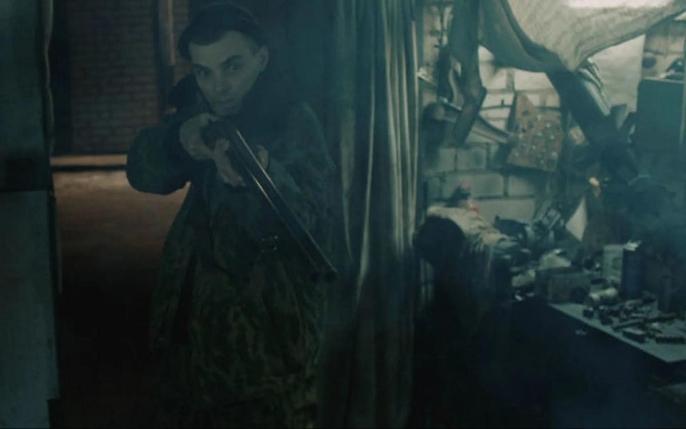

# Коси коса. В рамках программы «Новое молодое кино» в кинотеатрах КАРО покажут гротескную трагикомедию «Нашла коса на камень» Ани Крайс

- **URL:** https://novayagazeta.ru/articles/2017/10/24/74315-kosi-kosa
- **Дата:** 2017-10-24
- **Автор:** Лариса Малюкова

## Коси коса

## В рамках программы «Новое молодое кино» в кинотеатрах КАРО покажут гротескную трагикомедию «Нашла коса на камень» Ани Крайс

Фото: КиноПоиск«Новое молодое кино» — так называется программа, которую запускает одна из крупнейших киносетей КАРО и Афиша Daily. 26 октября в кинотеатрах КАРО можно будет увидеть гротескную трагикомедию «Нашла коса на камень» Ани Крайс. Жюри кинофестиваля дебютного кино «Движение» единогласно отдало главный приз смотра картине, свидетельствующей о приходе яркого, самостоятельно мыслящего автора.Аня Крайс — выпускница Кельнской академии медиаискусства, уроженка Ангарска. Ее фильм — мрачный, если не сказать черный, бурлеск. Беспросветность российской провинции сгущена до гротеска. Даже смерть напяливает на себя трэшевый колпак.

Фото: КиноПоискРубеж эпох и веков. Жили-были три брата. Средний погиб в Чечне. Младший — эпилептик. Старший Антон возвращается с войны домой в Иваново. Но и жизнь российской периферии мало похожа на мир. Наглые политизированные бомжи, менты-беспредельщики, докучливые свидетельницы Иеговы, чеченцы, отвязавшиеся от дома, танцующие победный танец во дворе утлых пятиэтажек. Что скажешь: 90-е на своем диком изломе. Антон силится пробить стену тотальной тоски — пережить смерть брата. Успокоить его невесту и мать. Надо как-то прирасти к незнакомому уродливому миру.

Фабрики закрыты, все вокруг странно приспосабливаются к ползущей неведомо куда стране. Кто-то спивается. Кто-то бродит по квартирам, агитируя вступать в религиозную секту. А кто-то отжимает имущество ушедших на войну. В ментовке смотрят по телеку: бывший президент представляет преемника, мол, выбирал из двадцати претендентов, выбрал самого лучшего. Вы увидите. Телевизор вообще здесь один из участников действия. Он показывает ужасы Хасавюрта. Пугает врагами. Он сам — война, на которой бывшие братья и сестры уже стали непримиримыми врагами.

Фото: КиноПоискПоддержите нашу работу!

1000 500 300 Нажимая кнопку «Стать соучастником», я принимаю условия и подтверждаю свое гражданство РФ

Если у вас есть вопросы, пишите [email protected] или звоните:+7 (929) 612-03-68

Чеченцы, убежавшие в Иваново от войны, истошно кричат: «Дай нам свободу, Россия! У себя порядок наводите, у нас свои традиции». Свидетельницы Иеговы терпеливо идут от двери к двери многонаселенного дома с одним вопросом: «Вы знаете, кто сейчас правит миром?» «Пошли отсюда, сучки американские!» — вопит в ответ им истинно православная, цитирующая Новый Завет на каждом шагу. Но нет упоения: ни в бою, ни в мире, ни в вере. Зато есть дедова винтовка, закрученная в пестрый ситец. Раз заявлено в начале фильма ружье — непременно выстрелит… в самый неожиданный момент… из рук самого неожиданного персонажа по мишеням бессмысленной жизни.

Это кино про людей, потерявших опору, зависших над черной щелью между веками. Они все вроде еще пытаются выползти на поверхность. Может, в Германию? В секту? Брекеты поставить? На дискотеку? Или водка «Русская душа» с дефицитной колбаской? А что? Под Анну Герман «Мы долгое эхо друг друга»… рядом с новопреставленным, геройски павшим, наевшись голубцов, от случайного выстрела.

Фильм — прощание с постсоветской эпохой. Визуальные цитаты из Балабанова, смысловые — из «Братьев Карамазовых». Жанр на крылатых качелях мотается от бытовой комедии до криминального гиньоля и кэмпа. Жирно выписанные роли (иной раз режиссеру следовало бы актеров немного усмирить). Работа неровная, но неожиданная, живая. Собственно, такого безбашенного, рискованного, пусть и не безошибочного кино и ждут от дебютантов.

Среди фильмов проекта «Новое молодое кино»: драма «Как Витька Чеснок вез Леху Штыря в дом инвалидов» Александра Ханта (награды фестивалей в Карловых Варах, в Выборге); лента ученицы Александра Сокурова Киры Коваленко о жителях горного абхазского села «Софичка» (приз кинофестиваля «Дух огня»); один из лучших фильмов новой якутской волны «Костер на ветру» Дмитрия Давыдова (три приза кинофестиваля «Движение»); кинокомикс про похождения философов «Тетраграмматон» Клима Козинского, молодого режиссера из «Электротеатра Станиславский», и кинотавровский дебют этого года — «Близкие» Ксении Зуевой — о семье, раздираемой конфликтами.

Поддержите нашу работу!

1000 500 300 Нажимая кнопку «Стать соучастником», я принимаю условия и подтверждаю свое гражданство РФ

Если у вас есть вопросы, пишите [email protected] или звоните:+7 (929) 612-03-68
