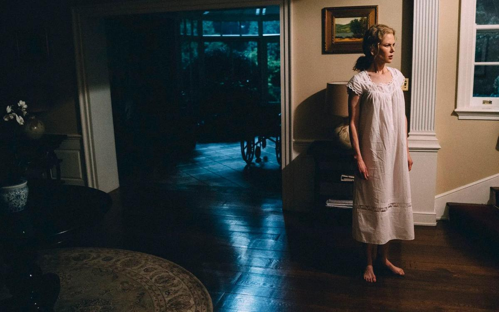

# В России идет фестиваль «Новое британское кино»: это отлично! Что смотреть? Обзор Ларисы Малюковой

- **URL:** https://novayagazeta.ru/articles/2017/11/03/74453-v-rossii-idet-festival-novoe-britanskoe-kino-eto-otlichno-chto-smotret
- **Дата:** 2017-11-03
- **Автор:** Лариса Малюкова

## В России идет фестиваль «Новое британское кино»: это отлично! Что смотреть?

## Обзор Ларисы Малюковой

Кадр «Убийство священного оленя»Смотр родился во второй половине 90-х на подъеме британского кинематографа. В сравнении с радикальными программными коллажами первых фестивалей (шокирующими полиэкранными экспериментами Майкла Фиггиса, неполиткорректными криминальными экшенами Гая Риччи, переворачивающими представление о пуританской Англии мелодрамами Найджела Коула) нынешний фестиваль более похож на солидный вернисаж. В этой «экспозиции» в разных программах представлен спектр современного английского кино, которое традиционно храбро и честно вступает в диалог с действительностью и с историей. Наследники движения «Свободное кино» продолжают дело Линдсея Андерсона, утверждавшего: «Совершенство не является целью. Отношение означает стиль. Стиль означает отношение».«Город тусклых огней»«У всех своя история, свои тайны», — утверждает герой «Города тусклых огней», частный сыщик. Среди его клиентов «мелкие труженики сомнительных профессий», пытающихся угадать свою счастливую карту в мутной игре мультикультурного сообщества. Среди его новых дел — поиск представительницы древнейшей профессии с явно неанглийским именем Наташа.

В «Божьей земле» проблема эмигрантов неожиданно выведена на чувственный уровень. Дебют Фрэнсиса Ли получил множество наград, в том числе независимого фестиваля в Сандэнсе».

Но акцент программы нынешнего года — на зрительских картинах: мелодрамах, комедиях, исторических драмах и детективах.

Известный режиссер Салли Поттер в стильной сатирической комедии «Вечеринка»рассказывает о дружеском приеме в честь вступления героини Кристин Скотт Томас в должность министра здравоохранения. На праздник приглашены исключительно близкие люди, каждый из которых представляет собой яркий типаж. Рядом с Томас знаменитые британские артисты — похудевший в два раза Тимоти Сполл, Киллиан Мерфи, американка Патришия Кларксон. Оператор Алексей Родионов уже работал с Поттер над фильмом «Орландо», для новой черно-белой картины он сочинил выразительное визуальное решение в стиле классического русского кинематографа. Непритязательный дивертисмент с ядреной порцией политического гротеска.

Один из любопытнейших фильмов программы — «Убийство священного оленя» — фантазия на темы трагедий Еврипида. Лидер «новой греческой волны» Йоргос Лантимос (его «Клык» побеждал в «Особом взгляде», а «Лобстер» удостоен приза жюри) снял сюрреалистическую антиутопию на основе почти бытового сюжета. Герой фильма — хирург, решившийся заменить отца неблагополучному подростку. Семейная драма превращается в историю мести и мистики. Кино Лантимоса — фантасмагорическая метафора бесперспективности и бесчеловечности режима узаконенных правил «общества порядка». Общества, где одиночек (не вступивших в брак) в буквальном смысле превращают в животных. Впрочем, у вас остается выбор: стать лобстером или попугаем. В главных ролях Колин Фарелл и Николь Кидман.

Устроители недели принципиально не делят британское кино на мейнстрим и артхаус. Зато среди их предпочтений — любимых жанр широкой аудитории— кинобиография. Байопики — один из краеугольных камней современного британского кино.

XVIII фестиваль — рекордсмен по числу биографических лент: программа похожа на прогулку в компании очень важных персон британской истории и культуры.

Поддержите нашу работу!

1000 500 300 Нажимая кнопку «Стать соучастником», я принимаю условия и подтверждаю свое гражданство РФ

Если у вас есть вопросы, пишите [email protected] или звоните:+7 (929) 612-03-68

Фильм-выставка «David Bowie Is» — возможность совершить путешествие по выставке в Музее Виктории и Альберта в Лондоне и погрузиться в мир легенды рок-музыки. Услышать рассказы О Дэвиде Боуи экспертов, а также дизайнера Кансая Ямамото, вокалист группы Pulp Джарвиса Кокера и других.

Герой фильма «Англия принадлежит мне» — Стивен Патрик Моррисcи, поэт, музыкант, будущий голос легендарных английских меланхоликов The Smiths, на чьих песнях выросло не одной поколение музыкантов. Правда, действие фильма разворачивается в Манчестере рубежа 70— 80-х. Юный Моррисси еще фанат панк-группы «Нью-Йоркская куколка». Еще не состоялась знаковая встреча с гитаристом Джонни Марра. Стивен ищет работу, меняет девушек, переживает разрыв родителей, пытается нащупать собственный путь. Но, кажется, он уже занят поиском своего ритма, своего звука.

«Последний портрет» Стенли Туччи. История о том, как легендарный швейцарский скульптор и художник Альерто Джакометти (Джеффри Раш) попытался нарисовать портрет своего друга, американского арт-критика Джеймса Лорда (Арми Хаммер). Сеансы, уверяет его Джакометти, займет всего несколько дней, однако «процесс» затягивается на годы. А за время, пока создается работа мастера, на экране возникает целая история трогательной и необычайной дружбы и отношений, полных красоты, разочарования, глубины и настоящего творческого хаоса. В основе картины книга «Портрет Джакометти», написанная Джеймсом Лордом в 1965 году. Мировая премьера фильма прошла в рамках Берлинале-2017.

Зрители узнают много любопытного о деятельности шотландского психиатра и мыслителя второй половины XX века Рональда Дэвида Лэйнга («Бесит быть нормальным»). Смогут погрузиться в идиллическую атмосферу Сассекса 1920-х и понаблюдать за тем, как Алан Александр Милн придумывал Винни-Пуха («Прощай, Кристофер Робин»).

«Виктория и Абдул»Фильм Открытия — лента «Виктория и Абдул» Стивена Фрирза (автора незабываемой «Королевы»). Кино для наслаждения. Насколько правдивы события, изложенные кинематографистами — судить зрителю. Во всяком случае, первый титр гласит: «Основано на реальных событиях… по большей части». Авторы фильма опираются на дневники индуса-мусульманина Мухаммада Абдула. Волей судьбы писаря из бомбейской тюрьмы занесло в королевский дворец, где он самым неожиданным образом сдружился с британской королевой Викторией и стал ее секретарем. Плохо говорящий по-английски, но непосредственный и неглупый, индус-простолюдин помогает престарелой королеве по-новому взглянуть на мир, но одновременно наживает врагов во дворце, полном зависти, ханжества и предрассудков. Эти особые отношения с королевой обсуждали не только в Англии, но и во всем мире. Жизнь дворца была почти парализована.

В экранизации романа Шрабани Басу скромный красавчик Абдул становится не только единственным другом королевы. Но и ее Мунши (духовным учителем), под чьим началом она стала изучать арабскую вязь и поссорилась со всей своей свитой, включая родного сына, будущего короля. И все же центр, магнит фильма — не сама неожиданная история, но королева.

Величайшая актриса современности Джуди Денч демонстрирует такую палитру красок, сокрушительных и тончайших изменений в характере любимицы империи, долгожительницы на троне — поистине королевская игра.

Вначале это дряхлая, тусклая, храпящая старуха, наряженная, словно нелепая кукла, вызывает неприязнь. Она неряшливо заталкивает еду в рот на великосветских раутах, и ее придворным за ней не угнаться. Но когда Мунши пробуждает в увядшей королеве интерес к жизни, Викторию не узнать. Их старухи она превращается в женщину. В ней просыпается интерес к жизни.

На представление фильм в Москву приехал актер Саймон Кэллоу («Амадей», «Кольцо дракона»), сыгравший в фильме Фрирза композитора Пуччини. Хотелось расспросить его, как в Англии относятся к киновоплощениям царственных особ — у нас это довольно проблематично. И вот что он сказал: «В Британии довольно часто снимают кино про наших королев и их придворных. Вспомните «Королеву» того же Фрирза. Или фильм «Король говорит» Хупера. Или популярный и один из самых дорогих в мире серил «Корона», а ведь, между прочим, среди его персонажей — наша королева Елизавета. Но, надо сказать, что Елизавета — любимица Британии. И даже левые кинематографисты, снимая о ней кино, хотя и позволяют себе юмор, иронию, но все это сквозь призму искреннего доброго отношения. В том, как выглядит королева Виктория в нашем фильме, полная заслуга Джуди Денч. В актерском мастерстве ей нет равных. Мы знаем друг друга уже тридцать лет. Она талантлива, честна, остроумна, легка в общении. Много снимается. И в нашем фильме она занята едва ли не во всех сценах. В свои 82 года она вставала в пять утра, ее гримировали, одевали. В восемь начиналась съемка. До позднего вечера. И ни разу она не дала почувствовать, что устала, недовольна. И если уж мы говорим о царственных особах, то в своей профессии Джуди Денч — настоящая королева.

Фестиваль в этом году пройдет в 20 городах России. Программа фестиваля — на сайте.

Поддержите нашу работу!

1000 500 300 Нажимая кнопку «Стать соучастником», я принимаю условия и подтверждаю свое гражданство РФ

Если у вас есть вопросы, пишите [email protected] или звоните:+7 (929) 612-03-68
