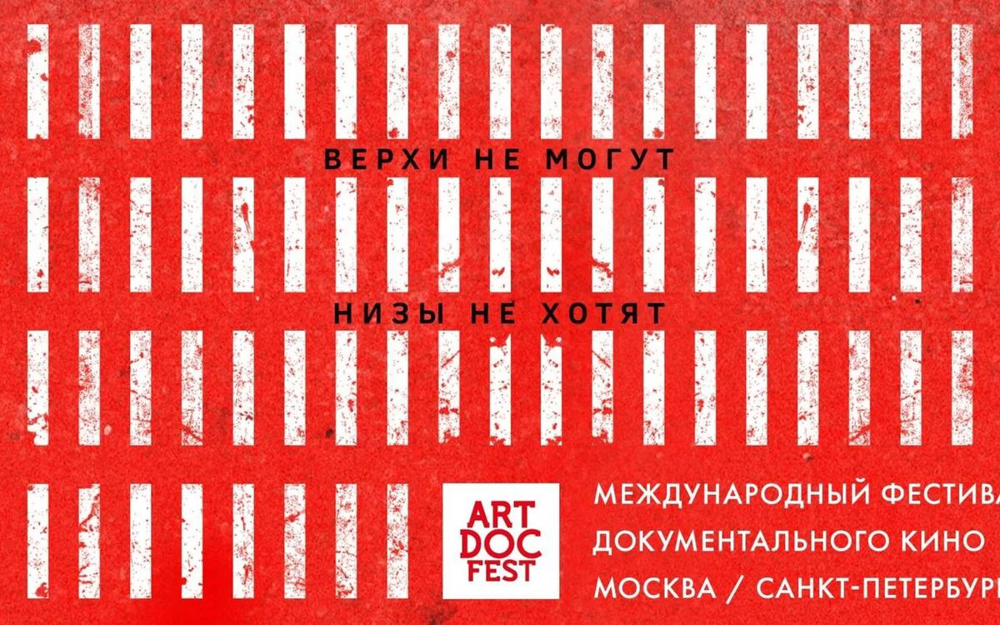

# Между сенсацией и гуманизмом. 6 декабря стартует «Артдокфест»: что смотреть? Рекомендации Ларисы Малюковой

- **URL:** https://novayagazeta.ru/articles/2017/11/20/74613-mezhdu-sensatsiey-i-gumanizmom
- **Дата:** 2017-11-20
- **Автор:** Лариса Малюкова

## Между сенсацией и гуманизмом

## 6 декабря стартует «Артдокфест»: что смотреть? Рекомендации Ларисы Малюковой

«Артдокфест-2017»Защищать человека и его право на жизнь и свободу — девиз и нынешнего фестиваля. Но выбор фильма определяет не злободневность, не тема, а качество кино, неординарность авторского взгляда на нашу жизнь. Открытие «Процесс» Аскольда Курова Мы показывали у себя в «Новой» работу нашего товарища Аскольда Курова об Олеге Сенцове. Теперь и у вас есть возможность ее посмотреть.

По признанию режиссера, идея провести параллель с «Процессом» Кафки возникла от бессилия. Когда отчетливо понимаешь: помочь, повлиять, доказать ничего невозможно. Следователи с самого начала заявили Сенцову, что за упорство в отрицании вины его посадят на 20 лет. Среди героев фильма две сестры Олега. Одна его поддерживает, другая заняла позицию противников — ее муж и сын служат в ФСБ. Фильм как способ рассмотреть процесс, в который втянута страна, и понять, что же произошло на самом деле. Как возможность напомнить: режиссер Олег Сенцов, в защиту которого выступают виднейшие кинематографисты мира: от Вайды, Вендерса до Джонни Деппа и Александра Сокурова, — продолжает отбывать срок на Крайнем Севере

Вы снова скажете: ничего нельзя сделать. Режиссер Аскольд Куров разделяет эту точку зрения с одной поправкой: нельзя и молчать.

Никогда неизвестно, какая капля станет последней. Кульминация фильма — звонок Олега из колонии домой, его разговор с мамой и детьми. Это кино о сочувствии, ради сочувствия.

## Конкурс

- «Сокровище Тарзана» Александру Соломона

Место действия — нынешняя Абхазия. Герои — макаки и прочие обезьяны. В тесных клетках. И люди, обезьян изучающие. Операции, «забор» крови — не для слабонервных: режут, вшивают, лапу тянут через прутья к игле. Все ради науки. Все ради людей. Афоня не хочет яблоко, у Афони жена и ребенок, ему не до людей. Он уже не подопытный, не «материал». Крошка Митя, обожаемый детьми, сидит на загривке у своей воспитательницы: фотографируемся за деньги! В музее — фото макак-космонавтов.

Авторов интересует человеческое начало в животном и животное — в человеке, которому до гомо сапиенса, как до луны.

Когда человек подходит к клетке, обезьяна всегда настороже в ожидании коварства. О, она знает человека.

Обезьяна помогла нам победить желтую лихорадку и туберкулез. Сегодня помогает бороться со старостью. Чем мы — мечтающие о вечной молодости — ответили? Здесь вспоминают фантастические эксперименты первой половины ХХ века по скрещиванию обезьяны и человека. Впрочем, неутомимый профессор Иванов всех скрещивал. Пока сам не погиб в ГУЛАГе.

Вокруг разрушенные войной здания, облезшая красота некогда прекрасного Сухуми. Старожилы вспоминают, как пережили войну, таскали обезьянам воду, молились на дождь.

Никто из животных не убивает просто так, только человек и обезьяна. Обезьяна, как и человек, привыкает к клетке. Мы правда очень близки.

- «Король Лир» Дениса Клеблеева

Здесь будет похоронен Лир. Он и могилку сам себе устроил.

У него сложилось в жизни так, как у шекспировского Лира. Есть дочери Регана с Гонерильей. С Корделией, увы, не повезло. Зато есть сын, который написал отцу, что тот напрасно прожил жизнь.

Напрасно? Тридцать лет он думает о роли. Ее играет в жизни, как на сцене. Он одержим. Не троном, не деньгами. Идеей постичь, приникнуть. Пробиться к глубине немыслимой любви отца к Корделии, которая постичь отцову философию не в силах.

Он должен был вас сединой растрогать, Хотя бы даже не был вам отцом.

Денис Клеблеев этот прекрасный фильм снял про отца, сгоревшего в огне влеченья к роли, ставшей больше, чем жизнь.

- «Наследство» Катерины Свешниковой

Взгляд на современную Украину через европейскую оптику.

Студентка из Франции в плацкартном вагоне едет на украинскую родину. Точнее, едет искать свою родину. Чувствует уже в вагоне, где поют про казака, гуляющего на воле: родина где-то близко. Для иностранцев русские, украинцы, белорусы, молдаване — русские. Иностранцы спрашивают ее про загадочную русскую душу, но прежде чем объяснить, она сама должна понять, она — кто?

И вот дом, мама, папа, старые фото на стенах — это и есть родина? Но и здесь смешались все национальности. Бывшие советские люди, когда-то жившие в бараках и на голом энтузиазме строившие недостижимое будущее, остались в прошлом. Кто-то спился. Кто-то умер. Кто-то сидит. Кто-то выживает в охранниках. Соседка угощает варениками. Говорит о трудном бытии. Их родина СССР куда-то эмигрировала. Сейчас они сами в поисках родины. Но не может же быть, чтобы Катя приехала напрасно. И вот бабушкино наследство — старая библиотека, собиравшаяся по крохам. Может быть, это и есть ее родина?

- «Стена» Дмитрия Боголюбова

Поддержите нашу работу!

1000 500 300 Нажимая кнопку «Стать соучастником», я принимаю условия и подтверждаю свое гражданство РФ

Если у вас есть вопросы, пишите [email protected] или звоните:+7 (929) 612-03-68

21 декабря ежегодно к праху «отца народов» на Красной площади движется бесконечная очередь. Верующие в Сталина идут по булыжнику чтить память своего «божества» со знаменами, портретами. Каракулевые папахи, норковые фуражки, вязаные шапки. Гвоздики, венки. Много молодежи. Зюганов в пояс кланяется. Люди фотографируются, крестятся на бюст гранитный, нерушимый.

«Раз-два-три. Вставай, товарищ Сталин, посмотри, что творится на просторах нашей родины!»

И только лишь какая-то девушка пытается прокричать о преступлениях злодея, толпа щерится: «Кто не уважает Сталина, должен умереть». Очередь тянется, люди приветствуют своего кровавого святого. И пока будут махать — он не подохнет.

- «Экстремисты» Алексея Тихомирова

Экстремисты — приверженцы крайних взглядов, провокаторы беспорядков, террористы и прочие беспредельщики. Так нас учат словари.

На экране скромнейшие, доброжелательные люди уважаемого возраста. Вынуждены мерзнуть зимой в палатках среди леса. Все потому, что у них есть совесть. Не могут они позволить бессовестным, алчным временщикам уничтожить едва ли не последний в Карелии бор. Одному из стариков — защитников леса приснилось, будто Путин подписал указ, «что жить нам разрешают». Ну и то слава богу.

«Не уйдем», — говорят старики. Кругом и так понарывали карьеров, и так уж песок брать негде. Реликтовые, краснокнижные деревья называют гиблой древесиной и вывозят. Лишайники уничтожают. Забирают у земли последнее. И ведь понимают, что могут прийти, все отнять, вывести под руки силой. Но старики хитрые, приготовили комплекты цепей, как что — прикуют себя к деревьям. Рубите вместе с нами. У Нины Ивановны курточка никакая, холодно. Что ей Гекуба? Но она повторяет: «Ну вырубят, а люди как будут дальше жить?» Комиссии приходят и уходят. Прокуратура пишет. Путин снится. И только Нину Ивановну волнует тот самый главный вопрос.

- «Андрей Звягинцев. Режиссер» Дмитрия Рудакова

«Опять этот мальчик… опять бежит… опять незашнурованный ботинок… да что ж это такое». Кино это любопытно посмотреть тем, кто называет фильмы Звягинцева — просчитанными, ориентированными исключительно на западные фестивали. Это не фильм про фильм, как снимали «Нелюбовь». Это киноэссе про режиссера. Про его муку, про недостижимость задуманного. Сплошные огрехи, помарки — смотреть невыносимо, свет уходит, давайте еще раз… Съемки как рутинная битва с обстоятельствами. Пусть увидят твердящие про рациональность и расчет «Нелюбви», пусть присутствуют при этом травматичном поиске.

Он шепчет: «Начали» — и впивается глазами в монитор, и требует всего лишь одного — не фальшивить.

- «ВоваНина» Натальи Назаровой

Про художников снимать трудно. Вроде все формы испробованы. Но Наташа Назарова все время изобретает новые. Потому что она сама — художник. Ее картина — прерывистое, пунктирное повествование об одном союзе: Владимире Сальникове и Нине Котел. «35 лет прожили вместе, — говорит Нина, — думала, лет в 80 разобьемся над Гималаями вместе. Но однажды они пошли смотреть кино про его любимую Индию, а ночью он умер». Назарова снимает окно их квартиры как пейзаж. Эти московские крыши они писали сотни раз.

Про Сальникова рассказывают художники, искусствоведы. Но это не главное. Как показать поэтику, укорененную в складе личности. Приблизиться? И тогда сам Сальников в своей видеоинсталляции продолжает диалог с Ниной, друзьями, с нами. Пристрастный. Тонкочувствующий. Ироничный. Парадоксальный. Исповедуется. И троллит. Будто отвечает нам не из прошлого, из будущего. Портрет художника Наталья Назарова собирает, как мозаику, из обрывков фраз, фрагментов картин — в том числе ста ошеломительных женских портретов — и инсталлирует его в экран. Кино о любви художника к художнику.

- «Куба и кинооператор»

Большой стиль документального кино от Netflix. Фильм из программы Венецианского кинофестиваля.

Это история многолетнего романа между ветераном неигрового кино, двукратным оскаровским номинантом Джоном Альпертом и Кубой. Между Джоном Альпертом и команданте Фиделем Кастро. Начиная с 1972-го оператор приезжал на коммунистический остров, общался, разговаривал, пытался понять простых крестьян, горожан и последнего рыцаря (тирана?) революции.

Вначале в его руках допотопные монохромные видеокамеры. Похороны Кастро и всенародное горе он уже снимает на цифру. Камера наблюдает, как страна меняется и остается неизменной.

Кастро всегда выделял доброжелательного американского киношника, общался с ним, похлопывал по плечу. И камера отвечает ему взаимностью: мы видим харизматика с неизменной сигарой, живыми глазами, готового разъяриться, когда американские чиновники не спешат выпускать его из самолета на американской земле. Автор не разоблачает и не восхваляет. Ищет способ погружения в страну на чувственном уровне. Сокращение расстояния между камерой и самым бедным фермером, и самым знаменитым политиком. В выборе между политической сенсацией и человечностью, Альперт, не задумываясь, выбирает гуманизм.

- «КВН: свидетельство о рождении» Инны Ткаченко

Когда-то у нас было живое телевидение. И самым непредсказуемым, раскрепощенным, карнавальным был КВН. Немалочисленные очевидцы вспоминают, как «в три головы» в 61-м пришла идея его создания. Вначале он назывался ВВВ (вечер веселых вопросов). Телевизионщик Муратов, реаниматолог Аксельрод, инженер Яковлев — отцы-основатели, три источника вдохновения самого знаменитого проекта ТВ. Но не было бы «Молодежки» — молодежной редакции, — кто бы им позволил. А не было бы оттепели, кто бы разрешил «Молодежку». В железном потоке времени возникла щель, в щель проник смех, и железо размякло. В моде были умные, не богатые, не льстивые. Юмор был иным. Они знали «зачем», «про что», «над чем» смеются. Они удивляли остротой ума. Не развлекали — размышляли. Вместе со зрителем. А телевизор — вы только подумайте — превращался в искателя смыслов, в архитектора будущего.

Они надеялись, что телевидение станет чудом, но оно стало чудовищем.

## ***

Мы рассказали всего о нескольких фильмах из огромной артдоковской программы. И возможно, ваши предпочтения окажутся иными.

К примеру, обидно будет пропустить один из лучших фильмов программы «Полет пули» Беаты Бубенец, снятый в ДНР — одним кадром, без монтажных склеек. И поэтому у зрителя возникает ощущение присутствия и головокружение от происходящих на наших глазах событий. Или увидеть авторскую версию фильма Андрея Осипова «Восточный фронт». Это германская хроника 30—50-х, показывающая, как общество незаметно и бездарно вползает в ад Восточного фронта. Но Министерство культуры увидело в этой хронике аллюзии с современным российским обществом. И велело снабдить фильм «объяснительным» текстом, сочиненным Военно-историческим обществом. И только зрители «Артдокфеста» увидят оригинальный вариант мощной картины. История Сталинградской битвы осмыслена и по-своему «увидена» одним из соавторов Александра Сокурова — Алексеем Янковским. В его фильме «Сталинград. Мы еще живы или нет?» помимо общеизвестных кадров и фактов о поворотном событии Второй мировой есть неизвестные кинодокументы из Бундесархива.

Продолжается онлайн-голосование в конкурсе «Артдоксеть».

Здесь библиотека фильмов, выложенных в открытый доступ в интернете. Победителя программы определяют участники группы Artdocfest в Facebook. В нее можно свободно вступить и принять участие в голосовании.

Поддержите нашу работу!

1000 500 300 Нажимая кнопку «Стать соучастником», я принимаю условия и подтверждаю свое гражданство РФ

Если у вас есть вопросы, пишите [email protected] или звоните:+7 (929) 612-03-68
