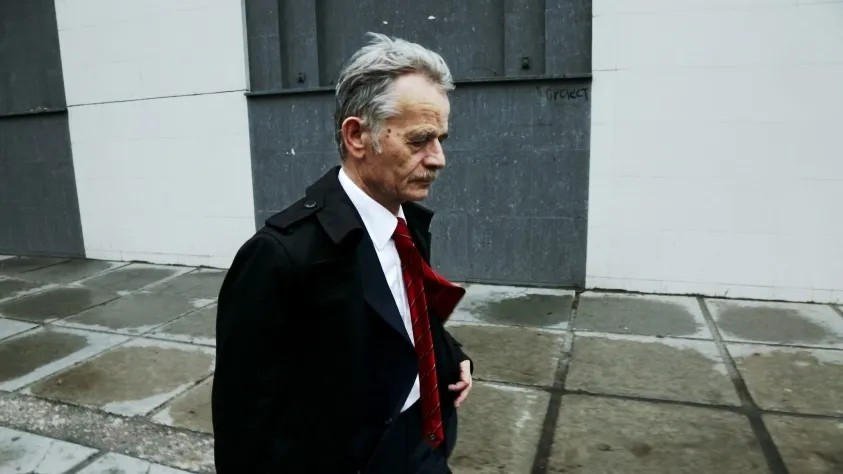

# Маховик «наездов». Лучший российский фестиваль документального кино «Артдокфест» снова в эпицентре скандалов

- **URL:** https://novayagazeta.ru/articles/2017/12/09/74858-mahovik-naezdov
- **Дата:** 2017-12-09
- **Автор:** Лариса Малюкова

## Маховик «наездов»

## Лучший российский фестиваль документального кино «Артдокфест» снова в эпицентре скандалов

- Случай первый. Фильм «КВН. Свидетельство о рождении» Инны Ткаченко

Александр Масляков-младший выступил против документального фильма об истории легендарной игры «КВН. Свидетельство о рождении». За несколько дней до премьеры он предъявил претензии прокатной компании «КАРО» (на ее территории и проходит «Артдокфест»). Он утверждает, что правообладатель торгового знака «КВН» — компания «АМИК», генеральным директором которой он является, согласия на использование бренда в названии постороннего фильма не давал. Фильм рассказывает о тех, кто в 1961 году придумал легендарную телевизионную программу. Поэтому Масляков-отец в фильме появляется эпизодически. Хотя с него картина начинается: создатели КВН Яковлев, Муратов и Аксельрод в качестве «родительского комитета» присутствуют на игре, Александр Васильевич их представляет. Все равно обидно.

Руководство «Артдокфеста», чтобы показать фильм, приняло решение убрать слово «КВН» из названия, оставить картину в показе.

- Случай второй. «Война ради Мира» Евгения Титаренко

Вице-спикер Петр Толстой требует от Минкульта и Генпрокуратуры запретить «показ в сети российских кинотеатров фильма, в котором Россия представлена страной-агрессором, а не гарантом выполнения Минских соглашений, а бойцы АТО на юго-востоке Украины — героями и благодетелями». Он бы хотел, «чтобы с нарушителями законодательства РФ разобрались компетентные органы».

- Случай третий. «Мустафа» Эрнеса Сарыхалилова

Кадр из фильма «Мустафа»Это биографическая история лидера крымских татар Мустафа Джемилева, ставшего символом мирного сопротивления, отстаивающего право на возвращение в Крым из ссылки во времена СССР. О 15 годах, проведенных Джемилевым в советских лагерях в качестве политзаключенного. О возбуждении против него нового уголовного дела за три дня до окончания срока заключения. Об объявленной в знак протеста голодовке — самой длинной в истории. Голодовку он остановил только по настоятельной просьбе Андрея Сахарова.

Используя телефонное право, некто потребовал от «КАРО» не допустить демонстрации фильма «Мустафа». Картина была снята с показа за два часа до премьеры. Зрителям, купившим билеты, были возвращены деньги либо предложены варианты замены на другие картины.

Между сенсацией и гуманизмом

6 декабря стартует «Артдокфест»: что смотреть? Рекомендации Ларисы Малюковой

Надо уточнить следующее: не «Артдокфест» радикализируется. Фестиваль показывает художественное неигровое кино, связанное с современностью, не закрывающее глаза на больные проблемы, показывая нашу действительность с разных точек зрения. Речь идет не об экстремизме «отдельных» картин. Пожалуй, сегодня это единственный фестиваль, существующий вне рамок цензуры во всех ее разнообразных формах.

Это и есть главный камень преткновения и претензий к смотру. Само общество семимильными шагами движется в сторону осмотрительного запрета всего того, о чем не говорят по телевизору.

комменарий

Виталий Манский

президент фестиваля«Артдокфест»

Поддержите нашу работу!

1000 500 300 Нажимая кнопку «Стать соучастником», я принимаю условия и подтверждаю свое гражданство РФ

Если у вас есть вопросы, пишите [email protected] или звоните:+7 (929) 612-03-68

### «Артдокфест сознательно демонизируют»

— Мы испытываем серьезнейше давление на фестиваль все годы с появлением Владимира Мединского в кресле министра культуры. Сначала он наивно полагал, что достаточно перекрыть госфинасирование, и мы исчезнем с лица земли. Когда они убедились, что это не работает, стали инспирировать судебные процессы, показывая сообществу и прокатным компаниям, что предоставлять площадки для «Артдокфеста» не только не выгодно для их бизнеса, но и даже небезопасно. Мы прошли через 21 (!) заседание в Хамовническом суде.

В этом году они пошли по пути создания общественного мнения и небывалого давления на фестиваль со стороны различных групп, органов, силовых структур и СМИ. Диапазон давления обширнейший: от депутатских запросов до проверок прокураторы и визитов «волонтеров» НОД (околокстремистская организация, созданная против «оранжевой угрозы»).

Еще до начала смотра мы начали получать анонимные звонки с угрозами личной безопасности. Прежде всего, это было связано с показом «неправильных» украинских фильмов.

Считаю, что образ «Артдокфеста» сознательно демонизируется, кинофестиваль пытаются представить предателем национальных интересов, агентом западных спецслужб, продвигающим нечто противозаконное. Любопытно, что занимаются этим люди, которые — заявляю это обоснованно — не видели тех фильмов, которые они обвиняют. И даже Первый канал, устроивший разбирательство «персонального дела» «Артдокфеста», оперировал информацией об одной картине из интернета, не имеющей никакого отношения к программе нашего фестиваля.

Маховик «наездов» раскручивается со страшной силой. К примеру, кампания против показа «Войны ради Мира» началась с многочисленных анонимных угроз, адресованных непосредственно мне в самых разнообразных вариациях. Потом стали появляться публикации в СМИ. Телекомпания «Царьград» и прочие ресурсы не стеснялись угроз в адрес организаторов фестиваля.

Выражалась и особенная «забота» о зрителе, например, говорили о возможных инцидентах, которые ненароком могут происходить во время показов «нехороших фильмов».

Ведущий Пятого федерального канала произнес в студии такое: «Если конечно, кинотеатр хочет, чтобы после сеанса зритель порезал ему кресла, пусть покажет этот украинский фильм».

А через 24 часа после этого эфира меня перед входом на радиостанцию «Эхо Москвы» встречает сотрудник прокураторы и вручает два документа под подпись. В первом меня просят предоставить копию фильма «Война против Мира». Во втором уведомляют: если я покажу это кино, меня могут привлечь за разжигание экстремизма. Получается, что, с одной стороны, выдают документальное подтверждение, что фильма не видели, с другой, что этот фильм нарушает российское законодательство. В любом случае действия прокуратуры прозрачны.

Прежде чем показывать кино, мы организовали его независимую экспертизу, показывали юристам. Мы не только не нарушаем закон, но считаем этот показ важным для развития общественных отношений в России.

Но еще через 24 часа начались действия не только неправомерные, но и по-человечески подлые. Давление со стороны высоких кабинетов непосредственно на владельцев сети «КАРО» с угрозами в отношении их основной деятельности.

«КАРО» принял решение отменить показ без нашего участия, чем вторгся в работу фестиваля, хотя по договорам мы просто арендуем здание, и всю ответственность, в том числе юридическую, принимаем на себя.

Обстановка действительно нездоровая. Впервые мы получили от целого ряда режиссеров и продюсеров — наших украинских друзей — отказы от участия в фестивале на территории России. При этом они готовы приехать на «Артдокфест» в Ригу. Не смогли мы показать картину «Сомнение Олега»: герои фильма — русские, воюющие на Украине, начали угрожать авторам фильма. Мы не могли рисковать.

Хочу подчеркнуть, что, несмотря на свое отношение к тем или иным нормам Российского законодательства, фестиваль Артокфест полностью соблюдает все требования закона. И показ фильма «Война ради Мира» мы сами перенесли в чешское посольство из соображения комфорта зрителей и прокатчиков. Но этот фильм не нарушает российского законодательства. Кадры, которые, по мнению юристов, могли бы быть спорно прочитанными, мы купировали. Три микроскопических кадра.

Что касается показа «Мустафы», мы пытаемся выяснить юридические обоснования для отмены сеанса, в соответствии с этим будем принимать меры.

### P.S.

Поддержите нашу работу!

1000 500 300 Нажимая кнопку «Стать соучастником», я принимаю условия и подтверждаю свое гражданство РФ

Если у вас есть вопросы, пишите [email protected] или звоните:+7 (929) 612-03-68
