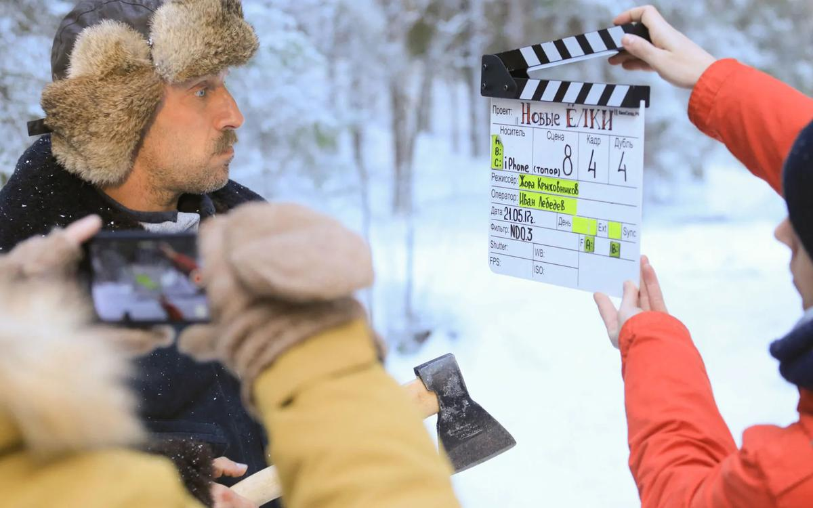

# Богатыри на Уральском Майдане. Чем отличилось наше кино в уходящем году?

- **URL:** https://novayagazeta.ru/articles/2017/12/22/75001-bogatyri-na-uralskom-maydane
- **Дата:** 2017-12-22
- **Автор:** Лариса Малюкова

## Богатыри на Уральском Майдане

## Чем отличилось наше кино в уходящем году?

Дмитрий Нагиев на съемках собрания новелл «Елки». Фото: ТАСС2017-й запомнится потеплением в отношениях между зрителем и российским кинематографом. Уж как бились в последние годы киночиновники «за повышение доли наших фильмов в кинорепертуаре! Какие только протекционистские меры не предлагали. И продолжают, кстати, в том же духе. Среди очередных новаций Владимира Мединского: ограничение сеансов одного фильма, трехпроцентный налог с билетов… Но насильно мил не будешь. Какие бы значимые темы ни поднимали слабые фильмы, они будут вариться в собственном соку, показываться на освобожденных от Голливуда сеансах в пустых залах.И все же есть ощущение, что лед тронулся. Более 50 миллионов зрителей в уходящем году пришли смотреть отечественные картины. Три фильма — «Последний богатырь», «Притяжение» и «Викинг» — стали рекордсменами проката, сборы каждого превысили миллиард рублей. А на подходе еще один яркий блокбастер «Движение вверх» — драматическая история победы сборной по баскетболу на роковой мюнхенской Олимпиаде.

Две космических ленты «Время первых» и «Салют 7» отличились хорошими сборами (более $10 миллионов) и приличным качеством. Среди успешных блокбастеров и карнавальный хоррор «Гоголь. Начало» — многообещающий зачин долгой самобытной франшизы.

Можно сделать вывод: основное отличие 2017-го в истории нашего кино в том, что не один случайный лидер на фоне киноболота затесался в репертуар, а целая группа «больших фильмов» обратила на себя внимание грандиозной аудитории. Той самой, что вчера еще брезгливо от «доморощенного» кино отказывалась. И причина успеха не только в профессии, которая ощутимо выросла в стремительно развивающей киноиндустрии. Кажется, что и продюсеры начинают хотя бы примерно понимать, кому адресуют свое кино. Вот, например, Тимур Бекмамбетов привлек к работе отличного комедиографа Жору Крыжовникова, и «Елки» номер шесть обрели наконец «человеческое лицо» и ненатужный, накачанный патриотизмом юмор. А блестящей новелле, в которой Дмитрий Нагиев делает из подростка-гаджета настоящего «мужика», обещана самостоятельная жизнь в интернете.

Поддержите нашу работу!

1000 500 300 Нажимая кнопку «Стать соучастником», я принимаю условия и подтверждаю свое гражданство РФ

Если у вас есть вопросы, пишите [email protected] или звоните:+7 (929) 612-03-68

Наши авторские фильмы стали участниками едва ли не всех главных киносмотров. «Нелюбовь» Андрея Звягинцева вошла в оскаровский шорт-лист, завоевала призы Европейской киноакадемии, приз жюри Каннского кинофестиваля. «Теснота» Кантемира Балагова на том же смотре — приз ФИПРЕССИ. «Аритмия» Бориса Хлебникова, триумфатор «Кинотавра», и драма «Как Витька Чеснок вез Леху Штыря в дом инвалидов» Александра Ханта — отмечены наградами в Карловых Варах. Одним из первых фильмов основного конкурса грядущего «Берлинале» назван тонкий, атмосферный фильм Алексея Германа «Довлатов». Мы писали о буме якутского кино, фильмы режиссеров республики начали выходить и на федеральный экран.

Год запомнился дебютами, заявившими о приходе талантливых авторов: Кантемира Балагова, Анны Крайс (социальный бурлеск «Нашла коса на камень»), ученицы Александра Сокурова Киры Коваленко («Софичка»), Дмитрия Давыдова («Костер на ветру»), Валерии Сурковой («Язычники»).

Российская индустриальная мультипликация стремительно завоевывает мировой рынок. «Машу и Медведя», «Снежную королеву», «Смешарики», «Белку и Стрелку», «Фиксики» — смотрят в Китае, Европе, Индонезии, США. Российская франшиза «Три богатыря» — самый успешный кинопроект за всю историю анимационного кино в России. И новогодние каникулы уже трудно себе представить не только без «Елок», но и без очередной богатырской порции.

И чтобы наш предновогодний текст не превратился в тост, объективности ради заметим, что в неигровом кинематографе все не так уж и празднично.

Видимо, Минкульт решил, что главным среди искусств является документальное кино, и сосредоточил свое неослабевающее внимание на нем. Во-первых, число госсубсидий сократили с 231 фильма до 122. Во-вторых, в числе избранных «счастливчиков» вот такое кино. «Один на один» (про то, что «Безопасность в стране и в мире определяется способностью власти обезвреживать террористов»), «Путь воина» (об офицерах «Альфы»), «Россия. Гений места» (путешествие по стране с историком Владимиром Мединским), «Уральский Майдан». Есть фильм-расследование о противодействии идеологическим диверсиям против России. Обязательная часть программы — фильмы о Крыме. Будет у нас кино про спецслужбы, про «Мифы Ельцин-центра», про «Стальной щит Кошкина» и прочие разнообразные картины, зовущие нас в светлое прошлое. А чтобы зритель их смотрел, есть отдельная строка в расходах — на поддержку документального кино в прокате. Но мне кажется правильным обязать экспертов Минкульта, включившим зеленый свет подобному кино, стать его первыми зрителями. И поддержать не государственным, а личным рублем «светлый путь» «кинодокумента», замышленного в Год кино.

Поддержите нашу работу!

1000 500 300 Нажимая кнопку «Стать соучастником», я принимаю условия и подтверждаю свое гражданство РФ

Если у вас есть вопросы, пишите [email protected] или звоните:+7 (929) 612-03-68
