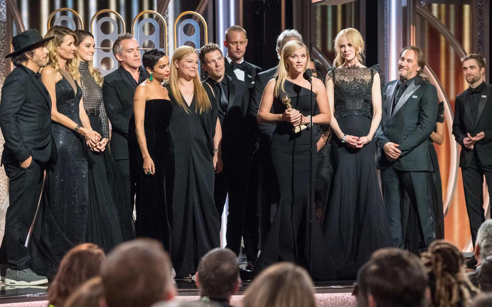

# Золотой глобус: женщины в черном начинают и выигрывают. Одна из самых престижных в мире кинопремий приобрела траурный вид и феминистский уклон

- **URL:** https://novayagazeta.ru/articles/2018/01/08/75084-zolotoy-globus-zhenschiny-v-chernom-nachinayut-i-vyigryvayut
- **Дата:** 2018-01-08
- **Автор:** Лариса Малюкова

## Золотой глобус: женщины в черном начинают и выигрывают

## Одна из самых престижных в мире кинопремий приобрела траурный вид и феминистский уклон

Фото: EPAПосеешь гнев – получишь Глобус, и призы Венеции и Канн в придачу. В этом убедились создатели талантливой трагикомедии «Три билборда на границе Эббинга, Миссури» (из шести номинаций – четыре Глобуса, среди которых главный – за «Лучший фильм») и однолинейной, предсказуемой драмы Фатиха Акина «На пределе» («Лучшая картина на иностранном языке»). Героиня Фрэнсис Макдорманд («Три билборда») объявляет войну смирившемуся с насилием и задохнувшемся в «неправосудии» обществу. Героиня Дайаны Крюгер («На пределе») сама превращается в штюрмера, в противном случае, социум готов лишь защищать наци, убийц ее взорванной семьи. Обвинять самих турков – понаехавших – в том, что они утонули в море крови.

Можно сказать, что женщины, берущиеся за оружие в самых разных его видах и формах – главные героини нынешнего киногода.

Кадр из фильма «Три билборда на границе Эббинга, Миссури». Kinopoisk.ruВозможно, «На пределе» и показалась экспертам предпочтительней «Нелюбви» Андрея Звягинцева из-за бешеной энергии, социальной активности, понятной (почти плакатной) позиции авторов. Героиня Марьяны Спивак в «Нелюбви», вызывающая у зрителя то отторжение, то сочувствие, к своей личной трагедии движется микроскопическими шагами, так и не выбравшись из… нелюбви.

Андрей Звягинцев: «Агрессия и неприятие сожрут нас с потрохами»

Каннский лауреат — о «Нелюбви», Серебренникове, инакомыслии

«У женщин – все сердце, даже голова», — заметил немецкий писатель и философ Жан Поль Рихтер. Уборщица на секретном военном объекте, рискуя жизнью, пытается спасти Человека-амфибию в чудном фэнтези Гильермо дель Торо «Форма воды» (призы за режиссуру и за «Лучшую музыку»). На Венецианском кинофестивале именно «Форма воды» получила «Золотого льва». Гильермо дель Торо – изобретатель миров, обладатель едва ли не самого богатого воображения среди современных авторов, сочинил собственную вариацию на тему вечной сказки про Красавицу и Чудовище. Он остается верен себе, по прежнему курсирует между независимым арткино и Голливудом. И в своей новой сказке соединяет фантастику и хоррор, романтику и ретротриллер. Да и «красавица» в очередной темной фантазии режиссера весьма далека от стандартов красоты и благочинного поведения. К тому же, героиня Салли Хокинс (на нее специально писался сценарий, вдохновленный «Созданием из Черной лагуны») – мало того, что дурнушка, к тому же – немая. Такой только и может быть современная принцесса, – считает режиссер. На премьере фильме в Торонто он цитировал фразу из «Хеллбоя»: «Нам нравятся люди за их качества, но любим мы их за дефекты. Думаю, это и есть любовь».

Кадр из фильма «Форма воды». Kinopoisk.ruИ сюжет «лучшего драматического сериала» «Рассказ служанки» разворачивается на территории вымышленного тоталитарного государства Гилеад. Лишь суррогатная мать Оффред (Элизабет Мосс) способна сказать «нет» концентрационным лагерным традициям искусственного социума, лишь она последовательно рвется к свободе.

Кадр из сериала «Рассказ служанки». Kinopoisk.ruПоддержите нашу работу!

1000 500 300 Нажимая кнопку «Стать соучастником», я принимаю условия и подтверждаю свое гражданство РФ

Если у вас есть вопросы, пишите [email protected] или звоните:+7 (929) 612-03-68

Золотым Глобусом отмечено и многокрасочное царство женщин под управлением Николь Кидман в мини-сериале «Большая маленькая ложь» – психологическом телеромане из жизни состоятельных домохозяек.

На церемонию актрисы, сговорившись, пришли в черном – в знак протеста против харассмента и сексуального насилия в киноиндустрии. О создании движения Time’s Up («Время вышло» или «Уже пора»), которое будет заниматься защитой женщин от домогательств в Голливуде и на любой другой работе, было объявлено в начале января. Среди поддержавших инициативу Натали Портман, Мерил Стрип, Эмма Стоун, Риз Уизерспун, Эшли Джадд, Ева Лонгория и другие.

На мужчин обязательность траурного стиля не распространялась, но к лацканам смокингов они сочувственно прикрепили фирменные значки «Time’s Up». Казалось, вся церемония была обращена не только против провинившихся кинодеятелей сильного пола, но и мужчин вообще, время которых вышло. И даже редкие награды, такие, как справедливый приз Гарри Олдмену за роль Уинстона Черчиля в картине «Темные времена», не могли изменить общего настроения.

В своем приветствии телеведущий Сет Майерс сказал: «Добрый вечер, леди и оставшиеся джентльмены… Добро пожаловать на 75-ую церемонию «Золотой глобус». И счастливого Нового года, Голливуд!

2018-ый год, марихуана наконец-то разрешена, а сексуальные домогательства наконец-то нет. Это будет хороший год».

Он иронизировал над сомнительным поведением Харви Вайнштейна и Кевина Спейси, обвиненных в домогательствах.

Секс-инквизиция

Юлия Латынина: нынешние процессы о харассменте полностью нарушают презумпцию невиновности. Мужчина стал заложником женщины

Программную пламенную речь произнесла телеведущая Опра Уинфри. Ее слова были посвящены тем женщинам, «которые чувствовали себя достаточно сильными говорить и рассказать свои личные истории». А сами печально известные истории о домогательствах, по ее мнению, затрагивают не только индустрию развлечений, но стоят над любой культурой, расой, религией, политикой или профессией. Финал продолжительного и вдохновенного спича был обращен к молодым девушкам и завершен оптимистическим утверждением нового дня, который «уже на горизонте», и который «будет нашим». Речь телеведущей несколько раз прерывалась аплодисментами.

Пресса немедленно дала имя пышной кино-вечеринке «Пятьдесят оттенков черного». Похоже, Голливуд продолжает играть с реальностью по законам, установленным… Голливудом.

Российские зрители в ближайшее время увидят отмеченные «Золотым глобусом» фильмы.

Поддержите нашу работу!

1000 500 300 Нажимая кнопку «Стать соучастником», я принимаю условия и подтверждаю свое гражданство РФ

Если у вас есть вопросы, пишите [email protected] или звоните:+7 (929) 612-03-68
