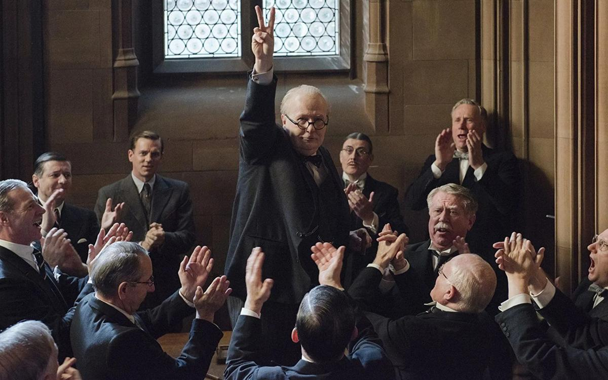

# Премьер говорит! 18 января на экраны выходит историческая драма об Уинстоне Черчилле «Темные времена» — потенциальный лауреат «Оскара»

- **URL:** https://novayagazeta.ru/articles/2018/01/11/75119-premier-govorit
- **Дата:** 2018-01-11
- **Автор:** Лариса Малюкова

## Премьер говорит!

## 18 января на экраны выходит историческая драма об Уинстоне Черчилле «Темные времена» — потенциальный лауреат «Оскара»

Кадр из фильма «Темные времена»Май 1940-го. Великобритания на краю войны: после вторжения в Польшу оккупированы Норвегия и Дания, следом капитулировали Бельгия, Нидерланды, Люксембург и Франция. Гитлер наступает. В сенате паника. Премьер-министр Чемберлен получает вотум недоверия. Его место должен занять граф Галифакс (Стивен Диллэйн) — в Британии каждое назначение регламентировано — и все же король Георг VI (Бен Мендельсон) и парламент принимают вынужденное решение: на ключевой пост назначить Уинстона Черчилля (Гэри Олдман). Человека с дурным характером и скверными привычками — о чем перешептываются в парламенте — и с обременительным багажом: виной за летальное фиаско Галлиполи. И этому монстру доверить королевство перед главной войной ХХ века? «Я получил эту работу, потому что корабль тонет», — позже заявит политик.

Кадр из фильма «Темные времена»«Темные времена» — история выбора, превратившегося в историю. Политическая логика и тотальный страх парализует, диктуя Европе пассивное сопротивление фашизму. Германия громит французские войска и окружает в Дюнкерке британский экспедиционный корпус, присланный на подмогу союзникам. Помощь США? Напрасные надежды, страна придерживается нейтралитета.

Что же Черчилль? Его склоняют к переговорам. Мирным переговорам с Гитлером, диктатором, ефрейтором, ничтожеством… Возможно, в этот момент сомнений и вызревания операции «Динамо» вершилась судьба не только Великобритании, но и всей Западной Европы.

Седьмой полнометражный фильм талантливого и разнообразного британского режиссера Джо Райта («Гордость и предубеждение», «Искупление», «Анна Каренина») можно назвать портретом Черчилля. Авторы не пытаются рассказать о едва ли не самом именитом в современной истории политике все, что знают. Райт берет лишь фрагмент из долгой жизни политического тяжеловеса, приближает его, укрупняет оптику. Чтобы в одном эпизоде, как в капле, рассмотреть океан личности. Для Райта суперважно, что Черчилль — не только политик, но журналист и писатель, обладатель Нобелевской премии по литературе. Собственно, основой сценария и стали три главных речи Черчилля, определившие путь нации.

Кадр из фильма «Темные времена»Недавно смотрели нолановский «Дюнкерк» — захватывающую драматическую и поэтическую историю эвакуации тысяч британских солдат с береговой линии — «на общем плане». С воздуха видели понурых военных на пляже, в длинных очередях ждущих решения своей участи, взрывы на пляже, трупы на пляже. А в облаках британцы бились с «мессерами», бомбящими мирные суда-спасатели. В «Темных временах» — та же история спасения армии, когда по приказу Черчилля началась операция «Динамо». В залив со всей Англии отправилась необычайная армада: частные яхты, рыбачьи шхуны, катера и утлые суденышки. Но Райт концентрирует внимание на крупных планах политиков.

«Дюнкерк» Нолана: обыкновенное чудо

Эпос об одном из самых важных и загадочных событий Второй Мировой — надо смотреть

Выход из безвыходной ситуации придумывается на наших глазах в правительственных кабинетах, в коридорах власти и… в спальне Черчилля. В «Дюнкерке» — изобретательная игра со временем, в «Темных временах» — тщательно выписанная проза тыловой жизни, определяющей судьбы мира. В «Дюнкерке» — попытка визуального эксперимента, игра со временем. У Райта — почтительная старомодность, тусклый свет, тревожно мерцающая лампочка подземного бункера — военного штаба. Многократный оскаровский номинант оператор Бруно Дельбоннель предпочитает мрачные клаустрофобные соцветия в помещениях и набухший дождем воздух на лондонских улицах. Вместо склейки — фотовспышка. Все работает на сгущающуюся атмосферу отчаяния.

«Темными временами» назвал Черчилль этот ключевой в карьере период, определивший весь ход жизни.

Фильм состоялся в тот момент, когда Райт, прочитав сценарий, в котором драма была приправлена сарказмом, решился пригласить на главную роль Гэри Олдмана — своего кумира. Выдающегося актера, непредсказуемого трикстера в «Дракуле» и «Пятом элементе». Нисколько не похожего на монументального премьер-министра, но способного к сказочным перевоплощениям.

Тяжелая походка — торжественное ковыляние с наклоном вперед и опорой на палку. Брюки, подтянутые высоко над выступающим животом. Ну и, разумеется, непреложная сигара.

С первого появления в кадре Черчилль напоминает уничтоженный за некомплиментарность знаменитый портрет Сазерленда, на котором политик предстал грузным, депрессивным, втекшим в кресло одутловатым стариком. Видимо, Райт и Олдман руководствовались признанием первой любви Черчилля — леди Памелы Литтон:

«Когда встречаешь Уинстона в первый раз, сразу же замечаешь все его недостатки, а остаток жизни проводишь, открывая его достоинства».

Поддержите нашу работу!

1000 500 300 Нажимая кнопку «Стать соучастником», я принимаю условия и подтверждаю свое гражданство РФ

Если у вас есть вопросы, пишите [email protected] или звоните:+7 (929) 612-03-68

Кадр из фильма «Темные времена»Черчилль диктует машинистке выступление перед парламентариями, лежа в ванной, в постели. В ночной рубашке. В халате без нижнего белья. Запивая слова скотчем. Словно бульдог, бросаясь на девушку, не успевающую расшифровать его бормотание.

Так ли уж странно, что он был окружен недоброжелателями, завистниками, оппонентами в сенате?

Над искусным гримом трудились знаменитые мастера Кацухиро Цудзи и Ивана Приморак. На разработку одной только маски для лица ушло полгода. Больше трех часов грима перед каждой съемкой. Но грим и искусственная тучность — лишь ключ, Олдман играет преображение ворчливого старика с взрывным характером в грандиозного политического лидера с лихорадочной энергией, прозорливостью и острым умом. Без смущения он мгновенно парирует изысканные нападки короля на еженедельных ритуальных встречах («Как вы научились пить и не пьянеть в течение дня?» — «Практика»). Дезавуирует политических оппонентов («Не перебивайте меня, когда я перебиваю вас!»). Пользуется всем богатством языка, чтобы доказать собственную правоту («Нельзя договориться с тигром, когда твоя голова у него в пасти»). В нужную минуту умеет повысить градус востребованного в военную эпоху энтузиазма: «Мы будем сражаться на морях и в океанах, мы будем защищать наш остров, чего бы это нам ни стоило, мы никогда не сдадимся!»

Кадр из фильма «Темные времена»Увы, авторы провалили кульминацию. Черчилль второй раз в жизни спустился в подземку по дороге в Вестминстер, где он должен объявить свое решение. И здесь, в метро, он спрашивает мнение у простых людей: готовы ли они бороться? Или следует идти на уступки? Далее следует полная патетики и зашкаливающего пафоса сцена, о которой и говорить не хочется.

А вот о выдающейся работе Олдмана, нащупавшего нерв характера своего героя, будут писать и говорить.

200 актеров играли Черчилля на большом и малом экране. Среди недавних удач работа Джона Литгоу в британской многосерийной драме «Корона». Там Черчилль — старый мудрый лис, не торопящийся выпускать из рук нити власти.

Черчилль Олдмана — вроде бы чистая непредсказуемость, эксцентричность, но — подчиненные жесткой внутренней логике, несмотря на чудовищное политическое давление.

Черчилль Олдмана — это масштаб личности, уязвленной слабостями.

Такой сложный, яркий человек мог взять на себя ответственность за страну. Пробудить в соотечественниках веру в победу, когда отчаяние проникло во все поры общества. Как же можно вселить в сознание людей надежду?

С помощью слов. О Черчилле говорят: «Он мобилизовал английский язык и отправил его в бой». Шансы спасти армию были туманны, а он в своей первой речи вколачивал в головы британцев слово «победа»: «Вы спрашиваете, какова наша цель? Я могу ответить одним словом: победа — победа любой ценой, победа, несмотря на все ужасы; победа, независимо от того, насколько долог и тернист может оказаться к ней путь; без победы мы не выживем». Он умел балансировать между эмоцией и доводом, и с помощью слов убеждать сограждан в том, что Гитлера можно победить. 4 июня в палате общин он обещал: «Мы будем сражаться на пляжах, будем сражаться на площадке, мы будем сражаться на полях и на улицах, мы никогда не сдадимся».

Кадр из фильма «Темные времена»Слова могут менять мир. Когда говорит Черчилль — пушки замолкают, чтобы ударить с новой силой.

На пресс-конференции в Торонто Гэри Олдман признался, что у него дома есть сборник цитат Черчилля, который он регулярно перечитывает. «Вот и «Оскар» за лучшую мужскую роль», — написали критики, посмотревшие картину. И были правы, «Золотой глобус» Гэри Олдману — тому подтверждение.

Поддержите нашу работу!

1000 500 300 Нажимая кнопку «Стать соучастником», я принимаю условия и подтверждаю свое гражданство РФ

Если у вас есть вопросы, пишите [email protected] или звоните:+7 (929) 612-03-68
