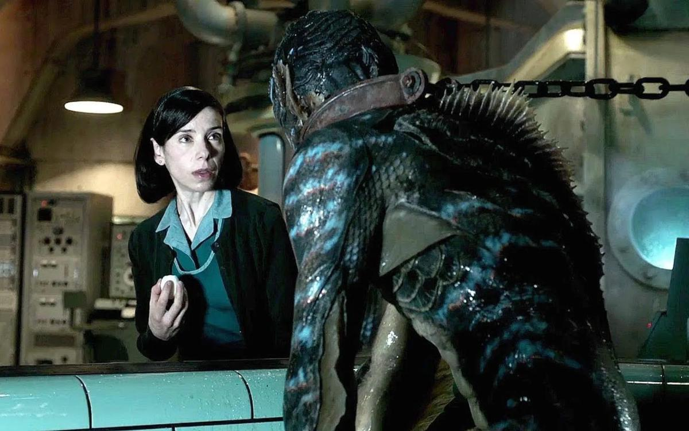

# Вода в мешке без дна. В прокат выходят две сказки для взрослых, сочиненные настоящими художниками

- **URL:** https://novayagazeta.ru/articles/2018/01/19/75201-voda-v-meshke-bez-dna
- **Дата:** 2018-01-19
- **Автор:** Лариса Малюкова

## Вода в мешке без дна

## В прокат выходят две сказки для взрослых, сочиненные настоящими художниками

Кадр из фильма «Форма воды»Январь-февраль — золотое время кинопроката, пик интереса к кино. На экраны выходят не только фильмы, участвующие в оскаровском марафоне. В это время в репертуаре можно встретить довольно редкие жанры, даже для арткино.Сладкий и мрачный

«Форма воды» — микс сказки и ретродетектива, сочинение Гильермо дель Торо, опытного создателя ирреальной реальности («Лабиринт Фавна», «Хребет дьявола»). Конец пятидесятых — противостояние Запада и Востока. Спецслужбы привозят в секретный центр отловленного в Амазонке водяного монстра, дабы отправить его в космос и нагнать СССР (русские-то уже отправили в космос собак!). Но вот незадача: в зеленоватую чешуйчатую амфибию влюбилась не юная, некрасивая уборщица Элиза (прекрасная Салли Хокинс). И Амфибия не могла (мог?) не ответить взаимностью.

Кадр из фильма «Форма воды»Дель Торо в стиле старинного комикса и старого кино восстанавливает эпоху промышленного дизайна, атмосферу холодной войны, обещающую тревожные перемены. Сочиняет вселенную вроде нашей, но подозрительно смахивающую на голливудские мюзиклы 40-х. Элиза — чисто Золушка — моет, убирает, трет. И на секретных объектах работают обычные уборщицы. К тому же она немая. Но нет, героиня Салли Хокинс не просто безголосая она — пришелица из немого кино. Носительница другой культуры, поэтому каждый жест ее — говорящий. Не случайно же героиня фильма живет в каморке над кинотеатром. Золушка превращается в принцессу кино, когда поэтическими жестами объясняет, что она и чудище похожи: одинокие, изгои, не понимаемые и не принимаемые враждебным миром. Олицетворением циничного мира в «Форме воды» становятся не любимые дель Торо «нелюди»-фашисты и даже не мутные агенты кей-джи-би, среди которых водится некто Михалков… А изощренный шовинист с квадратной челюстью, сыгранный Майклом Шенном. Он и есть представитель тревожного будущего, в котором не будет места для «других», «неполноценных», «ихтиандров». Он не замечает «невидимых» людишек вроде уборщиц, он — власть, расправляется с «уродами» — амфибиями. Что можно противопоставить этому натиску силы? Только любовь, которая, как сказано в Послании к Коринфянам, «долготерпит, милосердствует… сорадуется истине». Любовь видит сущностное. Любовь — синоним воды, она заполняет собой, принимает любые формы. Элиза приносит водяному деликатесы — отварные яйца. Учит монстра есть с ножом и вилкой, ставит любимые пластинки — с Кармен Мирандой, к примеру. Элиза сама учится танцевать под хит сороковых «Ты никогда не узнаешь, как я скучаю по тебе» из давнего фильма «Привет, Фриско, привет!». Через запретную любовь она учится осознавать себя, понимать, быть.

Кадр из фильма «Форма воды»Это самая бесхитростная, наивная история в фильмографии знаменитого автора изысканных готических хорроров. Сказка, приправленная сиропом, натурализмом и авторским саундтреком Александра Деспла. Местами чрезмерно сентиментальная, предсказуемая. Отсылающая нас к «Красавице и Чудовищу», «Кинг-Конгу», «Чудовищу из черной лагуны» и даже «Русалке». Но затягивающий, словно морское дно, визуальный ряд с выдержанной палитрой от изумрудного до черного — превращает фильм в сеанс магии. Как и фильм «Артист» — это посвящение старому кино, в котором на самом крупном плане были не шарахающие по глазам и перепонкам аттракционы, но чувства. Преувеличенные, не стесняющиеся сентиментальности. Облаченные не в слова — в жесты, взмах ресниц. И благодаря воображению не только авторов, но и зрителей немые актрисы обретали голоса… Точно как Элиза в великолепном исполнении Салли Хокинс. Фильм удостоен главного приза Венецианского кинофестиваля, а Гильермо дель Торо получил «Золотой глобус» как лучший режиссер.

Кадр из фильма «Форма воды»Нечаянная радость

Полнометражного фильма Хамдамова ждали более десяти лет. Его называют «гением неснятых фильмов». Возбудившая профессионалов и тут же запрещенная короткометражка «В горах мое сердце», убитые «Нечаянные радости» (незавершенный негатив был уничтожен по приказу руководства «Мосфильма», сохранились лишь фрагменты). Арестованная французским продюсером горемычная «Анна Карамазофф» с Жанной Моро. Реноме «проклятого поэта» преследует, превращаясь в сущность.

«Мешок без дна», как все хамдамовское кино, невозможно оценивать с точки зрения «жанров», «сюжетов». В нем «точность с зыбкостью слита», воздушный смех — с душевным оцепененьем, хаос с филигранной выделкой, безыскусность с мистикой. Лучше всех новую работу режиссера охарактеризовал он сам: определенно «Мешок без дна». Или автопортрет Рустама Хамдамова, который полвека снимает свой бесконечный магический фильм.

Поддержите нашу работу!

1000 500 300 Нажимая кнопку «Стать соучастником», я принимаю условия и подтверждаю свое гражданство РФ

Если у вас есть вопросы, пишите [email protected] или звоните:+7 (929) 612-03-68

Кадр из фильма «Мешок без дна»Картина — вариация на мотивы новеллы Рюноскэ Акутагавы «В чаще» (на этот сюжет Куросава снял «Расёмон»). Хамдамова привлекла множественность точек зрения на происходящее. Самурай превратился в русского царевича. Его вместе с царевной разбойник заманит в чащу. Дальше каждый герой поведает свою версию трагедии. Но Хамдамов волшебный сюжет спрячет в ларец другой истории. Завернет в другое время. В императорскую Россию во времена Александра Второго. Опытная чтица (Светлана Немоляева) приглашена во дворец читать Великому князю (Сергей Колтаков) средневековую сказку о мистическом убийстве царевича в лесу.

Все начинается в дворцовом зале с креслами, накрытыми белыми чехлами, словно бледные воспоминания об истаивающем прошлом с балами при свечах. Весь фильм — попытка реинкарнации этого бесследно канувшего в воды забвения мира.

Кадр из фильма «Мешок без дна»Князь, недавно похоронивший жену, горюет, тайно запивая горе крепкими напитками. Тут и возникает история старинных бутылок, спрятанных в библиотеке (бутыли вдохновлены натюрмортами Джорджо Моранди). Сказочница обнаруживает их с помощью «всевидящего» бумажного носа и разоблачает их «судьбы». Три пыльные, уставшие от жизни матовые стеклянные «девы», так и не выбравшиеся в Москву, о которой так мечтали в юности. А темная бутылка покрепче — Катерина, решительно замершая над обрывом. Грезы наполняют сосуды чахлой действительности.

Чтица, утянутая в черное платье, ублажает слух князя даже не самой историей, но волшебством происходящего, предстающего перед нами воочию (подчас как в немом кино — без звука). В берендеевом лесу неведомыми дорожками мчат васнецовские царевич с царевной в дорогом хамдамовском убранстве, в чаще сверкает волшебное зеркальце, привязанного к дереву царевича пронзит стрела, как Святого Себастьяна. А над гладью билибинского озера — голове разбойника, на которой замрет меч, и сама вода выстроит симметрию неотвержимого предвестья преступления. Здесь люди-грибы с соломенными ранцами находят клад и не знают, что с ним делать. А Баба-яга (неузнаваемая Алла Демидова) колдует и режиссирует действие.

Кадр из фильма «Мешок без дна»В прологе сказочнице строго указано фрейлиной Анны Михалковой: не больше двух убийств! Вот она и ведет свое ветвистое повествование по краю жизни, правды и вымысла, не забывая главного вопроса: а существует ли рай? И находит ответ, где раю быть: в детстве мы бессмертны.

Но и в сказке смерти нет. В ней живая вода или, как у Хамдамова, сплошные перемены участи и реинкарнации. «Мешок без дна», о котором говорит фрейлина Немоляевой, — сказка номер 295, ее Шехерезада рассказывала Шахрияру. Кто больше слов в мешок насыплет, тот и выиграет спор. Сказочница заговорит и мертвого: поместит в мешок и Самарканд, и Судный день, и лимон. Как ни любит князь выдумки и все чудесное, особенно грибы, даже целует их взасос, а проиграет сказочнице. Но утешится. Потому что и у страшной сказки — терапевтический эффект. Но вряд ли сказка вылечит реальность. «Зачем эти молодые люди бросают в кареты с царями мешочки с порохом?» — спрашивает нас чтица, похожая на птицу. Это кино о хрупкости человеческой жизни. О хрупкости самого искусства, сегодня почти невостребованного.

Кадр из фильма «Мешок без дна»Светлана Немоляева рассказывала мне, как подбирали костюм для ее чтицы. Страшно утягивали корсетом. Надевали множество старинных нижних юбок под кринолины. Отыскали где-то платье, которому место в музее. И даже белье батистовое и чулки — подлинные, из ХIХ века. Ветхие, как само время. Вы спросите, зачем все это? Кто это увидит? Для этого и необходим буратиний нос чтицы, с помощью которого можно рассмотреть волшебство.

«Мешок без дна» — произведение ювелирное, недаром его рабочими названиями были «Рубины» или «Яхонты» (но кто сегодня помнит про яхонты). Хотя кажется, что все драгоценные каменья в фильмах художника лишь отсвет переливов райского детского калейдоскопа.

Поддержите нашу работу!

1000 500 300 Нажимая кнопку «Стать соучастником», я принимаю условия и подтверждаю свое гражданство РФ

Если у вас есть вопросы, пишите [email protected] или звоните:+7 (929) 612-03-68
