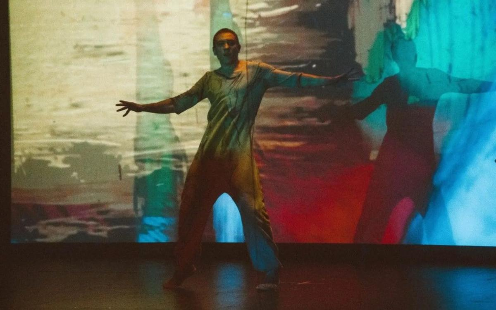

# Выйти из черного квадрата. На вопрос «Зачем человеку без зрения нужна живопись?» пытается ответить уникальный спектакль со слепоглухими актерами

- **URL:** https://novayagazeta.ru/articles/2018/01/23/75243-vyyti-iz-chernogo-kvadrata
- **Дата:** 2018-01-23
- **Автор:** Лариса Малюкова

## Выйти из черного квадрата

## На вопрос «Зачем человеку без зрения нужна живопись?» пытается ответить уникальный спектакль со слепоглухими актерами

Фотография предоставлена организаторамиПремьера «Anima Chroma/Живые картины» в театре Наций — невообразимый художественно-театральный эксперимент с инклюзивным актёрским составом. По сути, первый в мире спектакль, в котором на равных участвуют: актеры (зрячеслышащие и слепоглухие), живописная рукотворная анимация, музыка (композитор Денис Хоров). В основе его семь шедевров мировой живописи из коллекции «Эрмитажа».Anima Chroma — живая душа. Спектакль о восприятии и переживании живописи разными людьми. Не равными в своих возможностях. Семь актеров, семь основных цветов радуги, семь планет и мировых сфер, семь дней сотворения мира.

Все начинается с «Черного квадрата» Малевича. Медленно светлеющая тьма, внутри которой возникают блики, мечутся одинокие тени. Из ничего, из нуля — начало начал — на экране пробивается единица. «Черный квадрат» рождает световой луч. Запертая в геометрическую форму Тьма борется со стихией Света. Квадрат рассыплется на семь цветов – цветовых душ, отдельных, еще не знающих как взаимодействовать друг с другом. Завихрения красок, широких летящих в разные стороны мазков, не только на экране, но и на прозрачном занавесе, отделяющем нас от танца исполнителей. Это хаос и его преодоление из «Композиции №6» Кандинского. Краски соприкасаются, соединяются друг с другом, из хаоса возникают первые черты мироздания. Экран пульсирует раскаленным шаром. На фоне синего небосвода красные фигуры, взявшись за руки, несутся в хороводе: «Танец» Матисса. Женщина и Мужчина — любовная целомудренная пара в Эдеме… и ползучий алый шарф поодаль — живая кожа искусителя.

Фотография предоставлена организаторамиПоддержите нашу работу!

1000 500 300 Нажимая кнопку «Стать соучастником», я принимаю условия и подтверждаю свое гражданство РФ

Если у вас есть вопросы, пишите [email protected] или звоните:+7 (929) 612-03-68

Краски успокоятся лишь на время - застывая в любовном мареве ренуаровского «В саду». Но красный шарф возбудит бурю страстей: в житейском штормовом море барахтаются условные персонажи: потоки света и тьмы, свободы и долга, верности и предательства (Клод Верне «Кораблекрушение»). Затем приходит время Искупления - беззвучный разговор с собой. Или с двойником, изображение которого корчится на экране и раскалывается на части. И лишь дождевой поток несет с небес очищение, надежду на прощение («Блудный сын»). В финале отворятся двери в «незримый мир». В потоке цветных лучей высветится Икона «Спас в силах» — Христос на фоне красного ромба (божественного огня) вписанного в синий с зеленым овал (символ небесной сферы). Но пока образ иконы собирается в один световой поток, мы вспоминаем начальную рифму — черный квадрат, и действие обретает завершенность.

Фотография предоставлена организаторамиВсе это действо устроено очень просто (видеопроектор + исполнители) и очень сложно. Рукотворная анимация, созданная в Мастерской оскароносца Александра Петрова. Живопись на стекле, сотворена на прозрачных слоях пальцами и кистью. Она течет из проектора на два экрана, клубится в цветных дымах. С каждым слепозрячим артистом долго работали переводчики. Они проходили специальные тренинги (при поддержке фонда «Со-единение»). Более того, режиссер спектакля Дмитрий Петров вырезал из дерева некоторые картины в объеме, чтобы исполнители могли наощупь войти в их мир. На руках у артистов– специальные датчики, помогающие ориентироваться на сцене. Видящие артисты с помощью жестов, тактильных взаимодействий создавали общий пластический рисунок неостановимой хореографии (режиссер по пластике Александра Рудик). Персонажи здесь – элементы кадра, действующие лица живых картин. Их осторожные и направляющие прикосновения – выражение любви, заботы. Не правда, что невозможно отличить слепоглухих исполнителей от зрячих. Их видно по некоторой неловкости, странной пластике - но не неуверенности. Они – магические центры действа, всей этой живописная бесконечность, перетекания образов. Их сердцебиением одушевлен кадр. Это они танцуют анимацию. И когда в финале зрители грохочут ногами, чтобы их услышали артисты – это аплодисменты – «привычные моменты любви».

Фотография предоставлена организаторамиВиктория Авдеева, автор идеи и продюсер рассказывает, что проект возник как ответ на вопрос «Зачем человеку без зрения нужна живопись?». И спектакль сорежиссеров Дмитрия Петрова и Альберта Рудницкого пытается ответить на этот вопрос. В местами еще сыром, неуверенном спектакле-лаборатории (слишком сложно его устройство) есть чудо творческой воли, тайной передачи живых импульсов, постижение чувственной стороны искусства. Есть восхождение из бездны «черного квадрата» к геометрии гармонии, к световому потоку, направленному на зрителя. И именно в этой тайной и кропотливой работе не только с особенными исполнителями, но и со зрителями – кроется главная загадка «Живых картин». Потому как и счастливчикам, «смотрящим глазами» - дана возможность «увидеть».

Поддержите нашу работу!

1000 500 300 Нажимая кнопку «Стать соучастником», я принимаю условия и подтверждаю свое гражданство РФ

Если у вас есть вопросы, пишите [email protected] или звоните:+7 (929) 612-03-68
