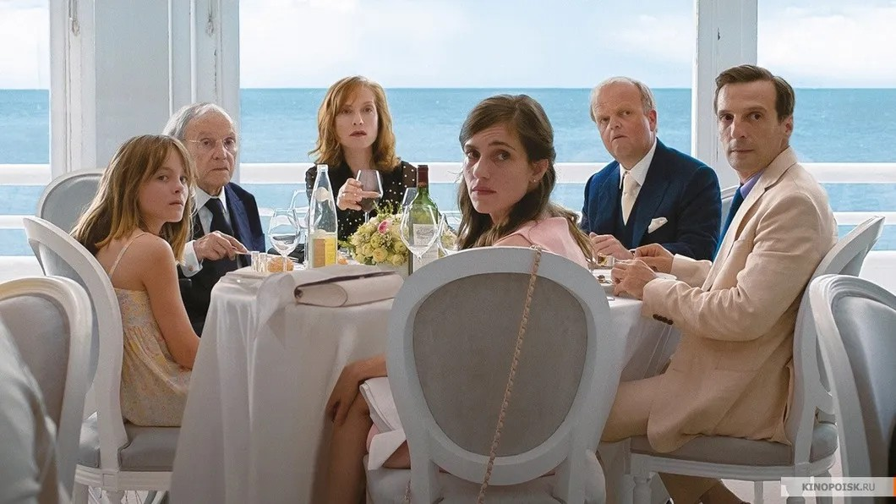

# Тоня без хэппи-энда. Две новые комедии, которые жалко пропустить. Рецензии Ларисы Малюковой

- **URL:** https://novayagazeta.ru/articles/2018/01/25/75268-tonya-bez-heppi-enda
- **Дата:** 2018-01-25
- **Автор:** Лариса Малюкова

## Тоня без хэппи-энда

## Две новые комедии, которые жалко пропустить. Рецензии Ларисы Малюковой

«Хэппи-эндом». Кадр из фильмаДважды лауреат «Золотой пальмовой ветви» Михаэль Ханеке («Пианистка», «Белая лента», «Любовь») возвращается на экраны с «Хэппи-эндом». Не верьте названию, это — «счастливый конец» в прочтении мрачного мизантропа Ханеке, обладателя «Оскара», многократного призера Канн.

Название фильма вдохновлено примерно той же язвительной иронией, что и его леденящие кровь «Забавные игры». За обнадеживающим заголовком не лишенная нот цинизма история противостояния буржуазной Европы новой иммиграционной волне — на примере живописной французской семьи. «Хэппи-энд» можно рассматривать как заключительную главу долгой семейной саги. Начатой еще фильмом «Седьмой континент» (фрагменты из жизни преуспевающей австрийской семьи). Продолженной «Скрытым» (о тайных грехах семьи благополучного литературоведа). Можно припомнить и «ячейку общества» во главе с благообразным строгим пастором в «Белой ленте» с его детками-ангелочками — отродьями зла. Или патологическую семью в «Пианистке»: учительницу музыки, старую деву и ее полубезумную мамашу… В предыдущей, самой неутешительной, из работ Ханеке «Любовь» рассказывалось о закате жизни семейной пары: Жоржа и Анн. Жорж (Жан-Луи Трентиньян) с помощью подушки избавлял свою любимую, превратившуюся в «овощ», от унизительных страданий.

И вот финал. Не слишком счастливый. Снова видим старого Жоржа и его дочь Анн Лоран (Изабель Юппер). Или кого-то страшно на них похожих. А рядом все традиционно ветвистое буржуазное французское семейство, связанное с крупным бизнесом, запутавшееся в сложных взаимоотношениях, в нарядных адюльтерах. В неспособности адекватно отвечать на вызовы времени.

Владельцы масштабной стройки — сливки общества — проживают в Кале, том самом, как помним, чудном процветающем городе на севере Франции, где при поддержке жителей снесли обширный лагерь мигрантов. Жирным мазком писанные персонажи. И прозрачные семейные тайны, недомолвки, скелеты в шкафах и в интернет-чатах. Режиссер использует разные способы подсматривания за воплощенной на экране противоречивой действительностью: от камеры до мобильного телефона, от широких панорам до странички в фейсбуке и порнографической переписки одного из благонравных членов семейства в месседжере.

«Хэппи-энд» слоится едва ли не всеми темами, которые затрагивает в своем кино Ханеке: космическая дистанция между разными социальными слоями, распад семьи, латентная ксенофобия, «видимое и скрытое», попытка диалога с близкой смертью. И если «Любовь» — физиологический очерк, поднимающийся до высот трагедии и история грандиозной любви, то время действия «Хэппи-энда» — после любви. По Ханеке — «приглашение на казнь», написанное собственноручно. Уставший от жизни герой Трентиньяна пытается из последних сил назначить свидание «старухе с клюкой», но она хитроумно уворачивается от встречи.

История с беженцами уводится с авансцены вглубь сюжета, но нисколько не блекнет. Ханеке дает семейный портрет в интерьере уродливого современного мира, обнажая за лощеным ритуалом и приличием невыносимый ужас грядущего бытия. Издевательски аккуратно выписанный макабр тревожит, вызывая нервный смех и внятное ощущение, что перед благополучной Европой сама действительность в униформе вышколенного метрдотоделя вежливо открывает инкрустированные золотом двери… в бездну.

Вы хотели света в конце туннеля? Получите. «Хэппи-энд» во всем блеске сарказма Ханеке.

## «Тоня против всех»

«Тоня против всех». Кадр из фильмаЧерная комедия «Тоня против всех»Крэйга Гиллеспи, отмечена «Золотыми глобусами» и попала в оскаровские номинации.

Поддержите нашу работу!

1000 500 300 Нажимая кнопку «Стать соучастником», я принимаю условия и подтверждаю свое гражданство РФ

Если у вас есть вопросы, пишите [email protected] или звоните:+7 (929) 612-03-68

В начале 1990-х скандал, связанный с ее именем, всколыхнул весь спортивный мир. Тогда Тоня Хардинг была у всех на устах. Новый формат 24-часовых новостей подливал масла в огонь, постоянно сообщая все новые детали. Американцы льнули к экранам. Наблюдали, как крепкая блондинка, чемпионка Америки, из любимицы страны превращается в объект ненависти.

Спортивные драмы, основанные на реальных событиях/биографиях, набирают оборот не только в России. Фильм, который в оригинале называется «Я, Тоня», — из таких. Героиня — американская фигуристка Тони Хардинг, первая в США, выполнившая тройной аксель на соревнованиях. За ней с придыханием будет следить страна. Но с белоснежных высот обожания национальная гордость слетит в тартарары всеобщего презрения. Без пяти минут члена олимпийской сборной обвинят в покушении на конкурентку Нэнси Керриган. Лишат не только спортивных регалий, но и будущего. Актуальная история не только для Америки…

Фильм строится как цепь документальных интервью с участниками событий. Актеры вживаются в своих героев дважды: сегодня и почти двадцать лет назад. Вот мамаша Тони Лавона Хардинг (Эллисон Дженни), шпыняющая, унижающая дочурку, силой выбивающая из нее рекорды. Вот ее экс-муж — зыбкое спасение для пятнадцатилетней девчонки от тирании мамаши. Но Джефф (Себастьян Стэн) оказывается не просто аутсайдером, он мстит Хардинг за собственные неуспехи, колотит ее и винится — попеременно. А у Тони, между тем, выстраивается свой вектор пути, с которого ее уже не сбить. Правда, будущая чемпионка не слишком привлекательна. «Выглядит так, будто дрова рубит каждое утро», — говорит тренер по фигурному катанию, глядя на 12-летнюю фигуристку. «Так она и рубит», — соглашается мамаша Лавона Хардинг, не вынимающая сигареты изо рта даже на катке.

Стране нужна милашка в дорогой шубке, из полноценной семьи, олицетворение благополучия и олимпийского спокойствия. А Тони не похожа на идеал. Какой она пример для подражания. Хабалка, лохня – и это еще лучшие из эпитетов, которыми награждают простушку в вульгарных костюмах с синим лаком на ногтях зрители и конкурентки. И это наша чемпионка?

Рядом с ней на льду невесомые бабочки-фигуристки в дизайнерских нарядах, крутящие свои волчки и ласточки. Но именно Тоня показывает отличное техничное катание.

Судьи постоянно занижают ей баллы. За что? Потому что не соответствует представлениям об «американской мечте».

Ей не позволят представлять сверкающую благополучием страну во внешнем мире. Судьи своей предвзятости не скрывают. «Это что за быдло на льду?» — кричат ей с трибун.

Звезда фильмов «Волк с Уолл-Стрит» и «Отряд самоубийц» Марго Робби играет грубую ранимость… Да, Тони резка, прямолинейна, нападает, защищаясь от тотального неприятия. Ей хочется любви, но вместо этого она нарывается на ненависть. Главный вопрос, на котором строится интрига: знала ли Хардинг о покушении на ее главную конкурентку Нэнси Керриган? Покушение будет по-идиотски организовано ее мужем и дебильным приятелем Шоном Экхардом (Пол Уолтер Хаузер). И если в реальности вина Тони доказана, то в кино авторы оставляют зрителю право оправдать героиню или обвинить.

За фасадом фабулы развивается совсем другой сюжет – история взаимоотношений многомиллионной страны и ее героини. Эта скорость, с которой кумир нации в мгновенье ока превращается в мальчика для битья… И уже нет газеты, телепрограммы, болельщика, который бы не бросил свою горсть камней в того, кого еще вчера возносил до небес.

«Знаете, в Америке обожают взахлеб любить кого-нибудь, — признается постаревшая Тони, — и обожают ненавидеть. И делают равно легко и непринужденно».

Знаете, и не только в Америке!

Д’Артаньян и НКВД несовместимы

Чем кончится крестовый поход Мединского за патриотизмом

Поддержите нашу работу!

1000 500 300 Нажимая кнопку «Стать соучастником», я принимаю условия и подтверждаю свое гражданство РФ

Если у вас есть вопросы, пишите [email protected] или звоните:+7 (929) 612-03-68
