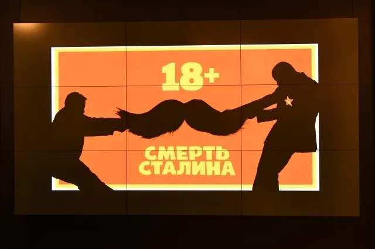

# Совесть на прокат. Скандал с фильмом «Смерть Сталина» демонстрирует удивительное: чиновники и депутаты просто не верят в моральность личного выбора россиян

- **URL:** https://novayagazeta.ru/articles/2018/01/26/75284-sovest-na-prokat
- **Дата:** 2018-01-26
- **Автор:** Лариса Малюкова

## Совесть на прокат

## Скандал с фильмом «Смерть Сталина» демонстрирует удивительное: чиновники и депутаты просто не верят в моральность личного выбора россиян

Афиша с фильмом «Смерть Сталина», у которого Минкульт отозвал прокатное удостоверение. Фото: РИА НовостиНе ладно, гнило в кинематографическом королевстве. Его колотит лихорадка скандалов. Скандалы случались и раньше, но не в режиме ежедневных новостей. По привычке во всем ищем след культурного министерства. Оно, действительно, бодрствует, переживает за нашу мораль, неспособность личного выбора. Кнутом и пряником направляет потоки зрителей в лоно отечественной кинематографии. Расчищает залежи иностранных фильмов, предлагает прокатчикам игру на выбывание: «возьми прокатку — отдай прокатку». Мишка Падингтон, несмотря на объявленную охоту на него, проскочил, а вот со «Смертью Сталина» хуже: судьба его печальна, несмотря на фронду кинотеатра «Пионер», показавшего фильм.

Зрители, пробившиеся на показ тоталитарной комедии, рассказывают: до последнего боялись, что сеанс отменят. И когда во время смотра дверь в кинозал открывалась, думали: «Ну, все, пришли выгонять!»

Опытные. Боялись не напрасно.

Сотрудники полиции пришли в «Пионер» с проверкой на «экстремизм». Силовики с невиданной скоростью реагируют на письмо возмущенного Общественного совета при Минкультуры генпрокурору Юрию Чайке с просьбой изучить фильм на предмет «возможных угроз общественной безопасности при прокате». И теперь уже эксперт Чайка даст свою оценку фильму…

«Смерть Сталина» отменить! (Обновлено)

Минкульт поддержал призыв общественности запретить показ комедии о кончине вождя. Новый скандал изменит индустрию кино

По поводу неожиданной храбрости Александра Мамута, которому принадлежит «Пионер», бродит много слухов.

Но, судя по всему, повода для них нет. Юристы кинокомпании просто разъяснили, что риск за показ недублированной копии в одном из многих кинотеатрах большой киноимперии Мамута — небольшой. Первое предупреждение и штраф до 100 тысяч рублей. А билеты уже распроданы уже на семь дней вперед.

Эксперты считают поведение крупного бизнесмена символическим: Мамут дает понять, что шансы Мединского удержать пост главного по культуре невысоки. Но теперь, с приходом на сцену Чайки, похоже, уже и у самого бизнесмена возникают проблемы, которые простым штрафом не решить.

Александр Мамут. Фото: РИА НовостиПоддержите нашу работу!

1000 500 300 Нажимая кнопку «Стать соучастником», я принимаю условия и подтверждаю свое гражданство РФ

Если у вас есть вопросы, пишите [email protected] или звоните:+7 (929) 612-03-68

Любопытно, что не только властные структуры в последнее время возбудились, но и сами творцы не спят. Заложники не вечности, но момента — они его ловят.

Письма в поддержку минкультовской политики ручного управления подписывают ведущие игроки кинорынка, не только Бондарчук, но и глава российского офиса 20th Century Fox Вадим Смирнов. Письмо с предложением запретить «Смерть Сталина» подписали не только «бесогоны» Юрий Поляков и Никита Михалков, но и прокатчик Алексей Рязанцев, директор кинокомпании «Каро-Премьер». Ничего личного — только деньги и интересы своей компании. Видимо, надеются, что пинать в прокате будут других, более слабых, а им-то удастся ухватить самые аппетитные даты для премьер.

Есть другая беда: атмосфера реакции сгущается, в предвыборное время достигая клинической патологии. В подобные нервные моменты очередные трибуны особенно рьяно радеют за нравственность — чем создают нарядную витрину цензурных ограничений. С лампочками. Неистовые братья-близнецы Соловьев и Киселев обнаруживают второе дыхание в марафонском забеге против неверных, но в общественное пространство выходят и новые творцы патриотического угара. Тот же Юрий Поляков, Захар Прилепин, Павел Пожигайло, Никита Михалков, Елена Драпеко готовы возглавить полки против зарвавшихся аморальных творцов и окормлять, направлять на духовный путь массы, которым все равно, куда идти.

Идея формирования Совета по нравственности давно носится по высоким кабинетам. «Смерть Сталина» стала очередным импульсом к его организации.

Елена Драпеко предлагает сформировать «высший суд по нравственности». Не избалованная ролями в современном кино, актриса и неравнодушный депутат с трибуны призывает «жить по законам военного времени». История мирового кино, в котором случаются не только патриотические блокбастеры, но и комедии, порой — сатирические, прошла мимо нее?

«Смерть Сталина» пролетела бы по малым экранам незаметной мухой, однако забили в набат защитники родины.

Открыто усматривают в сатире — издевательство, в отличной игре британских актеров — «мерзость», в изобличении упырей из окружения вождя — «очередную форму психологической войны против нашей страны».

Может быть, властолюбцы узнали на экране себя, собственные страхи? Как расстаться с прошлым со смехом, когда прошлое планируется в будущем? Как не запутаться в словах и делах, когда кругом одни подмены?

Даже правильное начинание — снятие с поста по просьбе общественности руководителя Госфильмофонда за многочисленные нарушения и коррупцию — упирается в тупик. Похоже, новый глава ГФФ Вячеслав Тельнов попал в западню разнонаправленных интересов сильных киномира сего, лично связанных с верховной властью. Среди удивительно нелепых затей — слияние громадного ГФФ с Музеем кино. Заметим, объединение разумно в дальних перспективах. Сейчас же, когда завалы ГФФ разгребает прокуратура, а музей, несмотря на щедрое финансирование, едва дышит, их объединение выглядит надругательством и над детищем создателя киномузея Наума Клеймана, и над делом главного хранителя ГФФ Владимира Дмитриева. И кому вершить это светлое будущее, когда научные сотрудники в обоих ведомствах загнаны или изгнаны? Но игра «за бразды» в архиве неожиданно стала частью борьбы за кресло министра. Ближайшее время покажет, кто ее выиграет. В проигрыше, как обычно, скорей всего останутся научные сотрудники и дело их жизни.

Российская киноиндустрия со страхом ждет выборов нового руководства. А ну как пробьется к министерскому креслу член Высшего совета «ЕдРа» и редактор книги архиерея Шевкунова Елена Ямпольская? Все звонкие скандалы вокруг Мединского покажутся детскими играми.

Поддержите нашу работу!

1000 500 300 Нажимая кнопку «Стать соучастником», я принимаю условия и подтверждаю свое гражданство РФ

Если у вас есть вопросы, пишите [email protected] или звоните:+7 (929) 612-03-68
