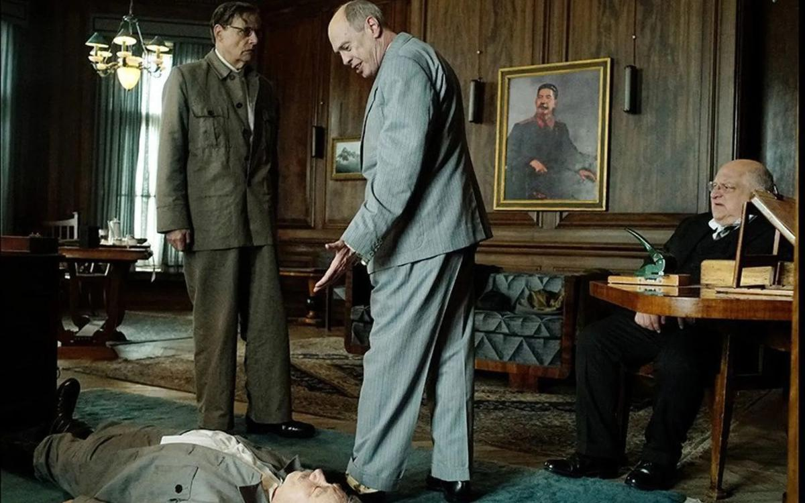

# Приговор «Сталину» вынесет прокурор. История с запретом показа комедии о смерти вождя СССР разобщила киносообщество

- **URL:** https://novayagazeta.ru/articles/2018/01/31/75344-chayka-i-putin-reshat-sudbu-stalina
- **Дата:** 2018-01-31
- **Автор:** Лариса Малюкова

## Приговор «Сталину» вынесет прокурор

## История с запретом показа комедии о смерти вождя СССР разобщила киносообщество

Фото: «Новая газета»Никита Михалков, руководитель большого Союза кинематографистов, был одним из инициаторов специального просмотра фильма «Смерть Сталина» Общественным советом Министерства культуры. И затем разделил негодование с коллегами, обнаружившими в фильме унижение лиц, занимавших высшие государственные должности. «КиноСоюз», который возглавляет Алексей Попогребский, выразил мнение более молодого поколения. В их заявлении прокатные удостоверения, используемые в России, названы инструментом цензуры. С помощью «прокатки» «влиятельные лица» получают возможность по своему усмотрению переносить выход фильмов или вовсе не выпускать их в прокат.

Кинематографисты требуют ввести уведомительный порядок получения прокатных удостоверений. «Только суд, — сказано в заявлении, — может принимать решения о запрете фильмов».

Совесть на прокат

Скандал с фильмом «Смерть Сталина» демонстрирует удивительное: чиновники и депутаты просто не верят в моральность личного выбора россиян

«КиноСоюз» ведет консультации с юристами и намерен подать иск на Минкульт «по факту применения прокатных удостоверений в качестве инструмента цензуры». Письмо подписано ведущими российскими кинематографистами, членами Правления «Киносоюза»: Борисом Хлебниковым, Мариной Разбежкиной, Виталием Манским, Алексеем Федорченко, Владимиром Коттом, Евгением Гиндилисом и другими.

Ранее Общественный совет при Минкультуры направил генпрокурору Юрию Чайке письмо с просьбой вынести министру культуры Владимиру Мединскому предостережение «о необходимости принятия мер по недопустимости нарушения законодательства» в связи с вредным фильмом, «направленным на возбуждение ненависти и вражды, на унижение достоинства российского (советского) человека».

Поддержите нашу работу!

1000 500 300 Нажимая кнопку «Стать соучастником», я принимаю условия и подтверждаю свое гражданство РФ

Если у вас есть вопросы, пишите [email protected] или звоните:+7 (929) 612-03-68

В последние дни пиратская копия фильма «Смерть Сталина» отправилась в путешествие по Интернету.

В итоге наказанной оказалась независимая прокатная копания «Вольга», которая не может выпустить фильм даже на DVD, потому что отзыв «прокатки» распространяется на все виды носителей. Ну и зрители, разумеется. Благодаря усилиям «влиятельных лиц», они вынуждены смотреть фильм в чудовищном качестве.

Мы прошли еще одну веху. С нынешней поры главным арбитром в современном российском кино является даже не министр Владимир Мединский, а Генеральный прокурор Юрий Чайка.

Именно у него ищут справедливости российские кинематографисты. Впрочем, вскоре и мнения Чайки будет недостаточно.

«Смерть Сталина» отменить! (Обновлено)

Минкульт поддержал призыв общественности запретить показ комедии о кончине вождя. Новый скандал изменит индустрию кино

Слухи о скандальном фильме уже разнеслись по стране. И понемногу закручивается очередной виток массовой истерии оскорбленных. Со своим протестным заявлением против «оскорбительной для россиян картины» выступили волгоградские ветераны. В своем письме президенту они требуют запретить фильм окончательно, независимо от результатов экспертизы. Достигнет ли эта эпидемия масштабов шума вокруг «Матильды», покажет время.

Поддержите нашу работу!

1000 500 300 Нажимая кнопку «Стать соучастником», я принимаю условия и подтверждаю свое гражданство РФ

Если у вас есть вопросы, пишите [email protected] или звоните:+7 (929) 612-03-68
