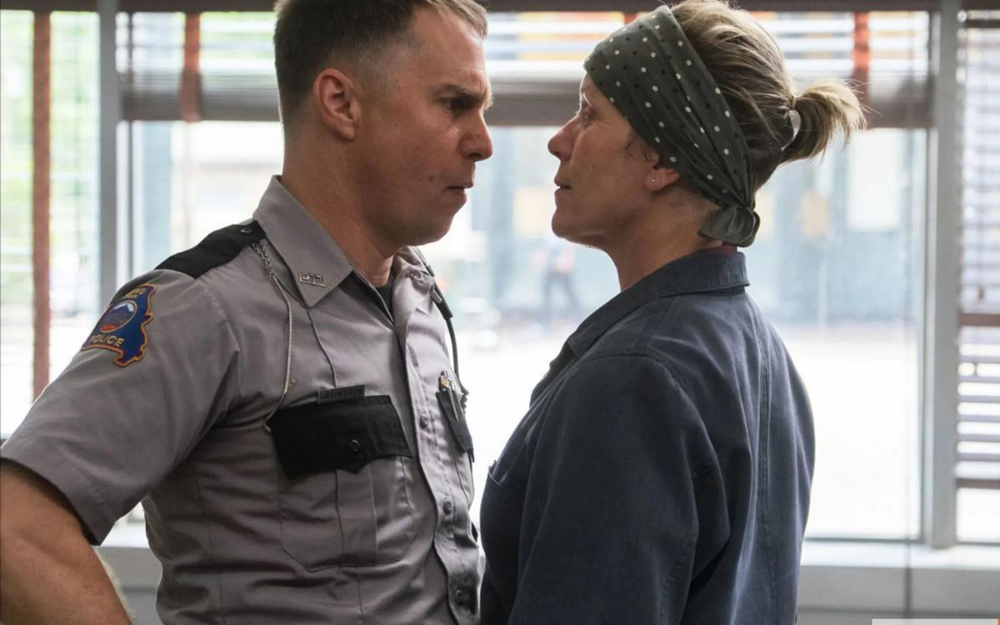

# «Посеешь гнев… пожнешь гнев». На российских экранах — главный фаворит «Оскара» «Три билборда на границе Эббинга, Миссури»

- **URL:** https://novayagazeta.ru/articles/2018/02/02/75370-poseesh-gnev-pozhnesh-gnev
- **Дата:** 2018-02-02
- **Автор:** Лариса Малюкова

## «Посеешь гнев… пожнешь гнев»

## На российских экранах — главный фаворит «Оскара» «Три билборда на границе Эббинга, Миссури»

Фото: kinopoisk.ruКогда вы прочитаете аннотацию: «50-летняя женщина, чью дочь изнасиловали и убили, вышла на тропу войны с полицией в родном городе», — подумаете: еще одно голливудское кино о мести. Но Мартин Макдонах — британский режиссер и драматург ирландского происхождения не снимает традиционных фильмов. Не сочиняет банальных историй про одиноких мстителей. Российские театры охотно ставят его провокационные пьесы «Человек-подушка», «Лейтенант с острова Инишмор» из-за их неожиданности, обезоруживающей искренности. И в его картинах «Залечь на дно в Брюгге» и «Семь психопатов» фантасмагория высекается из серы скучного быта, сюжетные парадоксы расслаиваются в бисерные ленты диалогов. В «Брюгге» пытаются убить человека, который и сам решил покончить с собой. В «Билбордах» виноватыми в убийстве пытаются сделать не причастных к преступлению. Но есть ли в этом круговороте преступлений и добродетелей – непричастные…

Милдред Хейс (Фрэнсис МакДорманд), отчаявшись добиться справедливости, купила огромные рекламные щиты и написала «обвинения» полиции и шерифа Уиллоуби (Вуди Харрельсон). Крупными буквами. «Изнасилована во время умирания», «И до сих пор никаких арестов», «Как же так, шеф Уиллоуби?»

Она уверена, что полицейские заинтересованы в пытках чернокожих больше, чем в содействии правосудию. И затхлый южноамериканский «твин пикс», где все про всех знают все и ничего, всколыхнется.

Потому что история Милдред коснется каждого, встряхнет и перевернет «верх дном».

Kinopoisk.ruВ мрачной, балансирующей между комедией, трагедией, абсурдом и реализмом истории нет правых и виноватых. Макдонах связывает клубок конфликтов из взаимоотношений сложных людей. И это множественность взглядов на происходящее – покруче любого 3D. Шериф Уиллоуби, приговоренный неизлечимой болезнью, старается не только быть хорошим мужем и отцом, но и понять убитую горем женщину. Его помощник Диксон (Сэм Рокуэлл) – безжалостный с «нигерами»… инфантил и маменькин сынок (взаимоотношения мамы и сына – почти цитата из «Мотеля Бейтса»). Тупой жесткий коп… рыдает, потеряв товарища и шефа, и протягивает руку тому, кто его чуть не убил (СэмРокуэлл). Карлик Джеймс (Питер Динклэйдж) покрывает неистовые выходки Милдред, отчетливо и безответно ей симпатизируя. Персонажи — выходцы из американского дна — нарисованы острым грифелем, почти карикатурно. Но из-под сухой графики прорываются сокрушительные человеческие страсти, комплексы, неуверенность, ранимость.

Kinopoisk.ruНе случайно Уэлби рекламщик (Калеб Лэндри Джонс), к которому за помощью обратится Милред, читает книжку Фланнери О’Коннор, соотечественницы режиссера, представительницы жанра южной готики. И кино Макдонаха — плоть от плоти южноготического стиля, с отзвуками фолкнеровского хаотичного мира с его «маленьким клочком земли величиной с почтовую марку», на котором одномоментно вершатся трагедии и комедии. Здесь пришлась к месту и идея Коннор о милосердии, способном изменить человека — но цена эта преображения будет высочайшей.

Человек всегда больше наших представлений о нем. Мысль вроде бы очевидная, но распотрошенная суетой будней и социальных распрей. Макдонах напоминает нам о ней. Его герои способны в минуты ярости совершить непоправимое. А ради поступка - забыть о собственной смертности. Обнаружить не только в другом, но и в себе, бесконечность, где все смешалось: добро, зло, преступление, благочестие.

Поддержите нашу работу!

1000 500 300 Нажимая кнопку «Стать соучастником», я принимаю условия и подтверждаю свое гражданство РФ

Если у вас есть вопросы, пишите [email protected] или звоните:+7 (929) 612-03-68

Kinopoisk.ruВ центре этого мрачного, но не беспросветного захолустного космоса — Милдред: никогда не улыбающаяся жертва обстоятельств, превратившая свою скорбь в карательное оружие. Мучимая демонами, страдающая от собственной упрямости и безжалостности. Выбивающая из действительности, как из старого пыльного ковра — справедливость. Нисколько не надеясь на «высший суд», потому что «там нет никакого Бога, и весь мир пуст, и неважно, что мы делаем друг с другом». Это лучшая роль МакДорманд со времен Фарго. При почти замороженной мимике она играет шекспировский диапазон эмоций. Среди незабываемых сцен — ее диалог с оленем. А с кем еще может поговорить по душам убитая горем мать?

Золотой глобус: женщины в черном начинают и выигрывают

Одна из самых престижных в мире кинопремий приобрела траурный вид и феминистский уклон

Стиль Макдонаха часто сравнивают со стилем Тарантино, Ричи, братьев Коэнов. Сам он этого сходства не видит. Среди своих учителей называет Билли Уайлдера, Терренса Малика, раннего Скорсезе, Орсона Уэллса, а также Пауэлла и Прессбургера.

Снимает по своим сценариям. «Оскар» получил за первый же короткометражный фильм. В кино нарушает правила.

Его фильмы многословны. Не боится банальностей, играет с ними, как в бисер, расшивая фразами вроде «Гнев порождает больший гнев» или Даже хорошим детективом не стать, потому что хорошему детективу нужна любовь». За произнесенными вслух банальностями, маячат тени недосказанности, после просмотра формулируемых смыслов.

Ему присущ разнофактурный, порой непристойный «юмор висельника». Меланхолия и ужас заряжают это мрачное со всполохами черного юмора кино, в котором небо и земля сошлись в клинче, и не размыкают объятий. И персонажи, барахтаясь в этом хаосе, вроде бы пытаются «не держаться за ненависть», ищут собственный выход, но никогда не знают, куда именно выберутся.

Kinopoisk.ruОтказ МакДонаха от ясных моральных убеждений уже вызвал негативную реакцию критики. И даже «Оскар» вряд ли утихомирит споры о «билбордах».

Кстати, книжка Фланнери, которую читал рекламщик, сделавший привлекающие внимание алые щиты для мамаши Милдред называлась: «Хорошего человека найти нелегко». Точно. И не только в фильмах Макдонаха.

Поддержите нашу работу!

1000 500 300 Нажимая кнопку «Стать соучастником», я принимаю условия и подтверждаю свое гражданство РФ

Если у вас есть вопросы, пишите [email protected] или звоните:+7 (929) 612-03-68
