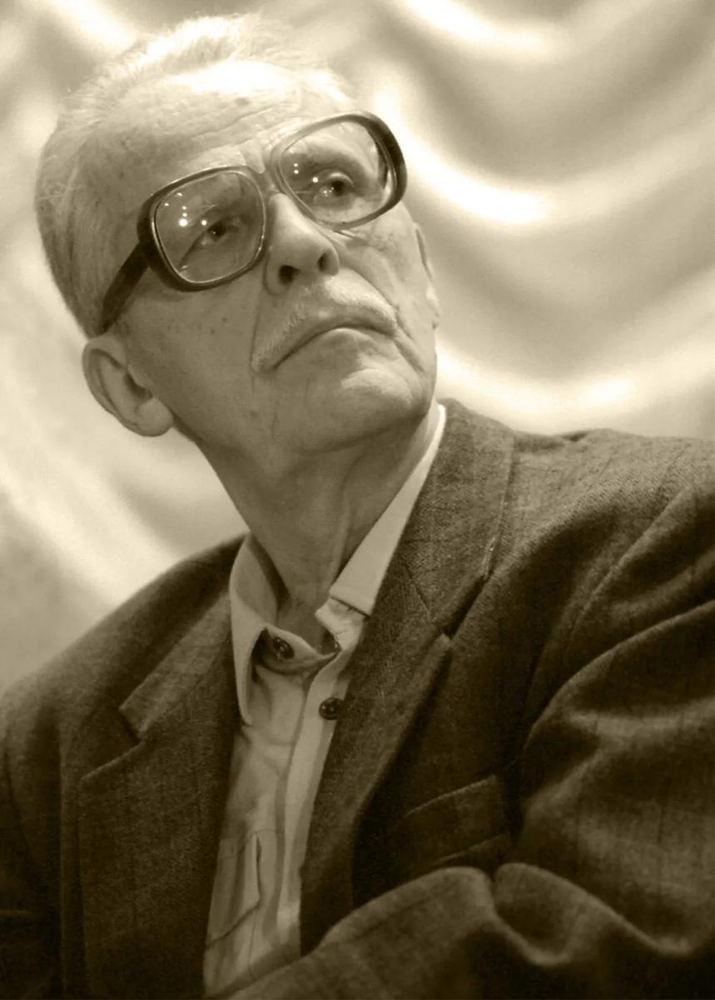

# Завтра была война. 21 июня 2018 года по инициативе «Новой газеты» в Москве будет установлена мемориальная доска писателю Борису Васильеву. На доме 5 «б» по улице Часовой, где он жил и работал

- **URL:** https://novayagazeta.ru/articles/2018/02/05/75386-zavtra-byla-voyna
- **Дата:** 2018-02-05
- **Автор:** Лариса Малюкова

## Завтра была война

## 21 июня 2018 года по инициативе «Новой газеты» в Москве будет установлена мемориальная доска писателю Борису Васильеву. На доме 5 «б» по улице Часовой, где он жил и работал

Фото: Николай Симаков / ТАССЭто сама память Москвы выдвигается на новые рубежи, далеко за Садовое кольцо. Здесь, между «Соколом» и «Аэропортом», не так много мемориальных досок. Но через Ленинградский проспект Борису Львовичу кивнут генерал авиации Юмашев, конструкторы Яковлев и Микоян, бронетанковый маршал Катуков. От «Аэропорта» — Константин Симонов. И кресты-обелиски погибшим на Первой мировой и юнкерам, погибшим в московских уличных боях октября 1917-го, памятники недальнего парка на месте Братского кладбища тоже примут в свой круг его мемориальную доску.

Он с Москвой сурового стиля, с веком великих войн и великих надежд 1960—1970-х связан кровно. На Отечественную 17-летний Васильев ушел добровольцем в июле 1941-го. Осенью 1941-го хлебнул по полной окружения под Смоленском.

Главные его книги — о той войне. Об очень молодых, очень чистых людях в солдатских цепях Отечественной. Повесть «А зори здесь тихие…» потрясла страну в 1969-м, почти сразу стала спектаклем Юрия Любимова и фильмом Станислава Ростоцкого. Лейтенант Плужников из «В списках не значился» (1974) продолжит ряд. Повесть «Завтра была война» (1984) резко усложнит тему трагедии 1940 года, сотрясающую 9 «Б», тень ГУЛАГа, легшая на судьбы героев, — тоже пролог к Отечественной: тут ведь всем на фронт иттить…

Поддержите нашу работу!

1000 500 300 Нажимая кнопку «Стать соучастником», я принимаю условия и подтверждаю свое гражданство РФ

Если у вас есть вопросы, пишите [email protected] или звоните:+7 (929) 612-03-68

«Не стреляйте в белых лебедей» или романы серии «История рода Олексиных» — нота этой прозы везде чиста. И в свой жестокий век Борис Васильев явно выполнял еще один долг: дать городу и миру живой пример достойного человека.

Собственно, этот пример он дает до сих пор. Книги-то его — читают. Читают очень молодые люди, ровесники героев «Завтра была война». Тектонические сдвиги в политике и словесности ничего не изменили. Читают!

А теперь и на улице Часовой, дом 5 «б», появится бронзовый профиль.

В беседке на берегу Волги выпускники вместе с учителем математики Василием Павловичем Рубинским встречают рассвет. 22 июня 1941 года. Радио начинало вещание с 6 часов утра. Весть о войне пока не дошла до городка. Для ребят еще мирное время. Из личного альбома В.П. Рубинского. Фото из коллекции Натальи Масловой www.rusalbom.ruприглашение к участию в конкурсе«Новая газета» и мэрия Москвы объявляют конкурс на создание мемориальной доски памяти писателя Бориса Львовича Васильева Департамент культуры Москвы согласовал ходатайство «Новой газеты» об установке мемориальной доски писателю и драматургу Борису Васильеву. Памятный знак появится по адресу: ул. Часовая, 5 «б», — где жил и работал Борис Львович. «Ваше ходатайство рассмотрено с положительным результатом», — сообщила мэрия города. Это означает, что с сегодняшнего дня «Новая газета» может объявлять конкурс на проект этого памятного знака. К участию допускаются студенты и выпускники художественных, архитектурных и строительных вузов. Возраст участников — до 40 лет. Конкурс начнется 5 февраля и завершится 5 марта, еще две недели потребуется на то, чтобы «Новая газета» опубликовала представленные проекты, а специальное жюри оценило работы и определилось с победителем. Дату открытия памятного знака — 21 июня 2018 года — подсказало название одного из самых известных произведений Бориса Васильева «Завтра была война». Проекты своих работ направляйте на адрес редакции. В теме письма укажите: «На конкурс мемориальной доски Борису Васильеву». Тел.: 8 495 624-20-54 e-mail:[email protected]Поддержите нашу работу!

1000 500 300 Нажимая кнопку «Стать соучастником», я принимаю условия и подтверждаю свое гражданство РФ

Если у вас есть вопросы, пишите [email protected] или звоните:+7 (929) 612-03-68
