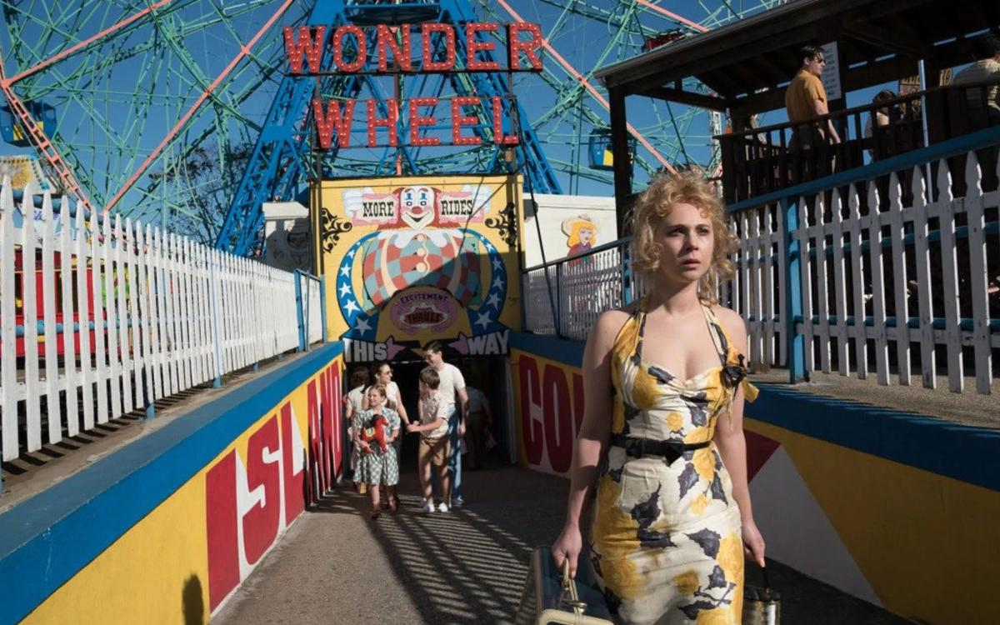

# Харассмент и Вуди Аллен на чертовом колесе. Скандал расколол киномир

- **URL:** https://novayagazeta.ru/articles/2018/02/07/75413-harassment-i-vudi-allen-na-chertovom-kolese
- **Дата:** 2018-02-07
- **Автор:** Лариса Малюкова

## Харассмент и Вуди Аллен на чертовом колесе

## Скандал расколол киномир

«Колесо чудес». Кадр из фильмаФото: EPAПокупая билеты на «Колесо чудес», зритель, как в аптеке, точно знает, какое лекарство хочет получить. Очередной психологический аттракцион от Вуди Аллена — ​успокаивающее, отвлекающее от насущных проблем средство. Словно сам зритель поднимается не спеша по прогнившим деревянным ступенькам, усаживается в неустойчивую кабинку, отдается неспешному кружению старого колеса обозрения…

Все начнется с привычного, погружающего в нирвану ретроджаза. С разно­цветного пляжного городка Кони-Айленд, пережившего пик популярности в первой половине ХХ века. И вот пятидесятые: сверкающая жизнь парка развлечений постепенно угасает. Но народ толпится еще у тира и у допотопных аттракционов, закусывая сладкой ватой шоу уродов… В тени гигантского чертова колеса находится квартирка выпивохи оператора карусели Халтая (Джим Белуши) и его жены Джинни (Кейт Уинслет) — ​мечтательной официантки в местном рыбном кафе. Несостоявшаяся актриса, она воображает, что лишь играет роль официантки. Мужа она не любит, семья тоже временная обитель. Два события в корне меняют размеренную, как смена волн на пляже, жизнь. Зрелая Джинни влюбляется в юного спасателя с вышки номер семь Микки (Джастин Тимберлейк). А на пороге домика под чертовым колесом возникнет дочь Халтая — ​прехорошенькая Каролина (Хунно Храм): «Папаня!» «Какого черта она выскочила за гангстера, — ​чертыхнется Халтай-Болтай, — ​а теперь явилась не запылилась». Но все для виду, вскоре он уже готов опекать и прятать дочь от реальной опасности. Вряд ли головорезы из банды мужа простят свидетельницу закапывания трупов. Все усложняется любовным треугольником: Джинни — ​ее спасатель — ​скрывающаяся в Кони-Айленде старлетка Каролина.

Здесь не только Джинни — ​все играют роли, временные вводы. Им, обычным, хотелось бы быть необычнее. Джинни ждет настоящей карьеры и настоящей любви. Микки, мечтая о будущем писателя, протирает плавки на вышке номер семь. Единственное спасение — ​книжки, прежде всего, отца американской драмы О’Нила, которому он пытается подражать. Потому что это пьесы не о том, «кем мы кажемся», — ​а о том, что мы на самом деле из себя представляем. Каролина временно прячется в пляжном Кони-Айленде. И даже их взаимные перепутанные влюбленности кажутся лишь еще одной театрализованной мелодрамой, которая освещает коротким бенгальским огнем их прозаическую жизнь. В этой песчаной кони-айлендской реальности, подсвеченной лампочками аттракционов, озвученной гомоном праздной толпы, пьют аспирин от простуды и снотворное — ​от любви. На день рождения дарят ворованный телефон за 3 доллара. Пытаются скопить деньжат, чтобы помочь юной жене гангстера пойти в вечернюю школу. Им кажется, что лучший шанс вырваться и унестись ввысь на чертовом колесе из этого вязкого песка — ​влюбиться. Но рано или поздно приходит расставание с мечтами.

Лучшее, что есть в этом кино: Кейт Уинслет и съемка обладателя трех «Оскаров» классика Витторио Стораро. Уинслет играет женщину-стихию: дождь, ветер, проблески солнечных лучей. Кажется, она сама придумала себе, что талантлива. Просто она не совпадала с жизнью, которая ей выпала. Вот и вынуждена вместо поклонов, аплодисментов и зубрежки текстов неприкаянно чистить рыбу и моллюсков.

Витторио Стораро с помощью специальной оптики и фильтров сгущает и поэтизирует реальность. И главные персонажи имеют свою цветовую гамму. Джинни — ​это теплые закатные цвета: охра, оранжевый, красный. Каролине отданы соцветья моря: голубой, изумрудный. Микки попеременно отражает тональность влюбленных в него женщин. И всех их «подсвечивают» отблески огней аттракционов. «Мы старались создать театральную драму, — ​говорит Аллен. — ​Наши герои живут посреди вечной суматохи, которая бурлит прямо у них за окном, — ​взять хотя бы стрельбу внизу или огни, из-за которых все время меняется цвет их жилища».

При всей сделанности «Колесо чудес» само немного напоминает Кони-Айленд, в фильме отзвуки многих картин Аллена. К тому же есть ощущение усталости. Впрочем, это вечная тема: «Аллен снимает так много и часто, что его кино недостает блеска».

Поддержите нашу работу!

1000 500 300 Нажимая кнопку «Стать соучастником», я принимаю условия и подтверждаю свое гражданство РФ

Если у вас есть вопросы, пишите [email protected] или звоните:+7 (929) 612-03-68

Другое дело, тема харассмента. Запущенная голливудским киноскандалом кампания против провинившихся мужчин не могла не разжечь вновь костер нападок и против Вуди Аллена. Он-то, как помним, был среди первых, кого настигли (и продолжают настигать) обвинения в сексуальных домогательствах. Приемная дочь режиссера Дилан Фэрроу и ее мать (жена Аллена) актриса Миа Фэрроу на протяжении многих лет публиковали разоблачительные письма и заявления. Две известных клиники, Child Sexual Abuse Clinic и New York State Child Welfare, провели тщательное расследование, заключив, что никакого надругательства не было. А, напротив, велика вероятность, что уязвимому ребенку внушила историю разочарованная расставанием мать. Все это было раньше.

Но скандал вокруг Харви Вайнштейна вновь возбудил в головах «голливудской общественности» повышенный интерес к фигуре знаменитого режиссера. Да он и сам подбросил дров в костер, сформулировав собственный взгляд на проблему: «Это так трагично для бедных женщин, которые были в это вовлечены, и грустно для Харви, чья жизнь теперь испорчена. Победителей тут нет и не будет. Хотелось бы только, чтобы этот скандал не привел к «охоте на ведьм» в лице мужчин, к атмосфере Салема, в которой каждый парень, подмигнувший девушке в офисе, должен был бы сразу бежать звонить своему адвокату». Вспомним, что слово «харассмент» стало распространено в Европе в ХVII веке и означало «натравить охотничью собаку на дичь».

В двусмысленном положении оказались актеры, которые снимались у Вуди. Некоторые из них поспешили выразить сожаление «из-за прежнего опыта работы с Алленом». Среди них Ребекка Холл («Дождливый день в Нью-Йорке», «Вики Кристина Барселона»), Мира Сорвино («Великая Афродита»), Дэвид Крамхолц («Колесо чудес»). Некоторые звезды, например, Селена Гомес предпочитают верить словам Аллена и не намерены прекращать работать с ним. В «Дождливом дне в Нью-Йорке» снимаются Эль Фаннинг, Лив Шрайбер и Тимоти Шаламе. Правда, Шаламе решил перевести свой гонорар за фильм в благотворительные организации: в том числе — ​Time’s Up, целью которой является борьба с сексуальными домогательствами. В общем, все это похоже на кино Вуди Аллена, в котором взаимодействуют иррациональные социопаты.

Любопытно, что и многие критики в связи с этой во всех отношениях нездоровой ситуацией, разрушающей сверкающую голливудскую мифологию, взялись пересматривать и осуждать фильмы Вуди Аллена, снятые им на протяжении долгой карьеры.

Теперь они находят, что в фильмах Аллена «всегда было что-то сексуально грязное», «скользкое». Как он мог позволить «отношения» в «Манхэттене» (1980) — ​между сорока­двухлетним Исааком и семнадцатилетней Трейси? Сомнительными названы «Воспоминания о звездной пыли», там в одной сцене девочка-подросток называет персонажа Аллена «сексуальным». «Преступления и проступки» — ​вызывают подлинное отвращение, в фильме он играет режиссера-документалиста Клиффа Стерна, проявляющего интерес к юной Дженни.

Пострадал от скандала и фильм «Колесо чудес», его нью-йоркская премьера прошла без красной ковровой дорожки, так как накануне продюсер студии Amazon Рой Пирс был уволен из-за обвинений в харрасменте.

Впрочем, многомиллионная аудитория не слишком обращает внимание на злые тексты, громкие обвинения, доверяя больше режиссеру, нежели его прокурорам. И ждет очередную порцию утешения от некрасивого, немолодого, носатого невротика в его очередной меланхолической трагикомедии. Лекарства надо принимать постоянно, особенно хроникам с подвижной психикой.

Поддержите нашу работу!

1000 500 300 Нажимая кнопку «Стать соучастником», я принимаю условия и подтверждаю свое гражданство РФ

Если у вас есть вопросы, пишите [email protected] или звоните:+7 (929) 612-03-68
