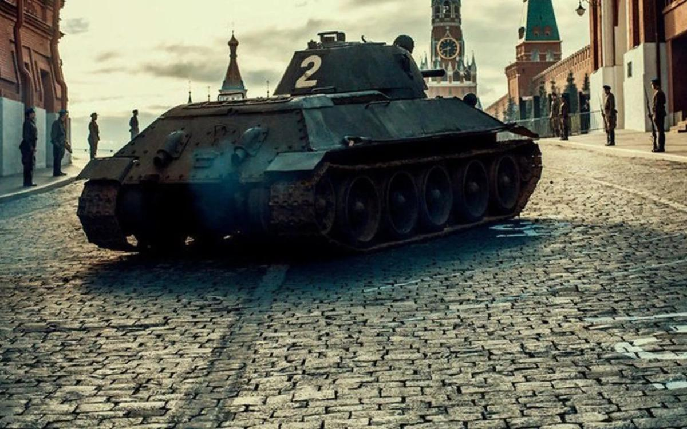

# Активируй Шульца! «Танки» на ММКФ… Приехали. Премьера нового фильма от создателей «28 панфиловцев»

- **URL:** https://novayagazeta.ru/articles/2018/04/20/76249-aktiviruy-shultsa
- **Дата:** 2018-04-20
- **Автор:** Лариса Малюкова

## Активируй Шульца!

## «Танки» на ММКФ… Приехали. Премьера нового фильма от создателей «28 панфиловцев»

Кадр из фильма «Танки»Такого вы давно не видели. И вот опять. В основе нового историко-патриотического «хита» с рабочим названием «Увидеть Сталина» Кима Дружинина — история пробега двух экспериментальных танков Т-34 Михаила Кошкина из Харькова в Москву с целью продемонстрировать их могучесть, а значит, необходимость производства новых танков для победы СССР в Великой Отечественной войне.

По сути, «Танки» — идеальное с точки зрения минкульта кино: пропагандистский блокбастер. Фильм и создан по инициативе министра. Ему сразу дан был зеленый свет. Владимир Мединский собственнолично посетил съемки, вспомнив свою профессию пиарщика, объяснил журналистам, что сценарий привлекает внимание достоверностью сюжета и выбором персонажей:

«Увидеть Сталина» — это правильное российское кино… Сценарий фильма заинтересовал нас именно тем, что в нем ничего не было выдумано. Эпизод встречи Кошкина со Сталиным действительно был».

Мединский на линии

Ключевые события карьеры ответственного хранителя культуры современной России

При этом авторы подумали о зрителе и пообещали приключенческий экшн с выдумкой. Ну, в кино еще и не то сочиняли. Тарантино вон в «Бесславных ублюдках» завершил Вторую мировую в кинотеатре, и Гитлера убил сержант «Жид-Медведь».

Кадр из фильма «Танки»После необъявленной войны на Халхин-Голе страна хочет вооружиться новыми танками — на гусеничном ходу. Чтоб броня была крепка и были быстры, в пекле не плавились. «Не знаю, сколько осталось воевать мне, но у Красной армии впереди еще не одна война», — прозорливо возглашает красный командир с Красной звездой и орденом Ленина на груди. И вот есть такой танк! Но на завод приходит приказ: экспериментальные танки к торжественному смотру на Красной площади без предварительных испытаний не допускать, на платформы не грузить! Тут-то выдающегося конструктора Михаила Ильича Кошкина (Андрей Мерзликин и вправду похож на своего героя) осеняет счастливая идея: грузить нельзя — своим ходом можно. Лично Жуков разрешил — уже даже доложил товарищу Сталину.

Начинается роуд-муви. Два секретных образца движутся через страну — Харьков, Белгород, Курск, Орёл. Тула. Едут: сам Кошкин, симпатичный, но строгий особист, два водителя и милая, хотя и своенравная девушка Катаева, которая знает все про режим закалки стали.

Кадр из фильма «Танки»Особист сначала вредный: хочет чудесную, но своенравную Катаеву расстрелять, потом в нее влюбляется. И хорошеет на глазах.

Смотр назначен на 17 апреля 1940-го. Если по 200 км в день — успеют к демонстрации новой советской техники. Это если без приключений. Но раз фильм обращен к юному поколению, приключения — главное блюдо для подростка.

Кадр из фильма «Танки»Враги народа и диверсанты кишмя кишат в тревожное предвоенное время. Сначала невидимый вражина откручивает гайку на баллоне с газом, потом группа немецких диверсантов разнообразными способами пытается уничтожить Т-34. Потом на «пробежчиков» нападет банда «недобитков», засевших в лесах в центре страны.

(Получается, они живут в своих лесных вагонах на заброшенной станции со времен Гражданской войны, двадцать лет, и никакому НКВД до них нет дела?)

Бандиты захватывают и сами машины, думая, что это трактора (это юмор), и их создателя — легендарного Михаила Кошкина. Но когда внешний враг — элегантные «немецкие диверсанты» на конях, типа европейские туристы — нападет, все наши объединятся, и одним выстрелом чудо-танка общего врага разгромят, а бандиты еще и напоят машины дефицитным топливом.

Кадр из фильма «Танки»Поддержите нашу работу!

1000 500 300 Нажимая кнопку «Стать соучастником», я принимаю условия и подтверждаю свое гражданство РФ

Если у вас есть вопросы, пишите [email protected] или звоните:+7 (929) 612-03-68

Фашистский командир решает любой ценой не допустить лучший из танков в Москву: «Они должны исчезнуть! — гортанно приказывает он, и произносит ключевую команду: «Активируй Шульца!» И вот уже по российским дорогам несутся черные мотозомби во главе с кожаным агентом-бомбой. Видимо, на киллера Шульца нет управы.., но не у наших доблестных конструкторов на их космических машинах.

Танки едут под трубную геройскую музыку через грязь, бездорожье. Кошкин прямо в кабине что-то срочно правит в чертежах. Пробег-то испытательный. Водители — парни азартные: даже гонки устраивают по полю: «Врешь, Михал Ильич, не возьмешь». Кошкин и сам знает: «Без этих танков нам не победить». А вокруг пейзажи неохватные: луга, поля, перелески. Россия. На Красной площади их ждет сам товарищ Сталин. И эпохальная встреча генералиссимуса с «ласточкой наших бронетанковых сил» состоится (прав Мединский, в реальной жизни она была). 700 км бездорожья, 7 дней, практически боевые испытания позади. Ура, товарищи! СССР получает стратегическое преимущество. В будущей войне.

Кадр из фильма «Танки»Тут звучит финальный «Марш советских танкистов»: «Гремя огнем, сверкая блеском стали / Пойдут машины в яростный поход, / Когда нас в бой пошлет товарищ Сталин…

Про арестованных и расстрелянных НКВД конструкторов в фильме ни слова. О том, что Кошкин, совершив этот невероятный героический пробег (ранним снежным мартом, а не летом, как в кино), заболел пневмонией, что впоследствии послужило причиной его смерти, даже в титрах не сказано.

Зато слова финальной песни будут помниться долго: «Пусть помнит враг, укрывшийся в засаде, / Мы начеку, мы за врагом следим».

Кадр из фильма «Танки»Над фильмом про танки трудились авторы «28 панфиловцев» — режиссер Ким Дружинин и продюсеры Олег Антипов и Дмитрий Щербанов под присмотром Российского военно-исторического общества. РВИО вручило создателям «святой легенды» о панфиловцах награду «За верность исторической правде» (сорежиссеру Дружинина Андрею Шальопе). Другие историки говорили об эксплуатации в фильме мифотворчества. Но при всех натяжках, идеологических клише, слабом сценарии — в той картины был хотя бы профессионально снятый бой.

Черной земляной тучей взрывался снег, полыхали танки, из жерла кабин выскакивали горящие танкисты и отстреливались от врага. Разработчик популярнейшей онлайн-игры War Thunder («Гром войны»), компания Gaijin Entertainment, присоединилась к созданию фильма, оказывая финансовую и техническую поддержку.

Похоже на грамотную военно-историческую реконструкцию

​​​​​​​Горячо поддержанный Минкультом фильм «28 панфиловцев» посмотрел обозреватель «Новой газеты», а миф об этой знаменитой битве разобрал профессор НИУ ВШЭ

В «Танках» ничего подобного нет. Есть инфантильное, не подкрепленное профессией желание сделать лихую ленту в духе «Смелых людей» или «Огненных верст» — с одной стороны, и «Безумного Макса», с другой.

Хотели зрелищную «киновойну», получили глупую детскую войнушку, в которой фрицы — дебилы, битвы — игрушечные, а белоснежные русские березки не уничтожить вражеским орудиям. Хотели приключения в духе старого кино, получили топорную безвкусную пропагандистскую поделку в духе «Танкистов», созданных за год до пробега Кошкина.

В том фильме зверский «верховный правитель», немецкий генерал Бюллер, начинает операцию по захвату крупного участка советской территории и уничтожению города Красноармейска. Но храбрые советские танки, форсировав реку через непроходимый обрыв, вынуждают немцев к капитуляции.

Про «Танкистов» писали без шуток: «Фильм является пропагандистской картиной, демонстрирующей возможности советских танков и бронечастей, в которой рассматривается сценарий возможной войны». Подобные картины тогда снимались массово, они поднимали дух воинов и обещали короткую и легкую войну.

Первыми зрителями «28 панфиловцев» были Владимир Путин и Нурсултан Назарбаев. Первыми зрителями «Танков» — российские военнослужащие на авиабазе Хмеймим в Сирии. Показ состоялся за три недели до официальной премьеры.

Поддержите нашу работу!

1000 500 300 Нажимая кнопку «Стать соучастником», я принимаю условия и подтверждаю свое гражданство РФ

Если у вас есть вопросы, пишите [email protected] или звоните:+7 (929) 612-03-68
