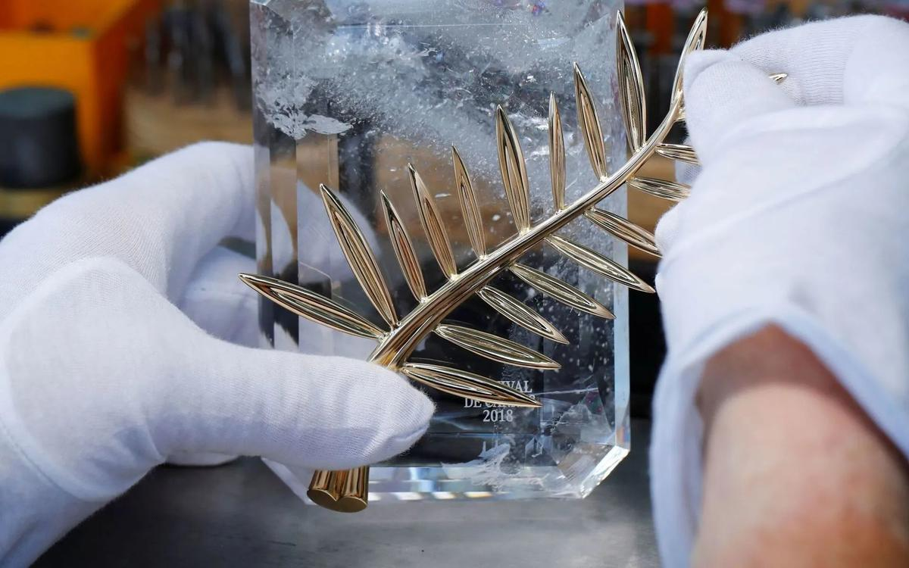

# Канны-2018: Годар, Серебренников, папа Римский. Несмотря на санкции, Россия необычайно широко представлена на 71-м Каннском кинофестивале

- **URL:** https://novayagazeta.ru/articles/2018/05/02/76347-kanny-2018-godar-serebrennikov-papa-rimskiy
- **Дата:** 2018-05-02
- **Автор:** Лариса Малюкова

## Канны-2018: Годар, Серебренников, папа Римский

## Несмотря на санкции, Россия необычайно широко представлена на 71-м Каннском кинофестивале

Фото: Reuters«Лето» Кирилла Серебренникова — черно-белое кино о любви, начале творческой судьбы Виктора Цоя, его отношениях с рок-ветераном Майком Науменко и его женой Наташей — представляет Россию в основном конкурсе. Режиссер был арестован на съемках фильма, завершал работу над ним под домашним арестом. И выпускать его для участия в форуме следствием не планируется.

Кадр из фильма «Лето». Kinopoisk.ruНо только непонимающие всю сложную каннскую механику могут говорить, что приглашение «Лета» — политический акт. Известно, что отборочная комиссия дважды смотрела картину, тянула до последнего с решением. Кроме того, Серебренников уже вошел в так называемую «каннскую номенклатуру». Его «Ученик» участвовал в «Особом взгляде» и получил приз имени Франсуа Шале.

«Лето» придет

Кирилл Серебренников, находясь под домашним арестом, сумел смонтировать фильм о солисте группы «Кино» Викторе Цое

Для Канн участие репрессированных режиссеров не новость. «Это не фильм» Джафара Панахи, снятый под домашним арестом, обласканным едва ли не всеми главными фестивальными наградами иранским режиссером (обвиненным в распространении антиправительственной пропаганды), участвовал в программе 2011-го. Новый фильм Панахи «Три лица» — расскажет о трех иранских актрисах разных поколений. Выпустят ли на фестиваль опального режиссера (домашний арест прекращен), неизвестно, министр культуры Ирана сказал, что «решение еще не принято».

В Каннском конкурсе также «Айка» одного из ведущих российских документалистов Сергея Дворцевого (копродукция России, Казахстана, Польши, Германии, Китая) — об эмигрантке, нелегально живущей в Москве. В 2008-м его полудокументальный «Тюльпан» получил приз «Особого взгляда». Над новым фильмом он работал более шести лет. В конкурсной секции Cinеfondation — «Календарь» Игоря Поплаухина о женщине, решающейся на необычные путешествия. В программе «Каннская классика» покажут один из самых дорогих и знаменитых советских фильмов — «Война и мир» Сергея Бондарчука, удостоенного в 1969 году «Оскара». В лаборатории «Мосфильма» в начале нулевых была отреставрирована киноверсия картины.

Если вспомнить, что членом жюри в этом году стал Андрей Звягинцев, можно отметить плотное представительство России на главном смотре мира. А возглавит жюри основного конкурса австралийская актриса Кейт Бланшетт.

Программа обещает быть сильной. Классик на все времена 87-летний Жан-Люк Годар — наряду с более молодыми конкурентами участник конкурсной программы. Его «Образ и речь» — очередной философский опус, закодированный в слова и метафоры эксперимент, созданный без помощи профессиональных актеров.

Лидер современного независимого китайского кино Цзя Чжанкэ привезет в Канны современный криминальный эпос «Пепел белоснежен» (его «Прикосновение греха» удостоено здесь в 2013-м приза за лучший сценарий). Двукратный обладатель каннского Гран-при итальянец Маттео Гарроне («Гоморра», «Реальность») представит городской вестерн «Догмен» об одном из ужасающих преступлений в послевоенном Риме. Еще одна итальянка Аличе Рорвакер, редкое дарование которой было отмечено также Гран-при жюри за фильм «Чудеса», привезет новую картину «Счастливый Лазарь» о волшебстве времени. Оскароносец Павел Павликовский («Ида») снял «Холодную войну» — историю любви, разворачивающуюся в 1950-е в социалистической Польше.

Случилось и примирение Каннского фестиваля с Ларсом фон Триером (он был объявлен персоной нон грата за высказанные на пресс-конференции симпатии к Адольфу Гитлеру). На фестивале будет показан его «Дом, который построил Джек» с Умой Турман и Мэттом Диллоном в роли серийного киллера.

А сама история задается нетривиальным вопросом: можно ли счесть убийство произведением искусства?

Поддержите нашу работу!

1000 500 300 Нажимая кнопку «Стать соучастником», я принимаю условия и подтверждаю свое гражданство РФ

Если у вас есть вопросы, пишите [email protected] или звоните:+7 (929) 612-03-68

Кадр из фильма «Дом, который построил Джек». Kinopoisk.ruПрограмма «Особый взгляд» откроется 9 мая «Донбассом» Сергея Лозницы, игровым фильмом о событиях на востоке Украины. И вряд ли у этой картины есть прокатное будущее в России.

Среди фестивальных любимцев и дважды лауреат «Оскара» иранец Асгар Фархади («Развод Надера и Симин», «Коммивояжер»). Его семейной драмой, традиционно превращающейся в психотриллер, фестиваль откроется. В главных ролях фильма «Все знают» Хавьер Бардем и Пенелопа Крус. А значит, на Красной дорожке будут звезды первой величины.

В специальных показах документальный фильм немецкого классика Вима Вендерса («Париж, Техас», «Небо над Берлином») «Папа Франциск. Человек слова». Как отметил префект секретариата Святого Престола по коммуникации о. Дарио Эдвардо Вигано, целью проекта было снять фильм не о папе Франциске, а с папой Франциском.

Каннский репертуар традиционно перемешивает работы маститых и новичков. И никогда не знаешь, что именно способно удивить и растрогать насмотренную аудиторию и строгое жюри.

Россия на ММКФ: трагедия — мистика — интим

Армянская трагедия, якутская мистика, китайский дневник

Для заключительной церемонии выбран наконец-то завершенный фильм Терри Гиллиама «Человек, который убил Дон Кихота». В нем наш современник отправляется во времена Дон Кихота, пытаясь выяснить, кто же убил рыцаря из Ла-Манчи. Повлияет ли ответ на этот существенный вопрос на события в нынешнем мире, увидим уже скоро.

71-й Каннский международный кинофестиваль пройдет с 8 по 19 мая 2018 года.

Поддержите нашу работу!

1000 500 300 Нажимая кнопку «Стать соучастником», я принимаю условия и подтверждаю свое гражданство РФ

Если у вас есть вопросы, пишите [email protected] или звоните:+7 (929) 612-03-68
