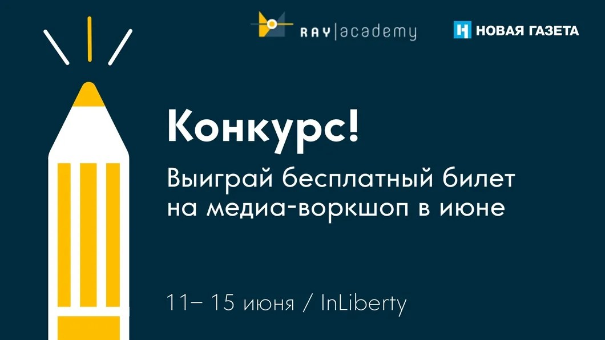

# Городской лагерь для школьников от «Новой» и «Академии RAY». Выиграй бесплатный билет на пятидневное обучение

- **URL:** https://novayagazeta.ru/articles/2018/05/03/76355-konkurs
- **Дата:** 2018-05-03
- **Автор:** Лариса Малюкова

## Городской лагерь для школьников от «Новой» и «Академии RAY»

## Выиграй бесплатный билет на пятидневное обучение

Ты любопытный подросток, которому интересна медиаиндустрия? Ты всегда хотел придумать свое СМИ с нуля и работать в настоящей редакции? «Новая газета» совместно с «Академией RAY» запускает медиаворкшоп для ребят 13-17 лет.

На протяжении 5 дней школьники будут проводить исследования, создавать концепцию собственного подросткового медиапроекта и продумывать визуальное оформление нового СМИ. Их ждет работа вместе с профессиональными продюсерами, журналистами и дизайнерами в редакции «Новой газеты» и студии Charmer.

Хочешь попасть на воркшоп бесплатно или получить скидку на билет? Участвуй в конкурсе!

Поддержите нашу работу!

1000 500 300 Нажимая кнопку «Стать соучастником», я принимаю условия и подтверждаю свое гражданство РФ

Если у вас есть вопросы, пишите [email protected] или звоните:+7 (929) 612-03-68

До 15 мая напиши эссе или сними видео на одну из двух тем:

- «Нужны ли подросткам медиа?»
- «Битва за внимание: какие каналы информации нужны подросткам?»

и присылай на [email protected].

Подробности о проектном лагере и конкурсе.

Поддержите нашу работу!

1000 500 300 Нажимая кнопку «Стать соучастником», я принимаю условия и подтверждаю свое гражданство РФ

Если у вас есть вопросы, пишите [email protected] или звоните:+7 (929) 612-03-68
