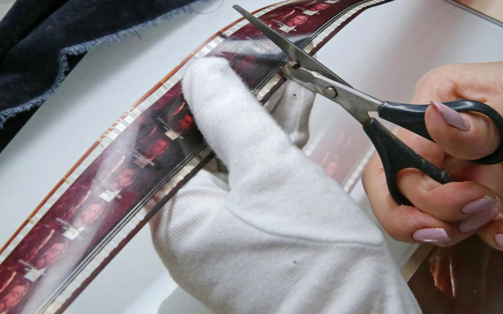

# Донос обратной силы не имеет. Подводим неутешительные итоги скандальной истории в Госфильмофонде

- **URL:** https://novayagazeta.ru/articles/2018/05/04/76362-donos-obratnoy-sily-ne-imeet
- **Дата:** 2018-05-04
- **Автор:** Лариса Малюкова

## Донос обратной силы не имеет

## Подводим неутешительные итоги скандальной истории в Госфильмофонде

Фото: Артем Геодакян / ТАССПосле статьи в «Новой» и открытого письма ведущих кинематографистов страны был уволен директор Госфильмофонда России Николай Бородачев. Назначили нового руководителя — Вячеслава Тельнова: разгребать завалы, разбираться со злоупотреблениями, увольнять многочисленных родственников Бородачева, нормализовать фундаментальную исследовательскую работу и как непременное условие этого — вернуть в архив изгнанного оттуда бывшим начальством ведущего в стране архивиста. Уникального в мировом масштабе ученого Петра Багрова, из-за которого и начался весь сыр-бор, письма в правительство... Не дождались.Впрочем, некоторые из «ведущих кинематографистов» свои проблемы решили и, воспользовавшись скандалом и смещением Бородачева, отстояли право распоряжаться студийными киноколлекциями. Да и «фигуранты госфильмофондовского дела», те, которые перед приходом нового начальства уничтожали порочащую документацию, чувствуют себя неплохо. Это вам не «Седьмая студия».

Бородачев немедленно нашел теплое место в Союзе кинематографистов, к изумлению киносообщества, став правой рукой Никиты Михалкова, — теперь «курирует основные направления деятельности Союза». Говорят, неплохо пристроен и Владимир Мялькин, бывший руководитель охраны ГФФ, который перебрался с Украины в Россию в канун суда по обвинению в убийстве. Сейчас охранник с криминальным прошлым возглавляет службу безопасности в Ветеринарном управлении №1 Одинцовского района Московской области. По свидетельству госфильмофондовцев, именно Мялькин собирал досье на служащих ГФФ, и прежде всего на Багрова. Жена Мялькина до сих пор работает в ГФФ в отделе пропаганды и спецпроектов.

«Есть доказательная база о совершении заказных убийств»

Чем знаменит Владимир Мялькин, скрывающийся в Москве от украинского правосудия

Новый руководитель привел с собой заместителей. Но осталась в качестве советника экс-заместитель генерального директора, верный сподвижник Бородачева Алла Хаецкая. Она, по всей видимости, традиционно возглавит следующий фестиваль архивного кино «Белые Столбы». Да и родственники, мордовские односельчане бывшего начальника никуда не делись. Большинство из них по-прежнему на ответственных и безответственных местах.

Лишь Багрова в архив вернуть «не велено».

И вот это любопытно.

Как Депардье науку победил

Крепкие хозяйственники из руководства Госфильмофонда могут отправить уникальный киноархив на свалку истории

Багров, несмотря на возраст, практически единственный не только в Белых Столбах, но и в отечественной архивной науке — ученый с мировым именем. Он делал резонансные открытия (к примеру, пару лет назад в архивах был обнаружен первый японский цветной фильм). Вместе с научными сотрудниками проводили собирательскую, исследовательскую работу, опознавали анонимные киноматериалы. Он оживил международные связи, пригласил в научный отдел известных киноисториков и талантливых молодых киноведов. Мировое сообщество, оценив эту работу, избрало 34-летнего ученого вице-президентом FIAF — авторитетнейшей мировой ассоциации киноархивов и синематек.

Впервые за 35 лет Россия представлена в руководящем органе этого международного сообщества. Была представлена. На последней Ассамблее, в связи с вынужденным уходом из ГФФ, Багров оставил и пост вице-президента ФИАФ.

Вся эта история смутная, почти детективная. По какому навету Багрова выдавили при прежнем руководстве ГФФ? Отчего нынешнее, во главе с Вячеславом Тельновым, так и не решилось пригласить его обратно? Судя по всем красноречивым намекам, против кандидатуры молодого ученого — некие силы безопасности. Ну вот представьте себе, не Мялькин, не Бородачев, а именно молодой архивист представляет угрозу для национальной безопасности. И кто бы ни пытался «замолвить словечко», пробить силу негласного сопротивления товарищей в погонах — все впустую: хоть режиссер с мировым именем, хоть сам министр.

Мединский на линии

Ключевые события карьеры ответственного хранителя культуры современной России

Научные сотрудники архива деморализованы, работа отдела расшатана. Остановлены многие проекты, среди которых подготовка единого каталога всех отечественных фильмов. Подвис номер «Киноведческих записок», посвященных истории ГФФ. Фестиваль «Белые Столбы» проведен будет, на него выделены госденьги, только качество его уже никто не может гарантировать. По словам служащих ГФФ, страх и подозрительность не улетучились из этих стен (известно, что до недавнего времени едва ли не во всех кабинетах была установлена прослушка, существует ли она сегодня — вопрос).

Впервые за всю историю Госфильмофонда РФ в руководстве нет ни одного специалиста по киноархивистике! Волнует ли это Минкульт или новое начальство? Не уверена, потому что и новая администрация считает научный отдел — по сути, мозг ГФФ — чем-то эфемерным, ненужным. И не скрывает этого. А и правда, к чему старым пленкам — историки и киноведы, способные эти старые пленки описать, определить их ценность?

В Уставе ГФФ в первых пунктах — собирание и хранение фильмов на первоисточниках. То есть на пленке, которой уже более 120 лет. Сегодня пленка признана единственно надежным носителем для хранения киноматериалов. Для администрации всех созывов на первом месте нечто более видимое: оцифровка (но ведь гарантий сохранности на цифре не существует!), продажа незадорого подарочных DVD-наборов — вроде «Женских судеб», «Лучших комедий Рязанова», «Фильмов Куравлева». Создание интернет-канала, куда можно выкладывать «золотую коллекцию». То есть, как правило, фильмы и так известные.

Неофитам в архивном деле неведомо, что только пленка — и есть оригинал классического или неизвестного автора фильма. Копий может быть сколько угодно.

Представьте себе, вы приходите в Эрмитаж, а там повсюду цифровые снимки полотен Леонардо.

Поддержите нашу работу!

1000 500 300 Нажимая кнопку «Стать соучастником», я принимаю условия и подтверждаю свое гражданство РФ

Если у вас есть вопросы, пишите [email protected] или звоните:+7 (929) 612-03-68

Ученый-архивист, как настоящий дракон, знает, где какое сокровище искать, как отличать истинное от мнимого, способен открывать тайны истории другим, воспитать новое поколение квалифицированных киноисториков и архивистов.

Но раз в руководстве ГФФ больше нет профессиональных архивистов, значит, и решения по хранению национального достояния могут быть ошибочными. Знают ли киноначальники, что 80% немых картин исчезли практически навсегда? Но это вовсе не значит, что периодически ученые заново не открывают ранее утерянные фильмы. Этот поиск продолжается. Несколько лет назад Юрий Цивьян и Петр Багров обнаружили в Аргентине считавшийся утраченным и ставший мифологическим фильм «Мой сын» Евгения Червякова — одну из самых популярных картин двадцатых годов, меняющую взгляд на историю кино.

О шедевре немого кино «Обломок империи» Эрмлера рассказывают во всех киновузах мира. Но никто (!) из нынешнего поколения зрителей и киноведов не видел канонической версии фильма. Петр Багров пересмотрел десяток копий, хранящихся в разных архивах мира. Выяснил, что российская — на треть короче исходной версии — она была сделана специально для деревенского зрителя. С помощью монтажных листов, сличая разные пленки, покадрово восстановил исходную версию. Затем договорился с голландским киноархивом о реставрации и восстановлении оригинала. Но сейчас ГФФ, опираясь на совет штатного юриста, отказывается забирать шедевр — жаль тратить на него средства. Лучше их израсходовать на очередную оцифровку. Или на завершение строительства храма.

Похоже, идея сохранения реальных артефактов, свидетельств времени, истории — сегодня сама по себе не актуальна. С памятью принято «работать». Подчищать. Контролировать. Героизировать. Обелять. Приватизировать. А въедливые историки, преданные профессии, ужасно этому мешают. Ученые уровня Багрова архиву не нужны. Там и без него около 500–600 сотрудников, 150 гектаров земли, хозяйство необъятное. К чему им кинотекстолог, способный восстановить канонический текст, структуру фильма. Условно говоря, кому нужен оригинал Рембрандта, мы на ксероксе своего «нарисуем».

Поэтому пусть лучше уезжает. Лучше подальше, за океан. Кстати, «въедливые историки» с мировой известностью на Западе востребованы, Багрова уже пригласили ведущие архивы.

Для отечественных архивистов, для кинонауки возможный отъезд Багрова действительно весомая потеря. Но люди сведущие объясняют, сколь бы ни были абсурдны вердикты, сформулированные в силовых ведомствах, — обратного хода нет, даже если решение было принято из-за навета доносчика.

Повсеместно идет захват неоварварами очагов исторической памяти. Из страны выдавливаются самые талантливые. Как Багров, который волею судьбы страны оказался связующим звеном между советской киноархивистикой (его благословил продолжить дело жизни главный кинохранитель СССР Владимир Дмитриев) и новым поколением киноведов. Это значит, снова будут зияющие пустоты в развитии кинонауки.

Вот и скажите мне, кто здесь патриот. Молодой востребованный ученый, не планировавший, как многие его сверстники, уезжать. Мечтавший о возможности работать в архиве. Лечить старые пленки. Открывать забытые названия. Возвращать нам нашу историю. Или сильные российского мира сего. С погонами. Которые учат нас правильно родину любить. Выдающийся киноисторик Евгений Марголит, горюющий в связи с отъездом талантливого коллеги, считает, что истинный патриот не орет о своей любви, а посвящает себя делу жизни, наполняя пространство вокруг себя смыслом.

Сегодня под вопли об обожании берез уничтожают отечественную науку, медицину, культуру, образование. И кинематограф. И ведь не то чтобы целенаправленно — инстинктивно — как жучки, разъедающие дерево.

«История — это драма свободы, где каждая точка окружена хаосом», — говорил Мамардашвили. Мы зацепились за эту точку, никак не можем с нее сдвинуться.

В мае новый руководитель Вячеслав Тельнов должен представить концепцию развития архива. Скорей всего в ней будет много экономических, хозяйственных нужд и проблем, способов их решения. Содержательная часть доклада — терра инкогнита. Во всяком случае, с научными сотрудниками «как нам реорганизовать архив» — администрация не советуется. Существующая уже два года концепция развития подведомственного ГФФ кинотеатра «Иллюзион», составленная киноведами Борисом Нелепо и Петром Багровым, — показательно не востребована. Зато в Госфильмофонде уже известно, что под шумок скандала возникла еще одна концепция, где ставка делается не столько на историю кино, сколько на громкие имена и кинопоказы шлягеров всех времен. Похоже, все забыли, что высокий статус «Особо ценного объекта культурного наследия народов РФ» Госфильмофонд получил благодаря тем самым старым пленкам, которые вроде бы не приносят дохода, не окупаются. И которые надо со знанием дела открывать для новых поколений зрителей.

«Здесь все устарело, не обновлялось, не модернизировалось десятилетиями»

Интервью нового директора Госфильмофонда Вячеслава Тельнова

Живем в эпоху, когда компетенции отменены, связи с предыдущими поколениями, их опытом — опрометчиво рвутся. России больше нет в руководящих органах ФИАФ.

Престиж страны несет потери — но кому это интересно.

«Кто мы?» — спрашивают в фантастическом бабелевском сценарии «Старая площадь, 4». «Дирижаблестроители», — отвечает герой фильма. Волшебные дирижабли, которые энтузиасты строят, взлетают, но сесть не могут, потому что у них нарушена связь между головой и хвостом. Такая вот системная проблема. И бог весть, куда наш дирижабль отнесет ветер.

Поддержите нашу работу!

1000 500 300 Нажимая кнопку «Стать соучастником», я принимаю условия и подтверждаю свое гражданство РФ

Если у вас есть вопросы, пишите [email protected] или звоните:+7 (929) 612-03-68
