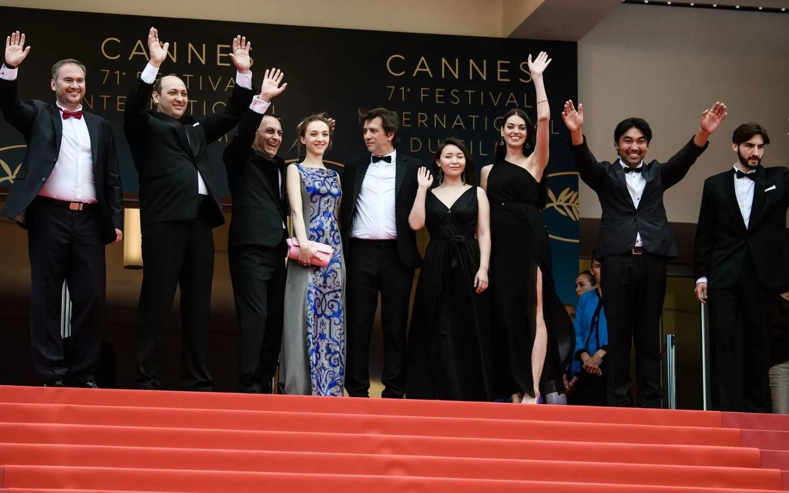

# Собачья жизнь. О награде российского кино и сильных конкурсных фильмах, показанных под занавес Каннского кинофестиваля

- **URL:** https://novayagazeta.ru/articles/2018/05/18/76517-sobachya-zhizn
- **Дата:** 2018-05-18
- **Автор:** Лариса Малюкова

## Собачья жизнь

## О награде российского кино и сильных конкурсных фильмах, показанных под занавес Каннского кинофестиваля

Премьера фильма «Айка». Фото: EPAФестиваль близок к финалу. Уже более-менее понятен рейтинг фильмов, очевидны лидеры и аутсайдеры. Конкурсную программу традиционно ругают, и традиционно в ней есть авторские высказывания, о которых будут писать, спорить, которые будут пересматривать. Рассказываем о фильмах «под занавес».Судьбы круженье

Второй приз программы Синефондасьон присужден короткометражному фильму «Календарь» режиссера Игоря Поплаухина и продюсеров Константина Шавловского и Александры Ахмадшиной. Сюжет весьма условен. Это путешествие женщины среднего возраста. Она меняет виды транспорта, траекторию пути. Кажется, что «заметает следы». Вообще, в этом «круженьи» — столько недосказанного, что зритель невольно создает в голове свое путешествие. И только в финале история проясняется. Главное здесь атмосфера, ощущение нарастающей непонятной тревоги. Заметно влияние учителя Поплаухина в «Московской школе нового кино», режиссера Дмитрия Мамулии, киносюжеты которого полны тайн и недомолвок.

Игорь Поплаухин учился на журфаке, закончил «Московскую школу нового кино». Он — интеллектуал и синефил. Свой первый фильм снял у себя на даче. Сегодня в его фильмографии 4 короткометражных фильма, и теперь его имя включено в «каннский клуб режиссеров».

За матерей, которые бросают своих детей

Завершила конкурс «Айка» — вторая игровая картина известного документалиста Сергея Дворцевого. Тематически история иммигрантки из Киргизии перекликается с фильмом «Капернаум», показанным накануне. «Капернаум» — третья полнометражная работа актрисы и режиссера Надин Лабаки (в Каннском показе были ее фильмы «Карамель» и «И куда мы теперь?»). Лабаки пророчат «Пальму» ведущие издания. Нелегалка-афроамериканка прячет годовалого сына, дабы ее не депортировали из бейрутских трущоб.

К ней прибивается мальчик из нищей многодетной семьи, который, как настоящий мужчина и воин, пытается быть защитником «новой семьи», но прежде всего малыша. Пытается из последних сил. Героически. Добывает еду, ворует памперсы, продает наркотическую воду с «колесами». Носится с ребенком на руках по чужому городу…

Фильмы совершенно разные по киноязыку, темпераменту, в том числе художественному и социальному.

В ленте «Капернаум» мальчик подает в суд на своих родителей, которые «рожают детей, не сознавая своей ответственности за их жизнь». И их дети умирают. Социальный пафос переплавлен в современную человеческую трагедию. Картина сверхчувственная, зрительный зал рыдает. К тому же игра непрофессиональных актеров, прежде всего детей поразительная. Ну ладно, двенадцатилетний мальчик — гений. Но как Лабаки удалось «разыграть» годовалого малыша, который существует естественно, при этом четко следуя жесткому сценарному рисунку?

Кино все на форте, музыка превосходная, правда, порой хочется тишины. Кино как натиск, атака против подлости современного мира.

В одной из сцен гуманитарная европейская делегация навещает несчастных людей в тюрьме. И дабы «облегчить их участь», благополучные люди для них поют и танцуют. Некоторые из заключенных даже пытаются им «подтанцовывать», но в основном из-за решетки во взгляде видны только черные бездны.

У Дворцевого все тише, налицо уродливость социального устройства общества. Героиня рожает ребенка в Москве, но вынуждена оставить его в роддоме, буквально бежать. И дальше весь фильм она бежит по замкнутой безвыходности. А вокруг очень страшный город Москва. Менты избивают бесправных приезжих и берут взятки. Люди снисходительны к животным, но не к людям.

Город не справляется не только со снегопадом. Не справляется с сотнями тысячами приезжих. Город их не видит, не видит, что каждый из них человек.

Фильм честный, но однолинейный. В нем много физиологии, прямолинейных, и скажем прямо, не очень тонких параллелей. В одной из сцен мать, которая не может покормить ребенка, смотрит на раненую собаку, которая кормит щенков.

Поддержите нашу работу!

1000 500 300 Нажимая кнопку «Стать соучастником», я принимаю условия и подтверждаю свое гражданство РФ

Если у вас есть вопросы, пишите [email protected] или звоните:+7 (929) 612-03-68

Постер к фильму «Айка». Kinopoisk.ruВ предыдущем фильме Дворцевого «Тюльпан», получившем главный приз программы фестиваля «Особый взгляд» была поэзия и мифология. Была, к примеру, сцена, ошеломившая аудиторию: юный чабан впервые принимает роды у овцы. Когда он свалявшемуся мокрому комку в материнской замазке — считай, божьему агнцу — делает искусственное дыхание, кажется, на наших глазах вершится битва жизни и смерти. В новой работе подобного прорыва нет. Похоже, картину отборочный комитет принял больше за соответствие сквозной теме об унижении женщин и «Ласковом безразличии мира» — так называлась казахстанская картина Адильхана Ержанова. Фразой из «Постороннего» Камю. Кино про то, что любви нет места в мире, где нет правды. Картина, сделанная в развитии Новой казахской волны, противопоставляет хлопочущий, абсурдный и жестокий мир людей — вечности природы. Но новых горизонтов фильм не открывает.

Ласковое безразличие мира

Надо сказать, что ближе к финалу показали и довольно сильные картины.

Наверное, самый талантливый сегодня корейский режиссер Ли Чан-дон («Оазис», «Поэзия») сочинил фильм «Горящий» по мотивам рассказа Харуки Мураками «Сжечь сарай». Рассказ, прямо скажем, незамысловатый. Про взаимоотношения юноши, его бывшей одноклассницы и ее новом знакомом — богаче. На экране текст Маруками растушеван поэзией, тайной, неизвестно из каких источников возникающего саспенса и тоски.

Кадр из фильма «Горящий». Kinopoisk.ruДавняя подруга Хэми просит Чонгсу – начинающего писателя — присмотреть за котом — она решила навестить Африку. Из поездки она возвращается в компании роскошного и томного Бена, владельца шикарной квартиры и Porsche. Бен не видит разницы между работой и игрой, игрой и жизнью. Для собственного удовольствия он поджигает теплицы, рассыпанные вокруг города. Этот странный треугольник все время рассыпается и собирается заново. Тем более, что легкая фантазерка Хэми в какой-то момент исчезает бесследно. Буквально истаивает.

В этом притягательном сумеречном кино, вспыхивают огни аллюзий и отсылок: и «Великого Гэтсби», и произведений Фолкнера, поклонником которого является Чонгсу, и «Исчезнувшей» Флинн, и даже «Завтрака у Тиффани» Капоте. У витающей в облаках непредсказуемой Хэми, вроде бы, есть кот. Это «вроде бы» — ключевое для фильма слово. Вроде бы, кот был. И его не было. И убита ли Хэми харизматиком с дьявольской улыбкой Беном. Или и ее не было. И поджигает ли Бен теплицы. А может быть, все это сочинено писательским воображением Чонгсу? Искусная сила воображения, иррациональное начало сильнее блеклой реальности, которую нынче модно воспроизводить на экране во всех подробностях. И кинематографическое мастерство Ли Чан-дон, словно кружево, вывязывающего эту сюрреалистическую поэму — тому доказательство.

Кадр из фильма «Горящий». Kinopoisk.ruОдин из выраженных брутальных мужских фильмов в конкурсе, где доминируют женщины» — «Догмэн» Маттео Гарроне («Таксидермист», «Гоморра» - оба фильма получили Гран-при Канн). Кино о жестокой силе современного мира, которой способна противостоять только смерть. Герой – маленький, чудаковатый Марчелло. Он и есть «догмен»: стрижет, причесывает, моет, сушит феном собак, устраивает маленькую гостиницу для четвероногих. Даже побеждает в «собачьих конкурсах», делая пуделю наимоднейший начес. Немного приторговывает кокаином. Дружит с грозой города Симоне, неуправляемым бушующим монстром, лбом ломающим носы в ежедневных драках.

Кадр из фильма «Догмэн». Kinopoisk.ruМечтой о смерти Симоне живет весь утлый городок. Но Марчелло покрывает товарища в очередном преступлении… и даже помогает его совершить. Отсиживает в тюрьме целый год. Странно было бы ждать благодарности от собачьего ублюдка Симоне. К тому же весь город отвернется от никудышного проштрафившегося Марчелло. В фильме есть сильнейшая сцена. Два человека убивают друг друга — драка не на жизнь. И за этой звериной жестокостью из своих клеток с печальным сочувствием наблюдают собаки.

Кадр из фильма «Догмэн». Kinopoisk.ruГарроне рассматривает устройство человеческих взаимоотношений, исследуя пограничные темы, доводя зрителя до точки кипения. Но в этом пространстве взрывоопасности — свобода и органика. Погружение в сокровенное – человеческую сущность, вокруг которой «ласковое безразличие мира».

Поддержите нашу работу!

1000 500 300 Нажимая кнопку «Стать соучастником», я принимаю условия и подтверждаю свое гражданство РФ

Если у вас есть вопросы, пишите [email protected] или звоните:+7 (929) 612-03-68
