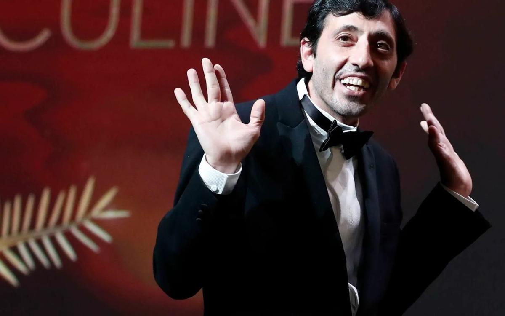

# Канны 2018. Что это было. Итоги пока еще «лучшего кинофестиваля планеты» подводит Лариса Малюкова

- **URL:** https://novayagazeta.ru/articles/2018/05/20/76529-kanny-2018-chto-eto-bylo
- **Дата:** 2018-05-20
- **Автор:** Лариса Малюкова

## Канны 2018. Что это было

## Итоги пока еще «лучшего кинофестиваля планеты» подводит Лариса Малюкова

Фото: EPAРешение жюри под управлением Кейт Бланшетт, очевидно, разочаровали журналистов. Собственно, это решение оказалось в созвучии с настроем смотра, который Гарри Олдмен на церемонии закрытия назвал «лучшим фестивалем планеты». Канны-2018 оказались чрезвычайно политизированными. Звездный женский марш на красной лестнице в ознаменование справедливости движения#meToo. Пламенная речь на церемонии закрытия Азии Ардженто, которая призналась, что пять лет назад именно здесь, в Каннах, была изнасилована Харви Вайнштейном. Зал выдохнул… На сцене в этот момент уже сидело жюри, в котором подавляющее большинство — женщин.

В общем, было ясно: хорошего — не жди.

Из трех картин женщин-режиссеров две получили награды. Аличе Рорвахер (о ее талантливой поэтической картине «Счастливый Лазарь» мы рассказывали) поделила приз за сценарий с опальным иранским режиссером Джафаром Панахи. Его скромный фильм «Три лица» был, очевидно, поддержан в знак солидарности с автором, дискриминированным на родине. Картина «Лето» Кирилла Серебренникова была проигнорирована. (Хотя французская критика «Лету» отдала пальму первенства).

Женщины на каннском экране — сильный пол

Они преобладают не только там, но и в жюри

Предсказуемо горячо обласкана лента «Капернаум» ливанской актрисы и режиссера Надин Лабаки. Эта громкокипящая социальная мелодрама об адской жизни бедняков третьего мира не могла быть не поддержана жюри под властью гинекократии. У фильма — почетный «Приз жюри». Сама Надин произнесла гневную тираду в защиту прав детей.

В это время на сцене был и юный исполнитель главной роли в фильме, ему было скучно и он играл с золотой «Пальмой».

Лучшей актрисой названа Самал Есламова, перевоплотившаяся киргизскую мигрантку в российско-казахском фильме «Айка» Сергея Дворцевого. На протяжении всей картины ее героиня, вынужденно оставившая ребенка в роддоме, страдает и мечется в поисках работы среди таких же «зачеркнутых» равнодушным обществом отверженных.

Собачья жизнь

О награде российского кино и сильных конкурсных фильмах, показанных под занавес Каннского кинофестиваля

Председатель жюри Кейт Бланшетт и японский режиссер Хирокадзу Коррээда. Фото: EPAПохоже, жюри вдохновлялось не только качеством кино, но и его соответствию нерву времени. Возможно, поэтому «Золотая пальмовая ветвь» досталась «Магазинным воришкам» знаменитого японского режиссера Хирокадзу Корээды. Его фильм в неожиданном ракурсе ставит вопрос: что же такое сегодня настоящая семья? Что есть подлинность отношений близких? Корээда показывает «липовую семью», в которой все друг другу формально чужие. Но когда ювенальные и правоохранительные органы вторгаются в их неправедную жизнь, наводят «порядок», разлучая фейковых родственников, никто из них не становится счастливее.

Среди неожиданных решений — награждение «Гран-при» Спайка Ли, одного из столпов афроамериканского кино, за остроумную криминальную комедию «Черный клановец».

Семидесятые. Чернокожий полицейский внедряется в отделение Ку-клукс-клана в Колорадо Спрингс. Делает это по телефону. А на встречу с расистами посылает своего коллегу Флипа Циммермана — белокожего еврея. Таким образом была раскрыта банда, готовившая теракт в городе. Самое поразительное, что в основе фильме — реальные факты. Картина зрительская, смотрится на одном дыхании, в ней отличные диалоги. Много цитат из речей Трампа, поэтому американские журналисты на показе хохотали громче других. Фильмом заинтересовались и российские дистрибуторы. Но на территории кино как искусства —

были работы, несомненно, заслуживавшие большего внимания каннский судей, но показательно не замеченные.

Прежде всего, «Горящий» большого художника Ли Чхан-дона. В этом фильме есть «тайное сияние» (так назывался один из фильмов одного из лучших современных корейских режиссеров). Все очевидное на экране превращается в загадку, сама поэзия с ее рифмами и умолчаниями становится саспенсом. А вопрос: что же такое настоящая метафора — звучащий в фильме — может стоить героям жизни. Фильм получил приз ФИПРЕССИ.

Итальянец Марчелло Фонте, сыгравший маленького человека Марчелло в «Догмэне» итальянского режиссера Маттео Гарроне назван лучшим актером. Похоже, он и не перевоплощался — играл себя, хотя он профессиональный актер. Со сцены фестивального дворца он сказал: «Когда я был ребенком, я слушал шум дождя, и мне казалось что это аплодисменты… вот такого огромного зала».

Поддержите нашу работу!

1000 500 300 Нажимая кнопку «Стать соучастником», я принимаю условия и подтверждаю свое гражданство РФ

Если у вас есть вопросы, пишите [email protected] или звоните:+7 (929) 612-03-68

Среди справедливых наград — Приз за лучшую режиссуру Павлу Павликовскому (автору увенчанной Оскаром «Иды»). «Холодная война» — история изломанных судеб на фоне тоталитарного ХХ века. Кино о хрупкости и силе любви в неравной борьбе с системой. Черно-белая изысканная картина, сочетающая минимализм и эпичность. Сдержанность и чувственность.

Война и любовь, война и правда

О фильмах «Холодная война» Павликовского, который претендует на главный приз Канн, и о «Донбассе» Лозницы, который у нас не покажут

Не отметить гения Годара, который, кстати, не получал каннского золота, жюри просто не могло. Поэтому было найдено спасительное решение. Впервые в истории Канн была присуждена специальная «Золотая пальмовая ветвь» за философское видеоэссе «Книга образа».

Перст Годара и женский бунт

В Каннах показали «Образ и речь» живого классика и протестный фильм «Три лица» иранского режиссера Джафара Панахи

И все же, как ни относись к выбору судейства (они сами признались, что их решение — результат компромиссов, полярных мнений) — награждение избранных всего лишь одна из вех в долгой жизни фестиваля. Его итоги подведет время.

Есть стойкое ощущение: Каннский кинофестиваль начинает отставать от несущегося вместе с новыми технологиями времени.

Индустрия кино решительно меняется. Форум уже не первый год сотрясается от грома конфликтов с платформой Netflix. Cкандал разгорелся в прошлом году. В конкурсе оказались две ленты Netflix «Окча» и «Истории семьи Майровиц». Но французские кинотеатральными сети и вещатели, а также влиятельные люди киноиндустрии потребовали от директора фестиваля Тьерри Фремо оградить Канны от Netflix, который отказывается от кинопроката. Но без Netflix, крупнейшего игрока киноинудстрии, развивающего производство сериалов и фильмов в невиданных размерах, Канны заметно тускнеют. Отчасти из-за этого скандала в программе не оказалось фильма-легенды «Другая сторона ветра». Ее снимал в семидесятые Орсон Уэллс, но не закончил из-за отсутствия финансирования. Сервис Netflix приобрел права на фильм, и взял под свое крыло его производство. Не дождались в Каннах и «Рима» Альфонсо Куарона, о котором высоко отзывался Фремо, «Норвега» Пола Гринграсса о норвежском террористе Андерсе Брейвике.

Смерть, которую построил Ларс

Десятки зрителей в ужасе сбежали с показа нового фильма фон Триера в Каннах. Зря: в финале были жаркие аплодисменты

Ситуация тревожная, тем более, что конкурент Канн — Венецианский кинофестиваль — не устанавливает подобных запретов. И его программа последних лет набирает силу. Главные фильмы из оскаровского шорт-листа были показаны в Венеции («Бердмен», «Гравитация», «Форма воды»), там фестиваль последовательно выстраивает отношения и с новыми медиа, и современной арт-культурой (благо, рядом Биеннале), и с американской киноиндустрией. А значит, и «звездопад» постепенно с Лазурного берега переносится на остров Лидо.

К тому же, буря и натиск новых технологий не теряет силы, бросая вызов кинорынку. И Каннский фестиваль, ведущий, в первую очередь, диалог с кинопрокатом, не должен игнорировать интернет-платформы.

Кстати, Каннский кинорынок, работающий во время фестиваля, не игнорирует новые медиа и способы их распространения. В частности прошли презентации новых платформ дистрибуции.

Продюсер Сэм Клебанов представил проект онлайн-дистрибуции фильмов «Cinezen». Уже ведут переговоры с более чем 250 правообладателями.

Если говорить упрощенно, то зритель получит прямой доступ (не завися от вкуса и ограниченных возможностей дистрибуторов конкретных стран) к фильму и его правообладателю. Это особенно важно для таких стран, как Россия, где под угрозой неполучения прокатного удостоверения может оказаться любая картина.

Канны-2018 оказались не столько демонстрацией высших достижений киноискусства, которое, безусловно, было представлено в конкурсе и других программах, сколько пейзажем битвы, в которую превратился современный мир. Но и сам кинофорум остро нуждается в модернизации, осмысленно сформулированной программе развития. В ином случае, ему не сохранить звания «лучшего фестиваля планеты».

Поддержите нашу работу!

1000 500 300 Нажимая кнопку «Стать соучастником», я принимаю условия и подтверждаю свое гражданство РФ

Если у вас есть вопросы, пишите [email protected] или звоните:+7 (929) 612-03-68
