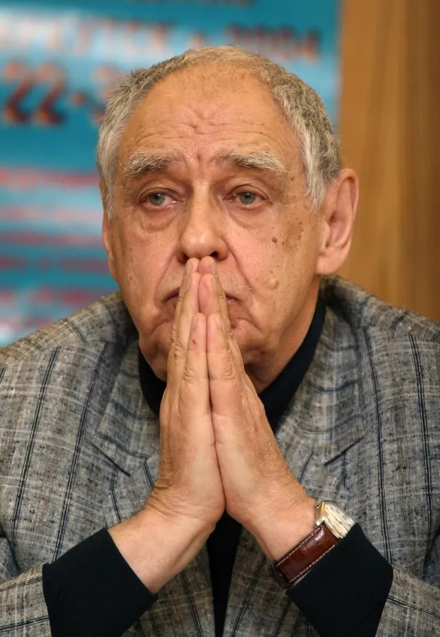

# Последний ребенок революции. Не стало Александра Аскольдова. Неопубликованный монолог режиссера и послесловие Юрия Норштейна

- **URL:** https://novayagazeta.ru/articles/2018/05/21/76550-posledniy-rebenok-revolyutsii
- **Дата:** 2018-05-21
- **Автор:** Лариса Малюкова

## Последний ребенок революции

## Не стало Александра Аскольдова. Неопубликованный монолог режиссера и послесловие Юрия Норштейна

Александр Аскольдов. Фото: Юрий Самолыго / ТАССРежиссер-миф. Писатель.

Автор легендарного «Комиссара» по рассказу Василия Гроссмана. Фильма, принадлежащего мировой классике. В котором воздух времени. Фильма, запрещенного. Отправленного на полку. Поправевшая власть утрамбовывала идеи коммунизма и всечеловеческого братства.

Режиссера самого гнали и не пущали. Уволили со студии с формулировкой «профессионально непригоден». Двадцать лет его мучили. Его не любили начальники. Предавали коллеги.

В перестройку фильм начал триумфальное шествие по миру. Но 20 лучших лет украли из жизни. «Если бы вы знали, что со мной все эти десятилетия делали», — говорил он, — если бы только власти…»

Картину «Комиссар» собирались уничтожить, но осталась одна копия, которую сам режиссер тайно вынес из монтажной и тем спас от уничтожения.

Его «Комиссару» в прошлом году исполнилось 50 лет.

Он считал благородство необходимой частью существа художника.

Снимал о человеческом и нечеловеческом в человеке.

И сам помогал, когда мог. К примеру, защищал «Заставу Ильича» Хуциева.

Он долгие годы жил с семьей в Германии по так называемой «визе почета». Несколько раз пытался запустить новый фильм в России. Однажды даже решился позвонить министру культуры Швыдкому: «Вам звонит Аскольдов». В этот момент услышал, как министр спрашивает помощника: «А кто это такой?» Ему оставалось только положить трубку.

Мы виделись с ним в прошлом году в Белых Столбах. И разговаривали про фильм, про революцию и ее связь с нашей жизнью. Впервые печатаем этот разговор.

- Лариса Малюкова

## Герои и варвары. Монолог Александра Аскольдова

Революция? Мне кажется, я был еще грудничком, а что-то уже чувствовал про нее. Возможно, я последний ребенок революции. Мой отец — один из создателей Красной армии. Был солдатом в Первую мировую, членом солдатского комитета Западного фронта. В былые времена орден полагался за это, ныне — это предательство.

В 20-м белополяки его схватили, приговорили к расстрелу. Повели… И что он? Пел «Интернационал». Расстрел отсрочили. Ленин дал указание Иоффе, полпреду в Берлине, чтобы отца обменяли на польских офицеров. Освободили. А через много лет все равно расстреляли.

Вот сейчас я проезжал мимо Дома на Никольской, в подвале которого расстреляли Кольцова, Бабеля, Мейерхольда. Лишь недавно я получил документальные свидетельства, что там убили и моего отца. Он был начальником Главного инженерного управления Красной армии. А в свое время — помощником Троцкого, командовал вооруженными силами Харьковского военного округа. Орден ему Троцкий подписал лично. В той страшной карусели террора, абсурда и глупости этот орден — последняя капля, решившая его судьбу (у него было три ордена Красного Знамени).

Расстрельный дом. Никольская, 23

В его подвалах вместо музея будет кафе, гостиница или доходный дом? А собственник так и не объявился...

Вот история моей семьи. А значит, и моя.

Под началом отца служили удивительные люди.

Кем они были? Одержимые? Садисты? Убежденные? Фанатики?

Отец строил Новосибирский оперный театр. И еще грандиозный оборонный завод под Новосибирском, сыгравший огромную роль в годы войны. Орджоникидзе послал его в Киев, и он был директором киевского оборонного завода «Большевик». Когда отца забрали из больницы — он был совершенно больным человеком, у него были раны, контузии.

Он вообще не ладил с начальством, так что считайте, это у меня наследственное.

Его сопровождали вечные конфликты. И только его обожаемый сослуживец Орджоникидзе его любил.

У Орджоникидзе на перекидном календаре перед гибельной для отца ночью осталась запись: «Утром позвонить Яше Аскольдову непременно».

Я видел этот календарь. Когда ушел Орджоникидзе из жизни, отец оказался совсем незащищен. И это при его независимости. Даже наивности.

Как говорить о людях той эпохи?

Оголтело обвинять их во всех смертных грехах? Ударяться в слащавость? Это все несправедливо.

Остались, например, документы обыска. Знаете ли, они обожали играть с оружием. По документам видно: из кабинета отца реквизировано столько-то маузеров, патроны, охотничьи ружья, золотое оружие, шашки именные. И три ордена Красного Знамени.

Есть домашняя легенда. Как-то отца Сталин встретил вопросом: «Почему ты не носишь ордена?» Ордена носить было обязательно, их перевинчивали с шинелей на пиджаки и пальто. Отец отвечает: «Приходится по работе залезать под агрегаты, могу машинным маслом испачкать». Через какое-то время отцу сообщили, что он должен сдать орден.

Тот, что от Троцкого, на которого началась травля. А он не сдал. Пришли люди, изъяли награды. Все и покатилось. А он все еще строил, строил.

Вообще, в отличие от меня, который не умеет ввинтить шуруп, он умел все.

Мама была намного моложе отца. В высшей степени девушка своеобразная. Из простолюдинок, крестьянской семьи. На юрфаке университета не доучилась. Пошла в медицинский. Познакомилась с отцом.

Приговор отцу подписан прокурором Вышинским и наркомом внутренних дел Ежовым. Естественно: шпионаж, платный агент двух держав: Польши и Японии. К высшей мере наказания без предъявления статьи закона. Читать дело мне было трудно. Вроде плохой пьесы, абсолютной липы.

И когда это касается тебя лично, понимаешь особенно остро: все было можно. Следователи даже могли не усердствовать. И все же они старались. Особенно злобствовал следователь Липман. Персонаж — чистый Достоевский. Терпеть не мог галстуков, ходил в сапогах. Состав крови у них был особый, что ли? Хочу думать, что он был человеком не озлобленным и не мстительным. Но доподлинно этого не знаю.

## Как я решился на фильм

Так бывает, что-то в тебе застряло — не можешь избавиться. Изначально были и другие варианты. Ведь всю историю отца я словно предвидел, даже записал, назвал будущий фильм «Полустанок». Он был бы еще страшнее «Комиссара», Там двух людей с Дальнего Востока везут на дознание в Москву…

Знал ли я, что отца полуживого привезут в Москву из Киева… Чтобы убить.

Я сделал тот сценарий с двумя прописанными характерами героев. Уже были присмотрены актеры. Когда я писал, думал о Чиркове и Черкасове. Черкасов — близкий мне человек. Мы тесно общались. Я притащил в Александринский театр пьесу «Бег», уговорил поставить, был консультантом. И вот мы договорились, что снимем эту картину.

Кадр из фильма «Комиссар». Ролан БыковУ меня был замечательный консультант, писательница, удивительная женщина Александра Яковлевна Бруштейн, с ней мы писали сценарий. Хотя она и говорила: «Дуся, признайтесь, придумали все вы!» Фантастический человек, умница.

Почему Черкасов? Ведь и инсценировку «Дон Кихота», которого с блеском играли в Ленинградском ТЮЗе, сделала Бруштейн. Черкасов не только актер гениальный, но человек добрый, редкой порядочности, даже наивности. Этой наивностью он побеждал даже Сталина. Было это в конце пятидесятых.

Еще вегетарианское время. Еще можно было что-то протолкнуть: небольшая щель существовала до шестидесятого года.

Но у Черкасова случился инсульт.

А заноза эта так и сидела.

Поддержите нашу работу!

1000 500 300 Нажимая кнопку «Стать соучастником», я принимаю условия и подтверждаю свое гражданство РФ

Если у вас есть вопросы, пишите [email protected] или звоните:+7 (929) 612-03-68

Я ведь Гроссмана не видел. Его вообще мало знали, практически не читали. Я был влюблен во все ранние рассказики, вроде «Счастья в кармане». Казалось: все это знаю так хорошо, так близко. Про Сибирь, Алтай, где мы были с родителями. Вот сейчас, разгребая свои архивы, натыкаюсь на сбивчивую запись: «Дозвонился Гроссману, объясняю, что хочу. Долгое молчание… Потом: «Ну что ж, раз решили, попробуйте. Потом он лег в больницу…»

Его считали желчным, но жизнь была к нему несправедлива. История чувств этого человека — отдельная. В ней счастье и трагедия. Трагедии больше.

Может быть, если бы роман вовремя пришел бы к людям. Даже такой глубокий и сложный, он был принят и понят.

Я ведь в такой атмосфере ненависти снимал эту картину — хочу ее забыть. Вам трудно даже представить, какой яростью и еврейского контингента, и антисемитов была окружена картина.

Когда я думал о «Комиссаре», фантазировал по поводу актеров… Ролан Быков был изначально. Но я не знал Мордюкову. Увидев ее, решил снимать без проб. С ней было чрезвычайно трудно. Она находилась под прессом влияния многих «мнений». На нее давили. У меня же не было права сформировать группу. Вот и работал в «неприятельском» окружении.

В этой съемочной группе была просто бандитская компания моих рьяных недругов — осветителей. Они меня не уважали, плохо слушались. И я позвал всех смотреть материал — поздно вечером в местный кинотеатр. И вот чудо искусства, они переменились: они уже разбивали морды всем, кто бездельничал или ругал меня.

Чудо, но в этом змеином клубке были приличные люди. Хотя, думаю, что многие были просто затравлены — нас много раз закрывали.

Конечно, у Нонны накопились обиды. Доброго слова она не получила за эту работу. Да и на съемках было трудно. В какой-то момент невыносимо. Мы ссорились. Однажды я громко сказал: «Вызывайте Тоню Дмитриеву!» Приехала замечательная актриса из Центрального детского театра. Начали примерять костюм, подгонять сапоги. Зашуршала группа: «Наш-то совсем свихнулся».

Иду по коридору гостиницы, слышу рыдания Нонны. Я пошел к ней и говорю: «Вы меня ненавидите. Мне тоже с вами трудно. Но я так подробно продумал всю вашу линию. Хотите сниматься? Давайте так, дотерпите до финала. Дайте мне слово. Там поступайте как угодно. Я точно дотерплю».

Пошел к Тоне, позвал ее выпить. Она сразу все поняла: «Я не буду сниматься…»

А Нонна терпела.

Кадр из фильма «Комиссар». Нонна МордюковаКак пройти в ИерусалимЕсли бы мне так не мешали, мы бы на порядок выше сделали бы кино. Иначе. Но я был связан по рукам и ногам.

На заседании коллегии Госкино были все, включая киногенералов: Донской, Герасимов… А у меня внезапно температура. Собрался идти — дома скандал. Позвонил в Госкино, меня успокоили, пообещали перенести собрание… и провели его без меня.

А сколько было заседаний партбюро студии Горького! Если бы знали, как выступали мои вчерашние товарищи. Со мной перестали здороваться. Так все и было. Меня все время закрывали.

Говорили, например: «Он все перепутал, ведь это про Гражданскую войну, при чем тут евреи?»

Было письмо Симонова о картине. Я много раз с ним встречался, не могу преодолеть доброе к нему отношение, он произвел на меня впечатление человека обаятельного, доброжелательного. Мы встретились в день смерти Сталина. У нас в университете было запланировано в клубе МГУ обсуждение его романа «Товарищи по оружию», напечатанном в «Новом в мире» вместе с Гроссманом. Я должен был делать доклад, подготовился. Но в связи с трауром все отменилось. Замок на дверях клуба. Вижу Симонова: стоит у дверей, вытирает слезы. Мы долго гуляли. Мне нравилась его лирика. И еще Серова.

Потом пошли с женой хоронить Сталина: сутки пробивались. Трубная была окружена «Студебеккерами». Солдатами. У жены было новое пальто. И солдаты закричали ей: «Эй, баба! Лезь под машину», она уже видела, что толпа напирает.

Ей было жаль пальто, там, на асфальте, было масло. Мы долго ползли на карачках. Вылезли. Пробрались к Пушкинской площади. А там уже цепь — не прорваться. Я вспомнил про только что полученный билет журналиста. Прибежал офицер — пропустили. Вбежали рысцой в проезд Художественного театра, перекрытый с двух сторон. Гоняли нас несколько часов. Я вцепился в металлические скобы у входа во МХАТ, меня оттаскивали … Наступил вечер. Мы снова пролезли под «Студебеккерами» и попрощались с товарищем Сталиным.

Вот бред. Это я мчался туда. Нет, не плакал. Но был ужасно взволнован.

Так больше, по сути, я ничего не сделал. Издал роман несколько лет назад. Фильм я уже вряд ли сделаю.

Хотя сценарий я написал. Называется «Как пройти в Иерусалим» — драма про эпоху, про время. Это середина 30-х — конец 50-х: очень важное время. Я знаю этих людей. Это не совсем про Михоэлса, это про эпоху. Картина довольно жесткая и в то же время о любви.

## Я человек оттуда

Я думаю, что Россия продолжать жить так, как она жила до революции, не могла по объективным причинам. Революция — это мучительные роды. Родились герои и варвары.

Может быть, это глупо. Но я человек оттуда. Когда-то про меня презрительно бросили: «А-а-а, он был членом партии». Так говорят люди, которым все равно, в какой партии быть. Но ведь и без всякой партии можно было лизать все эти начальственные задницы. Я был в партии не потому, что это давало какую-то прибавку к моей жизни. У меня и так все могло быть. Меня сама биография выталкивала на самый верх. Поверьте мне, я этого не хотел. Просто в какой-то момент верил, что так мы все выиграем. Мы же тогда в партию вступили втроем одновременно: Олег Ефремов, Миша Шатров и я. Мы были честны перед собой. Если б не вступил в партию, у меня была бы более легкая жизнь — я сам эту петлю на себя надел. Меня дважды исключали. Сейчас это выглядит анекдотично, но попробуйте с этим жить.

Сейчас, завершая все эти игры с жизнью, с профессией, думаю, сколько горя принес жене и дочери. Сколько! Зачем? Мы годами писали объяснения: день и ночь. Нормальный же человек не может так жить.

Юрий Норштейн

мультипликатор

### Здесь тоже была «смерть комиссара»…

— Я потерял огромного друга, близкого человека, с которым мы могли говорить обо всем. Он абсолютно искренно, временами по-детски удивлялся драматическим обстоятельствам, которые вихрем крутились вокруг него.

Теперь будут говорить: «Умер великий режиссер, автор одного великого фильма». Полагаю, на одну жизнь — этого достаточно.

«Комиссар» стал явлением мирового масштаба.

Главное его качество — сердечность. Искусство вообще не создается без сердца.

Как в пушкинских строках:

Оставь герою сердце! Что же Он будет без него? Тиран…

Это мы наблюдаем последние 25 лет происходящего в стране. Как сердце у иных превращается в кусок льда, железку, обращая человека в тирана.

На протяжении всего нашего знакомства Аскольдов находился в состоянии сильнейшего переживания. Какое сердце это выдержит?

Я не представляю, как сейчас переживает его жена Света. Они были неразлучники. Он рассказывал мне, когда приходили приглашения показать фильм в какой-нибудь стране, он всегда предупреждал: «Без Светы не поеду». Трудно найти более верного служителя его музе, его работе, переживанию вместе с ним всех драм, которые выпали на их долю. Она была той самой Солдадерас, сопровождающей мексиканских бойцов в самые страшные битвы.

Когда впервые услышал об этом фильме, а потом увидел Аскольдова, почему-то вспомнил картину Петрова-Водкина «Смерть комиссара». Профиль комиссара, обнявшего умирающего на поле боя бойца, напомнил профиль Александра Яковлевича.

Помню, тогда же я сформулировал про Аскольдова: здесь тоже была «смерть комиссара».

Наша последняя встреча была буквально за день до его отъезда. Сидели у него на кухне, допивали бутылку «Горилки», привезенной им из Киева. И разговор был грустный. Не хочу говорить о предвидении…

Но, может быть, теперь кому-то станет стыдно. Ведь и на 85-летие такого значимого автора телевидение не показало его фильма. В тот день показывали «Родню» Михалкова. И это уже факт нашей истории, нашего отношения к людям. Когда бизнес пожирает все, в том числе людей бизнеса.

Фильм «Комиссар» — о том, что происходит с человеком, который без сердечной боли теряет самое главное. Никто же не спрашивает, что играет гармонь в этой картине, какую песню поет героиня: русскую колыбельную, еврейскую… Но голоса сплетаются в целостную гармонию. И это бесценно. Без этого не сможем дальше жить.

Хочу все-таки думать, не все на телевидении еще потеряли совесть. И очнувшись, хотя бы в эти дни покажут «Комиссара», и те немногие передачи, в которых голос Аскольдова. Чтобы зрители слушали его, а значит, и себя, слышали мир.

Поддержите нашу работу!

1000 500 300 Нажимая кнопку «Стать соучастником», я принимаю условия и подтверждаю свое гражданство РФ

Если у вас есть вопросы, пишите [email protected] или звоните:+7 (929) 612-03-68
